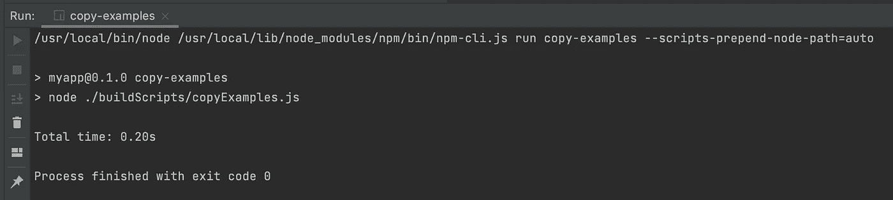
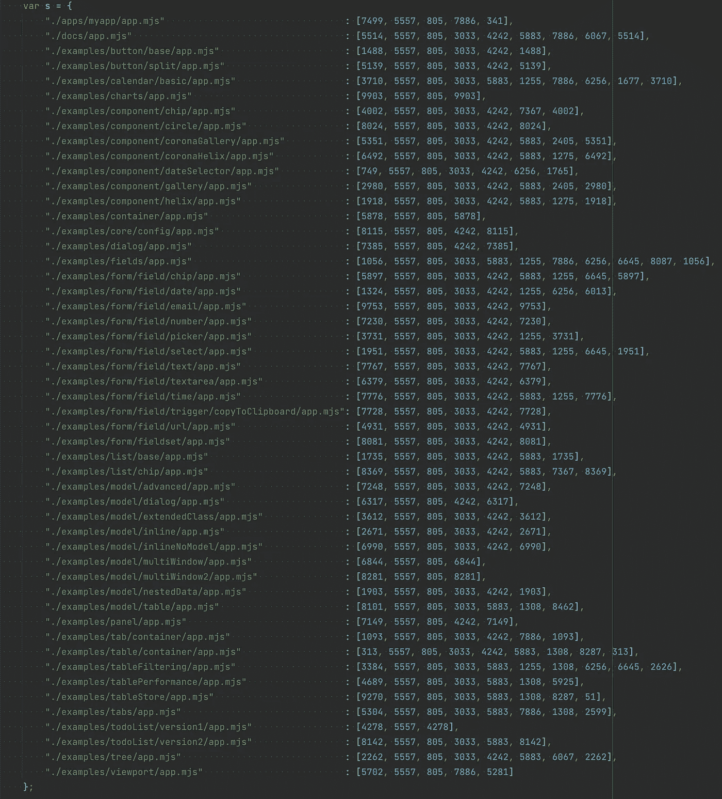

# neo.mjs v2.2:应用程序的主线程微加载器

> 原文：<https://itnext.io/neo-mjs-v2-2-main-thread-microloaders-for-your-apps-a8722e32335e?source=collection_archive---------4----------------------->

我仍然被 [neo.mjs](https://github.com/neomjs/neo) 提名所感动:

[](/neo-mjs-nominated-for-the-most-exciting-use-of-technology-cd5983debc7b) [## neo.mjs 获得“最令人兴奋的技术应用”提名

### JavaScript 开源奖励计划 2021 内幕。

itnext.io](/neo-mjs-nominated-for-the-most-exciting-use-of-technology-cd5983debc7b) 

本文涵盖了 v2.2.0 版本的增强功能。

# 内容

1.  介绍
2.  新的索引文件结构
3.  什么是 MicroLoader？
4.  npx 新应用版本 2.2.1
5.  examples 集合现在在工作区中可用
6.  如何将工作区迁移到 v2.2？
7.  最后的想法

# 1.介绍

让我们来看看 2.2 版之前的 index.html 文件的格式:

您可以直接在索引文件中定义 [DefaultConfig.mjs](https://github.com/neomjs/neo/blob/dev/src/DefaultConfig.mjs) 的所有可用配置。虽然这对于开发人员的体验来说还不错，但是将 JS 和 html 混合在一个文件中感觉不太干净。

更重要的是，配置的值会随着构建版本(分布/开发和分布/生产)而改变。虽然 [html-webpack-plugin](https://www.npmjs.com/package/html-webpack-plugin) 可以在某种程度上处理这个问题，但我们需要将所有演示应用程序和示例的值存储在单独的配置文件中。

当我们想要将应用程序移动到不同的文件夹层级时(例如，移动到 [neo.mjs 工作区](https://github.com/neomjs/workspace))，情况甚至变得更糟。docs 应用程序会出现这种情况，现在整个 examples 集合也可能出现这种情况。

# 2.新的索引文件结构

我们现在有了 html 和 JS 配置变量的清晰划分:

现在，每个应用都有一个顶级 neo-config.json 文件:

显然，对于`dist/production`输出，两个文件都被缩小了。

虽然让构建程序将 index.html 文件解析为一个字符串是很痛苦的，但是用 JSON 做同样的事情是微不足道的。构建程序变得更简洁、更小。

`html-webpack-plugin`依赖项被移除。您现在可以手动更改您的 index.html 文件，这些更改将保存在 dist 环境中。

# 3.什么是 MicroLoader？

如果您再次查看旧版本的索引文件，您会注意到`Neo.config`是在主线程文件加载之前定义的。保持这个时间是关键，因为 [Main.mjs](https://github.com/neomjs/neo/blob/dev/src/Main.mjs) 将首先导入 [Neo.mjs 文件](https://github.com/neomjs/neo/blob/dev/src/Neo.mjs)。

这个合并了自定义框架配置和底部的默认配置:

```
***Neo***.assignDefaults(***Neo***.config, ***DefaultConfig***);
```

MicroLoader 看起来如下:

我们获取配置文件，将 JSON 转换成 JS 对象，并将其内容直接传播到`Neo.config`。

放大后看起来像这样:

嗯，我们可以去掉 2 "chars 在最后，但是“微”这个词真的很适合，不是吗？

我们可以在`import()`调用中使用一个变量作为路径，因为 MicroLoader 文件永远不会被 [webpack](https://www.npmjs.com/package/webpack) 触及。

App、Data 和 Vdom 工作人员不需要使用 MicroLoader 来手动获取`Neo.config` JSON 文件。一旦创建了一个工人，就会使用 [postMessage](https://developer.mozilla.org/en-US/docs/Web/API/Worker/postMessage) 发送配置。

# 4.npx 新应用版本 2.2.1

新的 [neo.mjs](https://github.com/neomjs/neo) 与新版本的 create-app repo 相结合:

[](https://github.com/neomjs/create-app) [## neomjs/create-app

### 使用一行程序创建一个新的 neo.mjs 应用程序(工作区): npx neo-app 可以在 macOS、Linux 和 Windows 10 上运行。如果错误…

github.com](https://github.com/neomjs/create-app) 

您不需要安装或克隆此 repo，要生成新的工作区，只需输入:

```
npx neo-app
```

到您的终端(或 Windows 上的 CMD)。

npm CLI 目前有一些非常糟糕的“漏洞”。对我来说，npm 更新不再起作用。手动更改依赖关系并运行 npm 安装会导致“成功”，但只会再次安装旧版本。

我解决它的唯一方法(除了降级 CLI)是每次手动删除 package-lock.json 文件以及 node_modules 文件夹。详情如下:

[](https://github.com/npm/cli/issues/3269) [## [BUG]从 npm 6 升级到 7 时，npm install 无法安装正确的版本问题#3269 …

### 这是否存在问题？我搜索了当前运行 npm 安装的行为不…

github.com](https://github.com/npm/cli/issues/3269) 

如果 npx 呼叫没有给您 2.2+版本，请使用:

```
npx neo-app@latest
```

发电机程序被调整了。

如果 npx 脚本在本地无法正常工作:

[](https://github.com/neomjs/workspace) [## neom js/工作空间

### 此存储库包含 npx neo-app 的默认输出。如果 npx 脚本有任何问题，请感觉…

github.com](https://github.com/neomjs/workspace) 

这个 repo 包含默认输出，因此您可以克隆或派生它作为起点。

# 5.examples 集合现在在工作区中可用

工作区的包中现在有了一个新的脚本。

```
npm run copy-examples
```

这个脚本在我的机器上只需要 0.2 秒，并且可以动态调整所有的 neo-config.json 文件:



你可以在这里看一下代码:
[neomjs/create-app/blob/master/resources/copy examples . js](https://github.com/neomjs/create-app/blob/master/resources/copyExamples.js)

(或者在您的工作区 buildScripts 文件夹中)

如果您想知道为什么我们不直接在 npx 调用中复制示例:这是有充分理由的。

在 neo `development`环境中没有任何问题，因为这种模式使用真正的 JavaScript 代码，不需要任何构建或编译。

然而，`dist/development`和`dist/production`环境依赖于基于 webpack 的构建。你很可能熟悉 [splitchunks 插件](https://webpack.js.org/plugins/split-chunks-plugin/)。您可以在您的应用程序中使用动态导入，webpack 将为您想要延迟加载的文件创建单独的包。

neo.mjs 更进一步:应用程序工作者只有一个入口:应用程序工作者本身。这将获取所有可能的应用程序入口点(app.mjs)文件作为动态导入。

结果是，我们不仅会获得我们在一个应用程序中懒惰加载的包的拆分块，而且还会获得跨应用程序的拆分块。如果你想在一个页面上放置多个应用，这是非常强大的，因为几乎没有开销。

问题是，如果您将示例应用程序复制到您的工作区，这些应用程序将增加`dist/*`应用程序工作器的文件大小。



如果没有工作空间中的示例，地图将只包含前两行。

我的建议是:我会克隆或派生 [neo.mjs](https://github.com/neomjs/neo) 存储库，并在那里深入研究示例或演示应用程序代码或浏览器输出。

如果您希望将示例放入工作区，那么您应该在部署构建之前再次删除 examples 文件夹，以保持 App worker 文件较小。之后，您可以将示例复制回来(如前所述，这只需要 0.2 秒)。

# 6.如何将工作区迁移到 v2.2？

关于如何使用框架的 API 仍然是完全一样的。只有应用外壳发生了变化。有两种策略:

第一种方法是使用`npx neo-app`复制你的应用程序的内容。**强烈推荐**。

第二种方法是使用新的默认 npx 输出:
[neomjs/workspace](https://github.com/neomjs/workspace) 并根据需要手动调整“旧”工作空间中的文件。这意味着:

1.  将 neo-config.json 文件添加到您的应用程序
2.  调整应用程序的 index.html 文件
3.  删除 docs 应用程序文件夹，并从演示工作区复制版本
4.  [可选]将副本示例脚本添加到 package.json 中
5.  build scripts/myapps . JSON:“apps”不再是一个包含配置的对象，而是一个名称数组。例如`"apps": ["Docs", "MyApp"]`
6.  删除 buildScripts/webpack 文件夹
7.  将 MicroLoader.mjs 文件复制到工作空间 src 文件夹中
8.  运行`buildAll`程序

该框架现在处于一个非常好的状态，我这边没有计划在短期内再次改变应用程序的结构。

# 7.最后的想法

虽然这个更新乍看起来没什么大不了的，但它导致了我的数百次提交。 [neo.mjs](https://github.com/neomjs/neo) 已经收集了大量的例子，调整所有级别的构建程序是一个挑战。

请随意查看 neo 和 create-app repos 的提交日志。

如果你德语流利:我被邀请参加周一(5 月 31 日)的播客工作草案。主题是工作者、共享工作者和多窗口应用。

我的路线图上的下一个大项目是让“快速入门”部分对你来说更容易。我会写更多关于如何创建组件和应用程序的指南。我也喜欢自己在组件方面多做些工作，因为这是有趣的部分。

我还将进一步增强主题引擎，以包括子 neo 工作空间。你可以期待一篇关于**微软前端**的新文章！

你可以在这里找到回购协议:

[](https://github.com/neomjs/neo) [## 近地天体

### neo.mjs 使您能够使用一个以上的 CPU 创建可扩展的高性能应用程序。不需要照顾一个…

github.com](https://github.com/neomjs/neo) 

如果您刚刚开始使用 neo，欢迎您加入 Slack 频道:

[](https://join.slack.com/t/neomjs/shared_invite/zt-6c50ueeu-3E1~M4T9xkNnb~M_prEEOA) [## 在 Slack 上加入 neo.mjs

### Slack 是一种与团队沟通的新方式。它比电子邮件更快、更有条理、更安全。

join.slack.com](https://join.slack.com/t/neomjs/shared_invite/zt-6c50ueeu-3E1~M4T9xkNnb~M_prEEOA) 

感谢反馈！

问候&快乐编码，
托拜厄斯