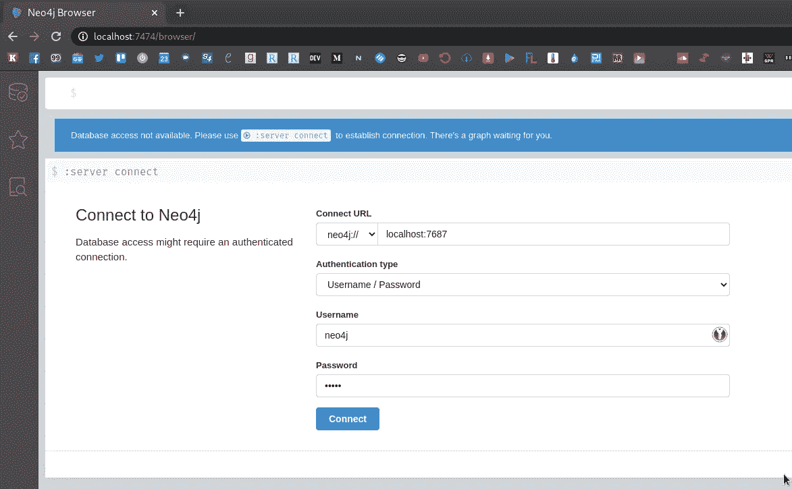
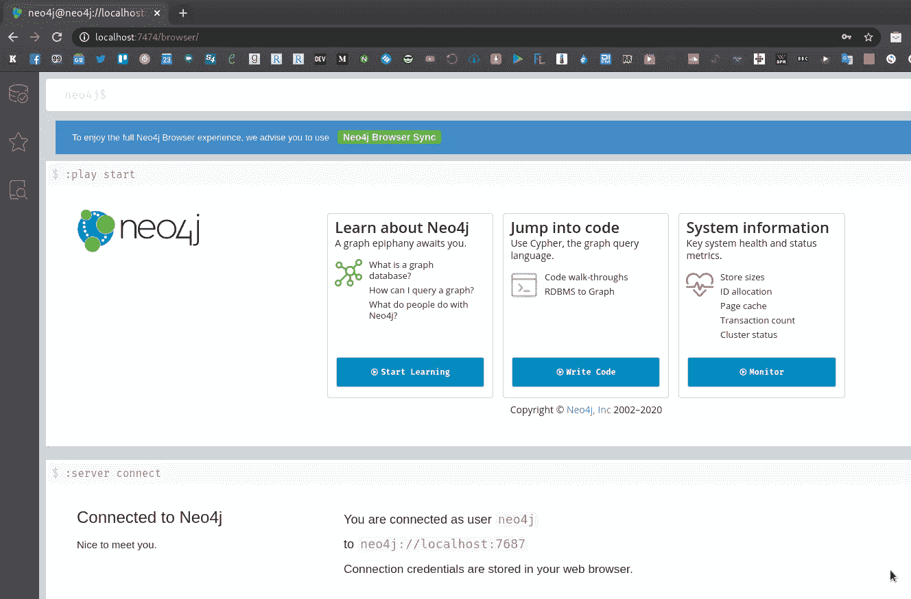
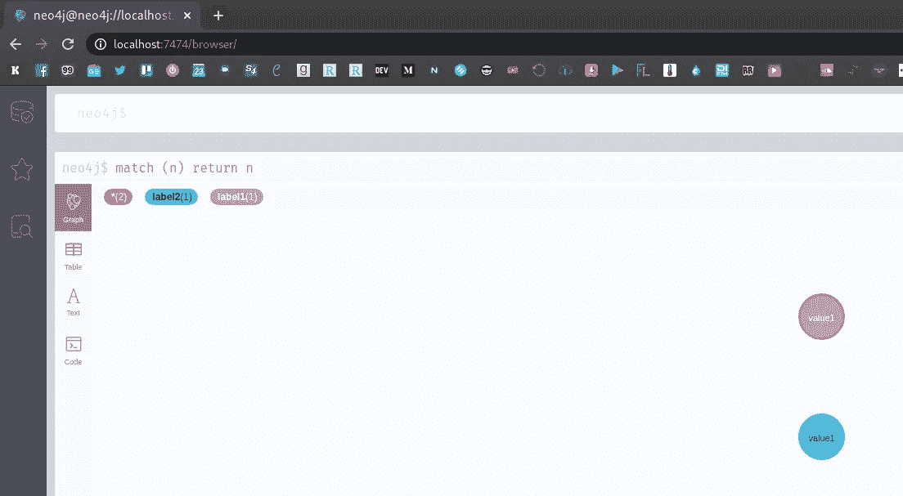
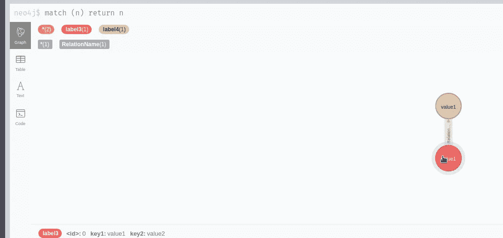
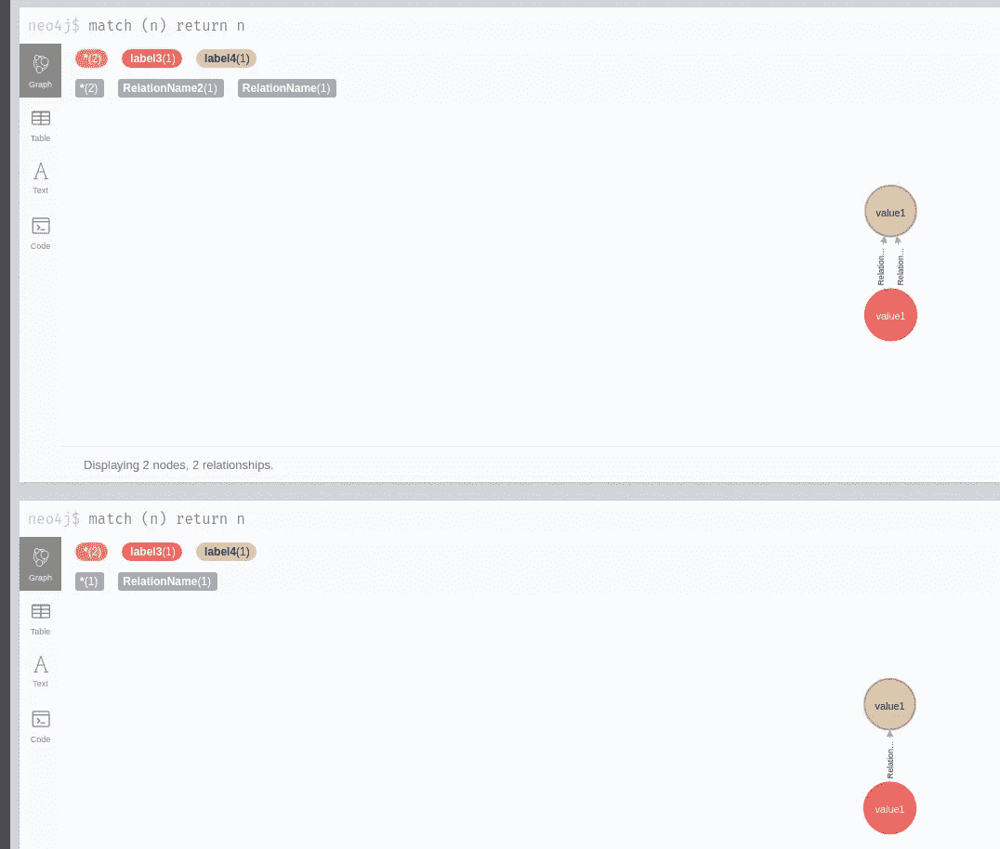

# Neo4j:图形数据库—运行 Docker 和 Cypher QL 示例

> 原文：<https://itnext.io/neo4j-graph-database-run-with-docker-and-cypher-ql-examples-6f81315f682?source=collection_archive---------3----------------------->


与数据对象是主要部分的 RDMS ( *关系数据库管理系统*)相比，在图形数据库中，这种数据对象之间的关系起着主要作用，并被表示为专用对象，这提供了更好的性能，尤其是当您有许多相互关联的小数据块时。

最早的图形数据库系统之一是 Neo4j，本文将对其进行研究。

对于查询，Neo4j 使用 Cypher 查询语言和`cypher-shell`工具，并通过内置 UI 的通用网络浏览器访问 Neo4j 数据库。还有，Neo4j 支持 REST API。

Neo4j 是通过付费模式发布的，但它有免费的社区版，但有一些限制(没有集群，没有在线备份，只有一个用户数据库，没有伸缩性等)，加上 SaaS 光环。参见他们的比较 [тут > > >](https://neo4j.com/subscriptions/) 。

因此，在本文中，我们将使用 Docker 启动 Neo4j Community Edition 实例，简要概述其查询语言，以及如何执行备份-恢复。

# 使用 Docker 运行 Neo4j

让我们在一台工作的笔记本电脑上运行一个带有 Docker 的容器，看看它是如何工作的。参见文档[此处> > >](https://neo4j.com/developer/docker-run-neo4j/) 。

```
$ docker run --rm --name neo4j -p 7474:7474 -p 7687:7687 neo4j:latest
…
Directories in use:
home: /var/lib/neo4j
config: /var/lib/neo4j/conf
logs: /logs
plugins: /var/lib/neo4j/plugins
import: /var/lib/neo4j/import
data: /var/lib/neo4j/data
certificates: /var/lib/neo4j/certificates
run: /var/lib/neo4j/run
Starting Neo4j.
…
2020–07–27 10:11:30.394+0000 INFO Bolt enabled on 0.0.0.0:7687.
2020–07–27 10:11:31.640+0000 INFO Remote interface available at [http://localhost:7474/](http://localhost:7474/)
2020–07–27 10:11:31.640+0000 INFO Started
```

检查它—打开浏览器，导航到[*http://localhost:7474*，](http://localhost:7474,)并使用默认登录密码 *neo4j:neo4j* 登录:



## 管理员密码

要设置新密码，请使用`--env NEO4J_AUTH`:

```
$ docker run --rm --name neo4j --env NEO4J_AUTH=neo4j/pass -p 7474:7474 -p 7687:7687 neo4j:latest
Changed password for user ‘neo4j’.
…
```

## `cypher-shell`

要使用数据库，您可以使用 REST API 或本地工具— `[cypher-shell](https://neo4j.com/docs/operations-manual/current/tools/cypher-shell/)`。

连接到容器并破坏外壳:

```
$ docker exec -ti neo4j cypher-shell -u neo4j -p pass
Connected to Neo4j 4.1.0 at neo4j://localhost:7687 as user neo4j.
Type :help for a list of available commands or :exit to exit the shell.
Note that Cypher queries must end with a semicolon.
neo4j@neo4j>
```

## Neo4j 配置文件

在容器中，主配置文件位于`$NEO4J_HOME/conf/neo4j.conf`路径，例如`/var/lib/neo4j/conf/neo4j.conf`:

```
root@65d8061ac13e:/var/lib/neo4j# head /var/lib/neo4j/conf/neo4j.conf
*****************************************************************
Neo4j configuration
For more details and a complete list of settings, please see
*****************************************************************
The name of the default database
dbms.default_database=neo4j
```

要重新定义任何设置—将新的配置文件挂载到容器的`/conf`目录中。

在> > > 这里可以找到`neo4j.conf`的所有设置。

要从 shell 获取当前配置，请使用`[dbms.listConfig()](https://neo4j.com/docs/operations-manual/current/reference/procedures/)`调用:

```
neo4j@neo4j> CALL dbms.listConfig()
YIELD name, value
WHERE name STARTS WITH ‘dbms.default’
RETURN name, value
ORDER BY name
LIMIT 3;+ — — — — — — — — — — — — — — — — — — — — — — — — -+
| name | value |
+ — — — — — — — — — — — — — — — — — — — — — — — — -+
| “dbms.default_advertised_address” | “localhost” |
| “dbms.default_database” | “neo4j” |
| “dbms.default_listen_address” | “0.0.0.0” |
+ — — — — — — — — — — — — — — — — — — — — — — — — -+
3 rows available after 216 ms, consumed after another 13 ms
```

# `cypher-shell` & & CQL

## `CREATE`

我们来玩玩数据。

Tutorialspoint [这里有一个很棒的数据类型教程> > >](https://www.tutorialspoint.com/neo4j/neo4j_cql_introduction.htm) 。

创建新节点:

```
neo4j@neo4j> create (test);
0 rows available after 56 ms, consumed after another 0 ms
Added 1 nodes
```

## `DELETE`

删除它:

```
neo4j@neo4j> MATCH (test) DETACH DELETE test;
0 rows available after 32 ms, consumed after another 0 ms
Deleted 1 nodes
```

要删除数据库中的所有记录，请使用`(n)`:

```
neo4j@neo4j> MATCH (n) detach delete n;
```

## 标签

创建一个标签为 *label1* label 的节点，其属性包含两个键— *key1* 和 *key2* :

```
neo4j@neo4j> create (node1:label1 {key1: “value1”, key2: “value2”} );
0 rows available after 47 ms, consumed after another 0 ms
Added 1 nodes, Set 2 properties, Added 1 labels
```

检查一下:

```
neo4j@neo4j> MATCH (node1) RETURN node1;
+ — — — — — — — — — — — — — — — — — — — — — — +
| node1 |
+ — — — — — — — — — — — — — — — — — — — — — — +
| (:label1 {key1: “value1”, key2: “value2”}) |
+ — — — — — — — — — — — — — — — — — — — — — — +
```

或者使用`RETURN` -在创建后立即获取节点，在同一个查询中:

```
neo4j@neo4j> CREATE (node2:label2 {key1: “value1”, key2: “value2”} ) RETURN node2;
+ — — — — — — — — — — — — — — — — — — — — — — +
| node2 |
+ — — — — — — — — — — — — — — — — — — — — — — +
| (:label2 {key1: “value1”, key2: “value2”}) |
+ — — — — — — — — — — — — — — — — — — — — — — +
```

使用`match(n) return n`在浏览器中检查以显示所有记录:



## 关系

可以在任何新节点之间或现有节点之间创建新的关系。

要在新节点之间创建关系—添加`-[r:RelationName]->`:

```
neo4j@neo4j> create (node3:label3 {key1: “value1”, key2: “value2”}) -[r:RelationName]-> (node4:label4{key1: “value1”, key2: “value2”}) RETURN node3, node4;
+ — — — — — — — — — — — — — — — — — — — — — — — — — — — — — — — — — — — — — — — — — — — — -+
| node3 | node4 |
+ — — — — — — — — — — — — — — — — — — — — — — — — — — — — — — — — — — — — — — — — — — — — -+
| (:label3 {key1: “value1”, key2: “value2”}) | (:label4 {key1: “value1”, key2: “value2”}) |
+ — — — — — — — — — — — — — — — — — — — — — — — — — — — — — — — — — — — — — — — — — — — — -+
1 row available after 88 ms, consumed after another 8 ms
Added 2 nodes, Created 1 relationships, Set 4 properties, Added 2 labels
```

检查一下:



要在现有节点之间创建关系，使用`MATCH`选择这些节点:

```
neo4j@neo4j> MATCH (node3:label3), (node4:label4) CREATE (node3) -[r:RelationName2]-> (node4) RETURN node3, node4;
+ — — — — — — — — — — — — — — — — — — — — — — — — — — — — — — — — — — — — — — — — — — — — -+
| node3 | node4 |
+ — — — — — — — — — — — — — — — — — — — — — — — — — — — — — — — — — — — — — — — — — — — — -+
| (:label3 {key1: “value1”, key2: “value2”}) | (:label4 {key1: “value1”, key2: “value2”}) |
+ — — — — — — — — — — — — — — — — — — — — — — — — — — — — — — — — — — — — — — — — — — — — -+
1 row available after 124 ms, consumed after another 9 ms
Created 1 relationships
```



# 备份和恢复

数据存储在`$NEO4J_HOME/data`中，它实际上是`/data`的符号链接，参见此处的[>>>](https://neo4j.com/docs/operations-manual/current/configuration/file-locations/.)。

检查目录:

```
root@65d8061ac13e:/var/lib/neo4j# ls -l /var/lib/neo4j/data
lrwxrwxrwx 1 root root 5 Jul 23 09:01 /var/lib/neo4j/data -> /data
root@65d8061ac13e:/var/lib/neo4j# ls -l /data/
total 12
drwxrwxrwx 4 neo4j neo4j 4096 Jul 27 11:19 databases
drwxr-xr-x 2 neo4j neo4j 4096 Jul 27 11:19 dbms
drwxrwxrwx 4 neo4j neo4j 4096 Jul 27 11:19 transactions
```

数据库文件存储在`databases`目录中，在这里可以找到两个默认的数据库——系统和 neo4j ，可以通过`show databases`找到:

```
neo4j@neo4j> show databases;
+ — — — — — — — — — — — — — — — — — — — — — — — — — — — — — — — — — — — — — — — — — — — — — — — — +
| name | address | role | requestedStatus | currentStatus | error | default |
+ — — — — — — — — — — — — — — — — — — — — — — — — — — — — — — — — — — — — — — — — — — — — — — — — +
| “neo4j” | “localhost:7687” | “standalone” | “online” | “online” | “” | TRUE |
| “system” | “localhost:7687” | “standalone” | “online” | “online” | “” | FALSE |
+ — — — — — — — — — — — — — — — — — — — — — — — — — — — — — — — — — — — — — — — — — — — — — — — — +
```

*系统*数据库用于……嗯，用于系统本身，而 *nedo4j* 是默认的用户数据库。

## Neo4j `dump`

创建新目录来保存我们的数据:

```
$ mkdir -p /tmp/neo4/{data,logs}
```

重新启动 Neo4j 容器，将这些目录挂载到其中:

```
$ docker run --rm --name neo4j --env NEO4J_AUTH=neo4j/pass -p 7474:7474 -p 7687:7687 -v /tmp/neo4/data/:/data -v /tmp/neo4/logs/:/logs neo4j:latest
Changed password for user ‘neo4j’.
Directories in use:
home: /var/lib/neo4j
config: /var/lib/neo4j/conf
logs: /logs
plugins: /var/lib/neo4j/plugins
import: /var/lib/neo4j/import
data: /var/lib/neo4j/data
certificates: /var/lib/neo4j/certificates
run: /var/lib/neo4j/run
…
```

检查主机上的数据:

```
$ ll /tmp/neo4/data/databases/
total 0
drwxr-xr-x 2 7474 7474 720 Jul 27 16:07 neo4j
-rw-r — r — 1 7474 7474 0 Jul 27 16:07 store_lock
drwxr-xr-x 3 7474 7474 740 Jul 27 16:07 system
```

连接，创建新记录:

```
$ docker exec -ti neo4j cypher-shell -u neo4j -p pass
neo4j@neo4j> create (test:tobackup);
0 rows available after 131 ms, consumed after another 0 ms
Added 1 nodes
```

要创建数据库转储，您首先需要停止实例(因为社区版不具备*在线备份*的能力):

```
root@771f04312148:/var/lib/neo4j# neo4j-admin dump --database=neo4j --to=/data/backups/
The database is in use. Stop database ‘neo4j’ and try again.
```

所以，退出容器并停止它:

```
$ docker stop neo4j
```

重新启动，但此时添加`bash`命令以阻止 Neo4j 服务启动:

```
$ docker run -ti --rm --name neo4j --env NEO4J_AUTH=neo4j/pass -p 7474:7474 -p 7687:7687 -v /tmp/neo4/data/:/data -v /tmp/neo4/logs/:/logs neo4j:latest bash
neo4j@6d4e9854bc1d:~$
```

创建转储:

```
neo4j@015ba14bdba2:~$ mkdir /data/backup
neo4j@015ba14bdba2:~$ neo4j-admin dump --database=neo4j --to=/data/backup/
Done: 34 files, 250.8MiB processed.
```

检查一下:

```
neo4j@015ba14bdba2:~$ ls -l /data/backup/
total 12
-rw-r — r — 1 neo4j neo4j 9971 Jul 27 13:46 neo4j.dump
```

## 恢复

在主机上，为第二个 Neo4j 实例创建一组新目录:

```
$ mkdir -p /tmp/neo4–2/{data,logs}
```

从第一个目录复制备份目录:

```
$ sudo cp -r /tmp/neo4/data/backup/ /tmp/neo4–2/data/
```

照常运行服务，挂载`/tmp/neo4-2`，替换端口及其名称:

```
$ docker run — rm — name neo4j-2 — env NEO4J_AUTH=neo4j/pass -p 7475:7474 -p 7688:7687 -v /tmp/neo4–2/data/:/data -v /tmp/neo4–2/logs/:/logs neo4j:latest
```

连接并检查数据:

```
$ docker exec -ti neo4j-2 cypher-shell -u neo4j -p pass
Connected to Neo4j 4.1.0 at neo4j://localhost:7687 as user neo4j.
Type :help for a list of available commands or :exit to exit the shell.
Note that Cypher queries must end with a semicolon.
neo4j@neo4j> match (n) return n;
+ — -+
| n |
+ — -+
+ — -+
```

好的—这里什么也没有找到，因为这是一个全新的数据库。

从容器中退出，停止并通过`bash`运行:

```
$ docker run -ti --rm --name neo4j-2 --env NEO4J_AUTH=neo4j/pass -p 7475:7474 -p 7688:7687 -v /tmp/neo4–2/data/:/data -v /tmp/neo4–2/logs/:/logs neo4j:latest bashneo4j@b0f324cb7c9b:~$
```

使用默认的`--force`键将转储加载到数据库中 *neo4j* 数据库已经存在:

```
neo4j@7bca892e9538:~$ neo4j-admin load --from=/data/backup/neo4j.dump --database=neo4j --force
Done: 34 files, 250.8MiB processed.
```

退出，以正常方式重新启动容器以启动 Neo4j 进程:

```
$ docker run -ti --rm --name neo4j-2 --env NEO4J_AUTH=neo4j/pass -p 7475:7474 -p 7688:7687 -v /tmp/neo4–2/data/:/data -v /tmp/neo4–2/logs/:/logs neo4j:latest
```

连接，检查:

```
neo4j@neo4j> match (n) return n;
+ — — — — — — -+
| n |
+ — — — — — — -+
| (:tobackup) |
+ — — — — — — -+
```

我们的记录就在它的位置上——都完成了。

*最初发布于* [*RTFM: Linux，devo PSисистемноеадминитииовваниованиее*T10*。*](https://rtfm.co.ua/en/neo4j-graph-database-run-with-docker-and-cypher-ql-examples/)