# 解释嵌套的 vSphere 7 和 Kubernetes 实验室部署

> 原文：<https://itnext.io/nested-vsphere-7-and-kubernetes-lab-deployment-explained-f9bfca0112f5?source=collection_archive---------4----------------------->

[林柏希出色的部署脚本](https://github.com/lamw/vghetto-vsphere-with-kubernetes-external-nsxt-automated-lab-deployment)引发了在我们的开发 vSphere 环境之上建立一个完全嵌套的 vSphere 7 和 Kubernetes (VCF 4)环境的想法。

虽然部署本身非常适合部署嵌套的 vSphere 7 环境，但在启用 Kubernetes 部分(VMware Cloud Foundation 4-VCF)之前，您需要满足一些重要要求。

这篇博客文章将涵盖这些需求，以及一些使用新的 VCF 4 环境、工作负载管理和 Tanzu Kubernetes 网格(TKG)集群的技巧和诀窍。

# 自动化部署

## 要求

William 提出了以下运行其脚本的要求:

[https://github . com/lamw/vghetto-VSP here-with-kubernetes-external-nsxt-automated-lab-deployment](https://github.com/lamw/vghetto-vsphere-with-kubernetes-external-nsxt-automated-lab-deployment)

## 额外要求

如果您想在嵌套环境中继续启用工作负载管理(VCF ),我们将进一步推荐以下内容——否则您的 SupervisorControlPlaneVM 将不会完全初始化。

*   在从 NSX T0 上行链路到您的互联网网关(sNAT)的通信路径上的每个虚拟和物理交换机上配置大小为 1600 或更大的 MTU。这包括底层(部署嵌套环境的地方)和嵌套的 vSwitch/dvSwitch！
*   接受端口组上的安全混杂模式和伪造传输设置
*   配置 PFsense(或类似设备)作为网关，包括 NSX T0 上行链路的 SNAT

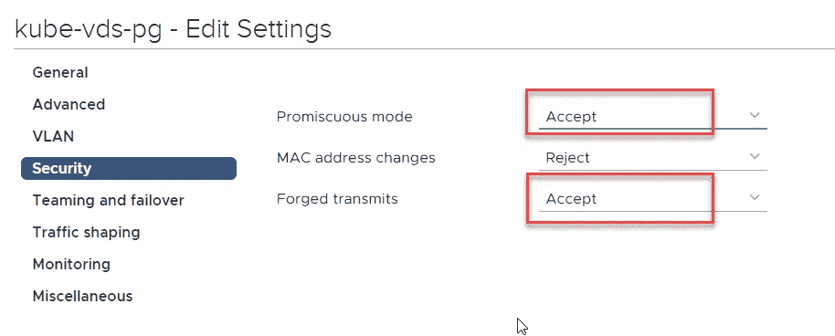

# 运行脚本

简单来说就是克隆 GitHub 存储库，根据 README.md 修改脚本，并使用 PowerCLI 运行它。

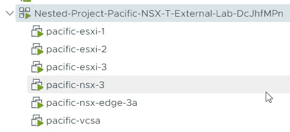

当脚本成功部署您的嵌套 ESXi、vCSA、NSX 管理和 NSX 边缘时，您可以继续连接到您新部署的 vCSA 7。

# 启用工作负载管理

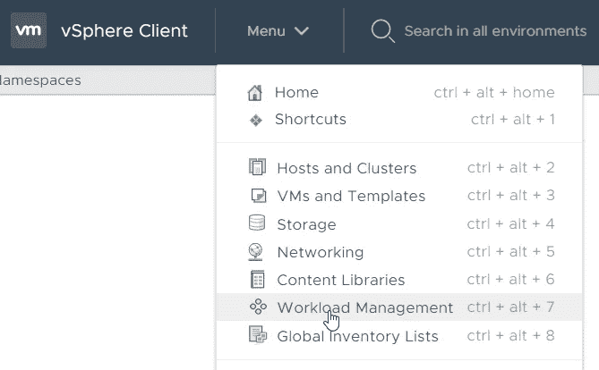

要启用工作负载管理并部署 Kubernetes 环境，只需在 vSphere client 菜单中选择 workload management。

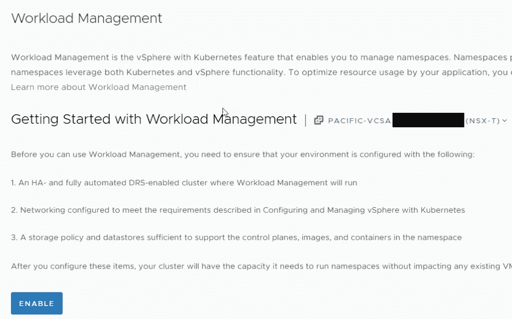

让我们启用工作负载管理

该向导将指导您完成最重要的步骤，大多数人可以选择 tiny 作为部署大小。

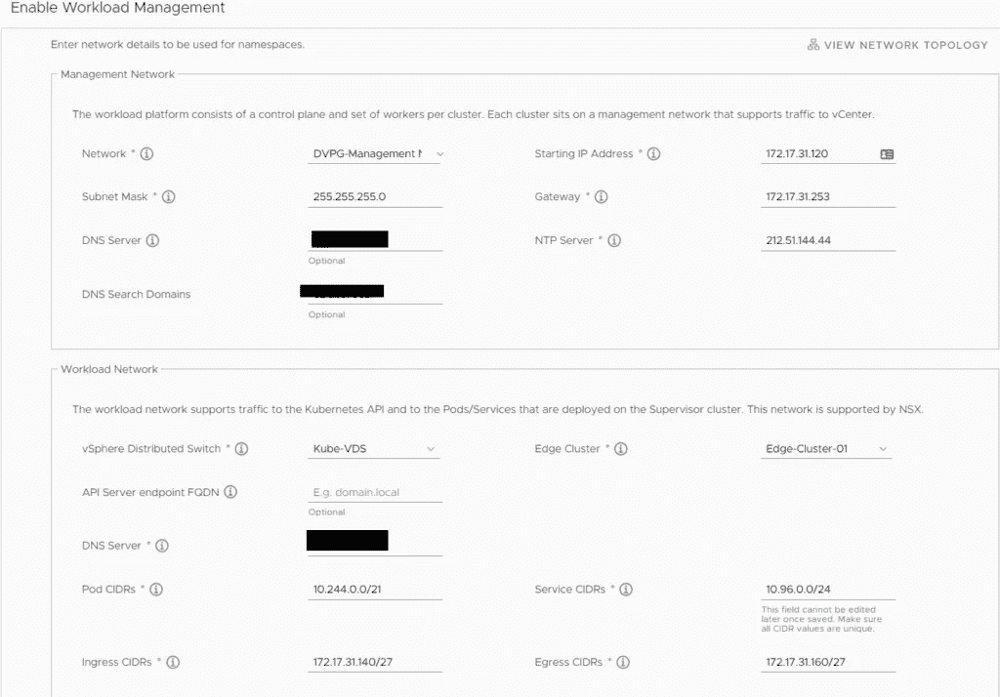

为了简化指南，我们使用了 William 在他的脚本中使用的所有网络设置。

您需要确保您的网关在管理和工作负载网络(入口和出口)中有一个适配器和 ip 地址，以确保以后可以下载容器映像。

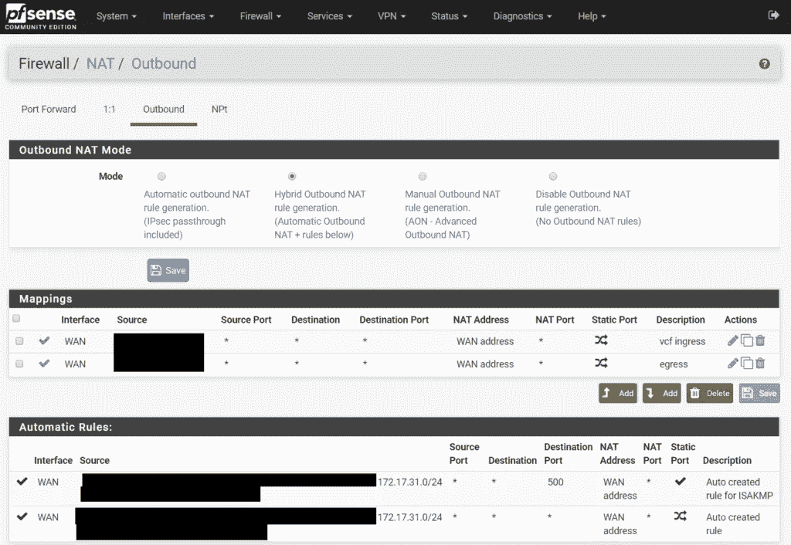

此外，确保在网关中启用 SNAT 并配置防火墙。

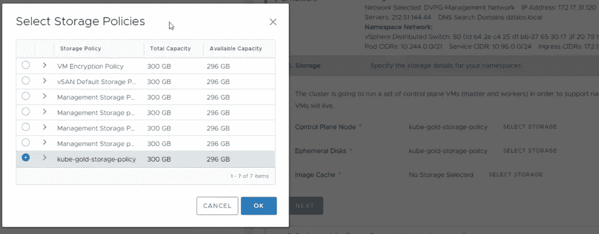

下一个重要步骤是为所有图像和相关数据选择正确的数据存储。

开始实施后，是时候喝杯咖啡了，因为这个过程需要一些时间。

# 部署问题

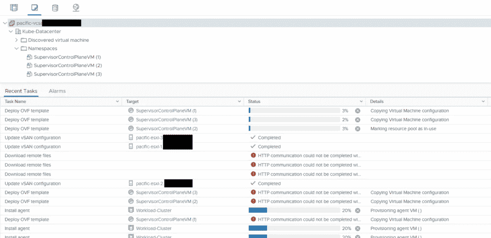

开始的几分钟相当无聊，你可以忽略一些错误。

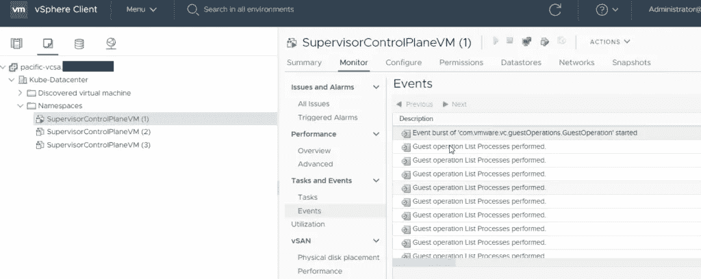

但是检查将被启动的第一个 SuperVisorControlPlaneVM 的事件并没有坏处。一个是 Kubernetes Master，如果这次部署失败，未来不会发生太多事情。

如果你看到一些这样的条目

**com . VMware . VC . guest operations . guest operation 的爆发开始**

在第一个启动 SupervisorControlPlaneVM 的事件中，您可以确信部署进展顺利，嵌套的 ESXi 和 VCF 虚拟机之间的通信正常。

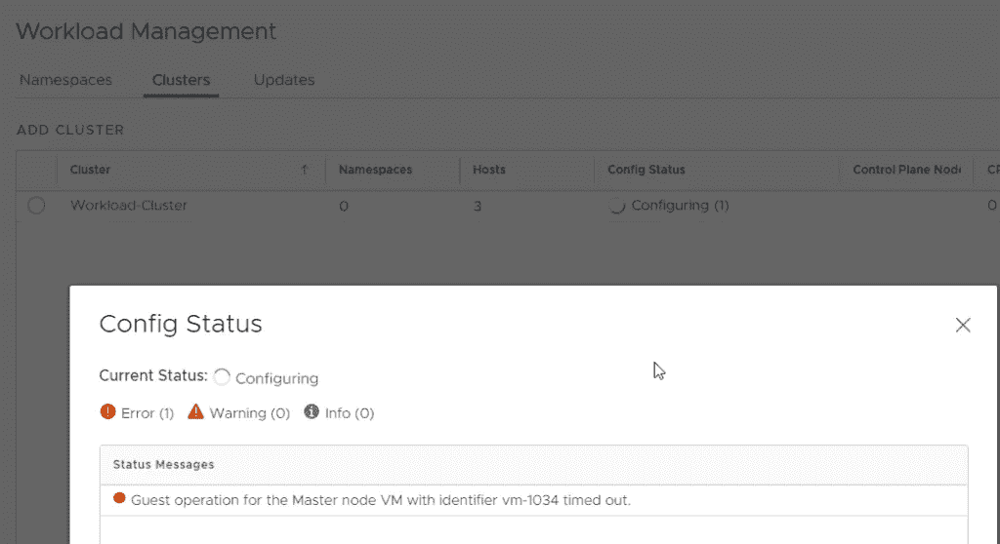

**不要心急！**

有些错误是绝对正常的，如果持续时间不超过 15-20 分钟，可以忽略。

您还可以在安装过程中通过 pinging the 上行链路来测试环境。

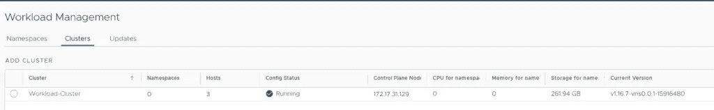

配置主虚拟机后，其他两个 SupervisorControlPlane 虚拟机也将启动，所有配置都将复制到它们。

# 创建您的第一个名称空间

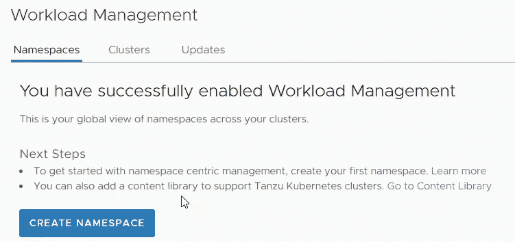

当您选择 Namespaces 选项卡时，您可以创建您的第一个名称空间来部署演示应用程序或只是进行一点测试。

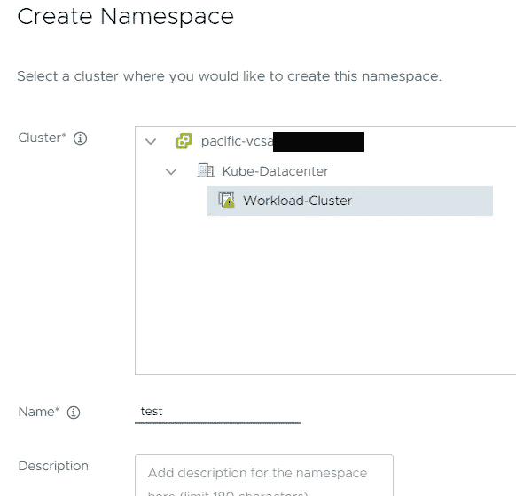

让我们创建名称空间测试

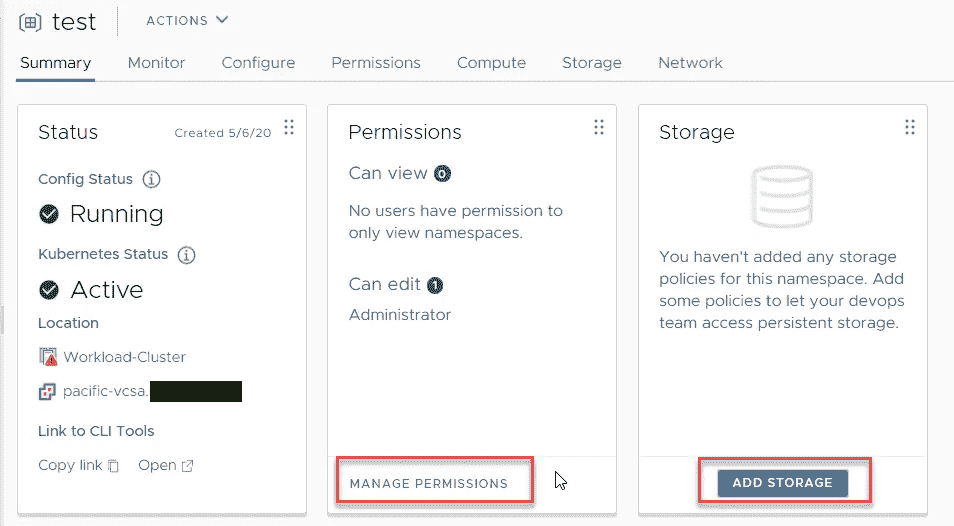

添加权限和存储

# 连接到控制平面

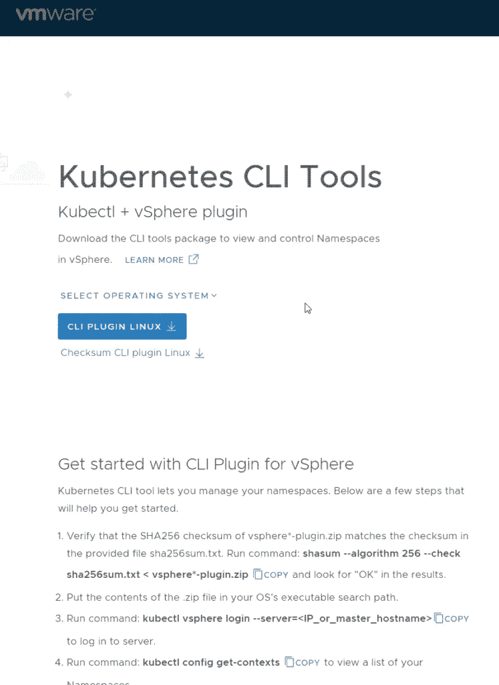

使用 Kubernetes 平台的主要工具是 kubectl，可以通过使用浏览器访问控制平面 IP 或单击 CLI 工具链接下的打开来下载。

下载 kubectl 和 vsphere 插件，以便您可以直接连接到基于 vSphere 的 Kubernetes 部署:

```
# Login to Kubernetes 
kubectl vsphere login --server=https://controlplane-ip -u administrator@vsphere.local --insecure-skip-tls-verify # select the test namespace - it safes you typing -n test after each command 
kubectl config use-context test # show all existing resources 
kubectl get all
```

如果您还没有部署任何东西，您可以简单地看到**在测试名称空间**中没有找到资源。我们要改变这种状况。

# 运行测试舱

让我们测试一下，我们是否可以通过创建一个演示 nginx pod 来访问互联网以提取图像。

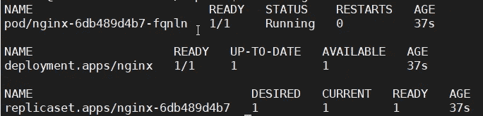

```
# deploy nginx for testing 
kubectl run nginx --image=nginx # ignore the warning as we're just testing: 
kubectl run --generator=deployment/apps.v1 is DEPRECATED and will be removed in a future version. Use kubectl run --generator=run-pod/v1 or kubectl create instead. deployment.apps/nginx created # check the deployment status 
kubectl get all
```

好像管用！

如果对您不起作用，请尝试以下命令来获取详细信息:

```
# get information about nginx deployment 
kubectl describe deployment.apps/nginx # get pods with label/value run=nginx and return full configuration kubectl get pods -l run=nginx -o yaml
```

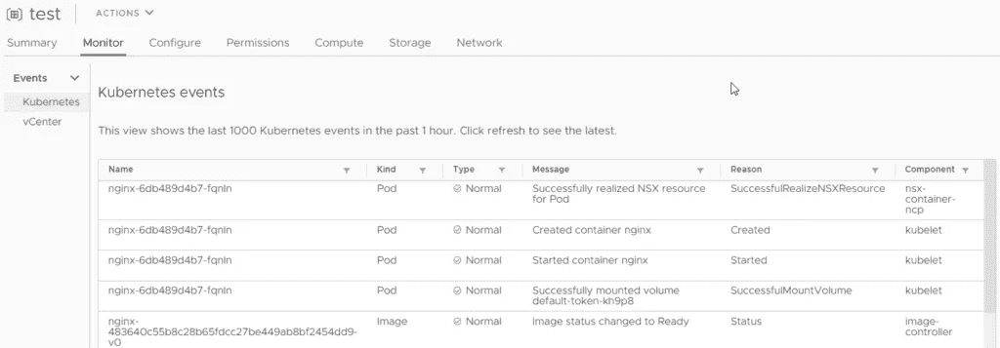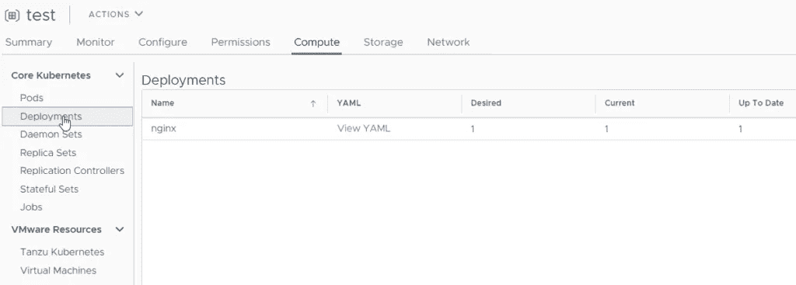

您还可以跟踪 vSphere client 中的所有事件和配置文件。

```
# delete the pod 
kubectl delete pods -l run=nginx # check for pods again and you'll find a new pod with a low AGE kubectl get pods -l run=nginx # delete the deployment 
kubectl delete deployment nginx # check for pods again and you'll nothing will be shown 
kubectl get pods
```

这个小练习解释了 Kubernetes 是如何工作的。pod 将基于由部署创建的副本集来创建。如果我们删除 pod，复制集就会创建一个新的。

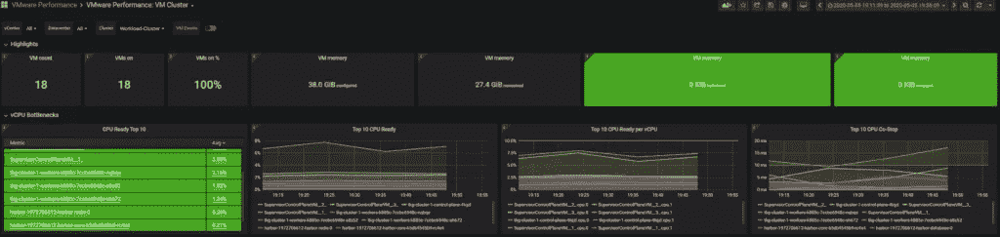

删除部署也会删除 pod 和副本集。

下一篇博文将是关于添加 Tanzu 内容库、创建 TKG 集群以及如何[监控日志和性能](https://www.opvizor.com)。

*原载于 2020 年 5 月 6 日 https://www.opvizor.com**的* [*。*](https://www.opvizor.com/nested-vsphere-7-and-kubernetes-lab-deployment-explained)