# NestJS-采用 TypeORM、MariaDb 和集成& E2E 测试的微服务

> 原文：<https://itnext.io/nestjs-microservice-with-typeorm-mariadb-and-integration-e2e-testing-379338e99580?source=collection_archive---------0----------------------->

使用 TypeORM、MariaDB 在 TCP 上创建一个 NestJS 微服务，并学习如何编写单元、集成和 E2E 测试。

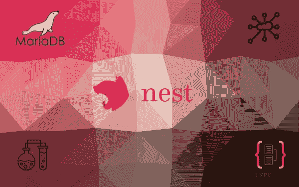

# TL；速度三角形定位法(dead reckoning)

[下面是带有代码的 Github repo。](https://github.com/GeoPablo/nestjs-microservice-boilerplate)

# 序

如果你看到这篇博文，我会假设你已经对什么是 Nest JS 和什么是微服务有了一些基本的了解。

代码可以免费下载和使用。在这篇博文中，我们将只讨论其实现中的棘手部分。

因此，在我们开始之前，下载代码并跟随我。

# 代码📃

我们将讨论的内容:

1.  [从 GitHub 下载代码😀](https://github.com/GeoPablo/nestjs-microservice-boilerplate)
2.  创建微服务
3.  为我们的项目创建配置服务
4.  连接到数据库
5.  创建自定义错误处理(可选)
6.  为具有 CRUD 操作的用户创建新模块
7.  测试(单元测试、集成测试和 e2e 测试)
8.  数据包发送器—测试 TCP 微服务的实用程序

**2。创建微服务**

**main.ts**

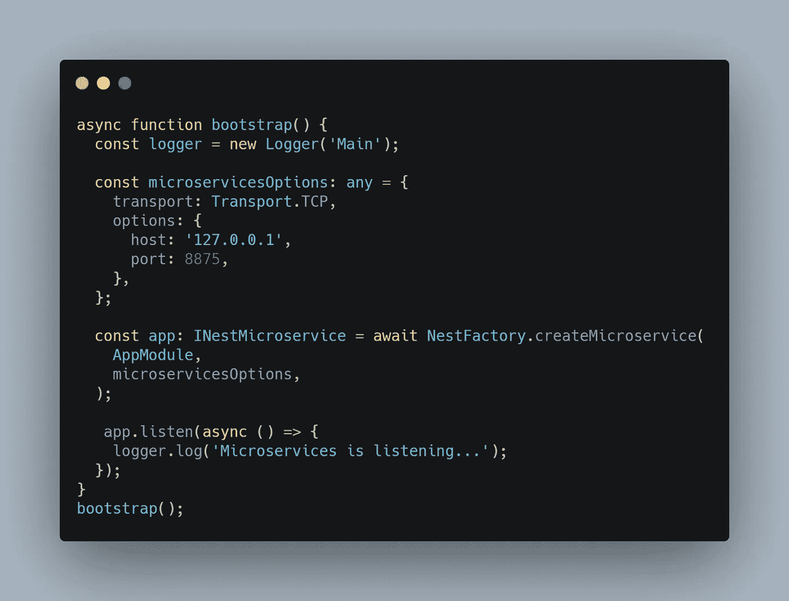

[生](https://carbon.now.sh/?bg=rgba%28171%2C+184%2C+195%2C+1%29&t=seti&wt=none&l=javascript&ds=true&dsyoff=20px&dsblur=68px&wc=true&wa=true&pv=56px&ph=56px&ln=false&fl=1&fm=Hack&fs=14px&lh=133%25&si=false&es=2x&wm=false&code=async%2520function%2520bootstrap%28%29%2520%257B%250A%2520%2520const%2520logger%2520%253D%2520new%2520Logger%28%27Main%27%29%253B%250A%250A%2520%2520const%2520microservicesOptions%253A%2520any%2520%253D%2520%257B%250A%2520%2520%2520%2520transport%253A%2520Transport.TCP%252C%250A%2520%2520%2520%2520options%253A%2520%257B%250A%2520%2520%2520%2520%2520%2520host%253A%2520%27127.0.0.1%27%252C%250A%2520%2520%2520%2520%2520%2520port%253A%25208875%252C%250A%2520%2520%2520%2520%257D%252C%250A%2520%2520%257D%253B%250A%250A%2520%2520const%2520app%253A%2520INestMicroservice%2520%253D%2520await%2520NestFactory.createMicroservice%28%250A%2520%2520%2520%2520AppModule%252C%250A%2520%2520%2520%2520microservicesOptions%252C%250A%2520%2520%29%253B%250A%250A%2520%2520%2520app.listen%28async%2520%28%29%2520%253D%253E%2520%257B%250A%2520%2520%2520%2520logger.log%28%27Microservices%2520is%2520listening...%27%29%253B%250A%2520%2520%257D%29%253B%250A%257D%250Abootstrap%28%29%253B)

有了这个功能，我们就有了一个微服务，在 PC 上的 8875 端口上实时使用 TCP 通信。

**3。为我们的项目创建一个配置服务**

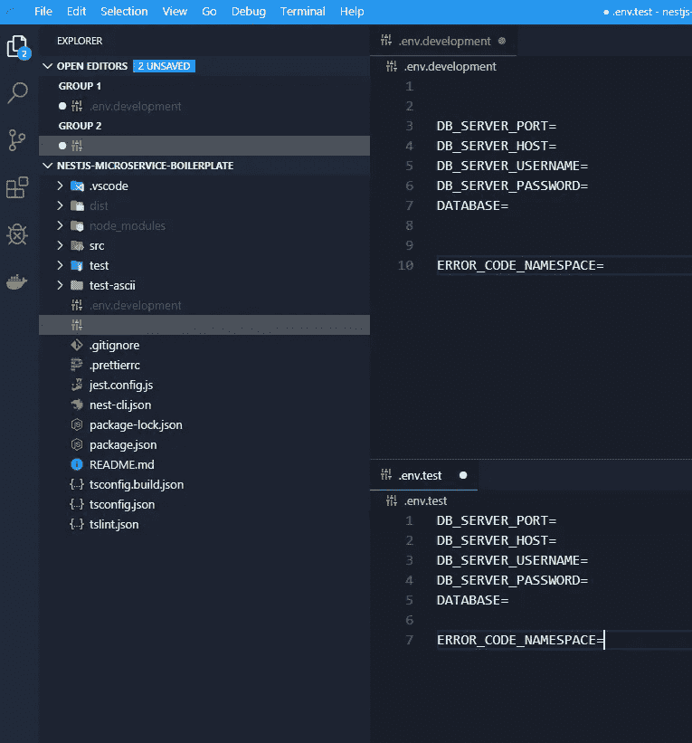

我们使用 **dotenv** 来加载我们的配置。所以我们需要两个**。env** 文件一个用于开发，一个用于测试( **.env.development** 和 **.env.test** )

接下来，我们使用配置服务将这些文件加载到我们的应用程序中。

在 **config.service.ts** 文件中，您会发现以下代码

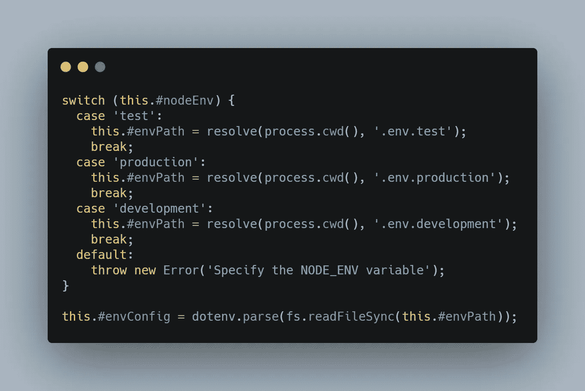

[RAW](https://carbon.now.sh/?bg=rgba%28171%2C+184%2C+195%2C+1%29&t=seti&wt=none&l=javascript&ds=true&dsyoff=20px&dsblur=68px&wc=true&wa=true&pv=56px&ph=56px&ln=false&fl=1&fm=Hack&fs=14px&lh=133%25&si=false&es=2x&wm=false&code=switch%2520%28this.%2523nodeEnv%29%2520%257B%250A%2520%2520case%2520%27test%27%253A%250A%2520%2520%2520%2520this.%2523envPath%2520%253D%2520resolve%28process.cwd%28%29%252C%2520%27.env.test%27%29%253B%250A%2520%2520%2520%2520break%253B%250A%2520%2520case%2520%27production%27%253A%250A%2520%2520%2520%2520this.%2523envPath%2520%253D%2520resolve%28process.cwd%28%29%252C%2520%27.env.production%27%29%253B%250A%2520%2520%2520%2520break%253B%250A%2520%2520case%2520%27development%27%253A%250A%2520%2520%2520%2520this.%2523envPath%2520%253D%2520resolve%28process.cwd%28%29%252C%2520%27.env.development%27%29%253B%250A%2520%2520%2520%2520break%253B%250A%2520%2520default%253A%250A%2520%2520%2520%2520throw%2520new%2520Error%28%27Specify%2520the%2520NODE_ENV%2520variable%27%29%253B%250A%257D%250A%250Athis.%2523envConfig%2520%253D%2520dotenv.parse%28fs.readFileSync%28this.%2523envPath%29%29%253B)

还有**这个。** # **nodeEnv** 来自

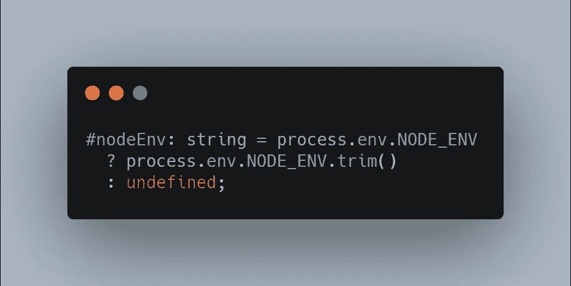

[未加工的](https://carbon.now.sh/?bg=rgba%28171%2C+184%2C+195%2C+1%29&t=seti&wt=none&l=javascript&ds=true&dsyoff=20px&dsblur=68px&wc=true&wa=true&pv=56px&ph=56px&ln=false&fl=1&fm=Hack&fs=14px&lh=133%25&si=false&es=2x&wm=false&code=%2523nodeEnv%253A%2520string%2520%253D%2520process.env.NODE_ENV%250A%2520%2520%253F%2520process.env.NODE_ENV.trim%28%29%250A%2520%2520%253A%2520undefined%253B)

所以我们检查什么是 **NODE_ENV** 值，并且我们将加载**。婀**的文件根据吧。

而 **NODE_ENV** 来自我们的运行脚本。在 **package.json** 中你会看到**cross-ENV NODE _ ENV = development**和 **cross-env NODE_ENV=test**

制作没有脚本，但是可以根据自己的制作环境自己写。

**4。连接到数据库**

我们将 MariaDB 与 TypeORM 一起使用，所以首先，确保您安装了数据库服务器，并且它工作正常。如果你需要任何帮助，你可以在 Github 页面找到一个关于如何安装 MariaDB 的 youtube 教程的链接。

我们将以异步模式连接到数据库，因此代码如下所示:

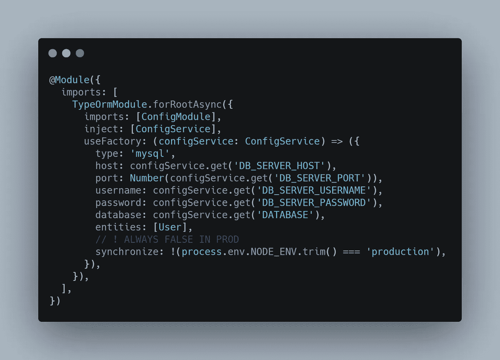

[RAW](https://carbon.now.sh/?bg=rgba%28171%2C+184%2C+195%2C+1%29&t=seti&wt=none&l=javascript&ds=true&dsyoff=20px&dsblur=68px&wc=true&wa=true&pv=56px&ph=56px&ln=false&fl=1&fm=Hack&fs=14px&lh=133%25&si=false&es=2x&wm=false&code=%2540Module%28%257B%250A%2520%2520imports%253A%2520%255B%250A%2520%2520%2520%2520TypeOrmModule.forRootAsync%28%257B%250A%2520%2520%2520%2520%2520%2520imports%253A%2520%255BConfigModule%255D%252C%250A%2520%2520%2520%2520%2520%2520inject%253A%2520%255BConfigService%255D%252C%250A%2520%2520%2520%2520%2520%2520useFactory%253A%2520%28configService%253A%2520ConfigService%29%2520%253D%253E%2520%28%257B%250A%2520%2520%2520%2520%2520%2520%2520%2520type%253A%2520%27mysql%27%252C%250A%2520%2520%2520%2520%2520%2520%2520%2520host%253A%2520configService.get%28%27DB_SERVER_HOST%27%29%252C%250A%2520%2520%2520%2520%2520%2520%2520%2520port%253A%2520Number%28configService.get%28%27DB_SERVER_PORT%27%29%29%252C%250A%2520%2520%2520%2520%2520%2520%2520%2520username%253A%2520configService.get%28%27DB_SERVER_USERNAME%27%29%252C%250A%2520%2520%2520%2520%2520%2520%2520%2520password%253A%2520configService.get%28%27DB_SERVER_PASSWORD%27%29%252C%250A%2520%2520%2520%2520%2520%2520%2520%2520database%253A%2520configService.get%28%27DATABASE%27%29%252C%250A%2520%2520%2520%2520%2520%2520%2520%2520entities%253A%2520%255BUser%255D%252C%250A%2520%2520%2520%2520%2520%2520%2520%2520%252F%252F%2520%21%2520ALWAYS%2520FALSE%2520IN%2520PROD%250A%2520%2520%2520%2520%2520%2520%2520%2520synchronize%253A%2520%21%28process.env.NODE_ENV.trim%28%29%2520%253D%253D%253D%2520%27production%27%29%252C%250A%2520%2520%2520%2520%2520%2520%257D%29%252C%250A%2520%2520%2520%2520%257D%29%252C%250A%2520%2520%255D%252C%250A%257D%29)

在这里，我们注入 **configService** ，并使用它来获取数据库的凭证。

> **同步——这是用来同步你的数据库和你的实体，如果你不想随机丢失你的数据，请确保在生产中设置为假**

现在回到你的**。env** 文件，并确保使用您的数据完成以下字段。对于 MariaDB，这些是缺省值，除了数据库名。**另外，不要忘记创建数据库。**

**.env.development**

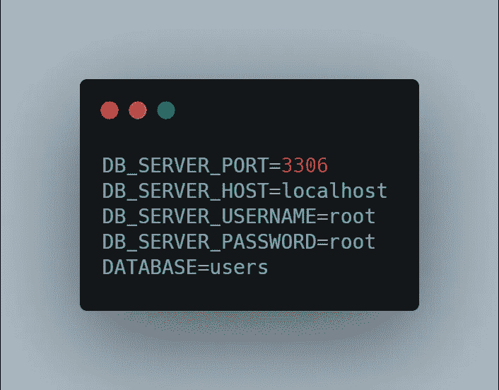

[RAW](https://carbon.now.sh/?bg=rgba%28171%2C+184%2C+195%2C+1%29&t=seti&wt=none&l=javascript&ds=true&dsyoff=20px&dsblur=68px&wc=true&wa=true&pv=56px&ph=56px&ln=false&fl=1&fm=Hack&fs=14px&lh=133%25&si=false&es=2x&wm=false&code=DB_SERVER_PORT%253D3306%250ADB_SERVER_HOST%253Dlocalhost%250ADB_SERVER_USERNAME%253Droot%250ADB_SERVER_PASSWORD%253Droot%250ADATABASE%253Dusers)

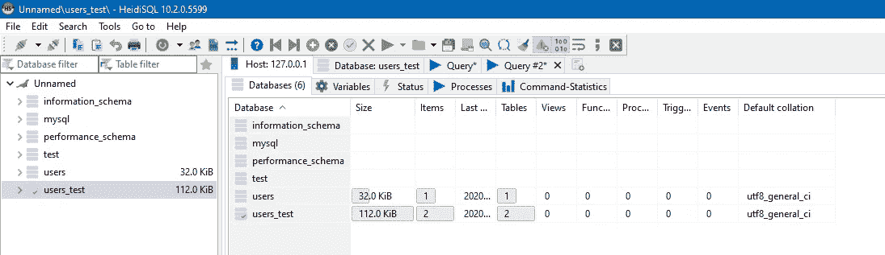

你可以使用 MariaDB 自带的 **HeidiSQL** 。

**5。创建自定义错误处理(可选)**

现在是处理错误的时候了。我的方法是创建一些自定义错误代码和一些异常过滤器。这里我们需要一个用于数据库，一个用于验证，一个用于 RCP 异常的全局错误过滤器。RCP 因为我们有微服务。

同时在 **.env.development** 和 **.env.test** 中编写以下代码

```
ERROR_CODE_NAMESPACE=users-microservice
```

该实现可以在以下文件夹中找到:**公共- >异常过滤器、**和**核心- >定制响应**。

如果您不想使用这种自定义的错误处理，可以从代码中删除这一部分，并返回简单的消息。

**6。为有 CRUD 操作的用户创建一个新模块**

接下来，我们创建一个名为 **user 的新模块。**为了将这个模块与数据库中的表 **user** 连接起来，我们编写了以下代码

用户模块 ts :

```
TypeOrmModule.forFeature([User])
```

在 **user.service.ts** 和 **user.controller.ts** 里面，你会发现不同 CRUD 操作的实现。

**7。测试(单元测试、集成测试和 e2e 测试)**

在真实的场景中，就数量而言，单元测试>集成测试> e2e 测试。

单元测试没有那么难，所以我只写了这个场景的一个例子。你可以在 **user.service.spec.ts** 里面找到。

简而言之，您通过使用模拟实现将应用程序的一个单元与代码的其余部分隔离开来，从而对其进行测试。

在 i **集成测试中，**你检查不同的模块是否在一起工作。所以在我们的例子中，我们不再模仿数据库，我们将使用一个真实的数据库。

您可以在**user . integration . spec . ts**中找到所有 CRUD 操作的测试

在 **E2E 测试**中，你从头到尾检查申请流程。

启动微服务、连接到微服务并提取客户端的代码如下:

**测试/应用 e2e 规范**

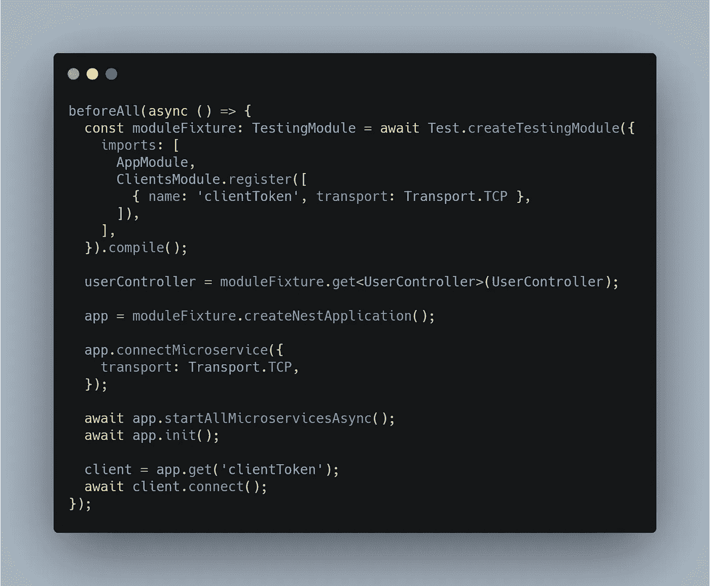

[RAW](https://carbon.now.sh/?bg=rgba%28171%2C+184%2C+195%2C+1%29&t=seti&wt=none&l=javascript&ds=true&dsyoff=20px&dsblur=68px&wc=true&wa=true&pv=56px&ph=56px&ln=false&fl=1&fm=Hack&fs=14px&lh=133%25&si=false&es=2x&wm=false&code=beforeAll%28async%2520%28%29%2520%253D%253E%2520%257B%250A%2520%2520const%2520moduleFixture%253A%2520TestingModule%2520%253D%2520await%2520Test.createTestingModule%28%257B%250A%2520%2520%2520%2520imports%253A%2520%255B%250A%2520%2520%2520%2520%2520%2520AppModule%252C%250A%2520%2520%2520%2520%2520%2520ClientsModule.register%28%255B%250A%2520%2520%2520%2520%2520%2520%2520%2520%257B%2520name%253A%2520%27clientToken%27%252C%2520transport%253A%2520Transport.TCP%2520%257D%252C%250A%2520%2520%2520%2520%2520%2520%255D%29%252C%250A%2520%2520%2520%2520%255D%252C%250A%2520%2520%257D%29.compile%28%29%253B%250A%250A%2520%2520userController%2520%253D%2520moduleFixture.get%253CUserController%253E%28UserController%29%253B%250A%250A%2520%2520app%2520%253D%2520moduleFixture.createNestApplication%28%29%253B%250A%250A%2520%2520app.connectMicroservice%28%257B%250A%2520%2520%2520%2520transport%253A%2520Transport.TCP%252C%250A%2520%2520%257D%29%253B%250A%250A%2520%2520await%2520app.startAllMicroservicesAsync%28%29%253B%250A%2520%2520await%2520app.init%28%29%253B%250A%250A%2520%2520client%2520%253D%2520app.get%28%27clientToken%27%29%253B%250A%2520%2520await%2520client.connect%28%29%253B%250A%257D%29%253B)

**8。数据包发送者—测试 TCP 微服务的实用程序**

如果你想使用工具测试你的微服务，就像用 Postman 测试你的 REST API 一样，你可以使用[数据包发送器](https://packetsender.com/)

要进行配置，您必须按如下方式填写字段:

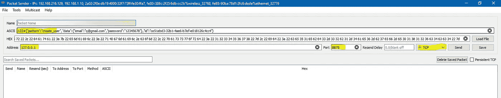

地址—本地主机；端口—微服务端口

在 **ASCII** 文件中你写下你的命令。

**122#** —表示消息的长度

你可以通过打开[blank.org](https://blank.org)来查看你的消息长度，然后在开发者工具里面写下你的消息。

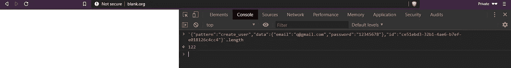

在以下字段中写入 JSON 数据:

```
”data”:{“email”:”[q@gmail.com](mailto:q@gmail.com)”,”password”:”12345678"}
```

字符串的最后一部分表示消息的类型。

```
”id”:”ce51ebd3–32b1–4ae6-b7ef-e018126c4cc4"
```

该值将映射到**@ message pattern(' create _ user ')**

如果您想映射到 **@EventPattern()** ，那么使用这个 **id 的任何其他值。**

# 结论

为了更好地理解这一点，我推荐您从 GitHub 下载代码并使用它。尝试创建一个类似于*帖子*或*照片*的新模块，并将其作为**多对一**和**一对多**与您的用户链接，或者创建一个使用该微服务的客户端。

如果你也想在生产中测试这个代码，这里有一个[数字海洋](https://m.do.co/c/f0f252058644)的链接，价格是 100 美元。