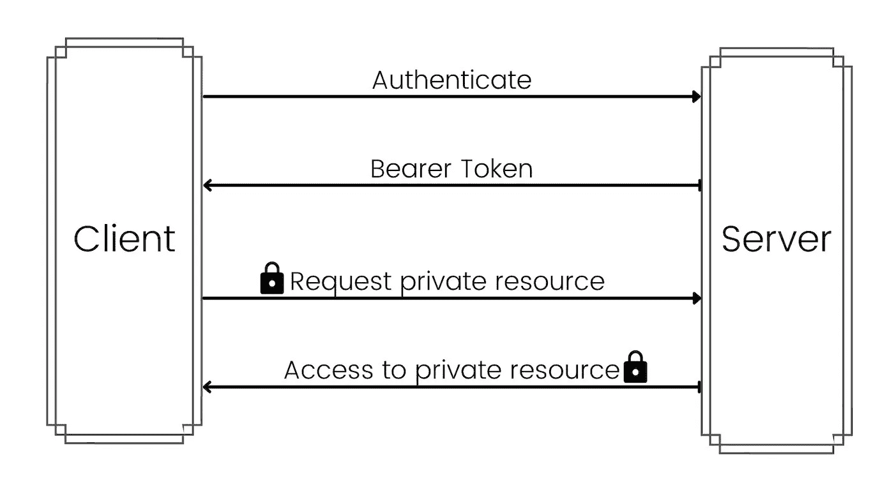
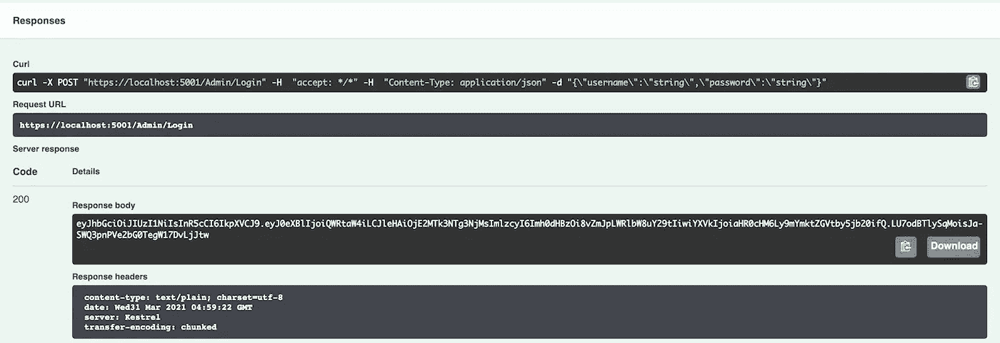
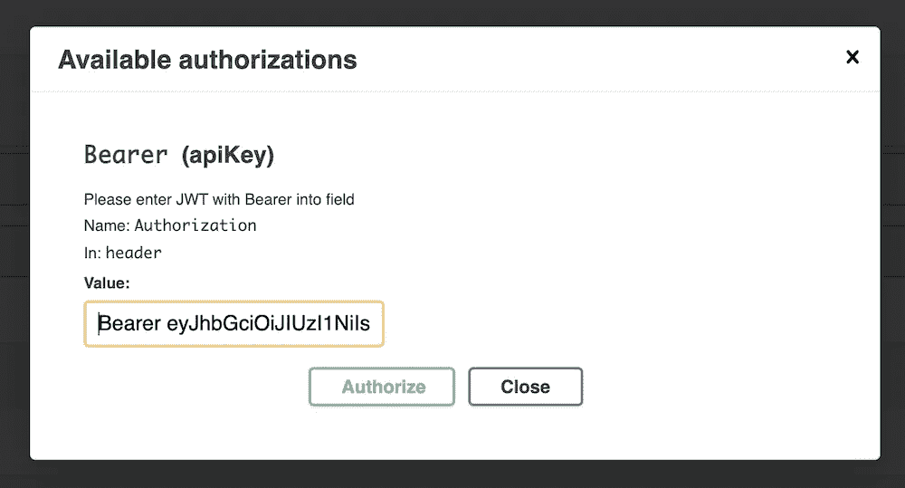

# 。NET 5:如何正确认证和授权 API

> 原文：<https://itnext.io/net-5-how-to-authenticate-authorise-apis-correctly-34b09d132d84?source=collection_archive---------1----------------------->


当心安全漏洞！

在我 11 年的经验中，我见过太多有重大安全缺陷的 API。它们或者缺乏正确的认证或授权设置，或者两者都缺乏。开发人员可能觉得没问题，因为这些端点通常不是公共的。但这是一个巨大的安全漏洞，任何人都可以很容易地锁定它。

为了更好地理解 API 的安全性，让我们为 FBI 创建一个演示项目。将有一个管理员可以登记联邦调查局特工，并改变他们的许可级别。第二，拥有*许可等级 1* 的联邦调查局特工将能够访问公共文件，拥有*许可等级 2* 的特工将能够访问公共&机密文件。

先是一些理论！

# 证明

我们的代理人成功地通过了他所有的考试；该给他报名了。为了做到这一点，他将提供他的文件，作为回报，将得到他的徽章。

在上面的场景中，*提供文档*就像登录一样，一旦通过验证，他将获得一个令牌(徽章)。这个过程叫做*认证*。它决定了代理是否是他们所声称的那个人。

我们将使用 Json Web 令牌(JWT)不记名令牌进行身份验证。*承载令牌*是一种由服务器生成的令牌，包含试图登录的用户的声明/角色的详细信息。不记名令牌大多是结构化令牌，如 *JWT* 。[阅读这里](https://jwt.io/introduction)了解更多关于 JWT 的信息。

# 授权

现在，联邦调查局特工已经得到了他的徽章，他可以进入联邦调查局大楼。他也能够访问公共文件，但是当试图访问机密文件时，他得到 [*401*](https://developer.mozilla.org/en-US/docs/Web/HTTP/Status/401) 错误。

这是因为联邦调查局特工没有被授权访问机密文件。授权决定代理可以和不可以访问的内容。

如上所述，JWT 承载令牌包含声明/角色。基于此，我们的服务器决定是否允许访问私有资源。

# 访问流程



如上图所示，成功登录后，服务器会返回一个不记名令牌。客户端在后续调用中使用承载令牌来访问私有资源。

这是我们将在本文中实现的两个主要概念。

理论讲够了，给我看看代码！

# 项目设置

通过从 cli 执行命令 dot net new webapi-name FBI 创建一个新项目。它将创建一个带有示例 WeatherForecast api 的项目。

我们可以在联邦调查局工作，为什么还要在天气预报上工作。继续删除 *WeatherForecast.cs* 文件。

通过执行命令添加依赖关系

```
dotnet add package Microsoft.IdentityModel.Tokens --version 6.9.0
dotnet add package Microsoft.AspNetCore.Authentication.JwtBearer --version 5.0.4
```

在您的 *Startup.cs* 文件的 *ConfigureServices* 函数中添加以下代码。

```
var TokenValidationParameters = new TokenValidationParameters
{
    ValidIssuer = "https://fbi-demo.com",
    ValidAudience = "https://fbi-demo.com",
    IssuerSigningKey = new SymmetricSecurityKey(Encoding.UTF8.GetBytes("SXkSqsKyNUyvGbnHs7ke2NCq8zQzNLW7mPmHbnZZ")),
    ClockSkew = TimeSpan.Zero // remove delay of token when expire
};
```

我们正在定义验证令牌的参数。确保用于生成 SymmetricSecurityKey 的字符串的长度为 32。

接下来，设置服务来为 API 添加身份验证。

```
services
    .AddAuthentication(options =>
    {
        options.DefaultScheme = JwtBearerDefaults.AuthenticationScheme;
    })
    .AddJwtBearer(cfg =>
    {
        cfg.TokenValidationParameters = TokenValidationParameters;
    });
```

*AddAuthentication* 方法注册认证服务所需的服务。它还将 JWT 承载认证配置为默认方案。

*AddJwtBearer* 启用 JWT 承载认证并设置上面定义的 TokenValidationParameters。

现在让我们为我们的*代理* & *管理员*添加一些授权声明。

```
services.AddAuthorization(cfg =>
    {
        cfg.AddPolicy("Admin", policy => policy.RequireClaim("type", "Admin"));
        cfg.AddPolicy("Agent", policy => policy.RequireClaim("type", "Agent"));
        cfg.AddPolicy("ClearanceLevel1", policy => policy.RequireClaim("ClearanceLevel", "1", "2"));
        cfg.AddPolicy("ClearanceLevel2", policy => policy.RequireClaim("ClearanceLevel", "2"));
    });
```

*AddAuthorization* 方法注册授权所需的服务。我们还通过调用 *AddPolicy* 为 *Admin* 、 *Agent* 、 *ClearanceLevel1* 和 *ClearanceLevel2* 添加声明。声明是一个名称值对，表示主题是什么。由于许可级别 2 也可以访问许可级别 1，我们将*“1】、*放在许可级别 1 中。你可以在这里 阅读更多关于 [*的主张。*](https://docs.microsoft.com/en-us/aspnet/core/security/authorization/claims?view=aspnetcore-5.0)

最后，在*配置*方法中，在*应用程序的正上方添加下面一行。use authorization()；*

```
app.UseAuthentication();
```

# 管理控制器

将您的文件*weatherforecastcontroller . cs*重命名为 *AdminController.cs* 。也要更改类名和构造函数名。最后，移除除构造函数之外的所有内容。

```
using Microsoft.AspNetCore.Mvc;namespace FBI.Controllers
{
    [ApiController]
    [Route("[controller]")]
    public class AdminController : ControllerBase
    {
        public AdminController() { }
    }
}
```

# 登录 API

让我们为 Admin 创建一个登录 API，这样她就可以获得一个令牌来执行其他任务。

```
[HttpPost]
[Route("[action]")]
public IActionResult Login([FromBody] User User)
{
    // TODO: Authenticate Admin with Database
    // If not authenticate return 401 Unauthorized
    // Else continue with below flow var Claims = new List<Claim>
            {
                new Claim("type", "Admin"),
            }; var Key = new SymmetricSecurityKey(Encoding.UTF8.GetBytes("SXkSqsKyNUyvGbnHs7ke2NCq8zQzNLW7mPmHbnZZ")); var Token = new JwtSecurityToken(
        "https://fbi-demo.com",
        "https://fbi-demo.com",
        Claims,
        expires: DateTime.Now.AddDays(30.0),
        signingCredentials: new SigningCredentials(Key, SecurityAlgorithms.HmacSha256)
    ); return new OkObjectResult(new JwtSecurityTokenHandler().WriteToken(Token));
}
```

在上面的代码*中，用户*是一个带有属性*用户名* & *密码*的模型。我们还使用在 *Startup.cs* 文件中使用的配置创建了一个 *JwtSecurityToken* 的对象。然后，令牌被转换为字符串，并在 OkObjectResult 中返回。

现在，您可以打开 Swagger 并执行 API 来查看不记名令牌。将返回一个不记名令牌，如下所示。



请将令牌放在手边，因为我们将在下一节中使用它。你也可以访问 [jwt.io](https://jwt.io/) 来分析你的令牌。

# 生成徽章 API

为代理生成工卡是一项敏感任务，只能由*管理员*授权。我们将为 *GenerateBadge* api 添加一个 *Authorize* 属性。

```
[HttpPost]
[Route("[action]")]
[Authorize(Policy = "Admin")]
public IActionResult GenerateBadge([FromBody] Agent Agent)
{
    var Claims = new List<Claim>
    {
        new Claim("type", "Agent"),
        new Claim("ClearanceLevel", Agent.ClearanceLevel.ToString()),
    }; var Key = new SymmetricSecurityKey(Encoding.UTF8.GetBytes("SXkSqsKyNUyvGbnHs7ke2NCq8zQzNLW7mPmHbnZZ")); var Token = new JwtSecurityToken(
        "[https://fbi-demo.com](https://fbi-demo.com)",
        "[https://fbi-demo.com](https://fbi-demo.com)",
        Claims,
        expires: DateTime.Now.AddDays(30.0),
        signingCredentials: new SigningCredentials(Key, SecurityAlgorithms.HmacSha256)
    ); return new OkObjectResult(new JwtSecurityTokenHandler().WriteToken(Token));
}
```

这里 Agent 是一个模型，其属性名称为字符串，ClearanceLevel 为 int。

现在，当你回到 swagger 并试图执行 *GenerateBadge* api 时，它会给出 401 未授权响应。由于我们没有传递不记名令牌，我们得到了这个错误。

为了能够在 Swagger 更改*服务中添加 Authorize 头。AddSwaggerGen* 如下:

```
services.AddSwaggerGen(c =>
{
    c.SwaggerDoc("v1", new OpenApiInfo { Title = "FBI", Version = "v1" });
    c.AddSecurityDefinition("Bearer", new OpenApiSecurityScheme
    {
        In = ParameterLocation.Header,
        Description = "Please enter JWT with Bearer into field",
        Name = "Authorization",
        Type = SecuritySchemeType.ApiKey
    });
    c.AddSecurityRequirement(new OpenApiSecurityRequirement {
    { new OpenApiSecurityScheme
            {
                Reference = new OpenApiReference { Type = ReferenceType.SecurityScheme, Id = "Bearer"}
            },
        new string[] {}
    }
    });
});
```

当你在浏览器中刷新 Swagger 时，你会注意到在 API 列表上方的右侧有一个*授权*按钮。

点击 Swagger 中新添加的*授权*按钮，将会打开一个对话框。我们需要提到它是什么类型的令牌。因此，首先在字段中输入 *Bearer* ，然后输入一个空格，然后输入从前面部分的 */Admin/Login* api 生成的令牌。



单击标题以锁定令牌。现在你都准备好了。当您再次执行 *GenerateBadge* api 时，您将获得一个令牌(类似于徽章)。把这个令牌放在手边，因为我们在下一节中需要它。还要确保现在将 ClearanceLevel 作为 1 传递。

# 代理控制器

用以下内容创建一个新文件 *AgentController.cs* 。

```
using Microsoft.AspNetCore.Mvc;namespace FBI.Controllers
{
    [ApiController]
    [Route("[controller]")]
    [Authorize(Policy = "Agent")]
    public class AgentController : ControllerBase
    {
        public AgentController() { }
    }
}
```

正如您在上面看到的，我们授权整个控制器仅供代理访问。因此，即使是管理员也无法访问我们将要创建的 API。

# 访问记录 API

让我们添加 api 来访问公共和机密文件。

```
[HttpGet]
[Route("[action]")]
[Authorize(Policy = "ClearanceLevel1")]
public ActionResult<String> AccessPublicFiles()
{
    return new OkObjectResult("Public Files Accessed");
}[HttpGet]
[Route("[action]")]
[Authorize(Policy = "ClearanceLevel2")]
public ActionResult<String> AccessClassifiedFiles()
{
    return new OkObjectResult("Classified Files Accessed");
}
```

我们为这两个 API 添加了*授权*属性，这样公共文件可以由 *ClearanceLevel1* 访问，机密文件可以由 *ClearanceLevel2* 访问。

如果你试图用管理令牌访问这些 API，你会得到 403 禁止错误。因此，继续操作，再次点击*授权*按钮，然后点击*注销*。然后，从上述步骤中获取令牌，并粘贴到以*载体*为前缀的字段中，即*载体*。

现在，当您访问*/Agent/AccessPublicFiles*API 时，您将看到响应 200，其中包含消息 *Public Files Accessed* 。但是当你尝试分类 api 时，你会得到 403 禁止错误。

# 改变净空高度

一晃 3 年过去了，我们的*代理商的*业绩好得令人难以置信。管理层现在决定将他提升到二级通关。

*代理*找到*管理员*并要求她提供一个许可级别为 2 的令牌/徽章。

*管理员*首先调用*/管理员/登录* api 来生成自己的令牌。然后她在*授权*对话框中输入它。

*/Admin/generage badge*API 随后被 ClearanceLevel 中值为 2 的 Admin 调用。这将生成一个新的令牌/徽章，然后她将它交给*代理*。

*代理*在*授权*对话框中输入这个令牌/徽章，当他现在调用*/Agent/AccessClassifiedFiles*时，他很高兴看到结果*机密文件被访问*。

# 结论

你可以在 github 上的这里找到整个项目[。](https://github.com/shenanigan/fbi-demo)

API 安全性极其重要，即使只供内部使用，也不能掉以轻心。设置认证和授权，你就成功了一半。

还有其他一些安全措施可以抵御 DDoS 攻击，比如只接受来自特定 IP 或域的 API 等等。

你觉得这篇文章怎么样？你通常采取的其他安全措施是什么？有任何反馈或意见吗？

你可以点击查看更多教程[。](https://arjavdave.com)