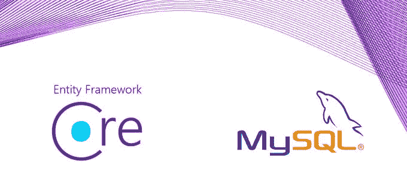

# 。NET 6.0:用实体框架核心和 MySQL 代码先行

> 原文：<https://itnext.io/net-6-0-code-first-with-entity-framework-core-and-mysql-3c779cec145c?source=collection_archive---------1----------------------->

MySQL 与 EF Core 集成初学者指南



EF 核心& MySQL

实体框架(EF)核心是一个对象关系映射器 O/RM，用于将实体与数据库对象进行映射。此外，EF Core 提供易于使用的功能，无需编写代码来访问任何数据。。NET EF 还提供了命令行工具来实现代码优先而不是数据库优先的方法。

# 什么是代码优先？

使用代码优先方法，您可以在代码中创建实体或模型。各种属性和配置定义了数据库中的关系和键。一旦定义和配置了模型，我们就可以使用实体框架 cli 工具将它们迁移到数据库中。

为了更好地理解代码优先的方法，最好有一个实际的例子。我们将创建两个实体用户和作业。用户将有一个字符串形式的主键 Id 和名字。作业实体将有一个主键 Id，名称为字符串，用户 Id 为用户实体的外键。

# 先决条件

在我们开始之前，我们需要一个在本地端口 3306 上运行的 MySQL 服务器。提供如何安装 MySQL 的指导超出了范围，但是有很多教程可以帮助你。此时，不需要创建新的数据库或表。只要有一个正在运行的 MySQL 服务器就足够了。我们还需要一个 MySQL 客户端来添加一些数据。可以使用 [DBeaver](https://dbeaver.io/) 。

# 设置项目

要开始安装[。NET 6.0 SDK](https://dotnet.microsoft.com/en-us/download/dotnet/6.0) 如果尚未安装。启动下面的命令创建一个新的 dotnet 应用程序。

```
dotnet new webapi --name dotnet
```

它将创建一个新的。net 项目以及控制器和一些其他文件。为了支持与 MySQL 的连接，我们需要添加一个 nuget 包。我们还会加入*微软。EntityFrameworkCore* 基本上是一个连接数据库的 ORM。为此，在新创建的 *dotnet* 项目中执行以下命令。

```
dotnet add package Pomelo.EntityFrameworkCore.MySql --version 6.0.1
dotnet add package Microsoft.EntityFrameworkCore --version 6.0.4
dotnet add package Microsoft.EntityFrameworkCore.Design --version 6.0.4
```

因为我们不再需要 *WeatherForecast.cs* 文件，所以删除它。相反，在 Job.cs & *User.cs* 中创建另外两个实体，如下所示。

```
using System.ComponentModel.DataAnnotations;
using System.ComponentModel.DataAnnotations.Schema;namespace dotnet;
public class User
{
    [Key]
    [DatabaseGenerated(DatabaseGeneratedOption.Identity)]
    public int Id { get; set; } public string FirstName { get; set; }
}
```

```
using System.ComponentModel.DataAnnotations;
using System.ComponentModel.DataAnnotations.Schema;namespace dotnet;
public class Job
{
    [Key]
    [DatabaseGenerated(DatabaseGeneratedOption.Identity)]
    public int Id { get; set; } public string Name { get; set; } public int UserId { get; set; } [ForeignKey("UserId")]
    public virtual User User { get; set; }
}
```

我们还需要一个 DbContext 子类来访问这些实体。创建一个文件名 *MySQLDBContext.cs* 并添加以下内容。

```
using Microsoft.EntityFrameworkCore;namespace dotnet;
public class MySQLDBContext : DbContext
{
    public DbSet<User> User { get; set; }
    public DbSet<Job> Job { get; set; }
    public MySQLDBContext(DbContextOptions<MySQLDBContext> options) : base(options) { }
}
```

我们想要配置。NET 使用这个 DbContext 类进行 O/RM 映射。导航到您的 *Program.cs* 文件，并替换为以下内容。*注:自。NET 6.0 中，Startup.cs 文件被删除，而 Program.cs 用于所有配置。*

```
using dotnet;
using Microsoft.AspNetCore.Builder;
using Microsoft.Extensions.DependencyInjection;
using Microsoft.EntityFrameworkCore;
using Microsoft.Extensions.Hosting;
using Microsoft.Extensions.Configuration;var builder = WebApplication.CreateBuilder(args);// Add services to the container.
builder.Services.AddDbContext<MySQLDBContext>(options =>
    {
    var connectionString = builder.Configuration.GetConnectionString("DefaultConnection");
    options.UseMySql(connectionString, ServerVersion.AutoDetect(connectionString));
    });builder.Services.AddControllers();
// Learn more about configuring Swagger/OpenAPI at [https://aka.ms/aspnetcore/swashbuckle](https://aka.ms/aspnetcore/swashbuckle)
builder.Services.AddEndpointsApiExplorer();
builder.Services.AddSwaggerGen();var app = builder.Build();// Configure the HTTP request pipeline.
if (app.Environment.IsDevelopment())
{
    app.UseSwagger();
    app.UseSwaggerUI();
}app.UseHttpsRedirection();app.UseAuthorization();app.MapControllers();app.Run();
```

由于我们使用的是从*连接字符串*中获取*默认连接*的*配置*，我们必须将它添加到我们的 *appsettings* 文件中。要实现这一点，请将*appsettings . development . JSON*和 *appsettings.json* 文件的内容设置如下。

```
{
  "Logging": {
    "LogLevel": {
      "Default": "Information",
      "Microsoft": "Warning",
      "Microsoft.Hosting.Lifetime": "Information"
    }
  },
  "AllowedHosts": "*",
  "ConnectionStrings": {  
    "DefaultConnection": "server=localhost; port=3306; database=super-app; user=root; password=$SuperApp1; Persist Security Info=False; Connect Timeout=300"  
  } 
}
```

接下来，我们将创建一个 GET api，它返回数据库中的作业对象列表。为此，删除*weatherforecastcontroller . cs*并添加一个包含以下内容的 *UserController.cs* 文件。

```
using System.Collections.Generic;
using System.Linq;
using Microsoft.AspNetCore.Mvc;
using Microsoft.EntityFrameworkCore;namespace dotnet.Controllers
{
    [Route("api/[controller]")]
    [ApiController]
    public class JobController : Controller
    {
        private MySQLDBContext _dbContext;  

        public JobController(MySQLDBContext context)  
        {  
            _dbContext = context;  
        }  

        [HttpGet]  
        public IList<Job> Get()  
        {  
            return (this._dbContext.Job.Include(x => x.User).ToList());  
        } 
    }
}
```

我们都设置了代码。但是我们仍然需要建立我们的数据库。为此，我们将在我们的*超级应用*数据库中创建一个用户和作业表。

# 。NET EF 工具

。NET 的实体框架核心提供了一个非常方便的实现方式。首先通过执行以下命令安装 *dotnet-ef* cli 工具。

```
dotnet tool install --global dotnet-ef
```

一旦安装，我们将代码优先的方法，并创建一个我们的实体，然后将被推到我们的数据库迁移。

```
dotnet ef migrations add InitialCreate
dotnet ef database update
```

上面两条语句一旦执行，将创建数据库、其中的表，并设置两个表之间的关系。

# 向 MySQL 添加数据

为了从数据库中获取数据，我们首先需要在表中添加数据。安装任何 MySQL 客户端来连接数据库。我个人最喜欢的是《T21》。现在，您可以从 DBeaver 添加数据，首先添加一个连接，详细信息如下:Host=localhost，Port=3306，User = root&password = $ superapp 1。

连接后，导航到用户表，添加一行并保存数据。同样，导航到职务表，添加一行并保存数据。我们的数据库现在都设置好了。让我们运行我们的项目并查看结果。

# 把所有东西放在一起

回到你的项目，运行下面的命令开始我们的项目。

```
dotnet watch run
```

上述命令将启动您的项目，并在浏览器中打开一个 swagger 链接。只需打开作业 api，点击*试用*，然后点击*执行。将显示一个带有工作列表的漂亮响应。因为我们刚刚添加了一个作业，所以只有一个作业被返回，如下所示。*

```
[
  {
    "id": 1,
    "name": "Tutor",
    "userId": 1,
    "user": {
      "id": 1,
      "firstName": "John Doe"
    }
  }
]
```

# 结论

总结一下，entity framework core 是我遇到的最好的 O/RM 之一，它可以很好地与许多不同的数据库配合使用。设置它就像发出几个命令一样简单。从实体到数据库的迁移非常顺利。