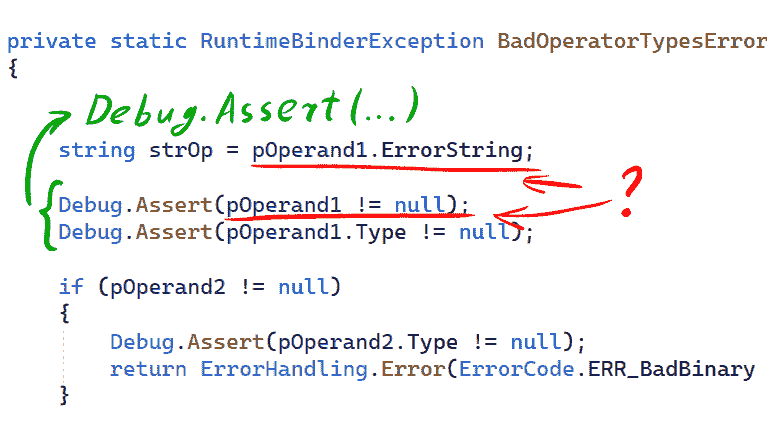
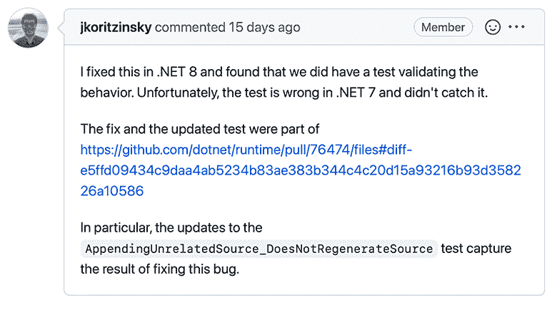
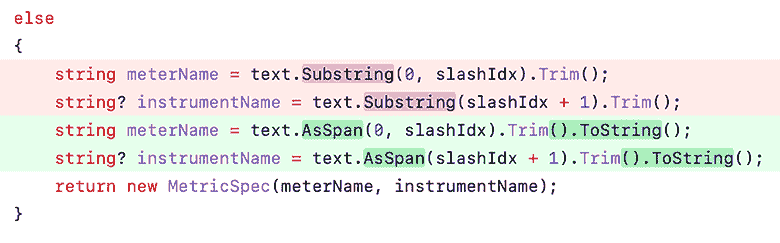
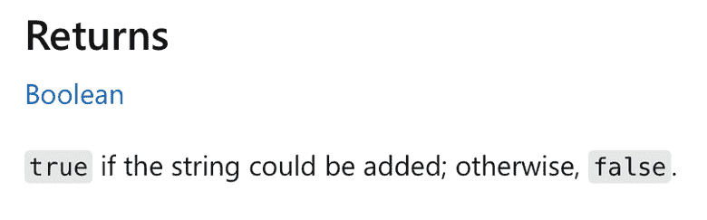
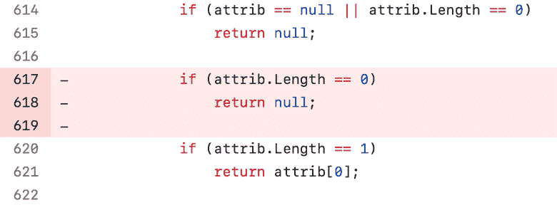
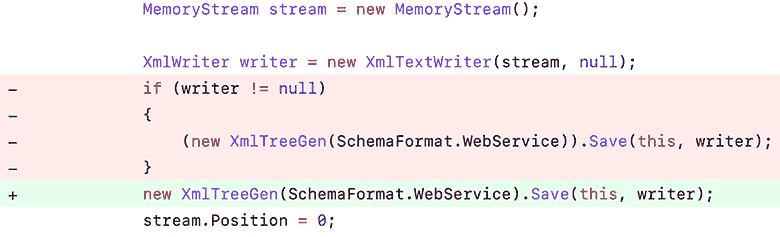
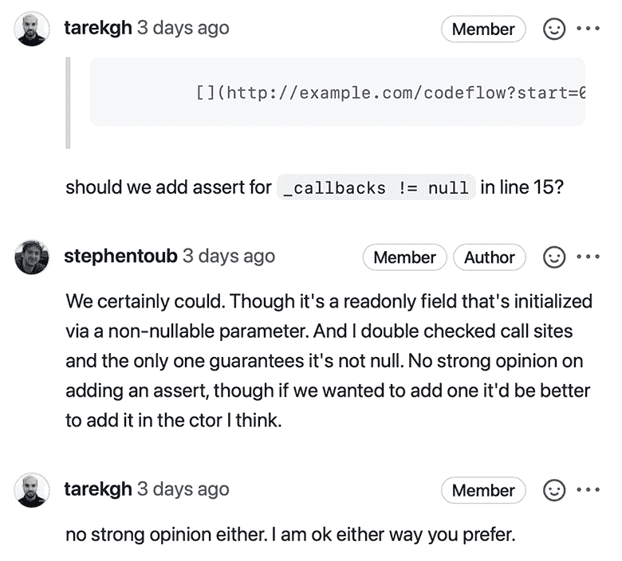
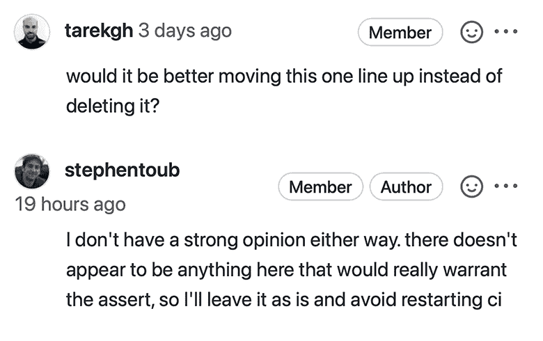
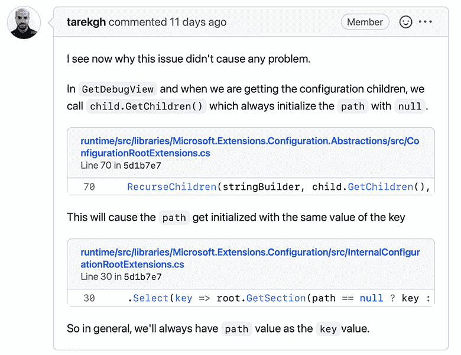

# 。NET 7:源代码中可疑的地方和错误

> 原文：<https://itnext.io/net-7-suspicious-places-and-errors-in-the-source-code-34dfa107a9c9?source=collection_archive---------0----------------------->



。NET 7 已经发布了！是时候让我们深入挖掘它的源代码，开始寻找错误和奇怪的代码片段了。在这篇文章中，您将看到来自。NET 开发人员。毕竟他们比任何人都了解平台代码。系好安全带。

我分析了。NET 7。可以在 GitHub 上找到:[链接](https://github.com/dotnet/runtime/tree/v7.0.0)。

在主版本之前有两个候选版本(RC ),所以大部分的 bug 都已经被修复了。这样更有趣——我们可以调查其中一些是否已经投入生产。

我在 GitHub 上为每个可疑的代码片段创建了一个问题。这帮助我了解了哪些是多余的，哪些是不正确的，以及哪些是开发人员修复的。

**第一期**

你能发现这里的错误吗？让我们检查一下！

```
internal sealed record IncrementalStubGenerationContext(
  StubEnvironment Environment,
  SignatureContext SignatureContext,
  ContainingSyntaxContext ContainingSyntaxContext,
  ContainingSyntax StubMethodSyntaxTemplate,
  MethodSignatureDiagnosticLocations DiagnosticLocation,
  ImmutableArray<AttributeSyntax> ForwardedAttributes,
  LibraryImportData LibraryImportData,
  MarshallingGeneratorFactoryKey<
    (TargetFramework, Version, LibraryImportGeneratorOptions)
  > GeneratorFactoryKey,
  ImmutableArray<Diagnostic> Diagnostics)
{
  public bool Equals(IncrementalStubGenerationContext? other)
  {
    return    other is not null
           && StubEnvironment.AreCompilationSettingsEqual(Environment, 
                                                          other.Environment)
           && SignatureContext.Equals(other.SignatureContext)
           && ContainingSyntaxContext.Equals(other.ContainingSyntaxContext)
           && StubMethodSyntaxTemplate.Equals(other.StubMethodSyntaxTemplate)
           && LibraryImportData.Equals(other.LibraryImportData)
           && DiagnosticLocation.Equals(DiagnosticLocation)
           && ForwardedAttributes.SequenceEqual(other.ForwardedAttributes, 
                (IEqualityComparer<AttributeSyntax>)
                  SyntaxEquivalentComparer.Instance)
          && GeneratorFactoryKey.Equals(other.GeneratorFactoryKey)
          && Diagnostics.SequenceEqual(other.Diagnostics);
    }

    public override int GetHashCode()
    {
      throw new UnreachableException();
    }
}
```

这段代码片段检查*这个*和*其他*对象是否等价。但是，开发人员犯了一个错误，将 *DiagnosticLocation* 属性与自身进行了比较。

不正确的比较:

```
DiagnosticLocation.Equals(DiagnosticLocation)
```

正确的比较:

```
DiagnosticLocation.Equals(other.DiagnosticLocation)
```

我在 *LibraryImportGenerator* 类中发现了这个错误([链接到 GitHub](https://github.com/dotnet/runtime/blob/d099f075e45d2aa6007a22b71b45a08758559f80/src/libraries/System.Runtime.InteropServices/gen/LibraryImportGenerator/LibraryImportGenerator.cs#L43) )。过了一会儿，我又发现了两个片段——同样的错误，但是在不同的类中:

*   *JSImportGenerator* 类，[链接到 GitHub](https://github.com/dotnet/runtime/blob/d099f075e45d2aa6007a22b71b45a08758559f80/src/libraries/System.Runtime.InteropServices.JavaScript/gen/JSImportGenerator/JSImportGenerator.cs#L42)；
*   JSExportGenerator 类[链接到 GitHub](https://github.com/dotnet/runtime/blob/d099f075e45d2aa6007a22b71b45a08758559f80/src/libraries/System.Runtime.InteropServices.JavaScript/gen/JSImportGenerator/JSExportGenerator.cs#L37) 。

有趣的事实:。NET 7 对此特性进行了测试。然而，测试也是不正确的，这就是为什么它没有检测到这个错误。



英寸 NET 8 的代码被大量重写。然而，开发人员还没有修复。NET 7 代码——他们决定等待反馈。你可以在 GitHub 上的[期了解更多信息。](https://github.com/dotnet/runtime/issues/78145)

**第 2 期**

```
internal static void CheckNullable(JSMarshalerType underlyingSig)
{
    MarshalerType underlying = underlyingSig._signatureType.Type;
    if (underlying == MarshalerType.Boolean
        || underlying == MarshalerType.Byte
        || underlying == MarshalerType.Int16
        || underlying == MarshalerType.Int32
        || underlying == MarshalerType.BigInt64
        || underlying == MarshalerType.Int52
        || underlying == MarshalerType.IntPtr
        || underlying == MarshalerType.Double
        || underlying == MarshalerType.Single // <=
        || underlying == MarshalerType.Single // <=
        || underlying == MarshalerType.Char
        || underlying == MarshalerType.DateTime
        || underlying == MarshalerType.DateTimeOffset
        ) return;
    throw new ArgumentException("Bad nullable value type");
}
```

位置:JSMarshalerType.cs，387 ( [链接](https://github.com/dotnet/runtime/blob/d099f075e45d2aa6007a22b71b45a08758559f80/src/libraries/System.Runtime.InteropServices.JavaScript/src/System/Runtime/InteropServices/JavaScript/JSMarshalerType.cs#L387))

在这里，开发人员再次检查底层的*变量*是否等于 *MarshalerType。单曲*。有时这种检查会隐藏错误:例如，应该检查左和右*变量，但是左*变量被检查了两次。这里有一个在开源项目中发现的类似错误的列表。**

我在 GitHub 上创建了一个问题:[链接](https://github.com/dotnet/runtime/issues/78682)。幸运的是，这段代码没有错误——这只是一个多余的检查。

**第三期**

```
public static bool TryParse(string text, out MetricSpec spec)
{
  int slashIdx = text.IndexOf(MeterInstrumentSeparator);
  if (slashIdx == -1)
  {
    spec = new MetricSpec(text.Trim(), null);
    return true;
  }
  else
  {
    string meterName = text.Substring(0, slashIdx).Trim();
    string? instrumentName = text.Substring(slashIdx + 1).Trim();
    spec = new MetricSpec(meterName, instrumentName);
    return true;
  }
}
```

位置:MetricsEventSource.cs，453 ( [链接](https://github.com/dotnet/runtime/blob/d099f075e45d2aa6007a22b71b45a08758559f80/src/libraries/System.Diagnostics.DiagnosticSource/src/System/Diagnostics/Metrics/MetricsEventSource.cs#L453))

*TryParse* 方法总是返回 *true* 。这太奇怪了。让我们看看这种方法在哪里使用:

```
private void ParseSpecs(string? metricsSpecs)
{
  ....
  string[] specStrings = ....
  foreach (string specString in specStrings)
  {
    if (!MetricSpec.TryParse(specString, out MetricSpec spec))
    {
      Log.Message($"Failed to parse metric spec: {specString}");
    }
    else
    {
      Log.Message($"Parsed metric: {spec}");
      ....
    }
  }
}
```

位置:MetricsEventSource.cs，375 ( [链接](https://github.com/dotnet/runtime/blob/d099f075e45d2aa6007a22b71b45a08758559f80/src/libraries/System.Diagnostics.DiagnosticSource/src/System/Diagnostics/Metrics/MetricsEventSource.cs#L375))

*TryParse* 方法的返回值作为 *if* 语句的条件。如果 *specString* 无法解析，应记录原始值。否则，接收到的表示( *spec* )将被记录，并对其执行一些操作。

问题是， *TryParse* 总是返回 *true。*因此, *if* 语句的*然后*分支永远不会执行——解析总是成功的。

GitHub 上的问题:[链接](https://github.com/dotnet/runtime/issues/78625)。

作为修复的结果， *TryParse* 变成了 *Parse* ，调用者方法失去了 *if* 语句。开发人员还将 *TryParse* 中的*子串*改为*作为 Span* 。



顺便说一下，这是我在研究。NET 6 源代码。但是当时，日志记录方法中缺少插值字符:

```
if (!MetricSpec.TryParse(specString, out MetricSpec spec))
{
  Log.Message("Failed to parse metric spec: {specString}");
}
else
{
  Log.Message("Parsed metric: {spec}");
  ....
}
```

你可以在关于的文章中读到更多关于这个问题的信息。网 6 检查(第 14 期)。

**第 4 期**

既然我们提到了具有奇怪返回值的方法，让我们看另一个:

```
public virtual bool TryAdd(XmlDictionaryString value, out int key)
{
  ArgumentNullException.ThrowIfNull(value);
  IntArray? keys;
  if (_maps.TryGetValue(value.Dictionary, out keys))
  {
    key = (keys[value.Key] - 1);
    if (key != -1)
    {
      // If the key is already set, then something is wrong
      throw System.Runtime
                  .Serialization
                  .DiagnosticUtility
                  .ExceptionUtility
                  .ThrowHelperError(
      new InvalidOperationException(SR.XmlKeyAlreadyExists));
     }
     key = Add(value.Value);
     keys[value.Key] = (key + 1);
     return true;               // <=
  }
  key = Add(value.Value);
  keys = AddKeys(value.Dictionary, value.Key + 1);
  keys[value.Key] = (key + 1);
  return true;                  // <=
}
```

地点:XmlBinaryWriterSession.cs，28 ( [链接](https://github.com/dotnet/runtime/blob/d099f075e45d2aa6007a22b71b45a08758559f80/src/libraries/System.Private.DataContractSerialization/src/System/Xml/XmlBinaryWriterSession.cs#L28))

该方法要么返回*真*要么抛出一个异常——它从不返回*假*。这是一个公共 API，所以对质量有更多的要求。

让我们看看[learn.microsoft.com](https://learn.microsoft.com/en-us/dotnet/api/system.xml.xmlbinarywritersession.tryadd?view=net-7.0)上的描述:



哦，太好了。我也在 GitHub 上为它创建了一个问题([链接](https://github.com/dotnet/dotnet-api-docs/issues/8656))，但是在写这篇文章的时候，还没有关于它的任何消息。

**第五期**

```
public static Attribute? GetCustomAttribute(ParameterInfo element, 
                                            Type attributeType, 
                                            bool inherit)
{
  // ....
  Attribute[] attrib = GetCustomAttributes(element, attributeType, inherit);
  if (attrib == null || attrib.Length == 0)
    return null;
  if (attrib.Length == 0)
    return null;
  if (attrib.Length == 1)
    return attrib[0];
  throw new AmbiguousMatchException(SR.RFLCT_AmbigCust);
}
```

位置:属性。CoreCLR.cs，617 ( [链接](https://github.com/dotnet/runtime/blob/d099f075e45d2aa6007a22b71b45a08758559f80/src/coreclr/System.Private.CoreLib/src/System/Attribute.CoreCLR.cs#L617))

在这段代码中，同一个表达式— *attrib。Length == 0* —检查两次:第一次作为“||”运算符的右操作数，然后作为 *if* 语句的条件。

有时这可能是一个错误——开发人员想检查一件事，却检查另一件事。我们很幸运:第二次检查只是多余的，开发人员删除了它。

GitHub 上的问题:[链接](https://github.com/dotnet/runtime/issues/78683)。



**第六期**

```
protected virtual XmlSchema? GetSchema()
{
  if (GetType() == typeof(DataTable))
  {
    return null;
  }
  MemoryStream stream = new MemoryStream();
  XmlWriter writer = new XmlTextWriter(stream, null);
  if (writer != null)
  {
    (new XmlTreeGen(SchemaFormat.WebService)).Save(this, writer);
  }
  stream.Position = 0;
  return XmlSchema.Read(new XmlTextReader(stream), null);
}
```

位置:DataTable.cs，6678 ( [链接](https://github.com/dotnet/runtime/blob/d099f075e45d2aa6007a22b71b45a08758559f80/src/libraries/System.Data.Common/src/System/Data/DataTable.cs#L6678)

开发人员创建了一个 *XmlTextWriter* 类型的实例。然后将对该实例的引用分配给*写入器*变量。然而，在下一行中，开发人员检查了*写入器*中的 *null* 。检查总是返回*真*，这意味着该条件在这里是多余的。

不恐怖，但是还是把支票去掉比较好。实际上，开发人员就是这么做的(GitHub 上的[问题](https://github.com/dotnet/runtime/issues/78684))。



**第七期**

又是冗余代码，但这次不太明显:

```
public int ToFourDigitYear(int year, int twoDigitYearMax)
{
  if (year < 0)
  {
    throw new ArgumentOutOfRangeException(nameof(year), 
                                          SR.ArgumentOutOfRange_NeedPosNum);
  }
  if (year < 100)
  {
    int y = year % 100;
    return (twoDigitYearMax / 100 - (y > twoDigitYearMax % 100 ? 1 : 0)) 
             * 100 + y;
  }
  ....
}
```

地点:GregorianCalendarHelper.cs，526 ( [链接](https://github.com/dotnet/runtime/blob/d099f075e45d2aa6007a22b71b45a08758559f80/src/libraries/System.Private.CoreLib/src/System/Globalization/GregorianCalendarHelper.cs#L526))

让我们看看在整个代码执行过程中如何检查 *year* 变量的范围:

```
ToFourDigitYear(int year, int twoDigitYearMax)
```

*年份*是 *int* 类型*的一个参数。*这意味着它的值在[ *int 内。MinValue*； *int。最大值*范围。

代码执行时，首先满足 *if* 语句；在此语句中，会引发一个异常:

```
if (year < 0)
{
  throw ....;
}
```

如果没有异常，那么*年*值在[0；智力。最大值。

然后，另一个 *if* 语句:

```
if (year < 100)
{
  int y = year % 100;
  ....
}
```

如果代码执行在*那么*的*分支，如果*，那么*年*值在[0；99]范围。这导致了一个有趣的结果——取除法的余数:

```
int y = year % 100;
```

*年*值始终小于 100(即该值介于 0-99 之间)。因此，*年% 100* 运算的结果总是等于左操作数— *年*。因此， *y* 总是等于*年*。

代码要么是多余的，要么是错误的。在我打开 GitHub 上的[问题后，代码被修复，并且 *y* 变量被移除。](https://github.com/dotnet/runtime/issues/78627)

**第 8 期**

```
internal ConfigurationSection
FindImmediateParentSection(ConfigurationSection section)
{
  ....
  SectionRecord sectionRecord = ....
  if (sectionRecord.HasLocationInputs)
  {
    SectionInput input = sectionRecord.LastLocationInput;
    Debug.Assert(input.HasResult, "input.HasResult");
    result = (ConfigurationSection)input.Result;
  }
  else
  {
    if (sectionRecord.HasIndirectLocationInputs)
    {
      Debug.Assert(IsLocationConfig, 
                   "Indirect location inputs exist 
                    only in location config record");
      SectionInput input = sectionRecord.LastIndirectLocationInput;
      Debug.Assert(input != null);
      Debug.Assert(input.HasResult, "input.HasResult");
      result = (ConfigurationSection)input.Result;
    }
    ....
  ....
}
```

位置:MgmtConfigurationRecord.cs，341 ( [链接](https://github.com/dotnet/runtime/blob/d099f075e45d2aa6007a22b71b45a08758559f80/src/libraries/System.Configuration.ConfigurationManager/src/System/Configuration/MgmtConfigurationRecord.cs#L341))

我们需要在这里挖得更深一点。首先，让我们看看第二个 *if* 语句:

```
if (sectionRecord.HasIndirectLocationInputs)
{
  Debug.Assert(IsLocationConfig, 
               "Indirect location inputs exist 
                only in location config record");
  SectionInput input = sectionRecord.LastIndirectLocationInput;
  Debug.Assert(input != null);
  Debug.Assert(input.HasResult, "input.HasResult");
  result = (ConfigurationSection)input.Result;
}
```

*LastIndirectLocationInput*属性的值被写入*输入*变量*。*之后，*输入*分两次被检查:检查*是否为空* ( *输入！= null* )和结果(*输入的存在。HasResult* )。

让我们看一下*LastIndirectLocationInput*属性的主体，以了解哪个值可以写入*输入*变量:

```
internal SectionInput LastIndirectLocationInput
  =>   HasIndirectLocationInputs 
     ? IndirectLocationInputs[IndirectLocationInputs.Count - 1] 
     : null;
```

一方面，属性可能返回 *null* 。另一方面，如果*具有 IndirectLocationInputs* 为*真*，那么*为 IndirectLocationInputs【IndirectLocationInputs。返回 count-1]*而不是显式的 *null* 。

问题是， *IndirectLocationInputs* 集合中的值是否可以为空值*？可能是的，虽然从代码上看不清楚。顺便说一下，可空注释在这里可能会有所帮助，但是它们根本没有被启用。NET 项目。*

让我们回到*如果*:

```
if (sectionRecord.HasIndirectLocationInputs)
{
  Debug.Assert(IsLocationConfig, 
               "Indirect location inputs exist 
                only in location config record");
  SectionInput input = sectionRecord.LastIndirectLocationInput;
  Debug.Assert(input != null);
  Debug.Assert(input.HasResult, "input.HasResult");
  result = (ConfigurationSection)input.Result;
}
```

条件表达式是*section record . hasindirectlocationinputs .*与在*LastIndirectLocationInput*中检查的属性相同。这意味着*LastIndirectLocationInput*肯定不会显式返回 *null* 。然而，不清楚哪个值将从*间接位置输入*接收并写入*输入*。

开发者首先检查*输入！= null* ，然后只检查结果的存在— *输入。散列结果*。看起来没问题。

现在让我们回到第一个 *if* 语句:

```
if (sectionRecord.HasLocationInputs)
{
  SectionInput input = sectionRecord.LastLocationInput;
  Debug.Assert(input.HasResult, "input.HasResult");
  result = (ConfigurationSection)input.Result;
}
```

让我们看看 *LastLocationInput* 属性:

```
internal SectionInput LastLocationInput 
  =>  HasLocationInputs 
    ? LocationInputs[LocationInputs.Count - 1] 
    : null;
```

和*LastIndirectLocationInput*的写法一样。就像前一个例子一样，根据标志( *HasLocationInputs* )，要么返回空值*要么返回来自 *LocationInputs* 集合的值。*

现在返回到 *if* 语句。其条件表达式是 *HasLocationInputs* 属性，在 *LastLocationInput* 中检查。如果代码在*然后 *if* 语句的*分支中执行，这意味着 *LastLocationInput* 不能显式返回 *null* 。来自*位置输入*集合的值是否可以为空值*？这个问题仍然没有答案。如果可以，那么*空值*也将被写入*输入*。*

如在第一次被检查的情况下*如果*，*输入。HasResult* 被检查但没有*输入！= null* 这次。

再一次。第一个检查的代码片段:

```
SectionInput input = sectionRecord.LastIndirectLocationInput;
Debug.Assert(input != null);
Debug.Assert(input.HasResult, "input.HasResult");
result = (ConfigurationSection)input.Result;
```

第二个:

```
SectionInput input = sectionRecord.LastLocationInput;
Debug.Assert(input.HasResult, "input.HasResult");
result = (ConfigurationSection)input.Result;
```

看起来像是*调试。断言(输入！= null)* 表达式缺失。

我在 GitHub 上开了一个[问题，在那里我描述了这个和其他与 *null* 支票相关的可疑地方(你会在下面看到它们)。](https://github.com/dotnet/runtime/issues/78634)

开发人员决定不修复这个片段，让它保持原样:


**空支票的问题**

我在代码中遇到过几个引用被解引用的地方，只有在那里才会检查是否有 *null。*我为 GitHub 上所有类似的代码片段创建了[一期](https://github.com/dotnet/runtime/issues/78634)。

我们来检查一下。

**第九期**

```
private static RuntimeBinderException BadOperatorTypesError(Expr pOperand1, 
                                                            Expr pOperand2)
{
  // ....
  string strOp = pOperand1.ErrorString;
  Debug.Assert(pOperand1 != null);
  Debug.Assert(pOperand1.Type != null);
  if (pOperand2 != null)
  {
    Debug.Assert(pOperand2.Type != null);
    return ErrorHandling.Error(ErrorCode.ERR_BadBinaryOps,
                               strOp, 
                               pOperand1.Type, 
                               pOperand2.Type);
  }
  return ErrorHandling.Error(ErrorCode.ERR_BadUnaryOp, strOp, pOperand1.Type);
}
```

位置:ExpressionBinder.cs，798 ( [链接](https://github.com/dotnet/runtime/blob/d099f075e45d2aa6007a22b71b45a08758559f80/src/libraries/Microsoft.CSharp/src/Microsoft/CSharp/RuntimeBinder/Semantics/ExpressionBinder.cs#L798))

首先， *pOperand1* 被解引用( *pOperand1。ErrorString* )并在*调试中检查*空值*。在下一个代码行断言*。如果 *pOperand1* 为 *null* ，则不触发断言，而是抛出 *NullReferenceException* 类型的异常。

代码已修复—使用前检查了 *pOperand1* 。

之前:

```
string strOp = pOperand1.ErrorString;
Debug.Assert(pOperand1 != null);
Debug.Assert(pOperand1.Type != null);
```

之后:

```
Debug.Assert(pOperand1 != null);
Debug.Assert(pOperand1.Type != null);
string strOp = pOperand1.ErrorString;
```

**第 10 期**

```
public void Execute()
{
  var count = _callbacks.Count;
  if (count == 0)
  {
    return;
  }

  List<Exception>? exceptions = null;
  if (_callbacks != null)
  {
    for (int i = 0; i < count; i++)
    {
      var callback = _callbacks[i];
      Execute(callback, ref exceptions);
    }
  }
  if (exceptions != null)
  {
    throw new AggregateException(exceptions);
  }
}
```

位置:PipeCompletionCallbacks.cs，20 ( [链接](https://github.com/dotnet/runtime/blob/d099f075e45d2aa6007a22b71b45a08758559f80/src/libraries/System.IO.Pipelines/src/System/IO/Pipelines/PipeCompletionCallbacks.cs#L20))

首先使用 *_callbacks* 变量，然后检查*是否为空*:

```
public void Execute()
{
  var count = _callbacks.Count;
  ....
  if (_callbacks != null)
  ....
}
```

在写这篇文章的时候，开发人员移除了检查*_ 回调*为*空*。

顺便说一下， *_callbacks* 是一个在构造函数中初始化的*只读*字段:

```
internal sealed class PipeCompletionCallbacks
{
  private readonly List<PipeCompletionCallback> _callbacks;
  private readonly Exception? _exception;
  public PipeCompletionCallbacks(List<PipeCompletionCallback> callbacks, 
                                 ExceptionDispatchInfo? edi)
  {
    _callbacks = callbacks;
    _exception = edi?.SourceException;
  }
  ....
}
```

在修复后的线程中，开发人员讨论了是否值得添加 *Debug。断言*并检查*_ 回调*中的*为空*进入构造函数。最后，他们决定不是。



**第 11 期**

```
private void ValidateAttributes(XmlElement elementNode)
{
  ....
  XmlSchemaAttribute schemaAttribute 
    = (_defaultAttributes[i] as XmlSchemaAttribute)!;
  attrQName = schemaAttribute.QualifiedName;
  Debug.Assert(schemaAttribute != null);
  ....
}
```

位置:DocumentSchemaValidator.cs，421 ( [链接](https://github.com/dotnet/runtime/blob/d099f075e45d2aa6007a22b71b45a08758559f80/src/libraries/System.Private.Xml/src/System/Xml/Dom/DocumentSchemaValidator.cs#L421))

有争议的代码:

*   *作为*运算符的结果被写入 *schemaAttribute* 。如果*_ default attributes[I]*—*null*或者转换失败，结果将是 *null* 。
*   允许空值的运算符(“！”)暗示了造型的结果不能是 *null* 。因此， *schemaAttribute* 不能为 *null* 。
*   在下一行代码中， *schemaAttribute* 被取消引用。然后在下面的一行中，检查引用的*是否为空*。

问题来了。 *schemaAttribute* 会不会是 *null* ？从代码上看不是很清楚。

代码是这样修复的:

```
....
XmlSchemaAttribute schemaAttribute 
  = (XmlSchemaAttribute)_defaultAttributes[i]!;
attrQName = schemaAttribute.QualifiedName;
....
```

在讨论修复过程中，开发人员提议转移*调试。断言*调用上面的行，而不是删除它。代码应该是这样的:

```
....
XmlSchemaAttribute schemaAttribute = (XmlSchemaAttribute)_defaultAttributes[i]!;
Debug.Assert(schemaAttribute != null);
attrQName = schemaAttribute.QualifiedName;
....
```

最终，他们决定不返回*断言*。



**第 12 期**

让我们看看*XmlConfigurationElementTextContent*类型的构造函数:

```
public XmlConfigurationElementTextContent(string textContent, 
                                          int? linePosition, 
                                          int? lineNumber)
{ .... }
```

位置:xmlconfigurationelementtextcontent . cs，10 ( [链接](https://github.com/dotnet/runtime/blob/d099f075e45d2aa6007a22b71b45a08758559f80/src/libraries/Microsoft.Extensions.Configuration.Xml/src/XmlConfigurationElementTextContent.cs#L10))

现在让我们看看它的使用场合:

```
public static IDictionary<string, string?> Read(....)
{
  ....
  case XmlNodeType.EndElement:
    ....
    var lineInfo = reader as IXmlLineInfo;
    var lineNumber = lineInfo?.LineNumber;
    var linePosition = lineInfo?.LinePosition;
    parent.TextContent = new XmlConfigurationElementTextContent(string.Empty, 
                                                                lineNumber,
                                                                linePosition);
    ....
    break;
  ....
  case XmlNodeType.Text:
    ....
    var lineInfo = reader as IXmlLineInfo;
    var lineNumber = lineInfo?.LineNumber;
    var linePosition = lineInfo?.LinePosition;
    XmlConfigurationElement parent = currentPath.Peek();
    parent.TextContent = new XmlConfigurationElementTextContent(reader.Value,
                                                                lineNumber, 
                                                                linePosition);
    ....
    break;
  ....
}
```

位置:

*   xmlstreamconfigurationprovider . cs，133 ( [链接](https://github.com/dotnet/runtime/blob/d099f075e45d2aa6007a22b71b45a08758559f80/src/libraries/Microsoft.Extensions.Configuration.Xml/src/XmlStreamConfigurationProvider.cs#L133))
*   xmlstreamconfigurationprovider . cs，148 ( [链接](https://github.com/dotnet/runtime/blob/d099f075e45d2aa6007a22b71b45a08758559f80/src/libraries/Microsoft.Extensions.Configuration.Xml/src/XmlStreamConfigurationProvider.cs#L148))

你注意到代码中有什么奇怪的地方吗？

请注意自变量和参数的顺序:

*   自变量:…，*行号*，*行位置*；
*   参数:…，*线位置*，*线号*。

我在 GitHub ( [链接](https://github.com/dotnet/runtime/issues/78212))上创建了一个问题，代码被修复:开发人员将参数按正确的顺序排列，并添加了一个测试。

**第 13 期**

另一个可疑案例:

```
public virtual bool Nested
{
  get {....}
  set 
  {
    ....
    ForeignKeyConstraint? constraint 
      = ChildTable.Constraints
                  .FindForeignKeyConstraint(ChildKey.ColumnsReference, 
                                            ParentKey.ColumnsReference); 
    ....
  }
}
```

位置:DataRelation.cs，486 ( [链接](https://github.com/dotnet/runtime/blob/d099f075e45d2aa6007a22b71b45a08758559f80/src/libraries/System.Data.Common/src/System/Data/DataRelation.cs#L486))

看看*findforeignkey constraint*方法:

```
internal ForeignKeyConstraint? 
FindForeignKeyConstraint(DataColumn[] parentColumns, 
                         DataColumn[] childColumns)
{ .... }
```

位置:ConstraintCollection.cs，548 ( [链接](https://github.com/dotnet/runtime/blob/d099f075e45d2aa6007a22b71b45a08758559f80/src/libraries/System.Data.Common/src/System/Data/ConstraintCollection.cs#L548))

似乎论点的顺序又混淆了:

*   参数:*父* …，*子* …
*   参数: *ChildKey* …， *ParentKey* …

还有另一个方法调用:参数顺序是正确的。

```
ForeignKeyConstraint? foreignKey
  = relation.ChildTable
            .Constraints
            .FindForeignKeyConstraint(relation.ParentColumnsReference,
                                      relation.ChildColumnsReference);
```

我在 GitHub 上创建了一个问题:[链接](https://github.com/dotnet/runtime/issues/78628)。不幸的是，在写这篇文章的时候，我还没有收到任何关于它的评论。

**第 14 期**

这些地方并不是所有的论点顺序都是混乱的——我发现了另一个:

```
void RecurseChildren(....)
{
  ....
  string? value 
    =  processValue != null
      ? processValue(new ConfigurationDebugViewContext(
                           child.Key, 
                           child.Path, 
                           valueAndProvider.Value, 
                           valueAndProvider.Provider))
      : valueAndProvider.Value;
  ....
}
```

位置:configurationrootwextensions . cs，50 ( [链接](https://github.com/dotnet/runtime/blob/d099f075e45d2aa6007a22b71b45a08758559f80/src/libraries/Microsoft.Extensions.Configuration.Abstractions/src/ConfigurationRootExtensions.cs#L50))

查看*ConfigurationDebugViewContext*构造函数:

```
public ConfigurationDebugViewContext(
  string path, 
  string key, 
  string? value, 
  IConfigurationProvider configurationProvider) 
{ .... }
```

位置:configurationdebugviewcontext . cs，11 ( [链接](https://github.com/dotnet/runtime/blob/d099f075e45d2aa6007a22b71b45a08758559f80/src/libraries/Microsoft.Extensions.Configuration.Abstractions/src/ConfigurationDebugViewContext.cs#L11))

订单:

*   参数:*路径*，*按键*，…
*   自变量:*子。关键*，*子。路径*，…

我在 GitHub 上创建了一个问题:[链接](https://github.com/dotnet/runtime/issues/78306)。据开发商说，这种情况下没有任何问题，尽管错误。



然而，他们仍然固定了辩论的顺序。

**结论**

的。NET 代码质量很高。我相信这是通过一个既定的开发过程实现的——开发人员知道确切的发布日期。此外，发布候选有助于发现最严重的错误，并为发布做好项目准备。

尽管如此，我仍然设法在代码中找到一些有趣的东西。这一次，我最喜欢的是在方法调用过程中混淆的参数。

本文中描述的所有代码片段都是由 PVS-Studio analyzer 找到的。是的，现在它可以检查项目了。NET 7。

如果你想检查你的项目(个人或商业)，在这里下载分析器。这个页面上还有一个文档链接:我们描述了如何输入许可并运行分析。如果您有任何问题，请告诉我们，我们会帮助您。