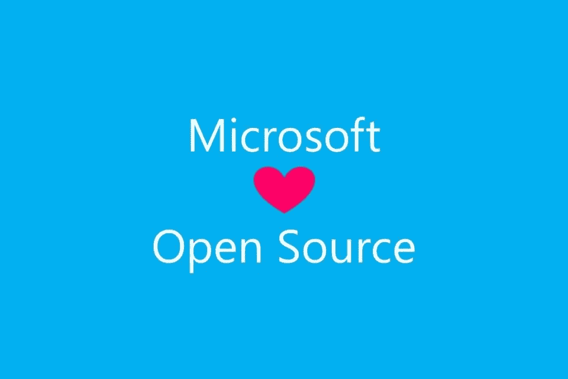
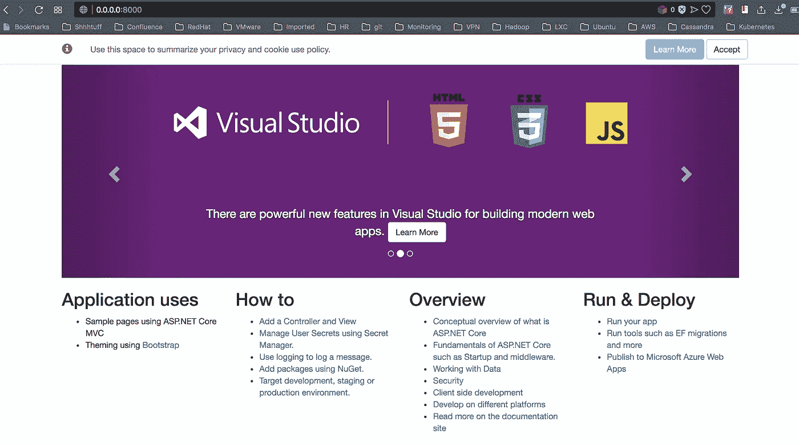
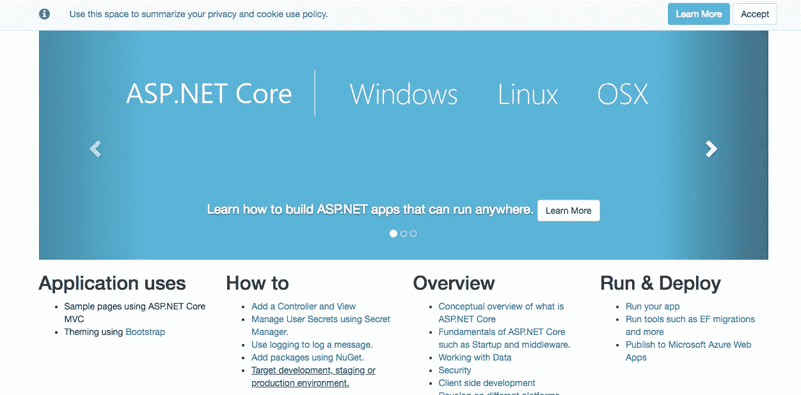

# 。DC 操作系统上的网络应用

> 原文：<https://itnext.io/net-apps-on-dc-os-137166c22335?source=collection_archive---------6----------------------->



资料来源:news.microsoft.com

以一个重要的免责声明开始这篇文章。

> 免责声明:我绝不是. NET 开发人员，也没有任何运行经验。我也不提倡你运行。网络应用。但我也不是说你不应该跑。网络应用。

我不认为自己是微软的粉丝，但我真的很喜欢微软在过去几年里做出的一些决定，更多地参与[开源社区](https://opensource.microsoft.com)(尽管我不得不承认，像许多其他人一样，我对 Github 的收购有点紧张)。我确实在我的一台个人电脑上使用了 Windows 10，并且完全爱上了 VSCode。几个月前，微软宣布你现在可以运行[。Docker](https://docs.microsoft.com/en-us/dotnet/core/docker/intro-net-docker) 中的网络应用。

> “大多数映像存储库都提供了广泛的标记，以帮助您选择特定的框架版本和操作系统(Linux 发行版或 Windows 版本)。”

厉害！既然我们能跑。NET 应用程序，并使用 Linux 发行版，那么在我们最喜欢的容器编制器上运行这些程序怎么样，比如 DC/操作系统？在这篇简短的帖子中，我将演示开箱即用是多么简单，并为您提供代码，让您跟随并亲自尝试。

[](https://github.com/geekbass/dotnet-dcos) [## geekbass/dotnet-dcos

### dotnet-dcos -正在运行。DC 操作系统上的网络应用

github.com](https://github.com/geekbass/dotnet-dcos) 

再说一遍，我并不是要提倡或者不提倡跑步。NET 应用程序，或者在 docker 中，或者在容器编排平台上。这是关于能够在你喜欢的平台上为你的用户提供更多的服务和灵活性。

一天下午，我的一个朋友走过来对我说:“你知道你现在可以跑步了吗？Docker 中的网络应用？我们应该看看能否在 DC 操作系统上运行它。”

当时，我不知道他是否真的是认真的。据我当时的理解，任何基于 Windows 容器的东西都需要 Windows 操作系统。所以我开始阅读他发给我的文章，我意识到你也可以在基于 Nix 的操作系统上运行它。干得好，女士团队！

开始阅读 Docker Hub 文档。NET Core 并在 Mac 上开发了方便的 dandy Docker。

```
docker run -it --rm -p 8000:80 --name aspnetcore_sample microsoft/dotnet-samples:aspnetapp
Unable to find image 'microsoft/dotnet-samples:aspnetapp' locally
aspnetapp: Pulling from microsoft/dotnet-samples
683abbb4ea60: Pull complete
a7e581c00d24: Pull complete
5e5679988195: Pull complete
799abad6ce99: Pull complete
384fcf967d83: Pull complete
dc6d19da5f5f: Pull complete
Digest: sha256:14d97a040222d434a31e6db5706c9117ba2c006fb427e1e561e4d3650bf066d3
Status: Downloaded newer image for microsoft/dotnet-samples:aspnetapp
warn: Microsoft.AspNetCore.DataProtection.KeyManagement.XmlKeyManager[35]
      No XML encryptor configured. Key {adfb2c92-2470-4fdc-964f-a42444bcf844} may be persisted to storage in unencrypted form.
Hosting environment: Production
Content root path: /app
Now listening on: [http://[::]:80](http://[::]:80)
Application started. Press Ctrl+C to shut down.
```

打开我的浏览器到[http://0 . 0 . 0:8000](http://0.0.0.0:8000)就有了！



我真的很震惊，它竟然这么容易就成功了。如果这真的能在我的 Mac 上运行，那么我看不出有什么理由不能在 DC 操作系统上运行。这实际上是 Docker 引擎的全部魔力。这才是真正需要的。

在继续之前，我觉得我需要再次展示这个。

> 免责声明:我绝不是. NET 开发人员，也没有任何运行经验。我也不提倡你运行。网络应用。但我也不是说你不应该跑。网络应用。

我走到绘图板前，精心制作了以下马拉松式 JSON 来测试“真实世界”类型场景的真实部署:

```
{
  "labels": {
    "HAPROXY_GROUP": "external"
  },
  "id": "/dotnet",
  "backoffFactor": 1.15,
  "backoffSeconds": 1,
  "container": {
    "portMappings": [
      {
        "containerPort": 80,
        "hostPort": 0,
        "labels": {
          "VIP_0": "/dotnet:8000"
        },
        "protocol": "tcp",
        "servicePort": 10101,
        "name": "dotnet"
      },
      {
        "containerPort": 0,
        "hostPort": 0,
        "protocol": "tcp",
        "servicePort": 10104
      }
    ],
    "type": "DOCKER",
    "volumes": [],
    "docker": {
      "image": "microsoft/dotnet-samples:aspnetapp",
      "forcePullImage": false,
      "privileged": false,
      "parameters": []
    }
  },
  "cpus": 0.5,
  "disk": 0,
  "healthChecks": [
    {
      "gracePeriodSeconds": 300,
      "intervalSeconds": 60,
      "maxConsecutiveFailures": 3,
      "portIndex": 0,
      "timeoutSeconds": 20,
      "delaySeconds": 15,
      "protocol": "MESOS_HTTP",
      "path": "/",
      "ipProtocol": "IPv4"
    }
  ],
  "instances": 1,
  "maxLaunchDelaySeconds": 3600,
  "mem": 128,
  "gpus": 0,
  "networks": [
    {
      "mode": "container/bridge"
    }
  ],
  "requirePorts": false,
  "upgradeStrategy": {
    "maximumOverCapacity": 1,
    "minimumHealthCapacity": 1
  },
  "killSelection": "YOUNGEST_FIRST",
  "unreachableStrategy": {
    "inactiveAfterSeconds": 0,
    "expungeAfterSeconds": 0
  },
  "fetch": [],
  "constraints": []
}
```

以下 JSON 定义包括如下内容:

*   用于[马拉松 LB](https://docs.mesosphere.com/services/marathon-lb/)(“ha proxy _ GROUP”:“external”和“service port”:10101)的标签和服务端口，因此用户可以从集群外部静态地访问它。
*   一个 [VIP 地址](https://docs.mesosphere.com/1.11/networking/load-balancing-vips/virtual-ip-addresses/)，以便其他服务能够以静态方式与该服务交互(“端口映射”)。
*   健康检查这样，如果服务变得不健康，马拉松可以成功地编排服务。请参见 JSON 中的“健康检查”键。

让我们使用[DC/操作系统 CLI](https://docs.mesosphere.com/1.11/cli/) 来部署它吧！

```
dcos marathon app add dotnet.json
```

我现在可以通过我的公共代理运行我的马拉松 LB 应用程序来访问该应用程序！



缩放怎么样？没错。

```
dcos marathon app update dotnet instances=5
```

我又一次可以击中。NET 默认 UI！而且，我总共只花了 15 分钟就到了这一步。酷！

尽管这不是一个真正的应用程序，也没有实际运行的真正计划。在我们的环境中，你可以看到这个现实变得多么简单。在很短的时间内，我就能够得到一个功能齐全、可扩展的。运行在 DC 操作系统上的. NET 应用程序。这可能会把我们引向这样一个场景:如果我们愿意，我们可以为用户提供这种能力。再次…

> **免责声明:我绝不是. NET 开发人员，也没有任何运行经验。我也不提倡你运行。网络应用。但我也不是说你不应该跑。网络应用。**

…并不是说你应该或不应该这样做。我保持开放的心态，支持在每一个独特的场景中都有意义的技术。我只是提供并展示了为用户提供更多服务的更大灵活性的能力(填写空白的“即服务”)。这就是我的全部。

我有几个人对此感兴趣，所以我写了这篇短文。我最初是为马拉松写的，但如果对在 Kubernetes 上跑步的例子有更多兴趣，请参见 [Github 链接](https://github.com/geekbass/dotnet-dcos)(这也是 DC/OS 上支持的 orchestrator)。