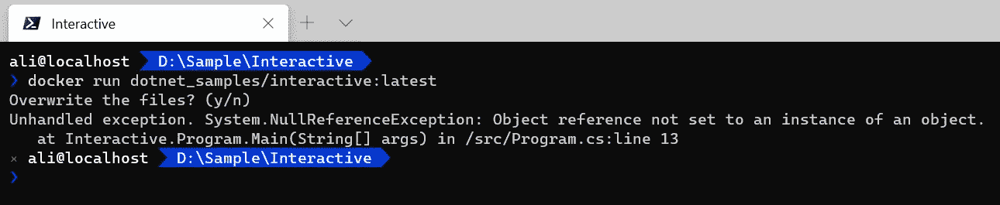
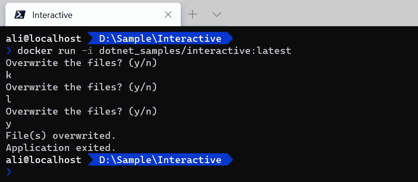

# 。Docker 的. NET 控制台应用程序准备

> 原文：<https://itnext.io/net-console-apps-preparation-for-docker-b72c9dfc1ded?source=collection_archive---------4----------------------->

我有一个服务要在我的 Raspberry Pi 上运行，我决定用 Docker 部署和托管它。事情进行得很顺利，直到我需要一些改变来让我的控制台应用程序为 Docker 做好准备。

大多数时候，我们通过调用`Console.ReadLine`来结束我们的应用程序 Main 方法。这似乎很合理，直到你尝试在 Docker [分离模式](https://en.wikipedia.org/wiki/Standard_streams#Standard_input_(stdin))下运行你的应用。

```
docker run -d myapp:latest
```

它运行容器，应用程序将立即退出！因为在分离模式下你做不到。我将涵盖交互式和分离模式的所有场景和解决方法，所以请系好安全带！

## 场景 1:交互模式

互动模式是什么？交互模式意味着你需要用户在容器中的应用上进行交互，比如输入一些信息，选择一个选项等等。我不喜欢这样，因为在大多数情况下，用户更喜欢为容器提供带有参数或环境变量的数据。

想象一个简单的。NET 控制台应用程序，需要用户确认才能覆盖文件。

```
static void Main(string[] args)
{
 while (true)
 {
  Console.WriteLine("Overwrite the files? (y/n)");
  var confirmation = Console.ReadLine().Substring(0, 1);
  if (confirmation.Equals("y", StringComparison.OrdinalIgnoreCase))
  {
   Console.WriteLine("File(s) overwrited.");
   break;
  }
 }
 Console.WriteLine("Application exited.");
}
```

> 💡这不是为实现 CLI 的好方法。为了更好地实现 CLI，请阅读[命令行界面(CLI)应用程序。网芯](/command-line-interface-cli-application-with-net-core-75bb5603ee70?source=friends_link&sk=2819a8e43b2e02e72c816961eb0c3217)篇。

如果我们创建并运行 docker 映像，您将得到这个错误。用户输入为 null，应用程序引发 NullReferenceException。



这是因为当您运行 docker-image 时没有任何用户输入。现在，如果在交互`-i`模式下运行应用程序:



在这种场景和实现中，您不能以分离或附加的方式运行应用程序。

## 场景 2:分离模式下长时间运行的作业

假设您有一个永远运行的服务，它提取数据并以面向事件的方式处理它们。

考虑到这些类型的应用程序是在分离模式下运行的，像`Console.Read`或`System.Thread.Thread.Sleep(...)`这样的解决方法并不好。在下面带有[autoreseteevent、](https://docs.microsoft.com/en-us/dotnet/api/system.threading.autoresetevent?view=netcore-3.1)的代码中，我们设法保持应用程序打开，直到用户想要用`CTRL + C`关闭应用程序。

```
internal static class Program
{
 private static readonly AutoResetEvent _waitHandle = new AutoResetEvent(false);private static readonly Service _service = new Service();
 private static void Main()
 {_service.OnMessageRecieved = OnMessage_Received;
  _service.StartReceiving();// Handle Control+C or Control+Break
  Console.CancelKeyPress += (o, e) =>
  {
   Console.WriteLine("Exit");
   // Allow the manin thread to continue and exit...
   _waitHandle.Set();
  };// wait until Set method calls
  _waitHandle.WaitOne();
 }private static void OnMessage_Received(int messageId, string message)
 {
  Console.WriteLine($"Message {messageId} recieved.");
 }
}
```

*   记住，在所有的作业之后调用`AutoResetEvent.WaitOne`方法。

## 场景 3:分离模式下的服务

在这种情况下，您可以轻松创建一个托管服务，并在您的控制台应用程序中运行它。微软[提供托管服务。扩展.托管](https://www.nuget.org/packages/Microsoft.Extensions.Hosting/)包。

只需创建一个类并实现`IHostedService`接口。你可以在微软文档上阅读更多关于 [HostedServices 的信息。](https://docs.microsoft.com/en-us/dotnet/architecture/microservices/multi-container-microservice-net-applications/background-tasks-with-ihostedservice)

```
public class Service : IHostedService
{
 public Service()
 {
 }public Task StartAsync(CancellationToken cancellationToken)
 {
  Console.WriteLine("Task is started.");
  return Task.CompletedTask;
 }public Task StopAsync(CancellationToken cancellationToken)
 {
  Console.WriteLine("Task stopped.");
  return Task.CompletedTask;
 }
}
```

在您的 Main 方法中，创建托管服务并配置服务，等等。

```
private static async Task Main()
{
 var hostBuilder = new HostBuilder()
  .ConfigureServices((hostContext, services) =>
   {
    services.AddHostedService<Service>();
   }
  );await hostBuilder.RunConsoleAsync().ConfigureAwait(false);
}
```

## 结论

我更喜欢 AutoResetEvent 方法，因为我的服务非常小。然而，对于更复杂或现实世界的问题，最好采用托管服务方法。

## 要阅读的相关文章

*   [ASP.NET 核心应用的较小 Docker 图像](/smaller-docker-images-for-asp-net-core-apps-bee4a8fd1277?source=friends_link&sk=32ffef97e661f1131703b2c84a0d5e14)
*   [命令行界面(CLI)应用程序。网络核心](/command-line-interface-cli-application-with-net-core-75bb5603ee70?source=friends_link&sk=2819a8e43b2e02e72c816961eb0c3217)