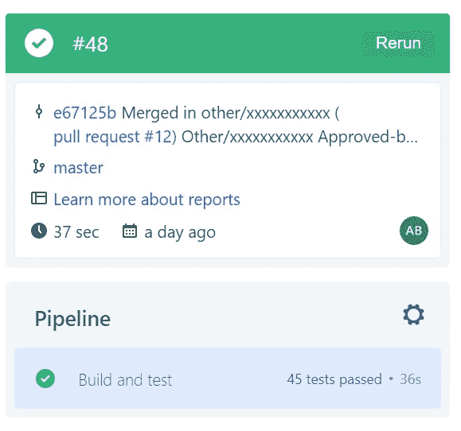
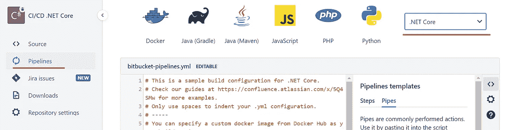
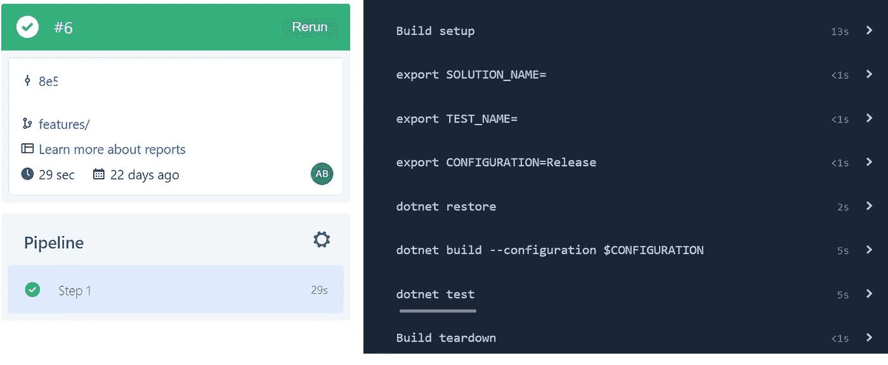
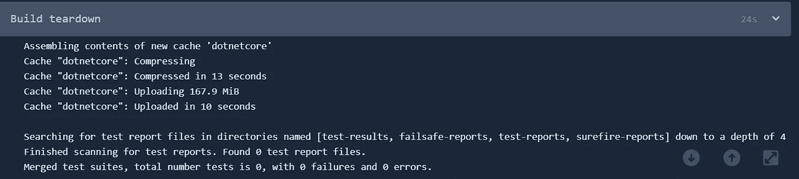
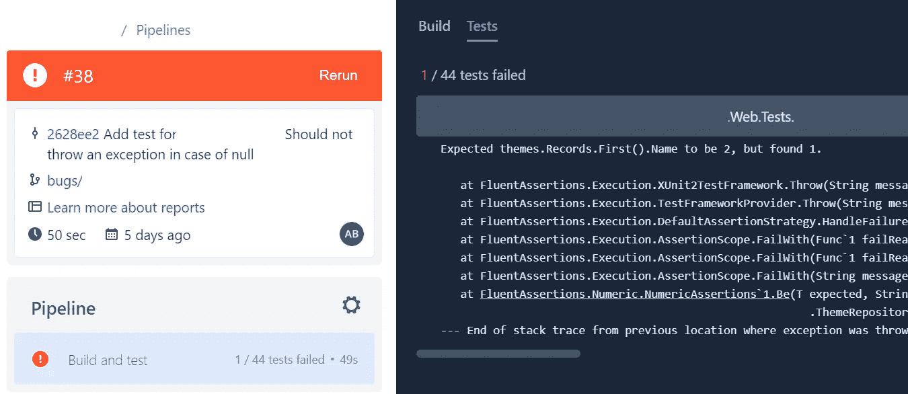
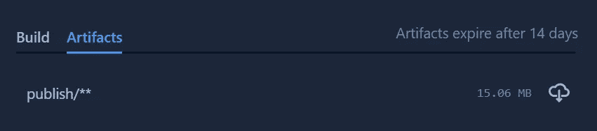

# 。NET Core 和 BitBucket 管道！

> 原文：<https://itnext.io/net-core-and-bitbucket-pipelines-9e8cb86b1dd6?source=collection_archive---------0----------------------->

## CI/CD 渠道故事



构建—测试—缓存

我在一个团队中工作，BitBucket 是我们的 git 仓库。BitBucket 中的 CI/CD 与市场上的其他竞争对手如 Azure DevOps、GitLab、GitHub 几乎相同。在这篇文章中，我解释了如何为。网芯。

## 步骤 1:准备好您的管道！

1.  创建您的 BitBucket repo，并将最新版本的代码放入其中
2.  创建您的管道:(从左侧菜单中选择管道，然后选择。从右边的下拉列表中选择核心网)



默认的 bitbucket-pipelines.yml 类似于下面的 YAML 代码:

```
# Only use spaces to indent your .yml configuration.
# -----
# You can specify a custom docker image from Docker Hub as your build environment.
image: microsoft/dotnet:sdkpipelines:
  default:
    - step:
        caches:
          - dotnetcore
        script: # Modify the commands below to build your repository.
          - export PROJECT_NAME=yourProjectName
          - export TEST_NAME=yourTestName
          - dotnet restore
          - dotnet build $PROJECT_NAME
          - dotnet test $TEST_NAME
```

BitBucket 管道非常简洁，因为它为每个构建使用了 docker 容器。来支持。网芯 3.1 把 docker 镜像改成`mcr.microsoft.com/dotnet/core/sdk:3.1`。

*💡从* [*官方微软 docker hub 页面*](https://hub.docker.com/_/microsoft-dotnet-core) *获取所有 docker 图片列表。*

```
# Only use spaces to indent your .yml configuration.
# -----
# You can specify a custom docker image from Docker Hub as your build environment.
image: mcr.microsoft.com/dotnet/core/sdk:3.1pipelines:
  default:
    - step:
        caches:
          - dotnetcore
        script: 
          - export SOLUTION_NAME=MyProject          
          - export CONFIGURATION=Release
          - dotnet restore SOLUTION_NAME.sln
          - dotnet build --no-restore $SOLUTION_NAME.sln --configuration $CONFIGURATION
          - dotnet test --no-build $SOLUTION_NAME.sln
```

*   将管道 **docker 图像**更改为**。网芯 SDK 3.1** 。
*   创建一个名为 **SOLUTION_NAME** 的变量，并将 MyProject 值赋给它。
*   使用 **SOLUTION_NAME 变量**执行 **restore，build，test** 命令。

管道很小，但是它完成了 CI 部分的工作。这个管道令人兴奋的部分之一是缓存部分；第一次构建可能需要一段时间来获取 SDK 映像或恢复 Nuget 包，但由于缓存部分，接下来的构建将会很快。

尽管这个管道运行测试，但是您看不到它们的细节，因为您需要以 [JUNIT](https://llg.cubic.org/docs/junit/) 格式记录结果。例如，请看下图:



它构建并运行测试，一切正常，但是我看不到它通过了多少测试！

## 步骤 2:点网测试和 JUnit 格式

Dotnet test 命令有一个选项，用于确定测试结果的输出文件格式。尽管如此，它不支持内置格式的 JUnit，但是您可以安装第三方记录器来启用 JUnit 格式的 dotnet 测试命令日志。

最好的伐木工之一是 T21 的 JUnitTestLogger 项目。快速将它安装到您的测试项目中。

```
# As an example for my own project
cd ./Web.Tests
dotnet add package JUnitTestLogger --version 1.1.0
```

## 步骤 3:更改管道来生成日志！

每个位桶管道的最后一部分是拆卸步骤。在该部分中，BitBucket 在以下名为**【test-results，failsafe-reports，test-reports，surefire-reports】**的目录中查找日志文件。



我们需要为输出测试日志定义一个新的变量，如下所示:

```
REPORTS_REL_PATH=./test-reports/build_${BITBUCKET_BUILD_NUMBER}
```

*💡* `*${BITBUCKET_BUILD_NUMBER}*` *是* [*中的一个，内置变量*](https://confluence.atlassian.com/bitbucket/variables-in-pipelines-794502608.html) *在每条管道中。*

现在，我们只需要将这个参数传递给 dotnet test 命令，生成 JUnit XML 格式的测试结果，并存储在`test-reports`目录中。

```
— test-adapter-path:. — logger:”junit;LogFilePath=$REPORTS_REL_PATH/junit.xml”
```

更改后的 YAML 文件:

```
# Only use spaces to indent your .yml configuration.
# -----
# You can specify a custom docker image from Docker Hub as your build environment.
image: mcr.microsoft.com/dotnet/core/sdk:3.1
pipelines:
  default:
    - step:
        caches:
          - dotnetcore
        script: 
          - export SOLUTION_NAME=MyProject          
          - export CONFIGURATION=Release
          - export REPORTS_REL_PATH=./test-reports/build_${BITBUCKET_BUILD_NUMBER}
          - export REPORTS_PATH=./${PROJECT_NAME}/test-reports/build_${BITBUCKET_BUILD_NUMBER}    
          - dotnet restore SOLUTION_NAME.sln
          - dotnet build --no-restore $SOLUTION_NAME.sln --configuration $CONFIGURATION
          - dotnet test --no-build $SOLUTION_NAME.sln --test-adapter-path:. --logger:"junit;LogFilePath=$REPORTS_REL_PATH/junit.xml"
```

由于这一改变，您可以看到通过测试的数量，如果有任何测试失败，您可以访问失败的详细信息:



失败和成功测试的样本

## 最后一步，但可能不是最后一步:发布人工制品

使用“点网发布”命令发布点网项目很容易。

```
dotnet publish --configuration $CONFIGURATION  --no-build ./Web/Web.csproj -o ./publish
```

该命令将 web 应用程序发布到发布目录中。现在我们需要告诉 BitBucket 管道来保存这些人工制品。

```
artifacts:
 - publish/**
```

最终的 YAML 文件:

```
# Only use spaces to indent your .yml configuration.
# -----
# You can specify a custom docker image from Docker Hub as your build environment.
image: mcr.microsoft.com/dotnet/core/sdk:3.1
pipelines:
  default:
    - step:
        caches:
          - dotnetcore
        script: 
          - export SOLUTION_NAME=MyProject          
          - export CONFIGURATION=Release
    - export WEB_PROJECT_NAME=Web
          - export REPORTS_REL_PATH=./test-reports/build_${BITBUCKET_BUILD_NUMBER}  
          - dotnet restore SOLUTION_NAME.sln
          - dotnet build --no-restore $SOLUTION_NAME.sln --configuration $CONFIGURATION
          - dotnet test --no-build $SOLUTION_NAME.sln --test-adapter-path:. --logger:"junit;LogFilePath=$REPORTS_REL_PATH/junit.xml"
          - dotnet publish --configuration $CONFIGURATION --no-build ./Web/${WEB_PROJECT_NAME}.csproj -o ./publish
        artifacts: 
          - ./publish/**
```

现在，在每个管道作业之后，您可以访问管道结果中的 artefacts 选项卡，如下所示:



## 下一步是什么？

您几乎已经为进一步的步骤做好了一切准备，比如集成测试和[使用工件进行部署](https://confluence.atlassian.com/bitbucket/using-artifacts-in-steps-935389074.html)。

祝您集成和部署顺利。