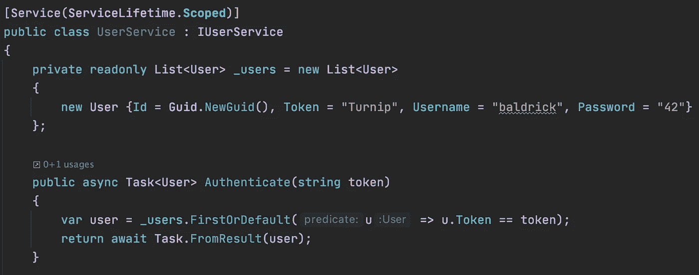
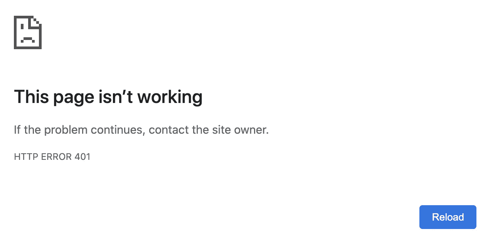
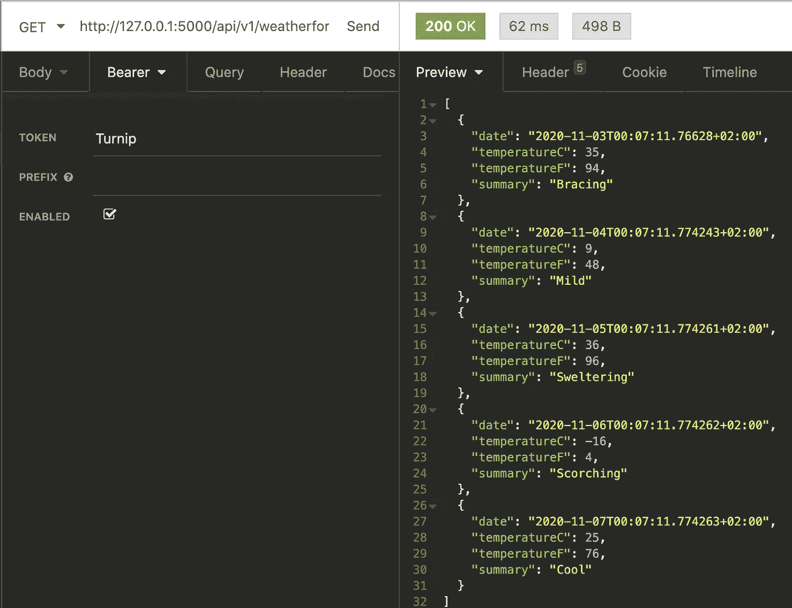
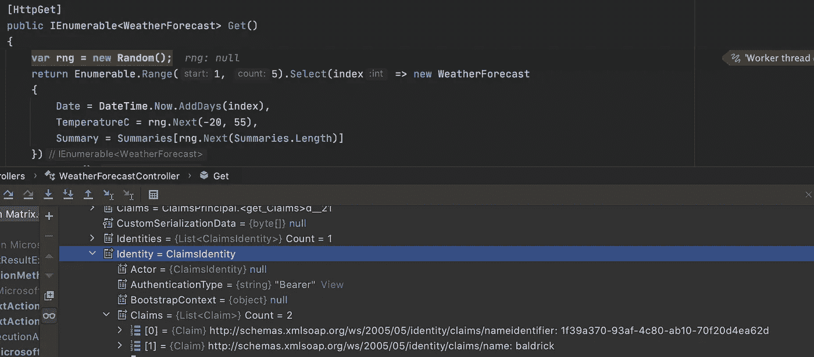

# 。网络核心—确保安全

> 原文：<https://itnext.io/net-core-be-secure-a48d6b27d3b8?source=collection_archive---------3----------------------->



安全，它总是引起头痛，它不是简单的。尽管人们认为这很简单，但它并不简单，而且很可能永远不会简单。我确实记得我的第一个项目，实际上是用 PHP，最有趣的部分，而不是通过 https。这一切都是关于，与秘密快速握手，秘密在瞬间有效。在某种程度上，是的安全，但即使是几秒钟也是我们需要考虑的。我完全同意，把安全留给真正明白什么是由内而外的安全的人，比如 [Auth0](https://auth0.com/) 。我非常喜欢 Auth0，原因之一可能是它对开发人员友好的文档，你实际上可以感觉到它们是为实际执行的人工作的。

当然，安全是有代价的，那么，没有安全专家在上面的代价是什么，有时是你的业务。

但是，如果——是的，如果，你只是需要一个小的，也许是中等规模的项目来担保呢？很复杂吗？不，它不是，微软团队使我们能够简单地做到这一点。记住，你需要明白你在唱什么，你在做什么纯粹是你的责任。

女士们先生们，我给你们带来了我简单的经验。开箱即用的网络核心安全性。

好，所以你认为你知道你在做什么，有什么风险，很好。

让我们从一个没有任何安全性的空 web API 项目开始。让我们使用 dotnet 客户端创建一个项目。至于这个项目的名字，我想不出更好的了，就叫它 Matrix 吧。

```
dotnet new webapi -n Matrix
```

一旦项目创建完毕，打开你最喜欢的 IDE，让我们开始黑吧。

在我创建的任何项目中，我都会通过删除 https 相关的东西来修复一些东西、启动 properties 和 startup.cs。无论如何，我的意图是在 Azure 服务上卸载 https，或者在数字海洋的反向代理后面。让我们从 launchsSettings.json 开始

我只是删除了所有的 IIS 内容和 https 引用，所以它将作为一个简单的终端应用程序在端口 5000 上运行。之后，让我们进入 Startup.cs 文件并删除所有注释(我不喜欢注释)和 https 相关的行。此外，我，嗯，它是 IDE，帮助我删除未使用的 usings。

现在，当我们运行这个项目时，它将启动默认的 web 浏览器并导航到天气端点。如果我们仔细观察 launchSettings.json，它实际上就是我们想要的。它应该显示类似这样的内容。

不错！我们的 API 正在工作，如何保护它？Nop，不是说“复杂”的安全流程。只需用户名/密码，获取令牌，并将令牌用于正在进行的请求。所以我可以想象，我们需要一个控制器来发送用户名和密码，它返回一个令牌。然后是某种验证受保护端点上的令牌的中间件。

好的——让我们更进一步，添加 API 版本控制。API 版本化是一个长期的愿景，我强烈建议你这么做。代替

```
[http://localhost:5000/weatherforecast](http://localhost:5000/weatherforecast)
```

让我们按时到达

```
[http://localhost:5000/api/v1/weatherforecast](http://localhost:5000/weatherforecast)
```

首先，让我们创建 BaseController.cs

这里发生了什么，我们说这是一个 API 控制器，默认版本是 1.0，路由应该是 start/API/{ version _ number/{ controller name }。最重要的是，你必须是一个授权用户才能得到响应。

这将不会工作，因为我们缺少几个包，这将被强调为未解决的

```
[ApiVersion( "1.0" )]
```

您可以通过添加 Microsoft 包来解决这个问题。注意:导航到项目目录

```
cd Matrixdotnet add package Microsoft.AspNetCore.Mvc.Versioning
```

现在，这应该可以修复错误。现在让我们通过添加扩展我们的基本控制器来调整 WeatherForecastController.cs 控制器。注意:我们删除了控制器的所有属性，因为基本控制器包含了所有属性，所以不再需要它了。

好的—在运行之前，我们需要调整启动设置，因为我们调整了路线以包含版本。由于我们添加了一个新的 NuGet，它负责版本，我们需要添加服务，它负责版本。

启动设置，请注意 launchUrl

Startup.cs，通知服务。addapiversioning

现在，如果我们运行这个项目，仍然会产生一个错误

```
InvalidOperationException: No authenticationScheme
```

这是可以的，因为我们还没有定义任何方案，但是如果你得到这个错误，它应该是这样的。

现在是微软大放异彩的时候了，因为定义您的身份验证方案和处理传入请求非常简单。

每个方案都需要一个处理程序——让我们创建一个处理简单令牌方案的处理程序。

创建一个类 defaultauthenticationhandler . cs，该类使用其通用 AuthenticationSchemeOptions 扩展 AuthenticationHandler

太好了，我们有一个中间件来处理传入的请求。现在，我们只需要添加检查传入请求的逻辑。正如我们所知，将有传入令牌，我们需要检查传入令牌的有效性。

在实现逻辑之前，让我们将这个处理程序添加到我们的应用程序中，这样我们就不会出现异常

```
InvalidOperationException: No authenticationScheme
```

在 Startup.cs 中，请注意服务。添加身份验证

我们说我们将使用不记名令牌，这里是中间件“DefaultAuthenticationHandler ”,它将处理令牌是否有效。

很好，现在当我们运行项目时，浏览器会显示



不完美，但我们至少没有得到一个错误。这只是说我们作为用户没有被授权查询端点。这很好，在这一点上应该是这样的。让我们对我们的处理程序进行调整，并赋予它一些智能。但在此之前，让我们再添加一个包，它将帮助我们进行依赖注入，并且我们不会使 Startup.cs 过于混乱

```
dotnet add package ServiceLocator
```

调整 Starup.cs，看第 3 行

设置好之后，让我们创建一个用户模型。其中包含用户名、密码和令牌，为了清楚起见，让我们也添加用户 ID。

我们有一个对象，可以用来#1 通过用户名和密码或令牌来验证用户。

现在让我们创建一个用户服务，它将通过令牌为我们的处理程序完成这项工作。我们将从抽象即接口开始。

现在，当抽象清晰时，让我们实现抽象。抽象地说，我们希望通过令牌来认证用户。

这里没有太多内容，但是首先，UserService 有一个属性(第 11 行)，它指出这个类应该在依赖注入中注册，并且作用域是 scope，所以我们可以在我们的安全处理程序中注入它。

然后我们有一个私有用户列表，只有一个用户。但是这可以用 DB 存储库来代替，否则，这就是内存中的用户数据库。

最后一件事，抽象“认证”和令牌的实现，我们试图通过令牌找到用户。

现在我们已经准备好给我们的认证处理程序添加大脑了。

看起来确实有很多事情在进行，但实际上，并没有很多。像第 29 行检查它是否是一个受保护的端点，如果不是，就忽略。在第 38 行，我们查看头部并获取传入的令牌。在第 39 行，我们使用我们的用户服务通过令牌寻找用户。之后，我们只需填充用户上下文 user。

因此，让我们使用 postman 或者在我的例子中使用[失眠症](https://insomnia.rest/)来获取天气数据，方法是在头中传递标记“芜菁”。

# Ups！


尽管如此，401，看起来我们有一个错误，不是第一次，让我们看看 Startup.cs 文件，是的，我们没有把一个配置

```
app.UseAuthentication();
```

10 号线。

现在我们跑吧



瞧啊。我们通过令牌为有效用户“baldrick”获取天气信息！我们可以在控制器中访问用户上下文。



故事当然会到此结束，但如何得到一个令牌呢？当然，我们知道它基本上是静态的，但如何创建一种体验，即在用户输入用户名和密码后，用户实际上获得了令牌？

为此，我们需要付出额外的努力，让我们开始吧。我们需要创建 UsersController 和无需身份验证即可访问的端点。

首先要指出的是，第 19 行，我们明确地说，这个端点

```
[http://127.0.0.1:5000/api/v1/users/authenticate](http://127.0.0.1:5000/api/v1/users/authenticate)
```

不受保护，因为我们需要[认证](http://127.0.0.1:5000/api/v1/users/authenticate)并获得令牌。

此外，我们衍生了三个新的类

#1 AuthenticateModel，我们希望 API 消费者发送用户名和密码

#2 认证响应，如果认证成功，我们将向 API 消费者返回一个令牌。

#3 UserOrPasswordException，如果用户名或密码不正确，则出现异常。

此外，我们需要改进我们的用户服务，以便能够通过用户名和密码找到用户，如果出现问题，抛出我们创建的异常。

现在让我们测试我们的新端点，并为用户“baldrick”获取一个令牌


# 接下来的步骤是

添加有状态存储库，向用户上下文添加范围和角色。所有这些都是可行且简单的。

# 一锤定音

正如你所看到的，微软已经做了大量的工作来帮助开发者创造出令人敬畏的解决方案。正如我在文章开头提到的，将安全性留给专业人员，因为这个例子只展示了简单的认证/授权流程。它可能会变得很复杂。这个指南只是为了*指出*，有时候你不需要为简单的流程建立沉重的框架。

[饭桶](https://github.com/alzuma/matrix)