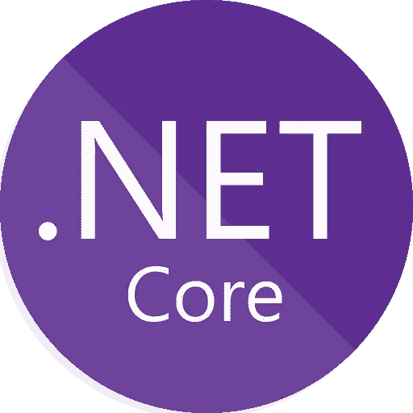
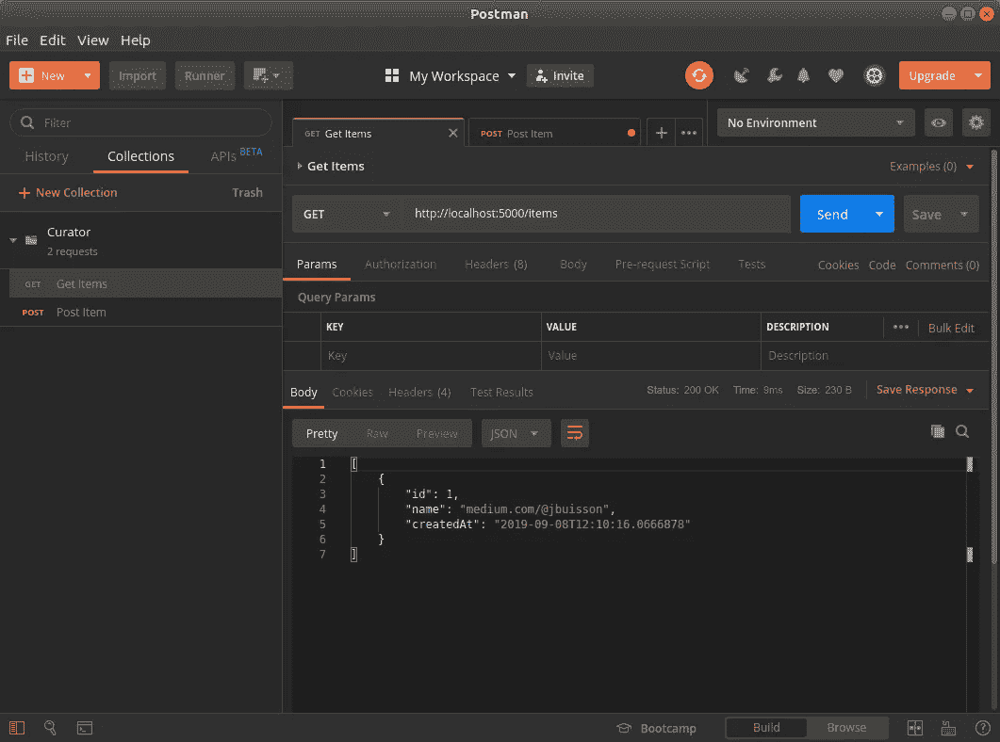

# 。NET Core 很性感——构建 Web API

> 原文：<https://itnext.io/net-core-is-sexy-building-a-web-api-cdb470cc8222?source=collection_archive---------2----------------------->



任何 web 开发人员都知道，新的应用程序越来越面向 API。正如 RESTful 和 GraphQL 的例子所示，现代模式使用后端 API 来提供数据，并以前端应用程序为特色(使用 **React** 或 **Angular** 等等)。所有时髦的技术都旨在通过尽可能直接地创建 **Web API、**和**来改善和缓解开发人员的生活。NET Core** 也不例外，您将在本文中看到，它是系列**的第三部。网芯性感(你也应该知道)**。

> 本文是关于。NET Core，以及它现在如何像 Node 或 Rails 等任何其他堆栈一样简单高效地创建现代应用程序。
> 
> [。网芯很性感你应该知道](/https-medium-com-buisson-jeremy-net-core-is-sexy-and-you-should-know-it-a3d0c2eeedc4)
> 
> [。NET Core 很性感——命令行应用](https://medium.com/@jbuisson/net-core-is-sexy-real-world-part-1-command-line-application-953f48394c83)
> 
> **。NET Core 很性感——构建 Web API**

在[上一部分](https://medium.com/@jbuisson/net-core-is-sexy-real-world-part-1-command-line-application-953f48394c83)中，我们创建了一个多平台控制台应用程序来处理我们的策展，通过添加主题、列出它们和删除一个完整的主题。我们已经建立了一个漂亮而简单的架构，在数据库访问(通过[实体框架](https://docs.microsoft.com/ef/core/)和 [Sqlite](https://www.sqlite.org/index.html) )和应用程序本身之间使用了一些分离。我们还花时间为数据库创建了一个简单但有用的抽象，允许我们轻松地编写测试并遵循一些[干净代码](https://blog.cleancoder.com)模式。

> **TL；如果你想看最终的实现，这里是完整的 Web API 的存储库:[https://gitlab.com/jbuisson/curator/tree/webapi](https://gitlab.com/jbuisson/curator/tree/webapi)**

# 让我们从头开始

```
git clone --branch console [git@gitlab.com](mailto:git@gitlab.com):jbuisson/curator.git
cd curator
dotnet build
```

使用这些命令，我们可以从上一部分停止的地方继续我们的开发。首先，我们使用名为 ***控制台的 git 分支克隆 [Gitlab 存储库](https://gitlab.com/jbuisson/curator/tree/console)。*** 然后，我们基于解决方案文件构建整个项目(。sln)在项目的根。

这是文件夹树中应该有的内容:

```
├── data
├── src
     ├── Curator.Console
     └── Curator.Data
         ├── Curator.Data.Entities
         └── Curator.Data.EntityFramework
             ├── Curator.Data.EntityFramework.Context
             ├── Curator.Data.EntityFramework.Memory
             └── Curator.Data.EntityFramework.Sqlite
└── tests
    ├── Curator.Console.Tests
    ├── Curator.Data.Entities.Tests
    └── Xunit.AssertExtensions
```

我们现在将添加一个新项目，**馆长。Api** ，我们将在其中创建我们的 Web API。

# 最低可行 Api

在这里，我们将集中于手动开发严格的最低限度，以拥有一个工作的 Web API，做与我们的命令行应用程序完全相同的事情。

在本系列的第一篇文章中，我们看到了[如何自托管 web 服务器](/https-medium-com-buisson-jeremy-net-core-is-sexy-and-you-should-know-it-a3d0c2eeedc4#8f37)并处理 http 请求。我们现在将做同样的事情，但是使用[ASP.NET 核心 MVC](https://docs.microsoft.com/aspnet/core/mvc/overview?view=aspnetcore-2.2) 来管理路由、控制器和所有我们不想自己做的事情。

```
dotnet new console -o src/Curator.Api
cd src/Curator.Api
dotnet add package Microsoft.AspNetCore
dotnet add package Microsoft.AspNetCore.Mvc
```

进入 ***Program.cs*** 文件，设置我们的虚拟主机:

[添加()然后使用()ASP.NET 核心 MVC 使用依赖注入](https://gist.github.com/jbuiss0n/2b7139aab037fd809139cf6eda332ac7)

来自我们新成立的**馆长。Api** 项目，使用命令 ***运行应用*** 。默认情况下，这个命令应该启动服务器，并在 http://localhost:5000 上监听任何请求。但是，我们没有配置任何控制器，所以所有请求都会抛出 404 not found 错误。下面是在新端子中使用 [**卷曲**](https://curl.haxx.se) 的例子:

```
curl -i [http://localhost:5000](http://localhost:5000/items)
> HTTP/1.1 404 Not Found
> Date: Sun, 08 Sep 2019 12:01:57 GMT
> Server: Kestrel
> Content-Length: 0
```

现在让我们添加第一个控制器来处理策展项目。这个控制器将使用我们的 **CuratorContext** 与 **Sqlite** 数据库的**条目**进行交互，因此我们需要从添加对我们已经存在的项目**的引用开始。**

```
dotnet add reference ../Curator.Data/Curator.Data.Entitiesdotnet add reference ../Curator.Data/Curator.Data.EntityFramework/Curator.Data.EntityFramework.Contextdotnet add reference ../Curator.Data/Curator.Data.EntityFramework/Curator.Data.EntityFramework.Sqlite
```

接下来，这里是控制器本身的代码，在 ***Program.cs*** 文件中:

[创建 ASP.NET 核心 web API 的严格最小代码](https://gist.github.com/jbuiss0n/5d33d3fd8b6451e70dd4951aacc946ad)

这里重要的代码行是类和方法的[属性](https://docs.microsoft.com/dotnet/csharp/programming-guide/concepts/attributes/)，定义了我们需要的 **URL** 和请求参数。

**【**[**路线**](https://docs.microsoft.com/dotnet/api/microsoft.aspnetcore.mvc.routeattribute) **【项】**声明控制器的端点。这个控制器中的所有动作方法都将从这个 **URL** 继承，因为它在整个控制器类中。

**[**[**HTTP GET**](https://docs.microsoft.com/dotnet/api/microsoft.aspnetcore.mvc.httpgetattribute)**]**声明下面的方法只能用于 GET HTTP 请求。没有定义路由路径，所以会在控制器的根路径: **/ *items*** 。

**[**[**HTTP POST**](https://docs.microsoft.com/dotnet/api/microsoft.aspnetcore.mvc.httpgetattribute)**]**与**【HTTP get】**做的事情一样，只是针对 POST HTTP 请求。

**[**[**from body**](https://docs.microsoft.com/dotnet/api/microsoft.aspnetcore.mvc.frombodyattribute)**】**允许我们给 ***Post()*** 方法添加一个字符串参数，这个参数将从请求体中解析出来。ASP.NET 核心将根据请求 [**内容-类型**](https://developer.mozilla.org/docs/Web/HTTP/Headers/Content-Type) 为我们处理格式。

**[**[**HTTP DELETE**](https://docs.microsoft.com/dotnet/api/microsoft.aspnetcore.mvc.httpdeleteattribute)**(" { id:int } ")**声明下面的方法仅可用于删除 HTTP 请求，它将一个命名参数添加到路径中，该参数必须是一个整数，并且将在 ***Delete()*** 方法中通过其名称可用。
示例路径: **/ *条目* / *42*** 。

最后，我们需要使用一个 ***appsettings.json*** 文件为 **Sqlite** 数据源添加一些配置，就像我们为命令行应用程序所做的一样。只需从**馆长那里复制文件。控制台**变成**馆长。Api** 。

使用命令 ***dotnet run*** 再次启动服务器，并在另一个终端中，使用 **cURL** 在 ***items*** 端点上运行 API:

```
curl -i [http://localhost:5000/items](http://localhost:5000/items)
> HTTP/1.1 200 OK
> Date: Sun, 08 Sep 2019 12:09:48 GMT
> Content-Type: application/json; charset=utf-8
> Server: Kestrel
> Transfer-Encoding: chunked> []
```

如果您没有清空控制台应用程序使用的数据库，您应该会看到在 [**JSON**](https://www.json.org) 中显示的项目，而不是示例中的空数组。向策展数据库添加一个新项目，如下所示:

```
curl -X POST [http://localhost:5000/items](http://localhost:5000/items) \
   -H 'Content-Type: application/json' \
   -d '"medium.com/@jbuisson"'
```

不要忘记指定 **Content-Type** HTTP 头，以便 ASP.NET 核心知道如何解析主体数据。现在，您可以获取创建的项目。我使用 [**jq**](https://stedolan.github.io/jq/) 来美化 **JSON** 输出，但是它是完全可选的:

```
curl [http://localhost:5000/items](http://localhost:5000/items) | jq[
  {
    "id": 1,
    "name": "medium.com/@jbuisson",
    "createdAt": "2019-09-08T12:10:16.0666878"
  }
]
```

> 如果你不想使用 **cURL，**你可以使用像 [**Postman**](https://www.getpostman.com) 这样的工具来执行 API 上的请求。



使用邮递员投递邮件

**恭喜**！我们已经用几行非常简单的代码构建了一个工作的 web API！

在这里，我自愿手工编写所有代码，我没有使用任何助手。我想向您展示，没有任何魔法，如何创建一个 Web API。网芯。但是，有一种更好、更简单的方法可以做到这一点。

# 简单的 API 设置

与我们创建第一个应用程序的方式相同，我们可以使用 **dotnet** 命令行界面(CLI)为我们搭建一个漂亮的 Web API。这可能会伤你的心，但是把我们刚刚写的代码全部删掉。删除**馆长。Api** 文件夹，并从头开始用新的 Api 项目替换它。

```
dotnet new webapi -o Curator.Api
```

这个新项目已经有了一些新文件:

**Program.cs** 一如既往地是我们的应用入口点，并使用 ***Startup*** 类创建一个新的自托管 web 服务器。

**Startup.cs** 是一个新文件。这是我们在 ***启动*** 类中设置和配置 api 的地方。这里大部分代码都是显式的，如果您有任何疑问，带有文档链接的默认注释应该足够了。

**appsettings。**.json** 是配置文件。对于 ***开发*** 运行时的环境，您有一个默认配置和一个覆盖配置。环境在下一个文件中声明。

**Properties/launch settings . JSON**包含启动配置。您可以在这里找到应用程序的已配置环境和启动属性。部分设置用于 Visual Studio(不是 VS 代码)，可以简单地忽略(就像 ISS Express 配置文件)。

**Controllers/values controller . cs**是一个带有固定值的示例控制器，展示如何创建自己的值。您将发现我们创建的控制器有几个不同之处:

*   **[**[**API controller**](https://docs.microsoft.com/dotnet/api/microsoft.aspnetcore.mvc.apicontrollerattribute)**]**属性启用特定于 API 的行为，例如路由要求、自动 HTTP 错误请求(400)响应、绑定、… [更多信息请参见文档](https://docs.microsoft.com/en-us/aspnet/core/web-api/?view=aspnetcore-2.2#apicontroller-attribute)。
*   [**controller base**](https://docs.microsoft.com/dotnet/api/microsoft.aspnetcore.mvc.controllerbase)继承为 **ValuesController** 启用帮助器的方法和属性，如 ***Request、Response*** 、 ***BadRequest()*** 、***CreatedAtAction()***、… [更多关于文档](https://docs.microsoft.com/en-us/aspnet/core/web-api/?view=aspnetcore-2.2#controllerbase-class)。

现在，您应该能够基于我们之前创建的***items controller***和 CLI 为我们创建的***values controller***创建自己的项目控制器了。

现在我们有两个应用程序，第一个是我们的命令行应用程序，第二个是我们新创建的 Web API。所以，我们面临的问题是我们复制了逻辑，无论是在**馆长。控制台/命令**和在**Curator.Api/Controllers**中。代码重复不仅不好(维护、调试等)，而且对您的应用程序来说也是危险的。所以，你应该已经猜到了，现在是…

# 是时候重构了

我们需要做的是创建一个单一的服务来处理关于获取、添加和删除项目的管理逻辑。我们开发的两个应用程序应该使用这个服务。我们也将能够为这个服务编写测试，避免重复单元测试。

首先，我们将与**策展人一起创建另一个独立的项目。Api** 和**策展人。控制台**，将被称为**馆长。核心**。

```
dotnet new classlib -o Curator.Core
```

在这个项目中，用我们自己的服务替换生成的类:

[ItemsService.cs](https://gist.github.com/jbuiss0n/7f91f0f37b3b4f1363a97b6ea205ed79)

不要忘记添加参考资料:

```
dotnet add reference ../Curator.Data/Curator.Data.Entitiesdotnet add reference ../Curator.Data/Curator.Data.EntityFramework/Curator.Data.EntityFramework.Context
```

我还创建了一个定制的异常来处理服务没有找到的项目。

[NotFoundException.cs](https://gist.github.com/jbuiss0n/aef25f335333290d3fe9563ef800e076)

让我们花些时间考虑一下我们已经创建的所有类以及它们之间的关系。

*   **CuratorContext** 是 **EntityFramework** 上下文，定义我们的数据存储库。
*   **DesignTimeDbContextFactory**是 **CuratorContext** 提供者，为两个**in memory**dans**Sqlite**数据库配置它。
*   **ItemsService** 是使用 **CuratorContext** 与数据库交互的服务，而不知道我们正在使用哪种提供者。
*   **ItemsController** 是 ASP.NET 核心控制器，应该使用 **ItemsService** 在 Web API 上公开该服务的方法。
*   **CuratorCommand** 是我们现有控制台应用程序的命令定义。它还应该使用 **ItemsService** ，就像我们应该使用 **ItemsController** 一样。

为了正确地配置所有这些，我们将使用 [**依赖注入**](https://docs.microsoft.com/aspnet/core/fundamentals/dependency-injection?view=aspnetcore-2.2) 机制。网芯。

让我们使用[**command line utils**](https://github.com/natemcmaster/CommandLineUtils)(作者 [](https://medium.com/u/bcd6cc2f75fd) [Nate McMaster](https://medium.com/u/bcd6cc2f75fd?source=post_page-----cdb470cc8222--------------------------------) )和**依赖注入**来更新我们已经存在的控制台应用程序:

[更新馆长。Console/Program.cs，使用 DependencyInjection](https://gist.github.com/jbuiss0n/8dfdaf045e7b9956a716fca0363ee9df)

在这个应用程序中，我们使用了带有 **Sqlite CuratorContext** 实现的 **ItemsService** 。现在由您使用 **ItemsService** 而不是 **CuratorContext** 来更新命令。

我们现在可以在我们的**管理器中做同样的事情。Api** 项目，使用**启动**类来配置应用程序。只需在 **ConfigureServices(…)** 方法中添加以下代码行:

```
services.AddScoped<CuratorContext>(provider => new DesignTimeDbContextFactory(m_configuration).CreateDbContext(null));services.AddTransient<ItemsService>();
```

我们对 **ItemsController** 的最终实现应该是这样的:

[ItemsController.cs](https://gist.github.com/jbuiss0n/db1f743fcf9fe6f2866b97c93fa3c393)

在考虑我们的应用程序“ ***生产就绪*** ”之前，唯一要做的事情是拥有一个合适的数据库，让托管我们的应用程序的多个服务器(例如，在一个负载平衡器后面)可以同时访问。另外， [**Sqlite**](https://www.sqlite.org/whentouse.html) 努力为单个应用程序或设备提供本地数据存储，并且不与客户端/服务器数据库竞争，因此我们将使用 [**MySql**](https://www.mysql.com/fr/) 来代替。

# 添加新的数据库提供程序

我们已经有两个数据库提供者，一个使用 **Sqlite** ，另一个使用 **InMemory** 进行测试。创建一个新的应该很容易，但是要使用 MySql。data . EntityFrameworkCore 而不是微软的 [**。EntityFrameworkCore . Sqlite**](https://www.nuget.org/packages/Microsoft.EntityFrameworkCore.Sqlite/)。

为此，从通常的第一步开始——创建一个新项目。它仍然很冗长，但您现在应该知道我更喜欢显式命名约定:

```
dotnet new classlib -o src/Curator.Data/Curator.Data.EntityFramework/Curator.Data.EntityFramework.Mysql
```

接下来，在新创建的项目中，我们需要为**配置**和 **EntityFramework** 添加引用和包，以最终创建**DesignTimeDbContextFactory**实现:

```
cd src/Curator.Data/Curator.Data.EntityFramework/Curator.Data.EntityFramework.Mysqldotnet add package Microsoft.Extensions.Configuration
dotnet add package Microsoft.Extensions.Configuration.Json
dotnet add package MySql.Data.EntityFrameworkCore
```

[Mysql designtimedbcontextfactory . cs](https://gist.github.com/jbuiss0n/975e9dd9a6b27c8c4f9deb6302a175b7)

不要忘记添加一个 **appsettings.json** 文件，在这个文件中你应该把 **ConnectionString** 放到你正在使用的 **Mysql** 服务器上。我们在新创建的 **Mysql** 项目和 **Web API** 项目中都需要它。

[不要忘记在管理器中添加**连接字符串**块。Api appsettings.json 文件](https://gist.github.com/jbuiss0n/4593a7ada207f9ac93cd83912683960c)

在本系列的前一篇文章中，我鼓励您在**实体**、**上下文**实现和 **Sqlite** 提供者之间创建清晰的分离。您现在应该理解这种分离的好处了，有了第三个提供者(不要忘记内存中的**用于测试)。现在更好的是，我们在**策展人中有一个专门和独立的服务项目**项目服务**。核心**项目。我们已经将**控制台**应用程序配置为使用 **Sqlite** 提供程序，将 **Web Api** 应用程序配置为使用 **Mysql** one，而没有用 **ItemsService** 逻辑做任何更改！**

> 这些是在我们的实现中使用**代码抽象**和**代码分离**的主要真正好处。

我们现在需要一个 **Mysql** 服务器用于我们的本地环境，为此我们将使用 [**Docker**](https://www.docker.com) 。如果你不熟悉 Docker，我真的鼓励你去读一读[教程](https://www.google.com/search?q=docker+tutorial)或者跟着[入门](https://docs.docker.com/get-started/)信息。

如果你愿意，你当然可以在你的本地计算机上使用标准的 **Mysql** 安装，或者甚至可以公开访问 [AWS RDS](https://aws.amazon.com/fr/rds/mysql/) 上的一个实例。

如果你还没有安装 **Docker** ，这里有在 [Mac](https://docs.docker.com/docker-for-mac/install/) 、 [Ubuntu](https://docs.docker.com/install/linux/docker-ce/ubuntu/) 和 [Windows](https://docs.docker.com/docker-for-windows/install/) 上安装的链接。完成后，您应该可以使用 [docker-compose](https://docs.docker.com/compose/) 工具，我们将使用它来创建我们的 **Mysql** 容器。

在项目的根目录下创建一个名为 **docker-compose.yml** 的文件，包含以下 yml 代码:

[Docker 为 Mysql 编写](https://gist.github.com/jbuiss0n/935636dc301eecd32bd1b69a96e96acd)

您应该能够按如下方式启动容器:

```
docker-compose up -d
```

如果你已经完成了，你只需要更新 **Web API** 应用程序来使用 **Mysql** 而不是 **Sqlite** ，为此你可以简单地更新 ***馆长。Api.csproj*** 文件，并将 **ProjectReference** 块中的 **Sqlite** 替换为 **Mysql** ，不要忘记***appsettings . JSON***文件中的 **ConnectionString** 。

而且，暂时就这样了！我们在这方面已经取得了很大成就。我们已经将我们的控制台应用程序升级为 Web API，并且我们已经做了一些重构来清理它，并使用依赖注入机制来利用我们已经实现的架构的所有好处。我们甚至用 Docker 建立了一个新的本地工作环境数据库。

[](https://gitlab.com/jbuisson/curator/tree/webapi) [## 杰里米·比森/策展人。美国石油学会(American Petroleum Institute)

### GitLab.com

跨平台。NET Core Web API](https://gitlab.com/jbuisson/curator/tree/webapi) 

在下一篇文章中，我将向您展示如何打包和部署 API，以及一些**持续集成**和**持续交付**。