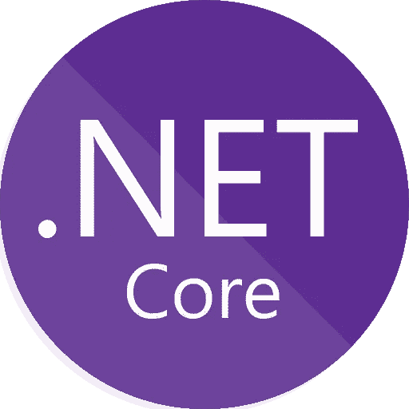

# 。NET Core 很性感——命令行应用程序

> 原文：<https://itnext.io/net-core-is-sexy-real-world-part-1-command-line-application-953f48394c83?source=collection_archive---------0----------------------->



> 本文是关于。NET Core，以及它现在如何像 Node 或 Rails 等任何其他堆栈一样简单高效地创建现代应用程序。
> 
> [。网芯很性感你应该知道](/https-medium-com-buisson-jeremy-net-core-is-sexy-and-you-should-know-it-a3d0c2eeedc4)
> 
> ***。网芯性感—命令行应用***
> 
> [。NET Core 很性感——构建 Web API](/net-core-is-sexy-building-a-web-api-cdb470cc8222)

我的意图是创建一个我们将逐步改进的策展应用程序，以一个完整的生产就绪平台结束。我们将从一个 Sqlite 数据库开始创建一个简单的命令行应用程序。

# 我们的目标应用

在这一步，我们正在构建一个命令行应用程序，我们将使用它来存储由唯一标识符、名称和创建日期定义的项目。然后，我们将能够显示我们当前的策展列表，并从中删除一个项目。

```
curator add medium.com/@jbuisson
curator add blog.cleancoder.com
curator list
> 1: medium.com/@jbuisson, 8/3/19 9:58:56 AM.
> 2: blog.cleancoder.com, 8/3/19 9:59:17 AM.
curator remove 1
curator list
> 2: blog.cleancoder.com, 8/3/19 9:59:17 AM.
```

# 设置应用程序和包

创建新的控制台应用程序:

```
dotnet new console -o Curator
```

我们会用[微软。EntityFramework](https://docs.microsoft.com/fr-fr/ef/core/) 作为我们的数据库对象关系映射(ORM)，配置为 Sqlite。此外，我们将使用[command line utils](https://github.com/natemcmaster/CommandLineUtils)——来自[Nate McMaster](https://medium.com/u/bcd6cc2f75fd?source=post_page-----953f48394c83--------------------------------)——一个用于轻松编写命令行应用程序的强大软件包。

在我们新创建的项目中，运行以下命令来添加包:

```
dotnet add package McMaster.Extensions.CommandLineUtils 
dotnet add package Microsoft.EntityFrameworkCore.Sqlite
dotnet add package Microsoft.EntityFrameworkCore.Design
```

# 编码时间到了

我们现在必须创建我们的**项目**模型，以便能够将其保存在 Sqlite 数据库中。

这种类通常称为 **DTO** ，用于数据传输对象。

我们有一个带有公共属性的 C#类来获取/设置 ***Id*** 、 ***Name*** 和 ***CreatedAt*** 。我们还覆盖了 ***ToString*** ()方法来显示项目信息。

接下来，我们创建 entity framework[***db context***](https://docs.microsoft.com/en-us/dotnet/api/system.data.entity.dbcontext?view=entity-framework-6.2.0)并将其配置为使用 Sqlite。

声明一个 **DbContext** 的最简单的方法，但不是最有用的方法，我们将在后面看到。

同样，这里没有什么是棘手的； ***DbContext*** 作为从数据库访问数据的桥梁。我们为*模型声明了一个 ***DbSet*** ，这表明我们在数据库中有一个 ***Items*** 表。*

*此外，我们将 EntityFramework 告知 ***UseSqlite*** ，并带有 Sqlite 数据库文件的路径。该路径相对于二进制执行目录。您可以随意使用您认为合适的任何其他路径，但要确保目标目录存在；否则，您可能会遇到以下应用程序错误:*

```
*SQLite Error 14: ‘unable to open database file’.*
```

*在设置应用程序本身之前，我们创建一个新的 EntityFramework 迁移并运行它来设置数据库。*

```
*dotnet ef migrations add InitialCreate
dotnet ef database update*
```

*你应该会看到一个 ***的 curator.db*** 文件出现在你之前在 **DbContext** 中设置的目录中。如果您没有更改**数据源**的路径，您应该能够在工作区的根目录中找到它。*

*最后，我们创建我们的命令。*

*代码很明确。我们有一个基类***CuratorCommand***，它作为所有其他命令的父类，负责***CuratorContext***。此外，我们还有另外三个类用于下面三个命令:**添加**、**列表**、**移除**。*

*我鼓励你探索这些命令。考虑甚至创建自己的应用程序来熟悉应用程序及其工作方式。*

*最后一步是更新应用程序的主入口点。这样做应该会产生类似如下的结果:*

*整个应用程序在一个文件中，并不真正性感…*

*现在，是检验它的时候了。*

```
*dotnet run add medium.com/@jbuisson
dotnet run add blog.cleancoder.com
dotnet run list
> 1: medium.com/@jbuisson, 8/3/19 11:13:37 AM.
> 2: blog.cleancoder.com, 8/3/19 11:13:42 AM.
dotnet run remove 1
dotnet run list
> 2: blog.cleancoder.com, 8/3/19 11:13:42 AM.*
```

# *是时候重构了*

*我们有一个工作的命令行应用程序，但是它设计得很差，并且不尊重任何[干净代码原则](https://clean-code-developer.com/weitere-infos/solid/)。*

*我的目标是这个项目架构，将控制台应用程序拆分成多个类库:*

```
*├── data
├── src
    ├── Curator.Console
    ├── Curator.Data
        ├── Curator.Data.Entities
        ├── Curator.Data.EntityFramework
            ├── Curator.Data.EntityFramework.Context
            ├── Curator.Data.EntityFramework.Sqlite
├── tests*
```

*这可能看起来有点复杂——也就是说，具有这样的深度并将实体、上下文和 Sqlite 分成三个不同的库。然而，多种原因支持使用这种方法:*

*   *我应该能够使用没有 EntityFramework 的实体；他们是两个有各自职责的公司，所以应该分开。这不是教条式的观点，而是务实的观点。我们可以在某个时候移除 EntityFramework 来使用另一个 ORM——或者不使用——由于这种方法，这样做的成本不会太高。*
*   *EntityFramework 允许我们使用广泛的数据库，这意味着在使用相同的上下文时，我们可以使用不同的数据库。剧透:我们将在测试和移植应用程序到 web 堆栈时这样做。*

*数据文件夹只是作为我们的 Sqlite 存储库。tests 文件夹是不言自明的，在重构完成后将被使用。*

*为了*空*或*无效*参数，我还将包括一些运行时检查。*

# *编写测试永远不会太晚*

*如果不增加一些测试，我无法有意识地考虑这一步。您将再次看到，基于您的代码设置测试并运行它们是非常简单的。*

*为了测试我们的命令，我们不想使用真正的 Sqlite 数据库。EntityFramework 有一个内存提供者来帮助我们这样做。*

```
*cd src/Curator.Data/Curator.Data.EntityFramework
dotnet new classlib -o Curator.Data.EntityFramework.Memory
cd Curator.Data.EntityFramework.Memory
dotnet add package Microsoft.EntityFrameworkCore.InMemory
dotnet add reference ../Curator.Data.EntityFramework/Curator.Data.EntityFramework.Context/*
```

*我们现在只需创建一个新的***DesignTimeDbContextFactory***，并使用***UseInMemoryDatabase***对其进行设置。这里的一个技巧是在每个新的 DbContext 上添加一个惟一的数据库名称来隔离每个测试。为此，我使用 ***日期时间。现在. Ticks*** ，这是足够安全的，但是您可以改为使用 ***Guid。NewGuid()*** 或任何唯一的随机生成器。*

*完成后，我们应该转到 tests 文件夹并创建一个新的测试项目。*

```
*cd tests
dotnet new xunit -o Curator.Console.Tests*
```

*除了刚刚创建的新数据库提供程序之外，我们还必须添加对希望测试的项目的引用:*

```
*dotnet add reference ../../src/Curator.Console
dotnet add reference ..\..\src\Curator.Data\Curator.Data.EntityFramework\Curator.Data.EntityFramework.Memory\Curator.Data.EntityFramework.Memory.csproj*
```

*现在，您可以为 AddCommand 编写一个简单的测试:*

*最后，一旦所有的测试都写好了，我们就有了一个干净的命令行应用程序。NET Core，兼容 Linux，Windows，Mac！根据我之前的故事，你现在应该可以轻松发布这个应用程序了:*

```
*dotnet publish src/Curator.Console -c Release — self-contained true -r [[YOUR_RUNTIME_IDENTIFIER](https://docs.microsoft.com/fr-fr/dotnet/core/rid-catalog)] -o [INSTALLATION_PATH]*
```

*[](https://gitlab.com/jbuisson/curator/tree/console) [## Jeremy Buisson /馆长-控制台

### GitLab.com

跨平台。NET 核心命令行应用程序](https://gitlab.com/jbuisson/curator/tree/console) 

这是我们的第一步。下一个将是部署在服务器上或使用 Docker 的 web API。*