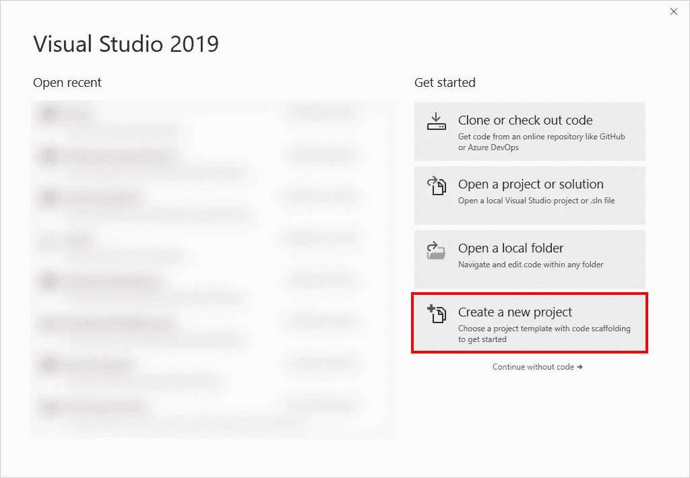
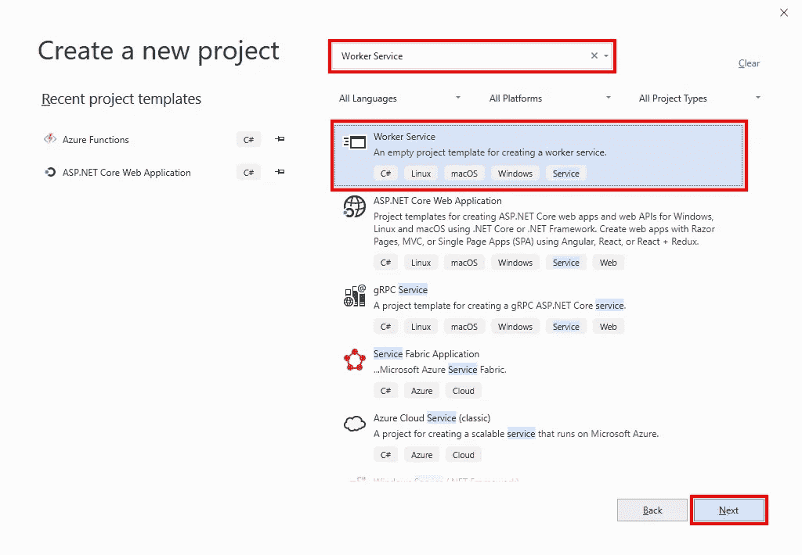
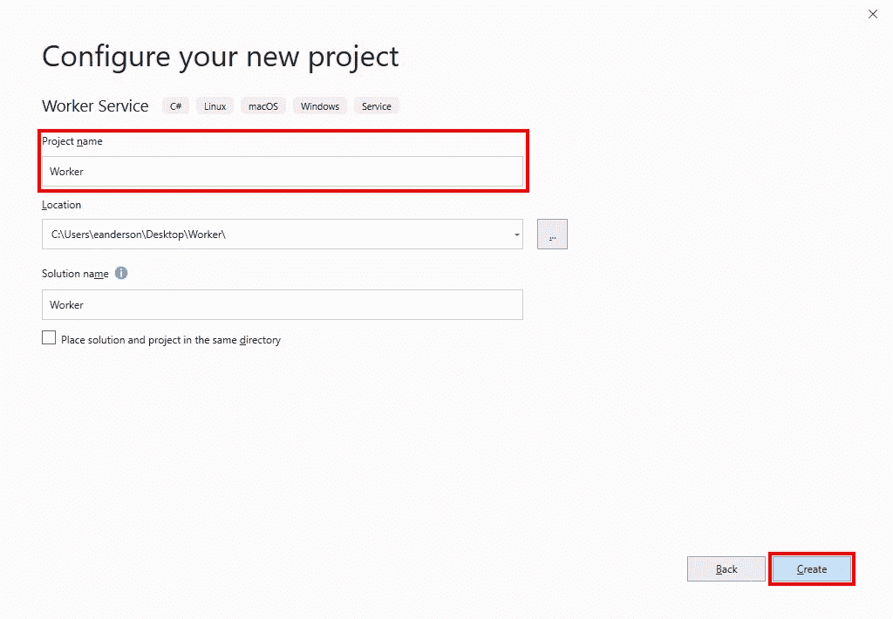
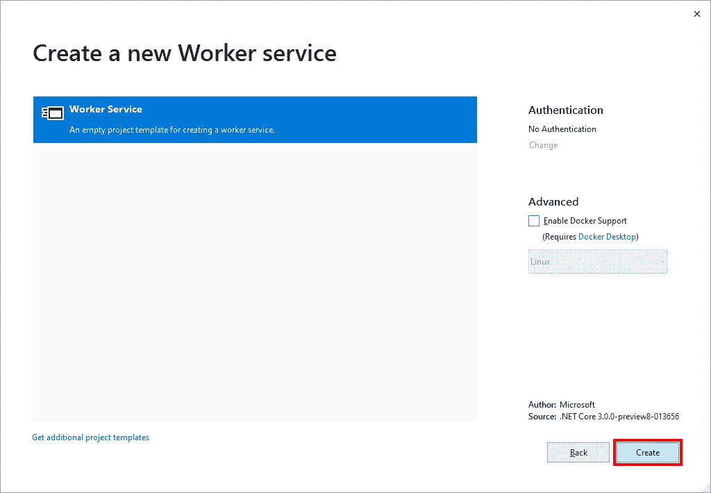
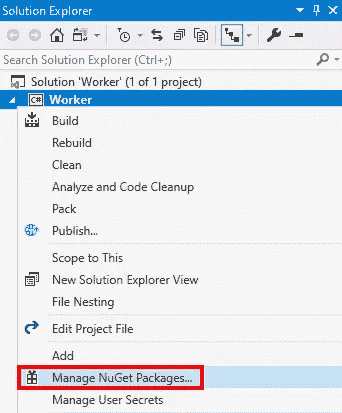
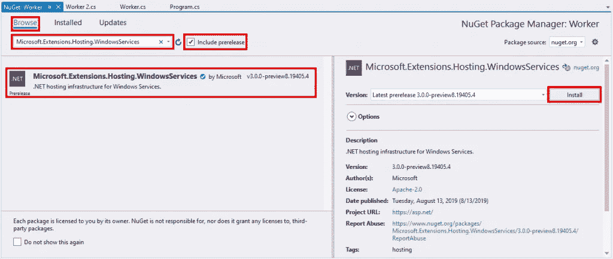
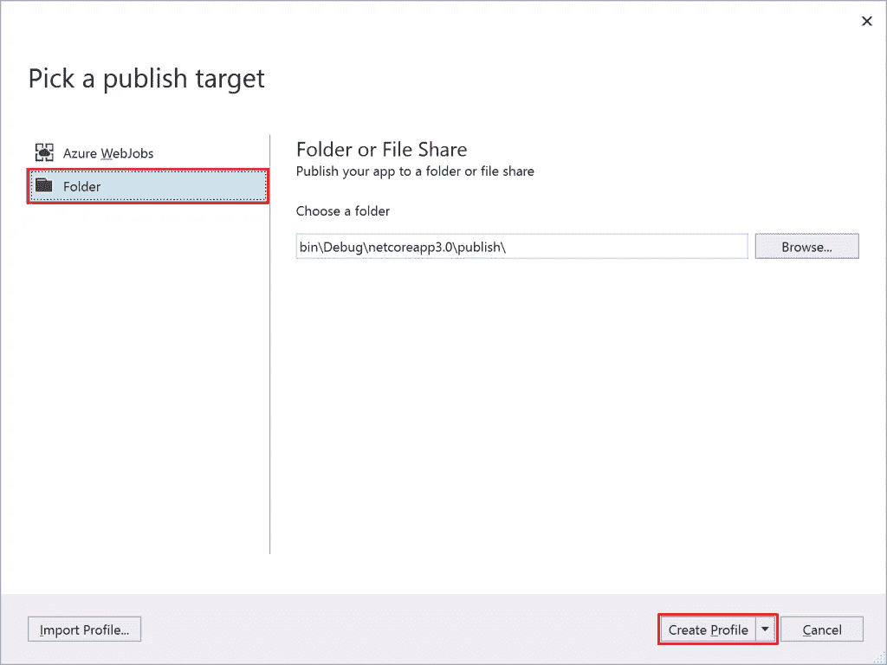
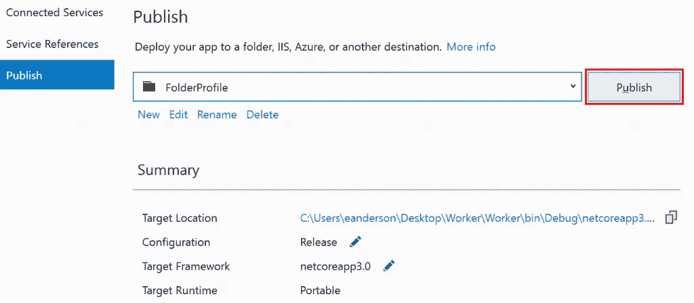

# 。网络核心工人服务

> 原文：<https://itnext.io/net-core-worker-service-23a0ec422600?source=collection_archive---------3----------------------->

大约一年前，我写了一篇文章[将 ASP.NET 核心应用作为 Windows 服务](https://elanderson.net/2018/09/host-asp-net-core-application-as-a-windows-service/)。随着即将发布的。NET Core 3 之后，我们现在有了另一个选项，可以使用新的 Worker 服务模板来创建服务。这篇文章将介绍如何使用新的 Worker 服务模板创建一个新的应用程序，然后将该服务作为 Windows 服务运行。

## 项目创建

这个过程我准备用 Visual Studio 2019 预览版。如果您愿意，您可以使用。请使用下面的命令来创建项目。

```
dotnet new worker
```

对于 Visual Studio，打开应用程序并选择**创建新项目**选项。



在下一个屏幕上搜索**工人服务**，点击**下一步**。



在下一个屏幕上输入一个**项目名**并点击**创建**按钮。



接下来，单击 create 按钮最终创建项目，除非您想使用 Docker。



## 项目结构

最终的结构非常简单。我们将要处理的两个文件是 **Program.cs** 和 **Worker.cs** 。

**Program.cs** 是应用程序的入口点，定义了您想要运行的不同作品。下面的示例设置了两个不同的工人。默认模板只有一个工人，但是我添加了第二个工人，以显示多个工人是一个选项。

```
public class Program
{
    public static void Main(string[] args)
    {
        CreateHostBuilder(args).Build().Run();
    }

    public static IHostBuilder CreateHostBuilder(string[] args) =>
        Host.CreateDefaultBuilder(args)
            .ConfigureServices((hostContext, services) =>
            {
                services.AddHostedService<Worker>();
                services.AddHostedService<Worker2>();
            });
}
```

**Worker.cs** 包含被调用来执行工作的代码。下面是从模板创建的默认工作线程。这个工人每秒只写一次日志。

```
public class Worker : BackgroundService
{
    private readonly ILogger<Worker> _logger;

    public Worker(ILogger<Worker> logger)
    {
        _logger = logger;
    }

    protected override async Task ExecuteAsync(CancellationToken stoppingToken)
    {
        while (!stoppingToken.IsCancellationRequested)
        {
            _logger.LogInformation("Worker running at: {time}",
                                   DateTimeOffset.Now);
            await Task.Delay(1000, stoppingToken);
        }
    }
}
```

此时，您可以运行应用程序，它将执行您设置的任何工作。

## 作为 Windows 服务运行

要将项目作为 Windows 服务运行，我们需要添加一个 NuGet 包。为此，右击项目文件并选择**管理 NuGet 包**。



在 NuGet 对话框中点击**浏览**选项卡，勾选**包含预发布**复选框，搜索**微软。extensions . hosting . windows services**，最后点击**安装**。



软件包安装完成后，打开 **Program.cs** ，在 **CreateHostBuilder** 函数中添加对 **UseWindowsService** 主机构建器的调用。

```
public static IHostBuilder CreateHostBuilder(string[] args) =>
    Host.CreateDefaultBuilder(args)
        .UseWindowsService()
        .ConfigureServices((hostContext, services) =>
        {
            services.AddHostedService<Worker>();
            services.AddHostedService<Worker2>();
        });
```

## 发布应用程序

既然我们已经将应用程序设置为能够作为 Windows 服务运行，我们需要发布它。从发布。您可以在包含解决方案或项目文件的目录中使用以下命令。如果您希望输出到不同的目录，还有一个输出位置选项。

```
dotnet publish
```

或者从 Visual Studio 中单击**构建>发布{解决方案名称}** 菜单。选择左侧的**文件夹**选项，然后点击**创建档案**。



在下一个屏幕上，点击**发布**按钮。



## 服务安装和管理

此时，可以像任何其他 Windows 服务一样安装和管理该应用程序。要安装该服务，请在管理模式下打开命令提示符，并运行以下命令来创建 windows 服务。 **binPath** 需要是 exe 的完整路径，否则即使创建成功，服务也无法启动。

```
sc create WindowsServiceHosted binPath= "C:\Users\eanderson\Desktop\Worker\Worker\bin\Debug\netcoreapp3.0\publish\Worker.exe"
```

另外，注意在 **binPath=** 之后和 exe 名称之前需要空格。

现在服务已经安装完毕，运行下面的命令来启动它。

```
sc start Worker
```

要检查服务的状态，请使用以下命令。

```
sc query Worker
```

要停止服务，请使用以下命令。

```
sc stop Worker
```

最后，使用下面的命令卸载您的服务。

```
sc delete Worker
```

## 包扎

这个模板使工人很容易上手。希望这能帮助你开始。确保并检查[。微软的. NET 核心工作者作为 Windows 服务](https://devblogs.microsoft.com/aspnet/net-core-workers-as-windows-services/)帖子。

*最初发表于* [*埃里克·安德森*](https://elanderson.net/2019/09/net-core-worker-service/) *。*