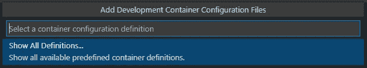
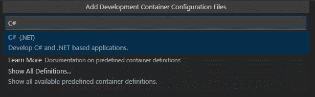
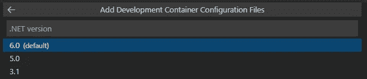
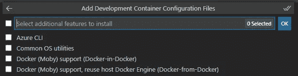
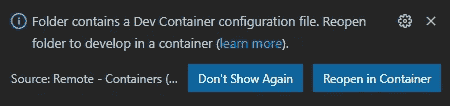
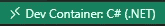
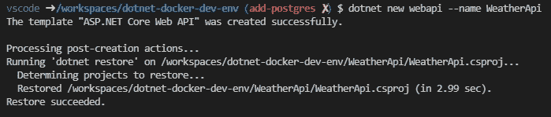
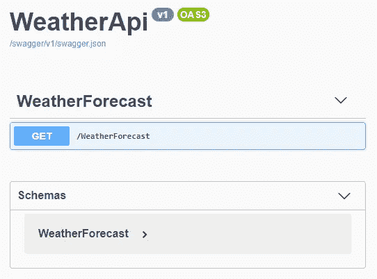
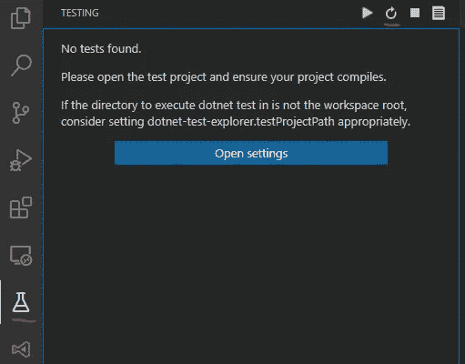
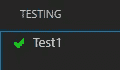

# 。使用开发容器在 Docker 中进行. NET 开发

> 原文：<https://itnext.io/net-development-in-docker-6509d8a5077b?source=collection_archive---------0----------------------->


照片由 [JJ 英](https://unsplash.com/@jjying?utm_source=medium&utm_medium=referral)在 [Unsplash](https://unsplash.com?utm_source=medium&utm_medium=referral)

*现更新为。NET 6.0！—最终代码* [*此处*](https://github.com/AndyWatt83/dotnet-docker-dev-env/tree/dotnet6) *。*

在我的[上一篇](https://medium.com/coinmonks/ethereum-development-in-docker-a6bd11d00ef2)中，我用 Docker 配置了一个以太坊开发的开发环境。这一次，我将为. NET 做同样的事情。

在 Docker 中构建开发环境在技术上已经有一段时间了，但是 Visual Studio 代码的' [Remote Containers](https://marketplace.visualstudio.com/items?itemName=ms-vscode-remote.remote-containers) '扩展已经把它带到了下一个层次。现在，工具已经足够成熟，可以在现实项目中使用了。在这篇文章中，我将搭建一个. NET API，并构建一些你在“普通”开发环境中可能会遇到的基本工具，但我将在 Docker 容器中运行它们！

在我们开始之前，让我们先回顾一下这样做的一些原因:

*   所有开发人员环境的一致性，这意味着“它在我的机器上工作正常”的终结。
*   接纳新的开发人员非常容易——他们只需拉出回购，所有的开发依赖都已经存在了。
*   更新每台开发机器也非常容易。
*   在开发机器上构建和运行项目的需求被表达为代码，并随着回购而移动。(扩展“基础设施即代码”的概念，以包括开发环境)
*   您不需要为您正在处理的每个项目的依赖关系“污染”您的机器。
*   这不是强制性的。如果团队中的任何一个开发人员因为某种原因厌恶 Docker，他们可以选择退出，不使用 Docker 功能。
*   您正在工作的环境是为您正在工作的项目量身定制的。

# 先决条件


由 [Kelly Sikkema](https://unsplash.com/@kellysikkema?utm_source=medium&utm_medium=referral) 在 [Unsplash](https://unsplash.com?utm_source=medium&utm_medium=referral) 上拍摄的照片

这有几个先决条件。我假设你对 Docker、VSCode 和 Linux / WSL 有很好的理解。无论您使用什么机器，都需要安装:

*   码头工人
*   [Visual Studio 代码](https://code.visualstudio.com/download)
*   VSCode 的“[远程容器](https://marketplace.visualstudio.com/items?itemName=ms-vscode-remote.remote-containers)扩展名
*   如果你用的是 Windows，[我推荐 WSL](https://docs.microsoft.com/en-us/windows/wsl/install-win10) ，尽管这不是必须的。

# 入门指南


[布拉登·科拉姆](https://unsplash.com/@bradencollum?utm_source=medium&utm_medium=referral)在 [Unsplash](https://unsplash.com?utm_source=medium&utm_medium=referral) 上拍摄的照片

如果您将文件托管在 Windows 文件系统中，并将它们挂载到 docker 中的一个卷中，[性能会非常糟糕](https://github.com/docker/for-win/issues/6742)，因此我建议将文件托管在 WSL 文件系统中。

进入 WSL 终端，创建一个新文件夹，用`code .`打开 VSCode

当 VSCode 打开时，点击 F1 并搜索`Add Development Container Configuration Files`


选择“显示所有定义”



现在搜索 C#



选择你的网络核心版本——我将使用 6.0



选择您的节点版本—我将使用 lts


选择任何所需的附加特征(不需要)-然后单击“确定”



VSCode 将弹出以下内容



单击在容器中重新打开。第一次这样做可能需要一段时间，但以后会快得多。完成后，VSCode 的左下角应该看起来像这样:



这告诉我们，我们现在是在一个容器中运行。到目前为止，一切顺利！

在 VSCode 中打开终端。您将看到终端运行在容器中，而不是运行在主机上。您可以通过尝试使用您最喜欢的 cli 工具来证明这一点——它们不会在那里，因为终端运行在一个全新的 Docker 容器中！很快，我们将添加一些 cli 工具，但首先我们可以创建一个新的 API 项目。

使用终端创建一个新的 WebAPI 项目，包括:

```
dotnet new webapi --name WeatherApi
```



然后将 CD 放入 WeatherApi 文件夹，生成 https 证书，并使用以下命令运行 Api:

```
cd WeatherApi
dotnet dev-certs https
dotnet run
```

现在打开浏览器，访问[http://localhost:5250/swagger/index . html](http://localhost:5000/swagger/index.html)，你应该会看到默认的天气 API。



那么，这很容易！但是，虽然从技术上来说你可以开始输入 C#代码，但我真的不认为这是一个开发环境。这仍然只是一个文本编辑器，如果我们想成为高效的开发人员，还有更多的工作要做！

# CLI 工具


照片由[潘卡杰·帕特尔](https://unsplash.com/@pankajpatel?utm_source=medium&utm_medium=referral)在 [Unsplash](https://unsplash.com?utm_source=medium&utm_medium=referral) 上拍摄

有一些我经常使用的 cli 工具，我希望在使用容器时可以随时使用。首先，我希望在命令行上使用 Vim

查看生成的 Docker 文件(在`.devcontainer` 文件夹中)。有一个注释掉的部分，你可以通过`apt-get`安装任何你喜欢的东西，就像这样:

```
# [Optional] Uncomment this section to install additional OS packages.
RUN apt-get update && export DEBIAN_FRONTEND=noninteractive \
    && apt-get -y install --no-install-recommends vim
```

您需要退出并重新进入远程容器环境(按`F1`)才能看到更改。重新打开远程环境后，打开一个终端，并确保 Vim 可用。任何其他 cli 工具都可以用同样的方式添加——只需将您想要的任何其他东西添加到行尾。

# 扩展ˌ扩张


照片由 [Nastuh Abootalebi](https://unsplash.com/@sunday_digital?utm_source=medium&utm_medium=referral) 在 [Unsplash](https://unsplash.com?utm_source=medium&utm_medium=referral) 上拍摄

开箱即用，VSCode 并没有带来太多，你需要添加所有的附加功能和扩展。当你在一个容器中打开 VSCode 时，没有安装扩展，所以我们拥有的是一个“编辑器”，而不是一个“开发环境”。

您可以使用 VSCode UI 或终端以通常的方式安装扩展，但是当容器停止时，它们将不会持久。为了持久化扩展，在`devcontainer.json`文件中配置您想要的扩展。

```
"extensions": [
    "ms-dotnettools.csharp",
    "formulahendry.dotnet-test-explorer",
    "fernandoescolar.vscode-solution-explorer",
    "shardulm94.trailing-spaces",
    "pkief.material-icon-theme",
    "jmrog.vscode-nuget-package-manager",
    "patcx.vscode-nuget-gallery",
    "k--kato.docomment",
    "formulahendry.dotnet",
    "2gua.rainbow-brackets",
    "oderwat.indent-rainbow",
    "donjayamanne.githistory"
],
```

以上是我典型的一套做。NET 开发，包括一个测试扩展，nuget，icons，几个“生活质量”扩展，最重要的是 [**尾随空格高亮**](https://marketplace.visualstudio.com/items?itemName=shardulm94.trailing-spaces) 。

您需要退出并重新打开容器环境才能看到更改。当容器停止并重新启动时，您将看到您已经安装的扩展现在可用了！

# 构建一个真实的项目

此时，我们已经添加了我们想要的所有 cli 工具，并配置了我们需要/想要开始开发的所有扩展的 vs code——我要说的是，此时我们已经有了一个“开发环境”,而不是一个“编辑器”。

作为演示，我将添加一个解决方案文件和一个测试项目，并运行测试，在这一点上，我认为我们可以称之为完成(目前…)。

添加包含以下内容的解决方案文件

`dotnet new sln --name WeatherApi`

添加引用 WetherApi 项目

```
dotnet sln add ./WeatherApi/WeatherApi.csproj
```

因为我们已经包含了`[解决方案资源管理器](https://marketplace.visualstudio.com/items?itemName=fernandoescolar.vscode-solution-explorer)`扩展，所以您可以使用它来添加测试项目，并以与 Visual Studio 相同的方式添加引用。但是，如果您喜欢使用 cli，可以使用以下命令:

```
dotnet new xunit --name WeatherApi.Tests
dotnet sln add ./WeatherApi.Tests/WeatherApi.Tests.csproj
cd WeatherApi.Tests
dotnet add reference ../WeatherApi/WeatherApi.csproj
```

您可以在控制台中键入`dotnet test`并看到输出，但这并不是我们真正想要的。

同样，当添加扩展时，我们已经添加了“ [dotnet 测试浏览器](https://marketplace.visualstudio.com/items?itemName=formulahendry.dotnet-test-explorer)”，因此我们有了一个测试浏览器 UI。单击扩展，然后单击以发现测试:



然后单击运行已经添加的虚拟测试，您应该看到它通过了:



我们现在已经有了一个. NET 开发环境，并且成功地运行了测试。任何机器上的任何人(安装了 Docker)都可以调用这个 repo，打开项目，然后开始工作。不需要设置！

# 结论

我认为这是一个暂停的好地方，尽管显然还有很多可以添加的内容。此时，我们有:

*   基于 Ubuntu 的。NET 开发环境。
*   定制的命令行工具。
*   定制的 Visual Studio 代码，专为。网络开发。
*   一个可以构建的 API 项目。
*   可用于测试 API 的测试项目。

接下来的步骤可能是

*   让它与 SSL 一起工作——目前本地证书不被传递到容器中。
*   添加 git 凭证——目前我正在主机上与 git 交互。
*   添加一个数据库(在第二个容器中)。
*   添加对 Angular 或 React 等 UI 框架的支持。

请在评论中告诉我你的想法。我很想知道是否有人已经在现实世界的项目中使用它了。我认为这是一项非常强大的技术，随着技术的成熟，我们将会看到越来越多的这种技术！


照片由[艾蒂安·吉拉代](https://unsplash.com/@etiennegirardet?utm_source=medium&utm_medium=referral)在 [Unsplash](https://unsplash.com?utm_source=medium&utm_medium=referral) 上拍摄