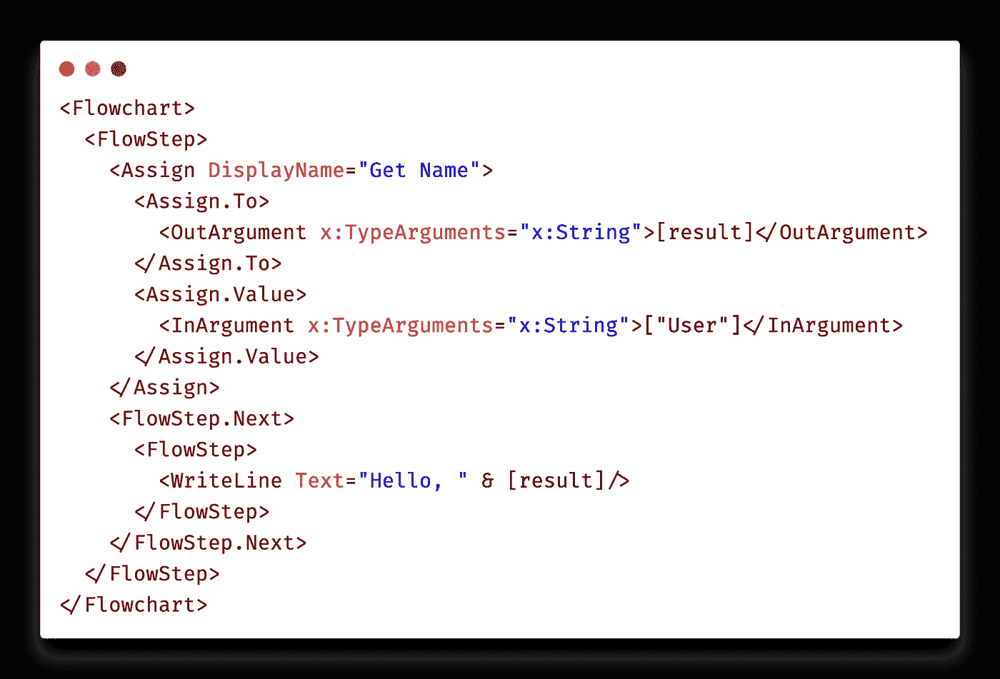
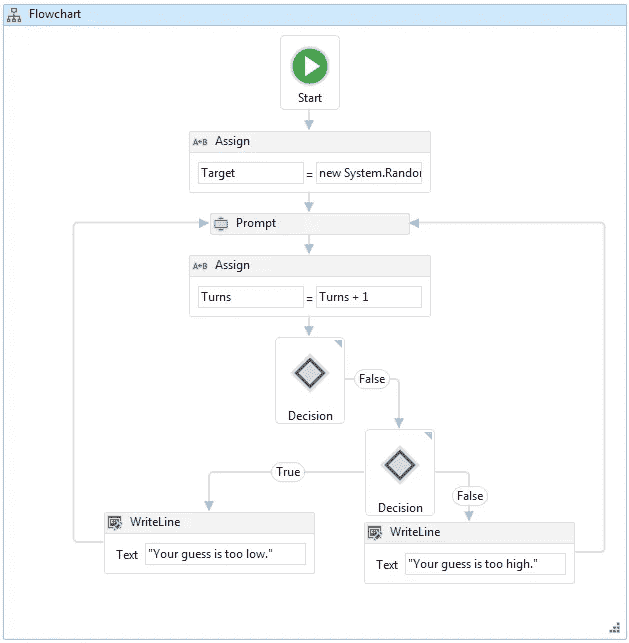
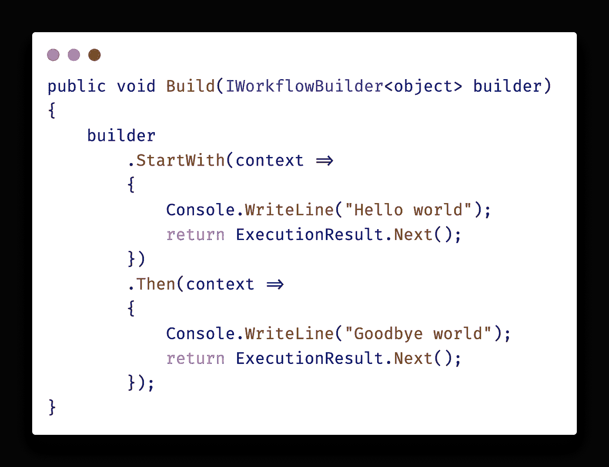
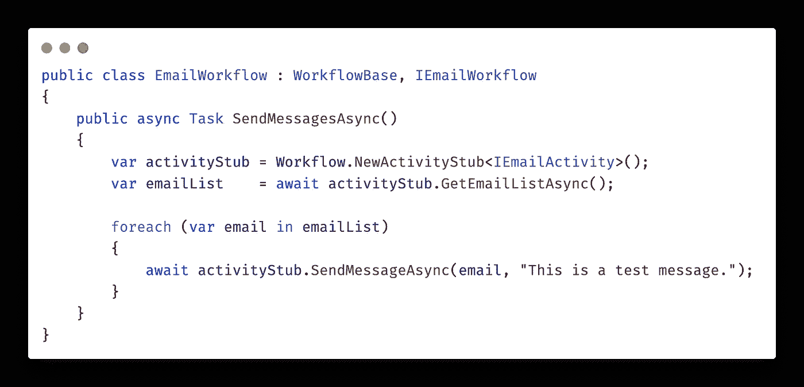

# 。NET 工作流引擎

> 原文：<https://itnext.io/net-workflow-engines-d6f794d121e1?source=collection_archive---------2----------------------->

这是我的文章[的. NET 特定延续，工作流引擎是你的工具](https://maximcus.medium.com/workflow-engine-is-a-tool-for-you-3f34e4dde831)。如果您不知道什么是工作流引擎或者为什么要使用工作流引擎，请参考上一篇文章。我在这里只重复定义:

> *一个应该被可靠执行的算法被称为*工作流。*一个工作流的单个步骤或语句被称为一个*活动。*负责可靠执行工作流的独立应用或嵌入式框架被称为*工作流引擎*。*
> 
> *工作流引擎通过保持工作流的状态并自动重新执行最后失败的活动，直到整个工作流完成，从而确保工作流的可靠性。*

在这篇文章中，我将

1.  提供…的分类。Net 工作流引擎如何表达工作流
2.  选择最好的。NET 工作流引擎，供开发人员在编写时使用

我不得不分析。NET 工作流引擎，我发现它们都可以归为三类。

# 1.XML/UI 设计器

创建这些类型的工作流引擎时，就好像业务人员希望自己定义工作流一样(因为谁不想成为程序员)。这里有几个来自[Windows Workflow Foundation](https://docs.microsoft.com/en-us/dotnet/framework/windows-workflow-foundation/)的例子:

问题是(至少在我的经验中)——出于某种原因，业务人员更喜欢将编程委托给软件工程师。对于软件工程师来说，使用声明性语言或使用设计器来创建命令式算法(工作流)根本不是最佳方式。更不用说调试和单元测试了。

这种类型的工作流引擎的一个可取之处是，您基本上可以将 DSL 作为 XML，从而限制您的工作流中允许的内容。但是我认为 XML 仍然是一个糟糕的选择——如果你需要，DSL 可以使用一些真正的编程语言来代替。

如果你想要另一个例子，你可以看看 [workflowengine.io](https://workflowengine.io/demo/designer/) 的漂亮的交互式演示，但是我要寻找一些对开发人员更友好的东西。

# 2.工作流生成器

在 C#中定义工作流的一种简单方法是使用某种生成器:

这个例子摘自[工作流核心](https://workflow-core.readthedocs.io/en/latest/getting-started/)。构建器很适合这个问题，因为您需要某种方法来定义活动(工作流步骤)并在活动之间保持工作流状态。

问题是——当使用构建器来定义工作流时，您不能使用标准的控制流语句(`if-else`、`for`等)。您必须改用生成器方法。更实际的例子是，看看 Elsa 工作流程中所谓的[简单文档审批工作流程](https://elsa-workflows.github.io/elsa-core/docs/guides-document-approval)。我并不是说 Elsa 有什么不好——事实是，使用这种方法时，即使相对简单的工作流也会变得非常冗长和笨拙。

那么，我们能做得更好吗？

# 3.本机工作流

事实证明，通过一些巧妙的技巧，工作流可以“隐藏”在本地语言结构之后。

这个例子来自[霓虹。Cadence](https://doc.neonkube.com/Neon.Cadence-GettingStarted-MultiStepWorkflows.htm) —优步 [Cadence](https://cadenceworkflow.io/) 工作流引擎的 C#客户端库。`IEmailActivity`方法只是普通的 C#方法，没什么特别的。神奇的事情发生在 activity stubs 中，它将执行 activity*和*并在 activity 成功执行后保存它们的结果。

工作流引擎应该能够恢复任何工作流状态，例如，如果工作流必须等待很长时间并从内存中卸载，或者如果工作流引擎节点失败。如果我们只有单个活动的结果，我们如何恢复工作流状态？唯一的方法是从头开始重放工作流，并使用以前保存的活动执行结果。

这是这些工作流类型的主要缺点。在编写工作流时，你必须特别小心，确保它是完全确定的(例如`Guid.NewGuid`或`DateTime.Now`必须封装在活动中，而不能直接在工作流中使用)。此外，您不能在工作流中创建无限的循环，因为这将意味着无限的重放时间(有解决方法)。

但即使有所有的缺点，对我来说这种权衡是值得的。使用我的原生工具来编写、阅读、调试和测试工作流的便利性不能被夸大。

# 最好的。NET 工作流引擎？

很明显，是最好的。Net 工作流引擎对我来说是最后一类。我只知道两个这样的工作流引擎。

Cadence(以及它的下一个版本 [Temporal](https://www.temporal.io/) )有很多优势，包括[一个很好的网络用户界面](https://github.com/uber/cadence-web)用于观察。与此同时。网客户端[霓虹。Cadence](https://doc.neonkube.com/Neon.Cadence-Overview.htm) 是由第三方开发者创建的，它还不允许单元测试，这对我来说是一个障碍。

微软的[持久任务框架](https://github.com/Azure/durabletask)意外摘得桂冠。很长一段时间以来，我忽略了这个工作流引擎，我为此责怪微软(对不起，微软人)。

我忽略持久任务框架的原因是它明显缺乏工作流和活动的强类型化。在[中，由官方文档提供的每个](https://github.com/Azure/durabletask/wiki/Example---Video-Encoding) [示例](https://github.com/Azure/durabletask/wiki/Error-Handling-&-Compensation)工作流和活动都是使用`typeof`调用的，而不是使用一些强类型接口。github 知识库的主要 readme.md 表明 Azure 持久功能(由持久任务框架支持)的文档可能会有所帮助，但是[它的示例](https://docs.microsoft.com/en-us/azure/azure-functions/durable/durable-functions-overview?tabs=csharp#application-patterns)甚至不使用类型——它们使用普通字符串来调用活动。很好。非常容易维护。

不知何故，我在整个持久任务框架存储库中偶然发现了一个例子，它展示了如何使用强类型接口调用活动。寻找，你就会找到。考虑到这一点，我认为实现强类型包装器来调用工作流应该不成问题。

持久任务框架有许多不错的特性，我没有时间在这里描述。虽然我认为这是最好的。NET 工作流引擎，这当然可能不是你的情况。例如，受支持的现成持久性存储仅限于 [Azure 选项](https://github.com/Azure/durabletask)，这可能很不适合你(尽管根据微软的说法，创建到任何持久性存储的绑定都不是问题，因为唯一的要求是一些非常基本的键值存储功能)。

您当然应该选择最适合您的需求和您试图解决的问题的工作流引擎。希望这个小指南能为你提供一些帮助你开始的信息。

