# 如何使用 Netmaker v0.10，一个 WireGuard 虚拟网络平台(深入探讨)

> 原文：<https://itnext.io/netmaker-v0-10-a-wireguard-virtual-network-management-deep-dive-b4ce93c6e715?source=collection_archive---------1----------------------->

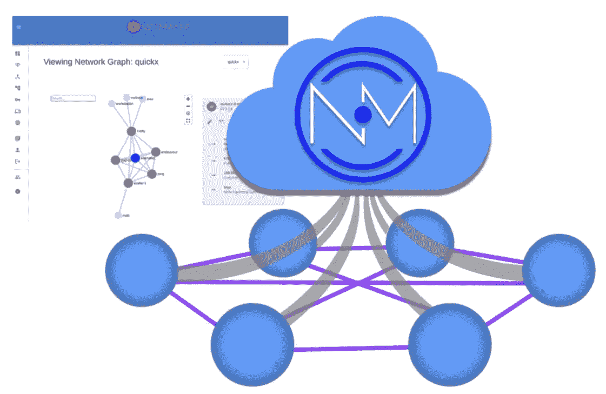

在本指南中，我们将逐步介绍 Netmaker v0.10 的安装、配置和使用。如果您不熟悉，Netmaker 是建立在 WireGuard 之上的虚拟网络平台，wire guard 是一种性能极高的 VPN 协议。非常非常快，效率极高。你可能会认为 Netmaker 是:

*   电线保护控制器
*   网络对接器
*   一个虚拟的 VPC(是的，我知道，多余的)

Netmaker 使网络变得一次性和即时。在您需要的地方，在您需要的时候，您都可以拥有安全、可控的网络。就像容器为计算所做的一样，Netmaker 在 WireGuard 的帮助下为网络做了很多事情。

这个演练是这个长达一小时的 YouTube 教程的一个更有条理的版本。如果你喜欢看视频，那就看视频吧！

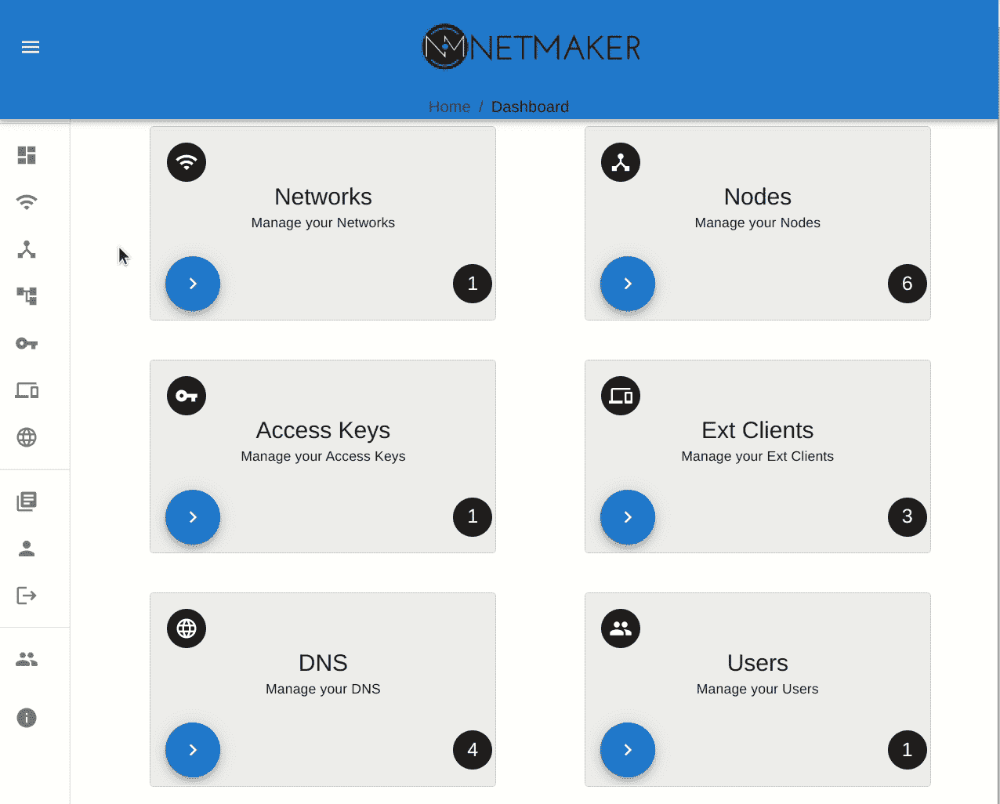

# 介绍

Netmaker 可用于创建各种网络拓扑。默认情况下，它会创建一个“全网状”网络，这意味着所有连接都是点对点的。

Netmaker 还可以创建入站(入口)和出站(出口)网关。出口网关对于您可能希望一组机器能够访问只有其中一台机器可用的资源的情况特别有用。

例如，假设您在以下任何环境中拥有一台机器:

*   自动警报系统
*   库伯内特星团
*   办公网络
*   你的房子
*   数据中心

这台机器可以充当“出口网关”，允许从外部进行安全的远程访问。

查看一些您可以使用 Netmaker 创建的网络拓扑:

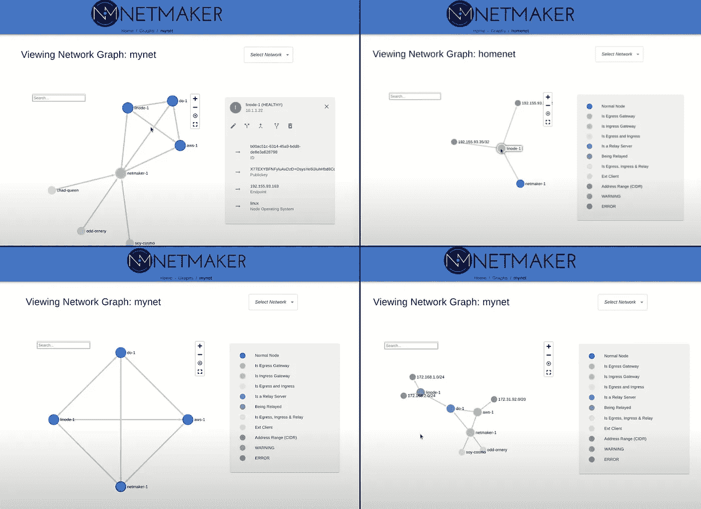

# 索引

*   服务器安装
*   初始设置
*   网络创建和配置
*   服务器节点
*   访问键和安装简介
*   如何使用 Netclient 建立平面(网状)网络
*   入口网关和外部客户端
*   出口网关
*   中继服务器
*   情节
*   结论

# 服务器安装

你需要一台服务器。可以很小，但是要公开。为什么？Netmaker 的全部目的是从分散在各处的机器中创建分布式虚拟网络。

这些机器都需要从同一个服务器(或者多个服务器，如果配置了高可用性的话)获取配置。如果 Netmaker 服务器运行在私有数据中心或 NAT 之后，那么该环境之外的机器将无法访问它。

对于更高级的用户，您可以设置端口转发，将服务器放在您自己的私有环境中，但对于典型用户，我们建议购买便宜的 VPS。[你可以从 DigitalOcean 得到一个，每个月 5 美元](https://m.do.co/c/496ffcf1e252)，他们有非常好的带宽定价。

使用 Linux 部署机器。我们更喜欢 Ubuntu 20.04。然后，您需要确保正确的端口是打开的。

至少，您需要打开端口 443 和 51821。为了快速开始，您还需要:

*   51821–51830(您创建的每个网络一个端口。这些是 WireGuard 端口)
*   22(用于 SSH)
*   80(如果使用快速安装。这只是为了让 Caddy 使用 LetsEncrypt 请求 SSL 证书)
*   53(针对 DNS)

对于本演练，我们将使用来自 [**GitHub 自述文件**](https://github.com/gravitl/netmaker#get-started-in-5-minutes) 的简单的“5 分钟安装”脚本。

`wget -qO -https://raw.githubusercontent.com/gravitl/netmaker/master/scripts/nm-quick.sh | sudo bash`

如果想使用自己的域(而不是自动生成的. nip.io 域)，按照 [**快速安装文档**](https://docs.netmaker.org/quick-start.html) 操作。这里唯一的区别是，你需要将你的通配符域名指向你的 VPS 的公共 IP，并告诉 Caddy 使用它。

以下是人们在安装过程中关心的一些典型问题，以及如何解决这些问题:

## **“我不想用球童！”**

Caddy 是 Netmaker 附带的反向代理。什么是反向代理？它将外部世界的流量带到您的实例中。在我们的例子中，它将 dashboard.yourdomain.com 映射到 UI (127.0.0.1:8082)，将 api.yourdomain.com 映射到 http API (127.0.0.1:8081)，将 grpc.yourdomain.com 映射到 gRPC 端点(127.0.0.1:50051)。

你可以排除 Netmaker 的 Caddy 组件，代之以你自己的反向代理，不管是 Traefik，Nginx，HAProxy，还是别的什么。[此 docker-compose 不包括 Caddy。](https://github.com/gravitl/netmaker/blob/master/compose/docker-compose.nocaddy.yml)

请注意，您需要为 UI、API 和 gRPC 创建域映射。gRPC 流量也很特殊，经常需要反向代理上的额外插件(老的通常甚至不支持)。

如果您在已经有负载平衡器并使用端口 443 的地方部署 Netmaker，这是非常有用的信息。这种情况下，往往需要整合。

**Nginx 文档:**[https://Docs . net maker . org/server-installation . html # Nginx-reverse-proxy-setup-with-https](https://docs.netmaker.org/server-installation.html#nginx-reverse-proxy-setup-with-https)

**Traefik 文档:**[https://github.com/bsherman/netmaker-traefik](https://github.com/bsherman/netmaker-traefik)

**如果您的环境有其他配置，请考虑为我们的文档** 提供 [**！**](https://github.com/gravitl/netmaker/blob/master/CONTRIBUTING.md)

## "我要在主机上安装 Netmaker networks！"

默认的 docker-compose 以“包含”模式部署 Netmaker。这意味着 VPN 流量直接流入容器，根本不会影响主机网络。这对于保持 Netmaker 的包容性非常好，并且使调试更容易(您可以重启容器来重置所有接口)。然而，用户通常希望 Netmaker 网络位于主机上，因为他们打算将 Netmaker 服务器视为某种“堡垒服务器”,用于访问他们的机器。

在这种情况下，您可以使用这个 docker-compose，它直接在主机 上运行网络 [**。**](https://github.com/gravitl/netmaker/blob/master/compose/docker-compose.hostnetwork.yml)

只是要小心，如果出现问题，网络可能需要一些手动清理。

## **“我需要 Netmaker 高度可用！”**

考虑使用我们的 [HA helm 模板](https://github.com/gravitl/netmaker-helm)在 Kubernetes 上部署 Netmaker。或者，使用 rqlite 设置您自己的 HA 配置[。](https://docs.netmaker.org/server-installation.html#highly-available-installation-vms-bare-metal)

## “我的组织需要 OAuth！”

你很幸运，除了基本 auth(默认)，Netmaker 还支持带有 Azure AD、GitHub 或 Google 的 OAuth。如果您需要 2fa，您可以通过您的提供商启用它。

要进行设置，请遵循常规的快速安装文档，但是在运行 **docker-compose up -d** ，[之前，请遵循以下步骤添加适当的环境变量以启用 OAuth。](https://docs.netmaker.org/oauth.html)

对于我们安装程序，我们将回到 README 安装脚本。

让我们假设您已经使用 Ubuntu 20.04 部署了一个 VPS/VM，这是一个可公开访问的 IP 地址，并且端口 443、80、53 和 51821–51830 是开放的和可访问的。让我们假设这台机器只用于 Netmaker。我们还假设您不需要 OAuth。如果是这种情况，您可以运行安装脚本:

`wget -qO -https://raw.githubusercontent.com/gravitl/netmaker/master/scripts/nm-quick.sh | sudo bash`

这将…

1.  安装电线保护装置和对接装置
2.  使用 [nip.io](https://nip.io) 发现公共 IP 并设置子域。
3.  下载并配置合成文件，以及 Caddy 和 Mosquitto (MQTT)的配置文件。
4.  启动 Netmaker
5.  创建“默认”网络、访问密钥，并将服务器设置为“入口网关”

输出将显示仪表板 URL，或者您可以在 Caddyfile 中找到它。使用此链接并在浏览器中打开它。

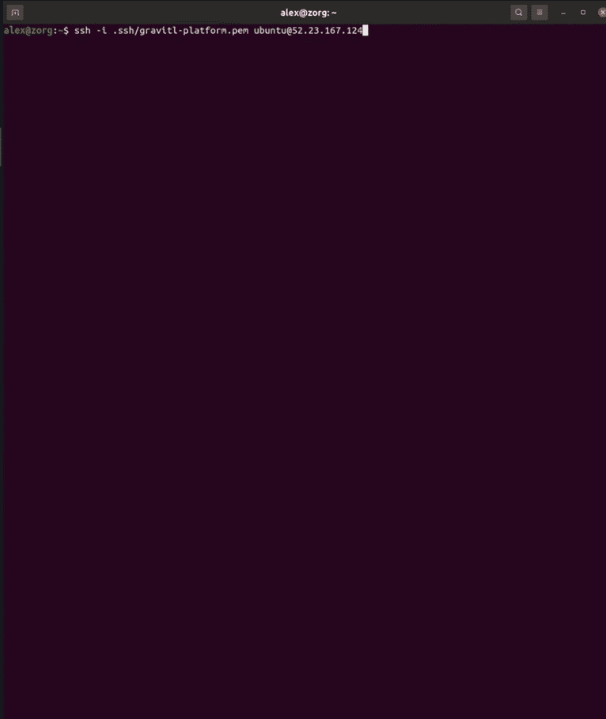

# 用户管理

首次登录时，您将看到“创建管理员”屏幕。这将是系统上的“超级用户”,能够运行所有命令。


选择用户名和密码，点击“创建管理员”，然后用该管理员登录。

您会注意到 OAuth 登录屏幕的一角有一个小按钮。如果您启用了 OAuth，您可以使用它登录。

管理员可以创建其他用户。只需点击侧边栏中的**用户**标签。这些用户可以是具有完全服务器访问权限的额外“超级用户”,也可以局限于有限数量的网络。

如果用户不是管理员，他们可以编辑和控制网络，但不能编辑服务器级设置。

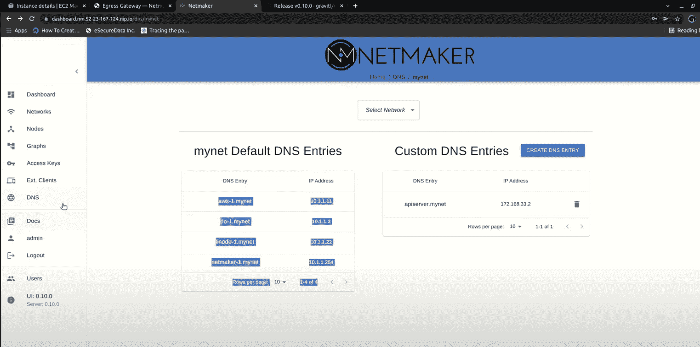

# 网络创建和配置

创建用户后，您可以创建网络。部署脚本中部署了一个默认的**，但是您可能想要创建自己的。如果你想重新开始，你也可以删除默认值。**

**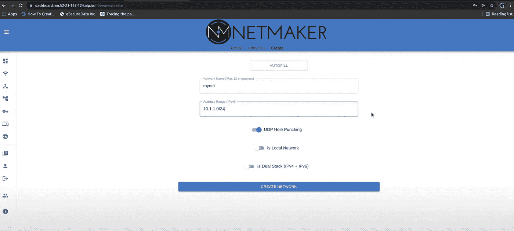**

**您的新网络应该有一个有效、唯一的 CIDR 和一个简短的描述性名称。**

**除此之外，决定是否要打开 **UDP 打孔**。**

**如果您在云/数据中心环境中主要处理静态服务器，最好不要使用它。如果您主要处理像笔记本电脑这样的终端用户设备，或者 NAT 后的设备，最好保持开启。如果启用，可以在节点级别为任何不应该有 UDP 穿孔的节点关闭 UDP 穿孔。**

**通常我们建议关闭“是本地的”。这仅适用于节点不应该通过公共网络进行通信的情况(例如，它们都在数据中心网络内)。**

**即使您关闭此设置，如果节点在同一个本地网络上，Netmaker 也会尝试检测并使用本地网络，因此最好禁用此选项。**

**最后，如果您希望您的节点拥有 ipv6 地址，您可以为双堆栈添加 ipv6 网络。**

**创建网络后，您可以在“网络”列表中编辑它。这里还有一些额外的选项。**

**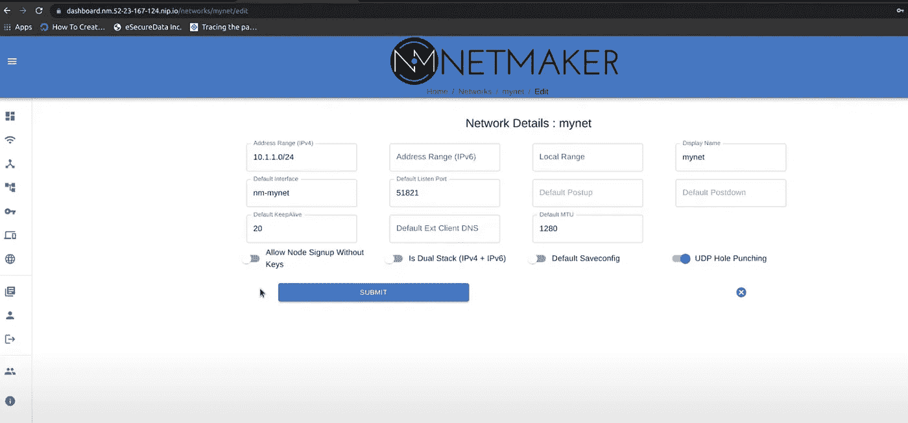**

**特别值得注意的是:**

*   ****默认监听端口:**如果 UDP 打洞关闭，节点将从**默认监听端口开始，将其端口设置为本地第一个空闲的可用端口。**例如，在 Kubernetes 中，我们将其更改为 31821，以便与默认的节点端口范围保持一致。**
*   ****默认外部客户端 DNS:** 如果使用外部客户端(稍后讨论)，您可以使用该字段设置它们的名称服务器。如果未设置，外部客户端将不会设置名称服务器，并将依赖主机的 DNS。**
*   ****默认 MTU:** 在某些环境中，您可能希望将默认 MTU 设置得更高或更低。一般来说，MTU 越高，性能越好，但可能会导致连接丢失。MTU 越低，连接性越好，但性能越低。值得记住的是，这将设置默认的网络 MTU，但也可以在单个节点级别进行设置。[这里是 Wireguard MTU](https://www.reddit.com/r/WireGuard/comments/mjcbcc/mtu_issuequestions/) 的一个很好的讲解者。**
*   ****UDP 打孔:**您可以通过此选项打开/关闭全网 UDP 打孔。如果您遇到一般的网络连接问题，并且 UDP 打孔已打开，请尝试将其关闭，反之亦然。**

**对于其他领域的解释者，[查看 UI 参考](https://docs.netmaker.org/ui-reference.html#edit)。**

# **服务器节点**

**创建网络后，您可以开始添加节点。**

**默认情况下，每个网络中都有一个**服务器节点**。这是 netmaker 正在运行的机器(通常是 docker 化的)。此节点不能被删除，并且对于 MQ 通信以及专用 DNS 流量是必需的。它总是使用网络 CIDR 的最后一个 IP，以便其他节点知道在哪里找到它。**

**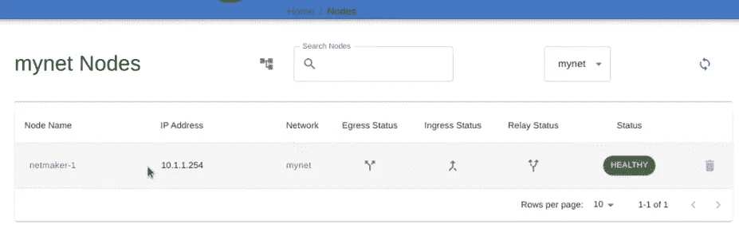**

**您通常没有理由编辑该节点。但是，有一些可编辑的设置，如 MTU。值得注意的是，在当前版本中，有时服务器节点会不同步。要排除故障，您可以更改节点上的设置，如 MTU 或 Keepalive，或者重新启动主机上的 netmaker 容器。**

# **访问键和安装简介**

**要开始构建我们的网络，我们需要一个访问密钥。**

**您可以单击访问密钥选项卡并创建一个密钥，赋予它多种用途。通常情况下，使用次数与您想要创建的节点数量有关。目前还没有“无限”键的概念，但是如果你打算自动化地使用它，你可以给这个键一个很高的使用次数(例如 9999999)。如果您不设置名称或用途字段，它将生成一个随机名称并有一个**使用**。**

**可以通过删除密钥来使其失效。当“使用”达到零时，它们将自动删除。**

## **客户端安装命令**

**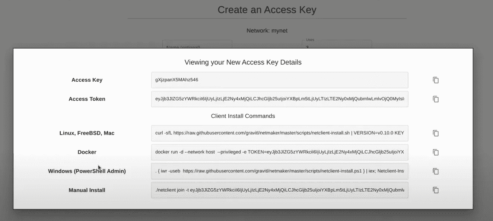**

**单击 netclient 键将显示安装说明。通常，您会忽略“访问密钥”和“访问令牌”字段，只使用正确的“客户端安装”命令。**

**为 Linux、FreeBSD 和 Mac 列出了一个命令，它只是一个安装程序脚本。还有一个 Windows 安装程序脚本。最后，还有一个“docker run”命令，用于将 netclient 作为容器运行。**

**在所有这些下面是“手动安装”命令，它只是:**

```
“netclient join -t <token>”
```

**这里假设您已经从 Github 上的[发布页面下载了合适的 netclient。](https://github.com/gravitl/netmaker/releases)**

**您还应该使用**加入**命令(而不是安装脚本)从同一台机器加入**附加**网络，因为安装脚本试图下载依赖关系。**

# **使用网络客户端进行网络设置**

**一旦有了访问密钥，就很容易将节点加入网络。只需对您想要加入网络的每台机器进行 SSH，然后运行 install 命令，例如:**

```
curl -sfL [https://raw.githubusercontent.com/gravitl/netmaker/master/scripts/netclient-install.sh](https://raw.githubusercontent.com/gravitl/netmaker/master/scripts/netclient-install.sh) | sudo VERSION=v0.10.0 KEY=eyJjb3JlcGN3Z3B1YmtleSI6IiIsI....cGN3Z2VuZHBvaW50IjoiIn0= sh -
```

**要记住的事情:如果运行安装程序，它会尝试安装 WireGuard。如果没有运行安装程序，必须已经安装了 WireGuard(内核或 wireguard-go)。此外，它将尝试在 Linux 上为 DNS 安装 resolvectl。**

**如果你是**而不是**使用 UDP 打孔，确保适当的端口是打开的(通常是 51821)。**

**加入网络时，您可以设置许多选项。只需查看帮助者文本:**

****需要注意的几个重要事项:****

*   **端口:更改使用的端口(当 udp 打孔关闭时)**
*   **udpholepunch:即使在网络级别设置为“是”,也可以设置为“否”**
*   **dnson:可以设置为“否”以防止设置 dns**
*   **守护程序:可以设置为“关”以避免创建系统守护程序(有利于测试/故障排除)**

**加入后，您应该可以立即看到网络中的其他节点，并且很快就可以进行通信:**

**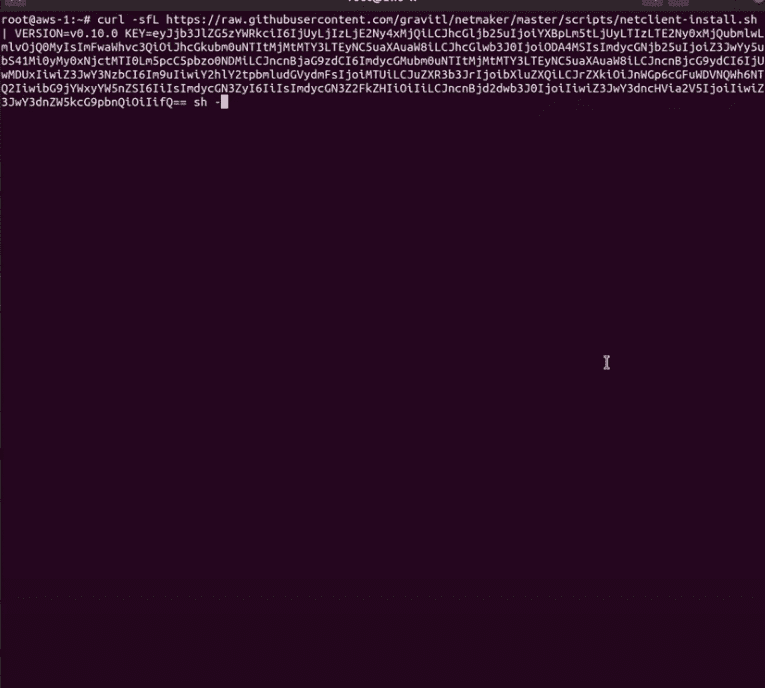**

**您可以像在大多数系统(如 Linux、Mac、Windows 和 FreeBSD)上检查和管理常规 WireGuard 接口一样检查和管理这些接口。该接口通常被命名为“nm-”+“网络名称”例如“nm-mynet”**

**请记住，当 netclient 运行时，它会尝试用正确的配置同步接口。如果您手动编辑接口/ wireguard 配置，它可能会恢复。但是，您可以通过运行 **systemctl stop netclient 来停止守护进程。****

**您可以通过运行…来监视 Linux 上正在运行的 netclient 守护进程**

****福网客户端****

****系统状态网络客户端****

**一个有用的提示是，如果没有收到更新，运行 **systemctl 重新启动 netclient** 。另一个有用的故障排除技巧是运行**

****网络客户端拉**或**网络客户端签入****

**这将同步最新设置。**

**最后，您可以运行**net client leave-n<net name>**来退出网络，或者运行 **netclient uninstall** 来完全卸载。**

**或者，您可以跳过这一切，通过用户界面进行管理。**

## **UI 节点管理**

**一旦添加了一些节点，通过 UI 进行管理就变得非常容易。你有几个不同的选择。**

****#1:节点列表****

**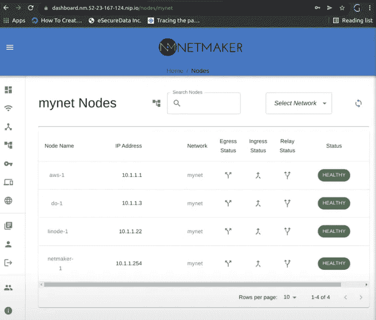**

****#2:图形视图****

****

**这两种视图为您提供了相同的信息和管理选项，但是图形视图看起来更酷。无论哪种方式，您都可以单击任何节点并编辑其设置。**

**服务器将向节点发送更新，如果所有对等端也必须更新其配置(例如，如果您更改了私有 IP)，则会通知所有对等端:**

****

****需要记住的几个关键配置选项:****

*   ****IP 地址:**机器在 CIDR 网络中的私有 IP**
*   ****AllowedIPs:** 您想要分配给节点的任何附加私有地址**
*   ****端点:**可到达的公共 IP:如果设置时，必须打开“是静态的”，否则它会自动复位。**
*   ****UDP 打孔:**如果您希望它使用静态端口，请将其关闭(对于服务器来说是个好主意)。**

****您可以在这里找到所有字段的详细列表:****

**[](https://docs.netmaker.org/ui-reference.html#edit-node-node-details) [## UI 参考- Netmaker 0.10.0 文档

### 此页面包含大多数 UI 组件的注释截图，详细说明了每个字段的配置选项…

docs.netmaker.org](https://docs.netmaker.org/ui-reference.html#edit-node-node-details) 

# 入口网关和外部客户端

创建网络后，您将拥有一个扁平的对等网络，其中所有节点都可以到达所有其他节点。这被称为“网状 VPN”但是，您可能希望实现其他模式。

入口网关为您的“网状网络”创建了一个单点入口这对远程访问很有用。对于不能运行 netclient 的设备，这也是必要的。这包括 Android 和 iOS 设备。如果您想将它们添加到网络，您必须将一台机器设置为“入口网关”，创建一个外部客户端配置，并使用官方 WireGuard 应用程序在您的手机上设置该配置。

通常，入口网关应该是公共场所中的可靠服务器。因为 Netmaker 服务器也有这个要求，所以通常可以使用 Netmaker 服务器作为入口网关。

只需点击按钮即可创建。

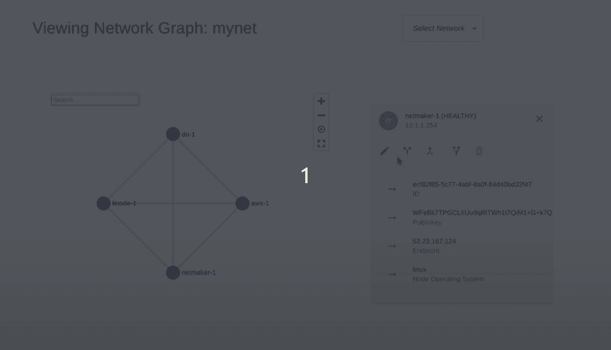

创建之后，您可以通过网关将“外部客户端”添加到您的网络中。请转到分机。客户端页面并单击以创建:

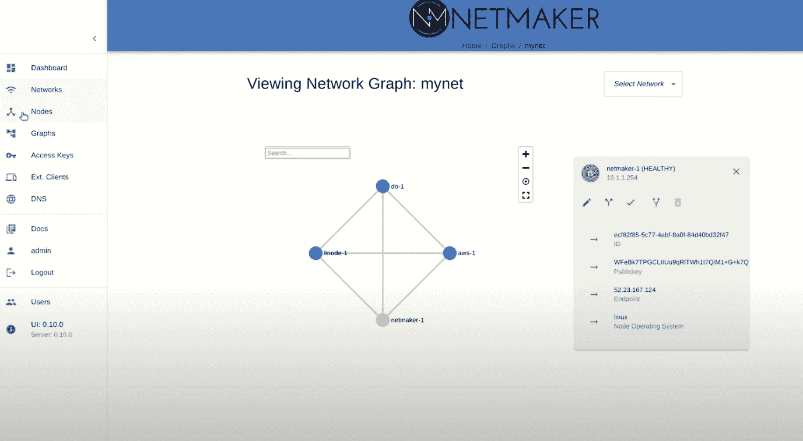

默认名称是高飞，但可编辑(您可以点击并更改名称)。

从这里，你所要做的就是把配置文件下载到你的机器上，或者扫描二维码。配置文件只是一个标准的 WireGuard 配置文件，如下所示:

```
[Interface]
Address = 10.1.1.1/32
PrivateKey = yLX3ftDsnuGxNIoZujFBLi3DBDClRc2I=[Peer]
PublicKey = WFeTWh1t7QiM1+G+k7QnrZqMVAo=
AllowedIPs = 10.1.1.0/24
Endpoint = 52.23.167.144:51821
PersistentKeepalive = 20
```

客户端将只有一个对等体(网关)。

**需要注意的是，外部客户端上没有运行代理(netclient ),这意味着它们不能自动更新。**

如果网关配置发生变化(端点、端口或公钥)，客户端将需要新的配置文件来访问网关。这就是为什么我们推荐一个稳定的公共服务器作为网关节点。

一旦激活，外部客户端就可以通过入口网关服务器访问整个网络，包括出口网关范围。

一般来说，如果你在通过网络客户端添加设备时遇到困难，我们建议你只需通过入口网关连接设备。

# 出口网关

出口网关与入口网关相反。它们允许网络中的节点(包括外部客户端)到达外部地址范围。这可能是…

*   家庭网络
*   办公网络
*   kubernetes 集群网络
*   一片云 VPC
*   数据中心

…实际上是任何子网。如果远程子网需要可访问，出口网关就可以做到。它可以处理任意数量的范围(至少几十个，可能几百个)，甚至可以处理单个地址。如果您的 AWS 帐户中有三个 ec2 实例需要远程访问，您可以访问填充子网，或者只需输入带有/32 掩码的地址。

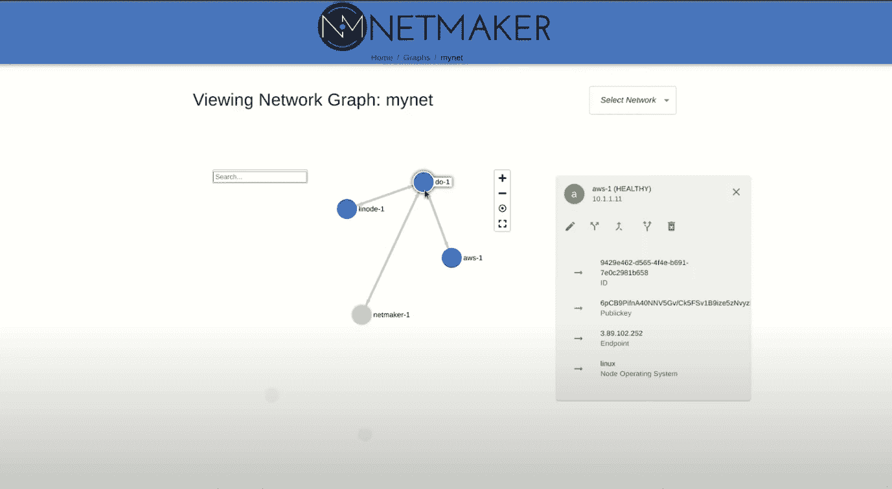

创建出口网关需要两条关键信息:范围和接口。范围是您需要访问的子网/CIDR/IP(用逗号分隔),接口是该机器上映射到这些 IP 地址的接口。

通过编辑节点和更改“出口范围”字段，可以在创建后添加/删除地址。

# 中继服务器

中继服务器使得通过直接 p2p 连接不可到达的机器可到达。发生这种情况的原因有很多，例如 CGNAT、4g LTE 路由器或双重 NAT。

在任何一种情况下，直接对等连接都是不可能的。这里，您可以简单地使用一个可靠的公共节点(比如 Netmaker 服务器)作为中继。

因为中继是公共的，所以对等体总是可以与中继建立连接。然后，该机器将向/从该机器和网络中的其他节点传递流量。


出口网关也可以存在于中继节点之后，这有助于建立到通常无法到达的网络的深度连接。

# 模式/用例

这些工具支持一些模式，我们不会深入探讨，但您应该知道:

**#1 远程访问:**使用双节点网络设置对网络的远程访问，一个作为入口，一个作为出口。然后创建 ext 客户端配置，添加到您的电话/笔记本电脑，使远程网络可访问(也可以只使用常规的 netclient + egress 网关)。

**#2 Kubernetes:** 我们使用 Netmaker 创建分布式集群，使用 mesh VPN 作为“底层”子网。我们还使用 Netmaker 建立多集群网络(类似于 submariner)，其中每个集群上的出口网关充当 pod/服务网络的入口点。

#3 **互联网 VPN / NAT 网关:**您可以创建一个互联网 VPN / NAT 网关，作为管理来自节点的互联网流量的一种方式。在出口网关中，只需使用以下范围。用这个代替 0.0.0.0/0。网络客户端将忽略 0.0.0.0/0:

```
0.0.0.0/5,8.0.0.0/7,11.0.0.0/8,12.0.0.0/6,16.0.0.0/4,32.0.0.0/3,64.0.0.0/2,128.0.0.0/3,160.0.0.0/5,168.0.0.0/6,172.0.0.0/12,172.32.0.0/11,172.64.0.0/10,172.128.0.0/9,173.0.0.0/8,174.0.0.0/7,176.0.0.0/4,192.0.0.0/9,192.128.0.0/11,192.160.0.0/13,192.169.0.0/16,192.170.0.0/15,192.172.0.0/14,192.176.0.0/12,192.192.0.0/10,193.0.0.0/8,194.0.0.0/7,196.0.0.0/6,200.0.0.0/5,208.0.0.0/4
```

# 结论

我们讨论了安装、初始设置、网络创建、节点创建以及通过出口、入口和中继的网络管理。

我们可以更深入地讨论这些话题，但是最好留给下一个教程。如果您想继续学习，请查看以下资源:

*   [官方文件](http://docs.netmaker.org)
*   [Gravitl YouTube 频道](https://www.youtube.com/channel/UCach3lJY_xBV7rGrbUSvkZQ)
*   我的[中型账户](https://afeiszli.medium.com/)

我希望你喜欢！最后一点，你可以随时[加入我们的 discord 服务器](https://discord.gg/zRb9Vfhk8A)并在那里提问。

**免责声明:** [WireGuard](https://wireguard.com/) 是 Jason A. Donenfeld 的注册商标。**