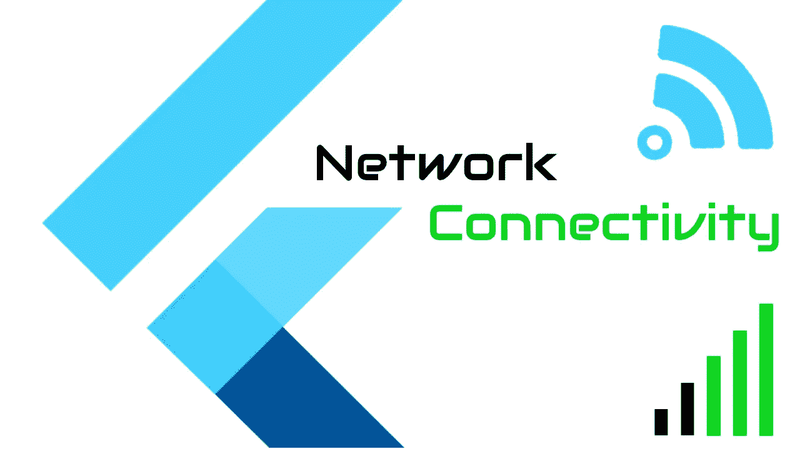

# 颤振中的网络连通性

> 原文：<https://itnext.io/network-connectivity-in-flutter-15e16c2598f?source=collection_archive---------0----------------------->

一篇关于如何在 Flutter 中检查网络连接的快速文章。我们将看到在 Flutter 中检查网络连通性的三种方法。



颤振中的网络连通性

# 视频教程

颤振中的网络连通性

# 添加依赖关系

我们将使用下面的依赖关系来实现这一点。

```
connectivity 2.0.2
provider 4.3.2+3
```

[https://pub.dev/packages/connectivity](https://pub.dev/packages/connectivity)

# 方法 1

我将从代码本身开始

```
String _networkStatus1 = '';

Connectivity connectivity = Connectivity();

void checkConnectivity1() async {
    var connectivityResult = await connectivity.checkConnectivity();
    var conn = getConnectionValue(connectivityResult);
    setState(() {
      _networkStatus1 = 'Check Connection:: ' + conn;
    });
}

// Method to convert the connectivity to a string value
String getConnectionValue(var connectivityResult) {
  String status = '';
  switch (connectivityResult) {
    case ConnectivityResult.mobile:
      status = 'Mobile';
      break;
    case ConnectivityResult.wifi:
      status = 'Wi-Fi';
      break;
    case ConnectivityResult.none:
      status = 'None';
      break;
    default:
      status = 'None';
      break;
  }
  return status;
}
```

这真的很简单。

我们创建一个连接对象，并对其调用 checkConnectivity，并根据返回值确定它是否连接到 WiFi、移动设备或未连接。

# 方法 2

使用订阅，我们可以订阅网络变更事件。

```
String _networkStatus2 = '';

Connectivity connectivity = Connectivity();
StreamSubscription<ConnectivityResult> subscription;

[@override](http://twitter.com/override)
void initState() {
  super.initState();
  checkConnectivity2();
}

// Method2 - Using Subscription
void checkConnectivity2() async {
  // Subscribe to the connectivity change
  subscription =
      connectivity.onConnectivityChanged.listen(
    (ConnectivityResult result) {
    var conn = getConnectionValue(result);
    setState(() {
      _networkStatus2 = '<Subscription> :: ' + conn;
    });
  });
}
```

这是另一个使用订阅的简单解决方案。

我们创建一个 S *流订阅*来监听它，然后我们在方法 1 上使用相同的 getConnectionValue 来确定连接性。

“ *onConnectivityChanged* ”就是我们正在收听的流。

# 方法 3

如果你想通过应用程序
收听网络变化，当网络变化时，小工具会自动更新..
为此，我们在应用程序的根级别使用 stream provider
在整个应用程序中传播更改。为此，我们将使用提供商。让我们创建一个新的类来管理它。
从您想要监听更改的位置转到根小部件
让我们打开添加了该类的 *main.dart* 文件。
每当连接改变时，小组件将会更新…

创建新的类连接服务。创建一个构造函数，将连接更改的值添加到流提供者，这将导致主小部件更新。

```
import 'dart:async';
import 'package:connectivity/connectivity.dart';

class ConnectivityService {
  //
  StreamController<ConnectivityResult> connectionStatusController =
      StreamController<ConnectivityResult>();
  // Stream is like a pipe, you add the changes to the pipe, it will 
  // come out on the other side.
  // Create the Constructor

  ConnectivityService() {
    // Subscribe to the connectivity changed stream
    Connectivity().onConnectivityChanged.listen(
      (ConnectivityResult result) {
       connectionStatusController.add(result);
    });
  }
}void checkConnectivity3() async {
    var connectivityResult = Provider.of<ConnectivityResult>.    (context);
    var conn = getConnectionValue(connectivityResult);
    setState(() {
        _networkStatus3 = '<Provider> :: ' + conn;
    });
}
```

*main.dart* 会是这样的

```
import 'package:connectivity/connectivity.dart';
import 'package:flutter/material.dart';
import 'widgets/Connectivity/ConnectivityDemo.dart';
import 'widgets/Connectivity/ConnectivityService.dart';
import 'package:provider/provider.dart';

void main() {
  runApp(
    new HomeApp(),
  );
}

// Wrap main widget inside the StreamProvider
class HomeApp extends StatelessWidget {
  [@override](http://twitter.com/override)
  Widget build(BuildContext context) {
    return StreamProvider<ConnectivityResult>(
      builder: (context) =>  ConnectivityService().connectionStatusController,
      child: MaterialApp(
        debugShowCheckedModeBanner: false,
        title: 'Flutter Tutorials',
        home: new ConnectivityDemo(),
      ),
    );
  }
}
```

# 完全码

```
import 'dart:async';
import 'package:connectivity/connectivity.dart';

class ConnectivityService {
  //
  StreamController<ConnectivityResult> connectionStatusController =
      StreamController<ConnectivityResult>();
  // Stream is like a pipe, you add the changes to the pipe, it will come
  // out on the other side.
  // Create the Constructor

  ConnectivityService() {
    // Subscribe to the connectivity changed stream

    Connectivity().onConnectivityChanged.listen((ConnectivityResult result) {
      connectionStatusController.add(result);
    });
  }
}

import 'package:flutter/material.dart';
import 'package:flutter/widgets.dart';
import 'dart:async';
import 'package:connectivity/connectivity.dart';
import 'package:provider/provider.dart';

class ConnectivityDemo extends StatefulWidget {
  ConnectivityDemo() : super();

  final String title = "Connectivity Demo";

  [@override](http://twitter.com/override)
  ConnectivityDemoState createState() => ConnectivityDemoState();
}

class ConnectivityDemoState extends State<ConnectivityDemo> {
  // In this video we will see 3 different ways to check network connectivity in Flutter.
  // So Let's Start...
  // First add the plugin..go to pubspec.yaml file and add.
  // The Plugin link is available in the description.

  // To keep it simple lets create 3 different varaibles to identify each
  // import the needed pacakges

  String _networkStatus1 = '';
  String _networkStatus2 = '';
  String _networkStatus3 = '';

  Connectivity connectivity = Connectivity();
  StreamSubscription<ConnectivityResult> subscription;

  [@override](http://twitter.com/override)
  void initState() {
    super.initState();
    checkConnectivity2();
  }

  // Method1
  void checkConnectivity1() async {
    var connectivityResult = await connectivity.checkConnectivity();
    var conn = getConnectionValue(connectivityResult);
    setState(() {
      _networkStatus1 = 'Check Connection:: ' + conn;
    });
  }

  // Method2 - Using Subscription
  void checkConnectivity2() async {
    // Subscribe to the connectivity change
    subscription =
        connectivity.onConnectivityChanged.listen((ConnectivityResult result) {
      var conn = getConnectionValue(result);
      setState(() {
        _networkStatus2 = '<Subscription> :: ' + conn;
      });
    });
  }

  // Method3 - Using Providers

  void checkConnectivity3() async {
    var connectivityResult = Provider.of<ConnectivityResult>(context);
    var conn = getConnectionValue(connectivityResult);
    setState(() {
      _networkStatus3 = '<Provider> :: ' + conn;
    });
  }

  // Method to convert the connectivity to a string value
  String getConnectionValue(var connectivityResult) {
    String status = '';
    switch (connectivityResult) {
      case ConnectivityResult.mobile:
        status = 'Mobile';
        break;
      case ConnectivityResult.wifi:
        status = 'Wi-Fi';
        break;
      case ConnectivityResult.none:
        status = 'None';
        break;
      default:
        status = 'None';
        break;
    }
    return status;
  }

  [@override](http://twitter.com/override)
  Widget build(BuildContext context) {
    // Update widget whenever connection changes
    checkConnectivity3();
    return Scaffold(
      appBar: AppBar(
        title: Text(widget.title),
      ),
      body: Container(
        padding: EdgeInsets.all(10.0),
        child: Column(
          crossAxisAlignment: CrossAxisAlignment.stretch,
          children: <Widget>[
            Text(_networkStatus1),
            SizedBox(height: 20.0),
            OutlineButton(
              child: Text('Check Connection'),
              onPressed: () {
                checkConnectivity1();
              },
            ),
            SizedBox(height: 20.0),
            // This string will be updated automatically when the 
            // connection changes
            Text(_networkStatus2),
            SizedBox(height: 20.0),
            Text(_networkStatus3),
            SizedBox(height: 20.0),
          ],
        ),
      ),
    );
  }
}
```

*就这样。*

*感谢阅读。请在这篇文章下面留下你的宝贵意见。*