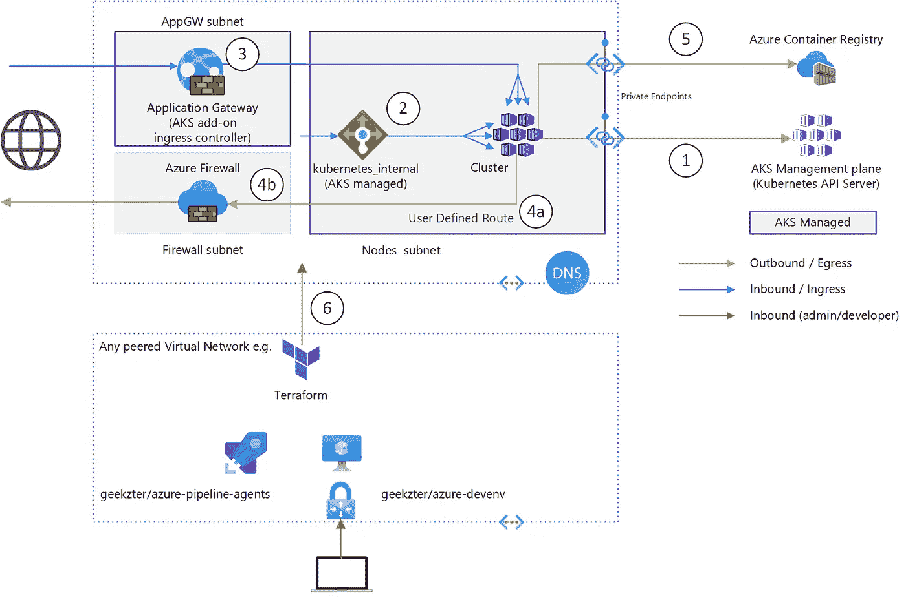
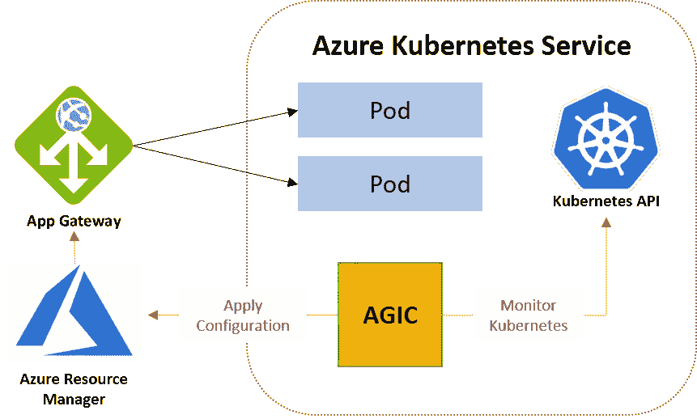

# 网络隔离 AKS 第 1 部分:控制网络流量

> 原文：<https://itnext.io/network-isolated-aks-part-1-controlling-network-traffic-2cd0e045352d?source=collection_archive---------2----------------------->

**孤立 AK 而不把自己困在**

这是关于 AKS 网络隔离的两篇博文的第一部分。首先，我将从网络的角度阐述如何保护 AK。在[第 2 部分](https://geekzter.medium.com/network-isolated-aks-part-2-how-do-i-get-in-1c01d0c1b115)中，我将描述如何为您自己的管理(例如 CI/CD)访问您的集群。你会看到我使用 Terraform，PowerShell，Azure CLI，Azure Pipelines，Kusto & Cloud init。第 1 部分的完整解决方案在 GitHub 上: [geekzter/azure-aks:网络隔离 AKS(github.com)](https://github.com/geekzter/azure-aks)。

当您在 Azure 门户中或使用 Azure CLI 等工具创建 Azure Kubernetes 服务(AKS)时，默认配置将在流量(应用程序和管理)穿越公共 IP 地址的意义上是开放的。这在企业中是一个挑战，尤其是在受监管的行业中。需要努力控制所有的网络路径，在 AK 的情况下，有相当多的移动部分需要考虑。

# AKS 网络模式

AKS 支持两种网络“模式”。这些模式控制集群中代理节点的 IP 地址分配。简而言之:

*   kubenet 在不同的地址空间创建 IP 地址，并使用 NAT(网络地址转换)来暴露代理。这就是 Kubernetes 术语“外部 IP”的来源，它是网络其余部分都知道的私有 IP 地址。
*   [Azure CNI](https://docs.microsoft.com/en-us/azure/aks/configure-azure-cni) 为代理使用与虚拟网络其余部分相同的地址空间。参见[比较](https://docs.microsoft.com/en-us/azure/aks/concepts-network#compare-network-models)

我不会详细讨论这些模式，因为网络模式在很大程度上与您需要实现的隔离控制无关。对于网络隔离来说，选择哪一个并不会有很大的不同。我用蓝色 CNI 测试过。

# 交通路径

要限制进出 AKS 群集的所有流量，需要以下可用措施:

AKS 网络流量路径

我将仔细阅读下面的每一行，但是会进行一些关键的配置。集中在[azure RM _ kubernetes _ cluster](https://registry.terraform.io/providers/hashicorp/azurerm/latest/docs/resources/kubernetes_cluster)terra form 资源上，因此我在这里突出显示它们:

Terraform AKS 资源(仅相关属性)

# 1.私有集群

Kubernetes API 服务器是 Kubernetes 管理操作的入口点，默认情况下，它作为多租户 PaaS 服务托管。API 服务器可以使用私有链接被投影到包含集群节点的虚拟网络中。这被称为[私有 AKS 集群](https://docs.microsoft.com/en-us/azure/aks/private-clusters)。这确保了从集群到 API 服务器的流量使用私有端点。

这就是它所做的一切，这只包括 API 服务器管理流量。控制 AKS 网络流量需要更多，例如您的应用程序正在被访问或正在访问外部世界。

# 2.通过内部负载平衡器进入

默认情况下，AKS 会提供一个 Azure 外部负载平衡器，即一个公共 IP 地址。
负载平衡器充当 Kubernetes 入口控制器。这对于只想入门的开发人员来说很容易，但这是 Enterprise 中的反模式。通常，路径中有一个过滤流量的安全设备，例如 Web 应用防火墙、Azure 防火墙或网络虚拟设备(Barracuda、Fortinet、Palo Alto 等)。企业架构师将尝试应用一个通用模式，而不管应用程序的堆栈是什么，例如 Kubernetes 或其他什么。

可以创建一个 Azure [内部负载平衡器](https://docs.microsoft.com/en-us/azure/aks/internal-lb)，而不是一个外部负载平衡器(带有公共 IP 地址)。这是通过 Kubernetes API 实现的。您可以将其创建为 Kubernetes 清单的一部分:

内部负载平衡器清单

或者您可以使用 Terraform[Kubernetes provider](https://registry.terraform.io/providers/hashicorp/kubernetes/latest/docs)创建一个内部负载平衡器:

内部负载平衡器地形资源

因此，这可以与基础架构代码以及应用程序打包在一起。由你来决定什么最适合你。

内部负载平衡器并不是真正的安全设备，但它使您能够将 AKS 集群节点“隐藏”在另一个安全设备(例如 Azure 防火墙或网络虚拟设备)后面。

# 3.通过应用网关进入

您最有可能将 Kubernetes 用于 web 应用程序。在这种情况下，Azure 中有一个名为应用网关的本地第 7 层保护服务，可用于管理入口流量。有多种方法可以设置这个(例如[舵图](https://azure.github.io/application-gateway-kubernetes-ingress/)，到目前为止最简单的是使用 [AKS 附加](https://docs.microsoft.com/en-us/azure/application-gateway/tutorial-ingress-controller-add-on-existing)。这使得 AKS 可以管理应用网关的生命周期并维护其配置。该插件在上面分享的[azure RM _ kubernetes _ cluster](https://registry.terraform.io/providers/hashicorp/azurerm/latest/docs/resources/kubernetes_cluster#ingress_application_gateway)片段中进行配置。

注意，应用网关入口控制器不在容器中运行(如 NGINX 或 Traefik)。它是单独部署的独特服务，在自己的子网中运行。容器用于同步 Kubernetes 和应用程序网关之间的配置，尽管:

[简介—应用网关入口控制器(azure.github.io)](https://azure.github.io/application-gateway-kubernetes-ingress/)

# 4.通过 Azure 防火墙出口

使用[用户定义的路由](https://docs.microsoft.com/en-us/azure/aks/egress-outboundtype)和 [Azure 防火墙](https://docs.microsoft.com/en-us/azure/aks/limit-egress-traffic#restrict-egress-traffic-using-azure-firewall)来管理出口，而不是直接进入互联网。

上述“交通路径”下的片段涵盖了 AKS 资源配置，以下是用户定义的路线:

用户定义的路线

请注意，实际路线由 Terraform 外部的 AKS 更新(特别是在 kubenet 网络模式下)，需要告知 Terraform 不要接触使用“生命周期”参数的路线。

Azure 防火墙需要定义相当多的出站规则，如这里描述的。这些规则的实现太长了，无法一一列举，可以在这里找到(通用规则)和这里的(依赖于 API 服务器 IP 地址的规则)。这些包括没有正式记录的规则。随着 Kubernetes 和 AKS 的不断更新，您可能会遇到比记录所需流量更多的问题，从而导致流量被阻塞。使用下面的 Kusto 查询(假设设置了日志分析，请始终这样做)来识别被阻止的 HTTP 出口:

Azure 防火墙拒绝出站 HTTP 流量

# 5.访问 Azure PaaS 服务

您的应用程序可能会连接到 Azure PaaS 服务，最有可能的候选服务是 Azure Container Registry。为了确保流量保持在您的私有网络中，存在一个名为[私有端点](https://docs.microsoft.com/en-us/azure/private-link/private-endpoint-overview)的特性。

如今，创建私有端点是相当标准的做法，下面是 terraform 片段:

Azure 容器注册表私有端点

# 6.CI/CD

我将在即将发布的关于 AKS 网络隔离的[第 2 部分](https://geekzter.medium.com/network-isolated-aks-part-2-how-do-i-get-in-1c01d0c1b115)文章中对此进行介绍。

# 完整的源代码和演示

你可以在 GitHub 上的 [geekzter/azure-aks](https://github.com/geekzter/azure-aks) 找到使用上述控件部署 AKS 的完整项目。这包括一个 [YAML Azure 管道](https://github.com/geekzter/azure-aks/blob/main/pipelines/azure-aks-ci.yml)(查看[第 2 部分](https://geekzter.medium.com/network-isolated-aks-part-2-how-do-i-get-in-1c01d0c1b115)网络指南)和手册说明。

# 其他资源

在[docs.microsoft.com](https://docs.microsoft.com/en-us/azure/architecture/reference-architectures/)发布了一个名为[Azure Kubernetes 服务(AKS)](https://docs.microsoft.com/en-us/azure/architecture/reference-architectures/containers/aks/secure-baseline-aks) 基线架构的参考架构。

如果您正在使用企业级登录区(云采用框架)，并且想要插入其中，您可以使用 [AKS 构造集](https://github.com/Azure/caf-terraform-landingzones-starter/tree/starter/enterprise_scale/construction_sets/aks/online/aks_secure_baseline)来创建一个 AKS 登录区。