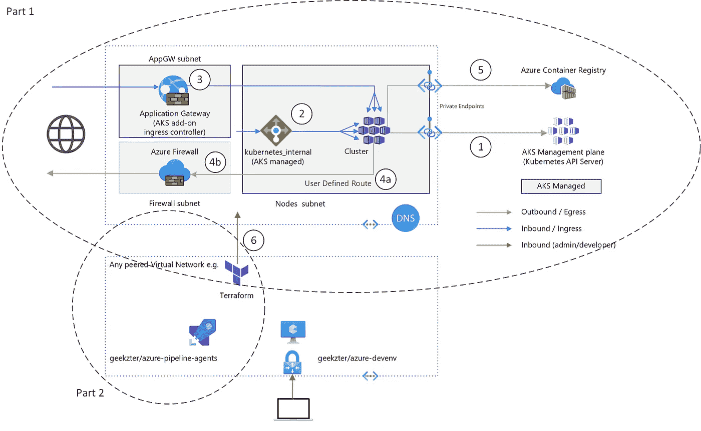
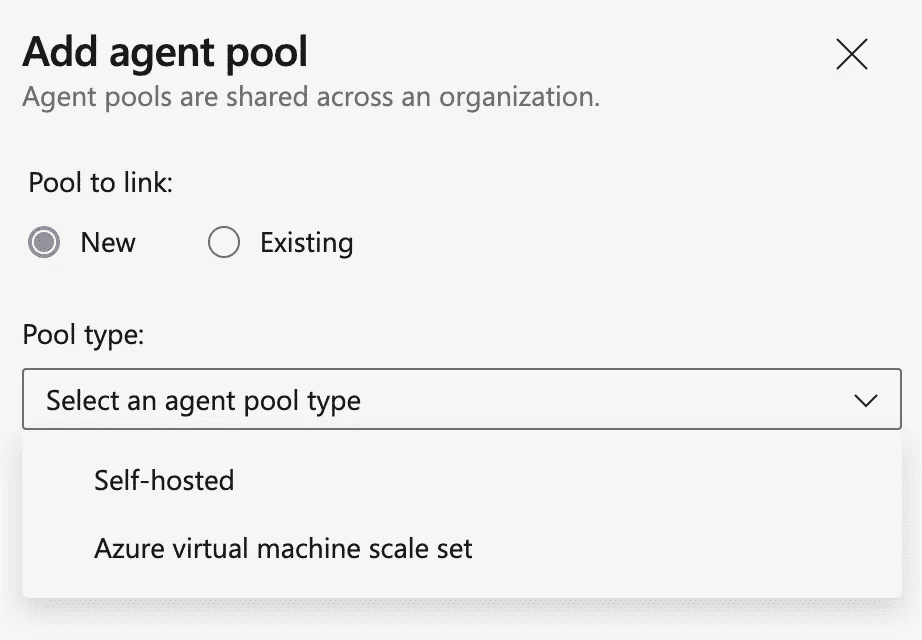
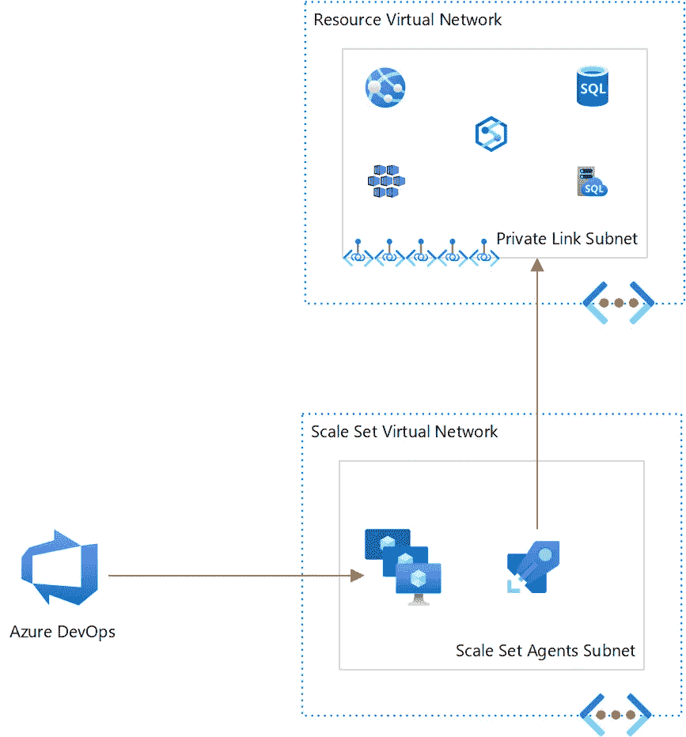

# 网络隔离 AK—第 2 部分:我如何进入？

> 原文：<https://itnext.io/network-isolated-aks-part-2-how-do-i-get-in-1c01d0c1b115?source=collection_archive---------3----------------------->

**隔离 AK(和 PaaS ),而不将自己束缚在**中

在[第 1 部分](https://geekzter.medium.com/network-isolated-aks-part-1-controlling-network-traffic-2cd0e045352d)中，我解释了如何创建一个网络隔离的 AK。这将尽可能多的流量限制在专用网络上，并将公共流量限制在必要的范围内(例如，您的应用程序监听端口 443)。那么，将应用程序部署到 AKS 也是必不可少的，那么如何满足这一点呢？



在第 2 部分中，在描述我选择的方案(Azure Pipeline Scale Set Agents)之前，我将首先介绍我考虑过的几个方案。注意，虽然我主要关注 AKS，但是这种方法适用于任何 VNet 封装的服务。

# 部署组和环境

对于在 Azure 虚拟机上配置和部署应用程序，Azure Pipelines 有一个称为[部署组](https://docs.microsoft.com/en-us/azure/devops/pipelines/release/deployment-groups/)(传统管道)和[环境](https://docs.microsoft.com/en-us/azure/devops/pipelines/process/environments-virtual-machines) (YAML 管道)的特性。这利用了安装在虚拟机上的代理，因此您可以直接从管道定位这些虚拟机。这些代理向 Azure Pipelines 注册以变得可用，并开始轮询作业。这种部署模式的副作用是 Azure 管道可以到达虚拟机所在的虚拟网络(事实上，这在 Azure 外部也可以工作，例如内部)。

由于 Kubernetes 也有一个[环境风格，您可能希望这也能解决网络连接性问题(我一开始就是这样做的)。然而情况并非如此，因为 Kubernetes 环境不使用代理。相反，这是一种定位已经在 Azure Pipeline 服务连接中注册的 Kubernetes 集群的便捷方式。因此，虽然这是将 Kubernetes 清单部署集成到 Azure 管道中的一个好方法，但它在连接性方面没有任何作用。Azure 管道将无法连接到您的孤立 AK。因此，我们需要看得更远。](https://docs.microsoft.com/en-us/azure/devops/pipelines/process/environments-kubernetes)

# 带焊剂的 GitOps

一种流行的 CI/CD 方法称为 GitOps，它通过源代码控制强制所有的更改，不允许直接的“kubectl apply”。相反，更改被推送到 Git，代理轮询更改并在更改存在时提取它们。然后，代理将这些更改应用到基础设施——在本例中是 Kubernetes。当我说“代理”时，它不是传统意义上的代理，而是与 Kubernetes 本地集成的工具。最流行的方法是使用[通量](https://fluxcd.io/docs/)。

这是一个拉模式，类似于 Azure Pipelines 中的部署组和环境，并且在运行时只需要出站访问。然而，您需要在 Flux 运行之前设置它本身。因此，你仍然面临着一个引导问题，即如何首先进入一个锁定的 AKS 集群。

# 定垢剂

要访问受限于虚拟网络的 AKS 或任何 PaaS 服务(您希望为其设置 CI/CD ),您需要确保 CI/CD 作业在同一个虚拟网络中的代理上运行，或者在可以访问的(对等)虚拟网络中运行。在 Azure DevOps 中，这可以通过[自托管代理](https://docs.microsoft.com/en-us/azure/devops/pipelines/agents/v2-linux?view=azure-devops)来完成。虽然这很有效，但我发现您需要积极地管理这些代理的生命周期，以便为 CI/CD 提供稳定、可靠(因此是可重复的)的基础架构。 [GitHub runners](https://docs.github.com/en/actions/hosting-your-own-runners/about-self-hosted-runners) 遵循同样的管理个体代理的模式。

相反，我使用规模设置代理，并发现他们是非常可靠的。创建秤台很简单，在[文档](https://docs.microsoft.com/en-us/azure/devops/pipelines/agents/scale-set-agents)中有描述。

## 使用 cloud-init 创建代理

为了创建 Ubuntu 代理，我使用了 Terraform 和 [cloud-init](https://cloud-init.io/) 。下面是用于定制代理的云配置文件:

云配置

云配置 YAML 包括要安装的包，包含一些防止与 dpkg 冲突的代码(这可能导致 cloud-init 失败)，并设置机器环境变量，这些变量可以在代理作业中使用，以发现代理所在的虚拟网络的上下文。

下面列出了用于创建比例集的 terraform 资源:

在 Terraform 中配置 cloudinit

## 竞争条件和并发性

我遇到的一个挑战是可预测地运行 cloud-init。虚拟机扩展的竞争条件会导致 cloud-init 失败。事物运行的顺序是不确定的。因此，需要注意确保资源调配活动以可预测的顺序运行，而不是并发运行。通常，在 Terraform 中，这将通过 depends_on 属性来完成。然而，我们正在处理一个虚拟机规模集，其中各个实例由 Azure 创建，并由 Azure DevOps 编排。在 Terraform 部署时没有提供实际的实例。

为了加强 cloud-init 的依赖性，我创建了一个 CustomScript VM 扩展，它首先等待 cloud-init 完成。这是自定义脚本:

```
/usr/bin/cloud-init status --long --wait ; systemctl status cloud-final.service --full --no-pager --wait
```

然后，我对其他 VM 扩展使用“provision_after_extensions”属性(而不是“depends_on”)，以确保它们在 cloud-init 完成后运行:

Azure 虚拟机规模集云初始化竞争条件修复

有了这些依赖关系，就可以可靠地创建比例集实例。

## 注册代理池

从秤台创建代理池是一种手动方法(此处记录了[和](https://docs.microsoft.com/en-us/azure/devops/pipelines/agents/scale-set-agents?view=azure-devops#create-the-scale-set-agent-pool))。从代理池页面(https://dev.azure.com/<组织>/_ 设置/代理池)添加池:



提供您的秤台的详细信息。实例需要一段时间来调配资源，之后它们应该会联机并可用于作业:


# 使用 scale set 代理进入 AKS

当规模设置代理完成调配后，我们已将此图的下半部分放置到位:



秤台代理连接

那么和上半部分的连接怎么样呢？这是代理上运行的管道的工作。下面是设置 Terraform 输入变量的关键部分:

Azure VM scale 为 Terraform 输入设置环境变量

底部的部分，例如修正 Terraform 输入变量的情况，在早先关于这个主题的[博客文章](https://geekzter.medium.com/using-terraform-with-azure-azure-pipelines-github-actions-86e043bd0d9e)中有所涉及。

## 配置虚拟网络

使用 scale set 代理公开 geek zter _ AGENT _ VIRTUAL _ NETWORK _ ID 环境变量，这足以将其传递到 Terraform:

```
$env:TF_VAR_peer_network_id ??= $env:GEEKZTER_AGENT_VIRTUAL_NETWORK_ID
```

## 从管道内部窥视:流血的抽象

对等主机代理所在的虚拟网络是一个非常抽象的概念。这将影响代理上运行的任何作业，而不仅仅是建立对等关系的作业。那么，我们如何降低一个代理影响另一个代理的风险呢？没有防弹解决方案，但我通过为自动调配的虚拟网络的地址空间创建随机 CIDR 来限制风险，并使用作业 ID 植入随机值:

```
$env:TF_VAR_address_space ??= "$([IPAddress]::Parse(`
    [String] (`
      167772160 + (`
        65536*(`
          Get-Random -Minimum 0 -Maximum 255 -SetSeed $(Build.BuildId)`
        )`
      )`
    )`
  ) | Select-Object -ExpandProperty IPAddressToString)/16"
```

这应该会降低后续作业生成相同值的可能性。注意，我在 192.168.0.0/24 中运行我的比例集代理，它不会与上面生成的 CIDR 冲突。

## 部署带对等功能的 AKS

有了上述内容，为 [azure-aks](https://github.com/geekzter/azure-aks) 设置了 [Terraform 变量](https://github.com/geekzter/azure-aks/blob/main/terraform/variables.tf)，并且 Terraform 将创建对等，作为 [azure-aks](https://github.com/geekzter/azure-aks) 部署的一部分:

来自 Azure 虚拟机规模设置代理的 Terraform VNet 对等

## 部署应用程序

虚拟网络对等化和 AKS 调配完成后，部署应用程序就像往常一样:

# 完整的源代码和演示

你可以在 GitHub 的 [geekzter/azure-aks](https://github.com/geekzter/azure-aks) 找到使用上述控件部署 AKS 的完整项目。这包括一个 [YAML Azure Pipeline](https://github.com/geekzter/azure-aks/blob/main/pipelines/azure-aks-ci.yml) ，以及手册说明。

# 其他资源

在[docs.microsoft.com](https://docs.microsoft.com/en-us/azure/architecture/reference-architectures/)发布了一个名为[基线架构的参考架构，用于 Azure Kubernetes 服务(AKS)](https://docs.microsoft.com/en-us/azure/architecture/reference-architectures/containers/aks/secure-baseline-aks) 。

如果您正在使用企业级登录区(云采用框架)，并且想要插入其中，您可以使用 [AKS 构造集](https://github.com/Azure/caf-terraform-landingzones-starter/tree/starter/enterprise_scale/construction_sets/aks/online/aks_secure_baseline)来创建一个 AKS 登录区。