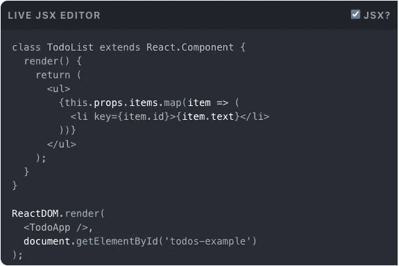
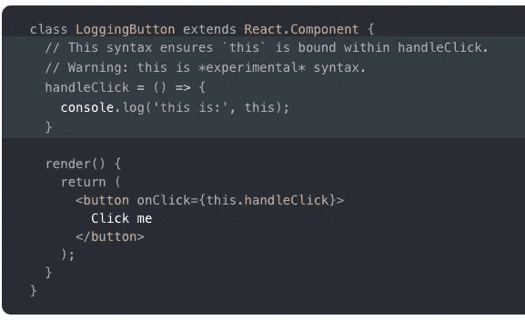
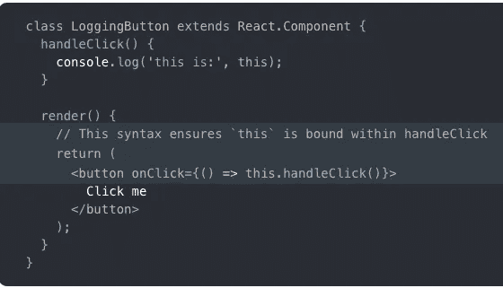
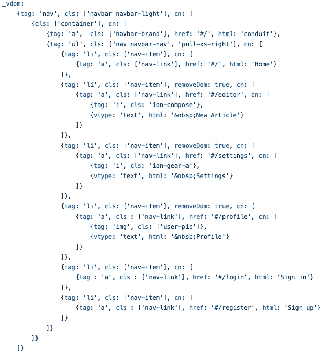

# 基于 JSON 的虚拟 DOM 的新格式化概念

> 原文：<https://itnext.io/new-formatting-concept-for-json-based-virtual-dom-ee52acc5e04a?source=collection_archive---------1----------------------->

当我在 2001 年(jQuery 之前→ 2006 年)第一次钻研 Javascript 时，有这样一个概念:

“不要将 html 和 Javascript 混合使用”

像 jQuery 或 Wordpress 这样的例子已经向我们展示了如果你把代码混合到一个极限，代码会变得多么糟糕。

React 和 JSX 的结合向我们展示了它可以以一种没问题的方式完成，所以这个概念今天不再适用。

然而，这个概念的含义是不同的:

**“不要把逻辑和你的标记混在一起”**

在我看来，这是大多数前端开发人员最近已经忘记的事情，是时候敲响警钟了。

# 内容

1.  问题 1:标记中的逻辑
2.  问题 2:范围界定
3.  使用基于 JSON 的 vdom 的优势
4.  基于 JSON 的 vdom 有什么问题？
5.  新的格式化概念
6.  更复杂的格式更改示例
7.  在行动中体验好处！

# 问题 1:标记中的逻辑

查看 React 主页:

你可能会说这不是真正的 XML，所以让我们使用术语标记。

if / else 语句不属于此处。循环也是如此。

Javascript 不擅长编辑“字符串”。在运行时动态改变模板可能很棘手，尤其是当组件变得越来越复杂时。

# 2.问题 2:范围界定

可能每个前端开发人员都遇到过“这种情况”，非常确切。你在你的标记中使用了一个类 fn，但是你的作用域并不总是清晰的。

再次查看 React 主页:

公共类字段在构造函数中得到应用。如果您滥用它们来定义函数，每个实例都将得到自己的副本。这很昂贵，而且与类应该如何工作没有什么关系:在原型级别应用方法。

肯定更好，但仍然是一个包装器，只是为了让您的范围到位。

如果你选择基于 JSON 的 vdom，这些问题就不存在了。

# 3.使用基于 JSON 的 vdom 的优势

这超出了本文的范围。
(抱歉，但我不得不这么说)

如果使用嵌套的 Javascript 对象和数组，Javascript 非常适合在运行时动态操作它们。

我写了一篇文章深入讨论这个问题(例如无限滚动):

 [## 使用基于 JSON 的虚拟 DOM 的好处

### 许多以前的同事和朋友找到我，问我:“你是如何做到如此高效和快速的……

medium.com](https://medium.com/dataseries/your-benefits-of-working-with-json-based-virtual-dom-7318a983da9e) 

# 4.基于 JSON 的 vdom 有什么问题？

最大的担忧是它可能很难阅读。

复杂组件的示例:

代码并不是很紧凑，而且看 DOM 结构也很棘手。

# 5.新的格式化概念

因为我们可以用不同的方式格式化 JSON，所以我考虑了一个概念，让它看起来更像 html，而不改变内容本身。

DOM 结构更加清晰。

【旁注】没有标签属性的对象是`div`。

您可以通过直接访问一个`ul`节点或使用一个标志来轻松地添加或删除列表项。

# 6.更复杂的格式更改示例

旧:

新:

# 7.在行动中体验好处！

neo.mjs 很有可能是第一个完全包含 JSON 的 Javascript UI 框架。没有 XML，没有模板。

 [## 近地天体

### neo.mjs 使您能够使用一个以上的 CPU 创建可扩展的高性能应用程序，而无需使用…

github.com](https://github.com/neomjs/neo) 

由于框架的主要参与者是 web 工作者，因此无法直接访问真正的 DOM。这使得虚拟 dom 通常是强制性的。

除了多线程方面，基于 JSON 的 vdom 在获得这种性能方面发挥了关键作用。解析嵌套的 objects & arrays 结构进行增量更新的速度非常快。

我希望新的 vdom 格式能让你更容易上手。

问候&快乐编码，
托拜厄斯

文章预览图像:

