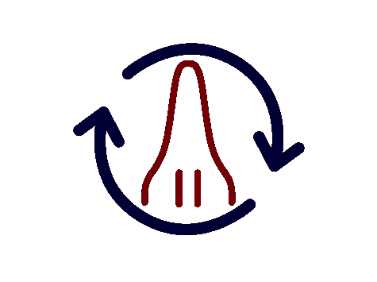

# 日程安排的新模式(火箭学)

> 原文：<https://itnext.io/new-paradigm-on-scheduling-cf2e55950a0d?source=collection_archive---------1----------------------->

有一些可用的调度框架:

*   时间单位
*   气流
*   Windows 计划程序
*   APS scheduler

然后是火箭技术。作为《火箭学》的作者，我不时会被问到为什么应该使用火箭学而不是其他的，它有什么特别之处。好吧，火箭技术有很多特点，但有一点是最突出的:独特的调度模式。

在替代框架中，任务触发器嵌入在调度器中。您指定一天中的某个时间，调度程序检查该时间是否到达，然后运行任务(如果已经到达)。有人可能认为这是显而易见的方法，但是这种方法有一个限制:如果您想每天运行一个任务，但是只在特定文件存在时运行，或者每天只在另一个任务之后运行，该怎么办？在一些框架中，有解决这些问题的方法，但是它们通常不是本地支持的，并且它们会导致非常难看的代码，难以维护。例如，Airflow 实现了一个类似 cron 的调度程序、任务管道和用于定制的传感器，但所有这些都是独立的概念，存在一些限制，人们不能任意组合这些概念。

另一方面，Rocketry 的调度程序不关心当前时间，它只检查调度语句是否正确。如果为真，则运行任务，如果为假，则不运行。检查当前时间或验证语句状态所需的任何其他内容是语句的责任。换句话说，你不需要告诉 Rocketry 的调度程序一个运行任务的时间，你只需要给它一个语句，告诉它在这个语句为真的时候运行任务。该语句可以类似于*当前时间在 11:00 和 12:00* 之间。如果当前时间在此范围内，则该语句为真，否则为假。

使用这种方法，Rocketry 的调度可以支持任意的调度需求，而不考虑复杂性。这些语句也可以用简单的逻辑(AND、OR 和 NOT)组合起来。这种方法使我们能够拥有与 Cron 或任何其他调度程序完全相同的调度选项，但我们也可以毫不费力地将它们与其他限制结合起来，如*特定文件必须存在*或*另一个任务必须首先运行*或创建任意复杂的调度逻辑。

在我们更深入地研究 Rocketry 中的调度之前，我将简要地介绍一下这个框架，以防不熟悉。

# 火箭学导论

Rocketry 是一个用 Python 编写的现代调度框架。它非常适合快速自动化问题，但也适合更大的应用程序。它可以独立运行，也可以集成到 FastAPI 等其他应用程序中。Rocketry 的重点是干净的代码、生产力和定制。

其核心功能包括:

*   条件力学
*   任务并行化/并发性(异步、线程和流程)
*   任务参数化
*   可修改的运行时会话

下面是一个简单的例子:

我们首先创建了 Rocketry 应用程序，然后创建了一个每天运行一次的简单任务，然后启动了该应用程序。在本文中，除了调度之外，我们不会深入研究框架的其他功能，但是您可以从文档中了解关于框架的更多信息。

相关链接:

*   文献:[https://rocketry.readthedocs.io/](https://rocketry.readthedocs.io/)
*   源代码:【https://github.com/Miksus/rocketry 
*   上映日期:【https://pypi.org/project/rocketry/ 

# 火箭计划

如上所述，任务如何启动的逻辑可以是任何东西。一个语句，或者框架中调用的一个条件，只是一个实例，它有 *observe* 方法，该方法根据时间、某种状态或任务本身来评估条件的状态，返回真或假。条件也可以与基本布尔逻辑相结合，创建您自己的自定义条件也很简单，但是您可以使用许多内置条件。我们经历了一些基本的调度需求，包括:

*   在特定时间运行任务
*   流水线任务(在一个任务运行后运行另一个任务)
*   组合条件(使用逻辑)
*   自定义条件

条件机制中有几个抽象层，但在本文中，我们将重点放在条件 API 上，因为它在大多数情况下都很有用。

## 基于时间的调度

火箭技术中基于时间的条件可以分为三类:

*   时间增量
*   固定时间
*   时间单位

时间增量调度意味着我们简单地指定一个时间长度，并且任务在从上一次运行以来的每一次时间量过去时运行。以下是一些例子:

然后是固定的时间条件。这在某种程度上不同于固定时间条件锚定在我们的时钟和日历上的时间增量:一天从 00:00 开始，到 24:00 结束。以下是一些简单的例子:

更具体地说，如果任务在给定时间段内没有运行，并且当前时间在该时间段内，则这些条件为真。原则上，这可能是两个独立的条件，但为了简单起见，它们被组合在一起。

这些可以使用`before`、`after`、`between`和`on`进一步限制。例如，如果一个任务被设置为在 11:00(上午 11 点)之前运行*，则意味着该任务只有在当前时间在 00:00 到 11:00 之间时才允许启动。如果一个任务被设置为在 11:00* 之后运行*，则意味着该任务被允许在 11:00 到 24:00 之间开始。火箭学中的操作`on`是给定范围的一个子单元的时间段:每周*一天*，每天*一小时*，每小时*一分钟*等等。即。星期一*的语句*翻译成从星期一 00:00 到星期二 00:00* 的*。*

以下是一些例子:

你也可以用与*分钟、*小时、*月*完全相同的方式使用这些方法。

由于条件和相关时间段机制的工作方式，Rocketry 也完全支持类似 Cron 的调度，如果您对它更熟悉的话。只需将 cron 字符串传递给 *cron* 条件:

查看更多如何创建 cron 字符串: [https://crontab.guru](https://crontab.guru/) 。

您可能想知道如何在固定的时间条件下形成相同的 cron 调度。固定时间条件可以进一步分为两类:与任务相关的条件和简单检查当前时间是否在给定时间段内的条件。以前我们使用前者，但是后者可以与*分钟时间*、*时刻*、*星期几*和*月几*完全相同地使用。

下面是一个使用 cron 条件和具有固定条件的等效条件的示例:

注意，我们在这个例子中使用了逻辑操作 AND (&)。

## 流水线任务

火箭技术中也有流水线条件。任务流水线意味着我们在一个任务完成后运行另一个任务。流水线条件是当一个任务在另一个指定的任务完成后还没有运行时为真的条件。这里有一个例子:

如果您希望在另一个任务失败后运行该任务，或者在另一个任务以任何状态完成后运行该任务，还有 *after_fail* 和 *after_finish* 。还有诸如 *after_any_success* 和 *after_all_success* 之类的条件，这样一个人就可以拥有多个先决任务，而无需多次键入 *after_success* 。

您还可以管道化输出-输入参数:一个任务的返回值可以作为另一个任务的输入参数。在本文中，我们主要关注调度，但是您可以从文档中了解更多。

## 自定义条件

既然我们知道了基本的条件，那么怎样才能做出自己的呢？嗯，这非常简单:

该任务持续运行(因为*真或假*等于真)。您可以使用逻辑运算添加更多逻辑:

我们已经讨论了 AND (&)操作符。符号“|”是 OR 运算符，符号“~”是 NOT 运算符。在上面的示例中，我们创建了一个无意义的自定义条件，但是您可以轻松地创建一个条件来检查:

*   特定文件是否存在
*   数据库表是否有数据
*   您的计算机是否可以访问互联网
*   是否可以访问给定的网站
*   等等。

# 结束语

我希望您喜欢这篇文章，并发现这个框架对您的问题有用。时间安排是框架的核心部分，但框架中还有许多其他功能，你可以从[的文档](https://rocketry.readthedocs.io/)中了解更多。

如果你喜欢这个框架，考虑把它告诉你的同事和朋友，让它成为 Github 上的明星[。该项目是免费和开源的，它是带着热情开发的。这个项目也欢迎捐款，无论金额大小。](https://github.com/Miksus/rocketry)

到目前为止，以下是一些您可能会感兴趣的其他链接:

*   使用 FastAPI 和 React 在火箭应用程序上创建 API 和 UI 的例子:[https://github.com/Miksus/rocketry-with-fastapi](https://github.com/Miksus/rocketry-with-fastapi)
*   火箭学介绍(改名为火箭学之前写的):[https://it next . io/red-engine-insannely-powerful-scheduler-7d 9d 8 e 84 b 58 b](/red-engine-insanely-powerful-scheduler-7d9d8e84b58b)
*   如何将 FastAPI 集成到 rocket ry:[https://it next . io/scheduler-with-an-API-rocket ry-FastAPI-a0f 742278 d5b](/scheduler-with-an-api-rocketry-fastapi-a0f742278d5b)