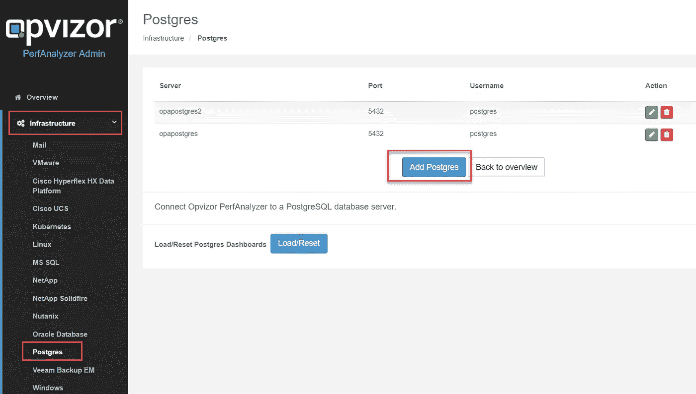
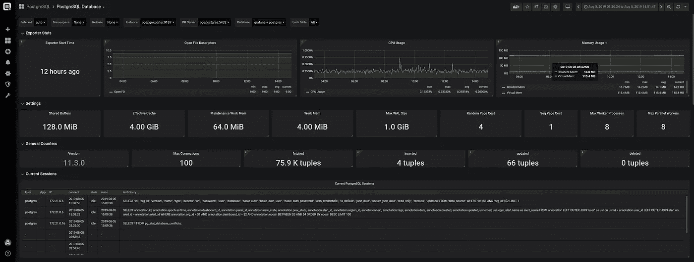
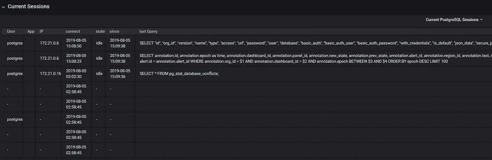
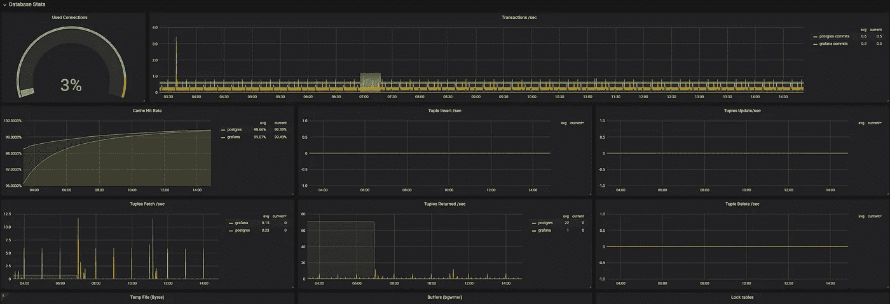

# 性能分析器中新的 PostgreSQL 数据库支持

> 原文：<https://itnext.io/new-postgresql-database-support-in-performance-analyzer-129c9f4c19da?source=collection_archive---------5----------------------->

我们非常高兴地宣布性能分析器中新的数据库集成: [PostgreSQL](https://www.postgresql.org/)

由于我们对 Microsoft SQL server 和 Oracle 的支持已经有一段时间了，我们注意到我们的客户群对添加 PostgreSQL 也很感兴趣。

运行 Performance Analyzer 6 时，您需要确保安装 6.2.5 修补程序和 PostgreSQL 许可证，以使添加数据库服务器的选项可用。

请准备好您的 PostgreSQL 服务器网络 dns 或 ip 地址，以及可以访问数据库指标的数据库用户。

将包含所有数据库的数据库服务器添加到数据(指标)收集器中，就像使用 Performance Analyzer 一样简单，只需单击 add。

接下来，您可以看到一个新的控制面板，数据流入:

标题部分允许您在数据库服务器和数据库之间进行选择。

我们不仅收集服务器设置、各种指标和计数器，还显示会话、查询及其运行时间。

**采集器信息:** **设置:**

*   共享缓冲区
*   有效缓存
*   维护工作记忆
*   工作记忆
*   最大墙壁尺寸
*   随机页面成本
*   顺序页面成本
*   最大工作进程数
*   最大并行工人数

**通用计数器:**

*   版本
*   最大连接数
*   提取的元组
*   插入的元组
*   更新元组
*   删除的元组

数据库统计信息:

*   使用的连接
*   每秒事务数
*   缓存命中率
*   元组插入/秒
*   元组提取/秒
*   每秒返回的元组数
*   元组删除/秒
*   临时文件(字节)
*   缓冲区(bgwriter)
*   锁定表格
*   冲突
*   僵局
*   空闲会话
*   活动会话
*   检查点统计

如果您也想集成您的 PostgreSQL 数据库服务器，请联系我们。这是对我们现有的 VMware vSphere 支持、Linux、Docker、Kubernetes aso 的巨大补充。

[https://www.opvizor.com](https://www.opvizor.com)

*原载于 2019 年 8 月 5 日*[*https://www.opvizor.com*](https://www.opvizor.com/new-postgresql-database-support-in-performance-analyzer)*。*