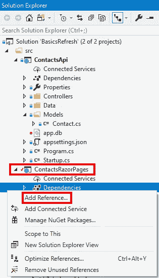
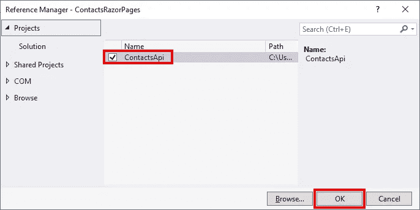
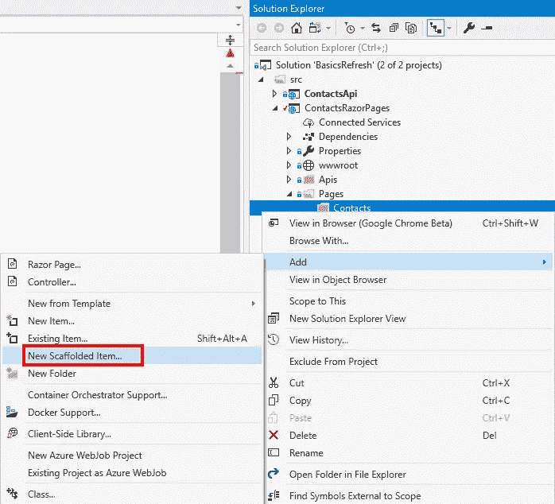
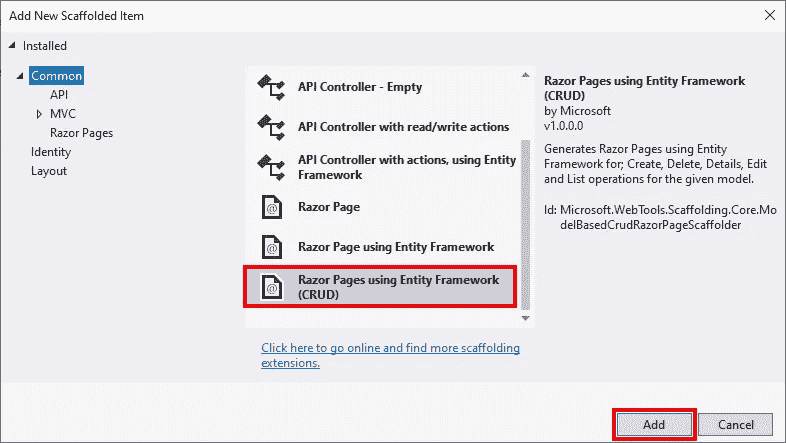
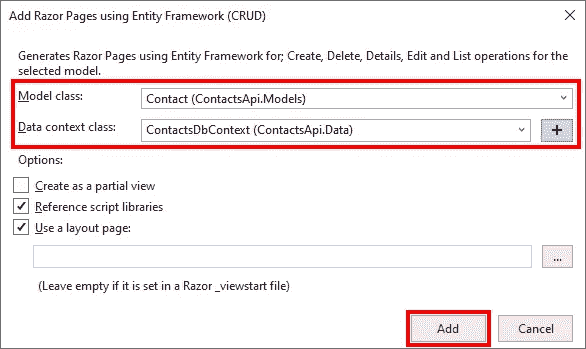
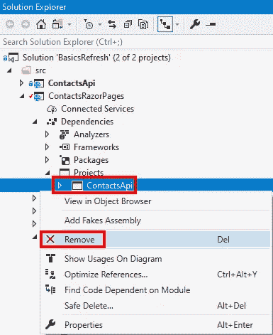

# 由 API 支持的新 Razor Pages 项目

> 原文：<https://itnext.io/new-razor-pages-project-backed-with-an-api-c4daa50b009d?source=collection_archive---------1----------------------->

本周我们将添加一个 [Razor Pages](https://docs.microsoft.com/en-us/aspnet/core/razor-pages) 项目，该项目将利用我们几周前创建的 API。这篇文章是我的 ASP.NET 核心基础回购改造的一部分，我开始时。网芯 3.0 发布。关于我们如何在应用程序中达到当前点的详细信息，请查看以下帖子。

[带有 NSwag 和 ASP.NET 核心的 Swagger/open API 3](https://elanderson.net/2019/10/swagger-openapi-with-nswag-and-asp-net-core-3/)
[ASP.NET 核心 3:向现有项目添加实体框架核心](https://elanderson.net/2019/11/asp-net-core-3-add-entity-framework-core-to-existing-project/)

这个帖子修改前的代码可以在这个 [GitHub repo](https://github.com/elanderson/ASP.NET-Core-Basics-Refresh/tree/14d130df7102c0603d532a2aef4d459292359b9d) 里找到。

## 剃刀页项目

为应用程序添加一个新目录，然后在终端中导航到该目录。然后可以使用下面的命令来创建新的 Razor Pages 应用程序。

```
dotnet new webapp
```

接下来，使用下面的命令将新项目添加到 repo 根目录下的解决方案文件中。当然，如果你不能使用相同的代码，你的文件名和路径会有所不同。

```
dotnet sln ..\..\BasicsRefresh.sln add ContactsRazorPages.csproj
```

## API 访问设置

对于 API 访问，我们使用 NSwag 来生成我们的 Razor 页面应用程序将使用的客户端。对于 API 客户端的实际创建，请参见下面的帖子，因为这篇帖子将跳过实际的客户端生成过程。

[使用 NSwag 为 ASP.NET 核心 3](https://elanderson.net/2019/11/using-nswag-to-generate-c-client-classes-for-asp-net-core-3/)
[生成 C#客户端类使用 HTTP 客户端工厂与 NSwag 生成的类在 ASP.NET 核心 3](https://elanderson.net/2019/11/use-http-client-factory-with-nswag-generated-classes-in-asp-net-core-3/)

有了客户端生成的和 Razor Pages 项目中的本地 API 目录，我们现在可以配置和注册它，以便在我们的新项目中使用。首先，打开 **apppsetting.json** 文件，为我们的 API 的 URL 添加一个设置，它是下面示例中的 **ContactsApi** 值。

```
{
  "Logging": {
    "LogLevel": {
      "Default": "Information",
      "Microsoft": "Warning",
      "Microsoft.Hosting.Lifetime": "Information"
    }
  },
  "AllowedHosts": "*",
  "ContactsApi": "https://localhost:5001"
}
```

接下来，在 **Startup** 类的 **ConfigureServices** 函数中，我们需要为我们的 API 注册一个 HTTP 客户端。

```
public void ConfigureServices(IServiceCollection services)
{
    services.AddRazorPages()
            .AddNewtonsoftJson();

    services.AddHttpClient<IContactsClient, 
                           ContactsClient>(client => 
             client.BaseAddress = new Uri(Configuration.GetSection("ContactsApi").Value));
}
```

## 添加页面

既然我们的 API 访问已经设置好了，我们需要创建允许用户与 API 交互的页面。首先，在现有的**页面**目录中添加一个**联系人**目录，这样所有处理与联系人 API 交互的页面将会在一起。

**注意**下一位可能有用也可能没用。我想为联系人页面生成 UI，而不是使用脚手架手动创建它们，但它需要实体框架才能工作，而这个新项目不使用实体框架。本节将向 API 项目添加一个临时引用，因为它确实使用了实体框架，以便生成相关的 UI。如果您想手动创建关联的 UI，可以跳过这一部分。

在 **API 项目**中，向 **ContactsDbContext** 类添加以下临时更改。

```
public ContactsDbContext() {}

protected override void OnConfiguring(DbContextOptionsBuilder options) => 
          options.UseSqlite("Data Source=app.db");
```

现在我们需要从 Razor Pages 项目中添加一个对 API 项目的临时引用。为此，右键单击 Razor Pages 项目中的**依赖关系**节点，并选择**添加引用**。



在**项目**部分，选中 API 项目的复选框，并点击**确定**。



现在有了上面的内容，我们就可以搭建我们的 UI 了。右键单击您希望生成的 UI 所在的文件夹，在我们的例子中是 **Pages/Contacts** 目录。从菜单中选择**添加>新脚手架项目**。



在显示的对话框中，我们希望使用实体框架(CRUD) 选择 **Razor 页面，然后单击**添加**。**



在下一个屏幕上，我们将从为其生成 UI 的实体的 API 项目中选择**模型类**和**数据上下文类**，然后单击**添加**。



几秒钟后，我们需要查看、创建、编辑和删除联系人的所有页面都将存在。现在我们已经生成了页面，我们需要删除对 API 项目的引用。为此，展开**依赖项>项目**节点，右键单击 API 项目并选择**移除**。



此外，恢复我们对上面的 DbContext 所做的更改。

既然对 API 项目的引用已经消失，那么 Razor Pages 应用程序就不会构建了。这是意料之中的，因为它使用了 API 项目中的一些类。我们将遍历修复 **Contacts** 目录中的 **Index** 页面中的问题所需的编辑，但是所有生成的类都需要相同类型的更改。

首先，我们需要改变一些用法。移除任何与 usings 相关的实体框架。然后更改任何与 Contacts API 相关的内容，改为引用项目本地的 API 客户端。

```
Before:
using Microsoft.EntityFrameworkCore;
using ContactsApi.Data;
using ContactsApi.Models; 

After:
using Apis;
```

另一大项是用 API 客户机替换实体框架 DB 上下文的注入，并用对 API 的调用更新相关调用。以下是存在实体框架位的 **IndexModel** 。

```
public class IndexModel : PageModel
{
    private readonly ContactsApi.Data.ContactsDbContext _context;

    public IndexModel(ContactsApi.Data.ContactsDbContext context)
    {
        _context = context;
    }

    public IList<Contact> Contact { get;set; }

    public async Task OnGetAsync()
    {
        Contact = await _context.Contacts.ToListAsync();
    }
}
```

这是使用 API 客户端的最终结果。

```
public class IndexModel : PageModel
{
    private readonly IContactsClient _client;

    public IndexModel(IContactsClient client)
    {
        _client = client;
    }

    public IList<Contact> Contact { get;set; }

    public async Task OnGetAsync()
    {
        Contact = (await _client.GetContactsAsync()).ToList();
    }
}
```

如上所述，这种事情需要为其他生成的页面重复。

**结束警告**

## 添加到导航栏

现在我们已经创建了页面，我们需要为用户添加一个访问它们的方法。为此，我们将在导航栏中添加一个联系人选项。打开**Pages/Shared/_ layout . cs html**文件。找到需要进行更改的地方的最简单的方法是搜索一个现有导航链接的文本。下面是添加了新项目的链接部分。

```
<ul class="navbar-nav flex-grow-1">
    <li class="nav-item">
        <a class="nav-link text-dark" asp-area="" asp-page="/Index">Home</a>
    </li>
    <li class="nav-item">
        <a class="nav-link text-dark" asp-area="" asp-page="Contacts/Index">Contacts</a>
    </li>
    <li class="nav-item">
        <a class="nav-link text-dark" asp-area="" asp-page="/Privacy">Privacy</a>
    </li>
</ul>
```

## 包扎

使用 Nswag 生成的客户端使得将一个应用程序连接到一个 API 变得非常简单，并不是说手动操作本身很难。这篇文章的大部分内容都是关于我在客户端应用程序中生成 UI 的过程。值得吗？我不确定。我想无论哪种方式，当您有可用的实体框架数据时，知道它是一个选项是很好的。

[这里的](https://github.com/elanderson/ASP.NET-Core-Basics-Refresh/tree/30bda427fdc7db27b754c0263e4bb76f855bfeb7)是这篇帖子最后状态的代码。

*最初发表于* [*埃里克·安德森*](https://elanderson.net/2019/12/new-razor-pages-application-backed-with-an-api/) *。*