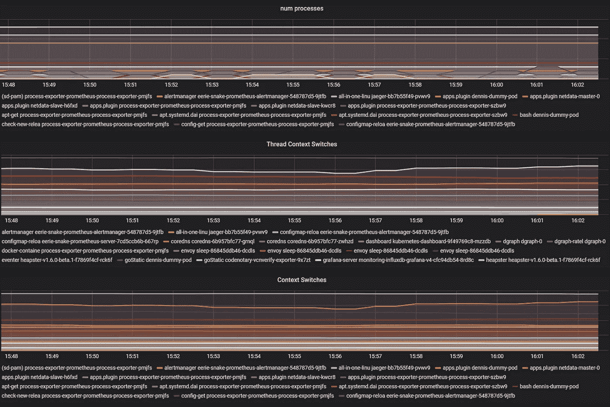
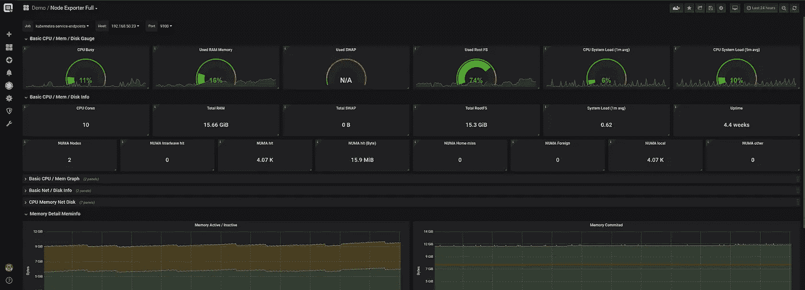
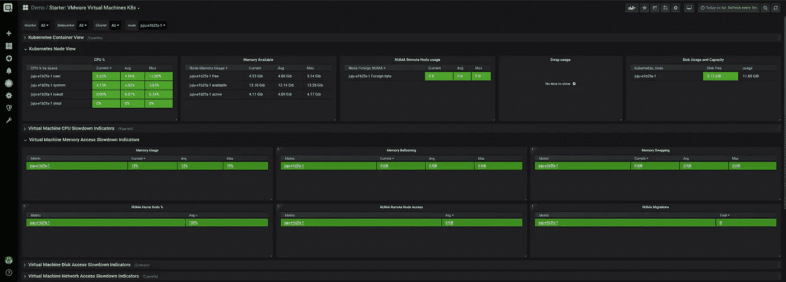
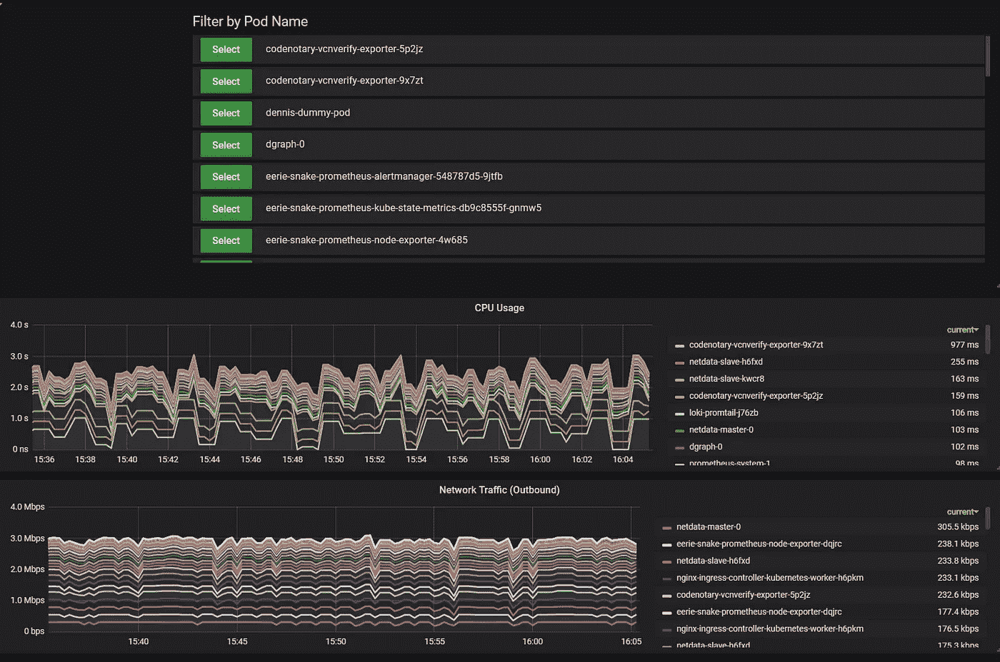

# 新版本:性能分析器 6

> 原文：<https://itnext.io/new-release-performance-analyzer-6-6c2d164f9615?source=collection_archive---------8----------------------->

经过几个月的努力工作和数百次客户访谈以获得宝贵的反馈，我们非常激动地宣布 Performance Analyzer 6 正式上市！

这个版本是巨大的，因为我们几乎改变，更新或改进了每一个组件。从视觉角度看，最明显的变化是:

我们升级到了 Grafana 6(最好的开源项目之一)作为我们的仪表板引擎。

幕后的变化数不胜数，因为我们转移到了一个全新的微服务架构，这允许比以前更多的可伸缩性和灵活性。

最大的改进之一是:作为在 ESXi 上运行 [Kubernetes](https://www.kubernetes.io) 和 container 的 [VMware](https://www.vmware.com) vSphere 用户，您将获得前所未有的透明度和可见性，这在其他任何地方都无法获得。

但是让我们一步一步地介绍 Performance Analyzer 6 的所有新功能:

**新平台**

*   新的基础操作系统(Ubuntu 18.04)
*   完整的微服务基础设施(改进的可扩展性和维护)
*   新型仪表板-发动机( [Grafana](https://www.grafana.com) 6)
*   [普罗米修斯](https://www.prometheus.io)后端支持

**新扩展**

*   [Nutanix](http://www.nutanix.com) 支持(包括 qcow2 图像)
*   Kubernetes 本地集成
*   VMware vSphere 上的 kubernetes(K8s 节点 NUMA 到虚拟机 NUMA 到 ESXi NUMA)
*   Kubernetes Pod 到容器流程图
*   [Istio](https://istio.io/) 指标
*   Docker 和 Kubernetes 容器日志分析(测试版)
*   Google Stackdriver(测试版)
*   亚马逊 AWS
*   微软 Azure(测试版)
*   弹性搜索(Filebeat)

Kubernetes Pod 到容器流程映射，用于在从 Kubernetes 节点向下钻取时获取容器的上下文切换信息:

Kubernetes 节点的 NUMA 信息

VMware / Kubernetes 入门信息

Kubernetes Pod 指标

**数据爬虫**

*   度量中的名称现在区分大小写，并且我们增加了对某些特殊字符的支持
*   增加了对 Oracle 可插拔数据库(容器)的支持
*   扩展的自动仪表板加载
*   Timeseries 数据库 API 可用性的自动运行状况检查
*   更新的 Netapp Ontap 9 最新版本支持

**修复**

*   Numa-Metrics 的某些值被悄悄删除。
*   更新的 Oracle SDK

**新仪表板**

*   对于所有新扩展
*   VMware 许可概述控制面板

让我们开始吧—只需[下载虚拟设备](https://www.opvizor.com)并将其导入到您的 VMware 或 Nutanix 环境中，15 分钟后，您将会看到仪表盘中填充了您在整个行业中可以找到的一些最深入的信息。

内置 15 天免费试用，在设备中注册时可免费试用 30 天，没有借口！

**现有客户重要信息**

因为我们想发布这个版本，但是不能在数据迁移部分花太多时间，所以这个版本只针对新的安装。

如果您是现有的 Performance Analyzer 客户，您可以在第 5 版之后部署新设备，并在某个时间点进行切换，或者耐心一点，因为我们计划在接下来的 1.5 个月内发布升级补丁。

*原载于 2019 年 5 月 9 日*[*https://www.opvizor.com*](https://www.opvizor.com/new-release-performance-analyzer-6)*。*