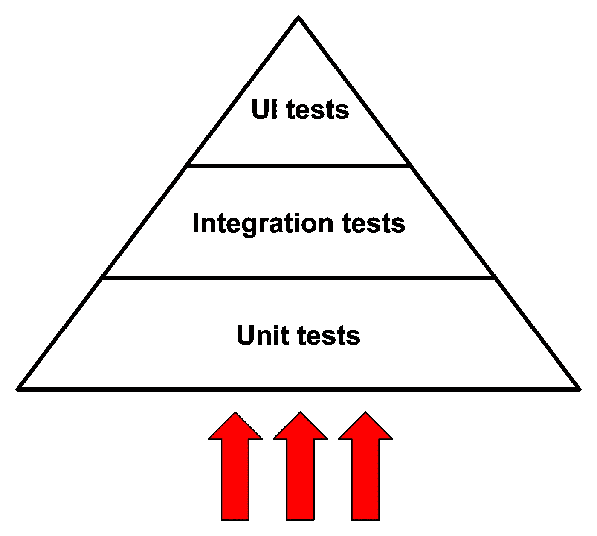
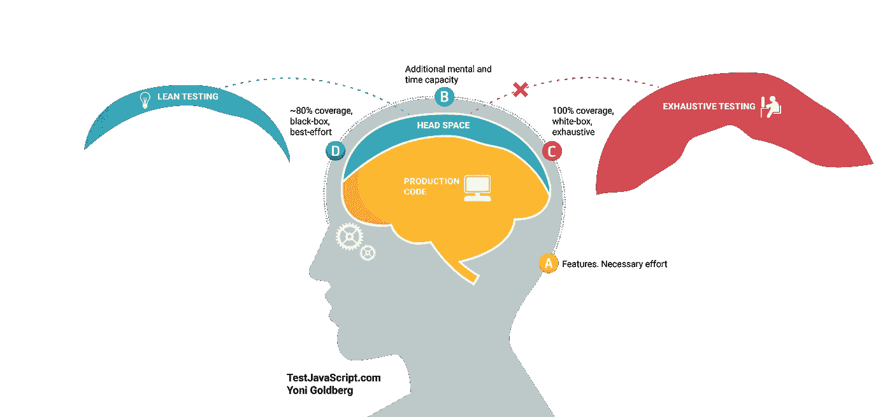
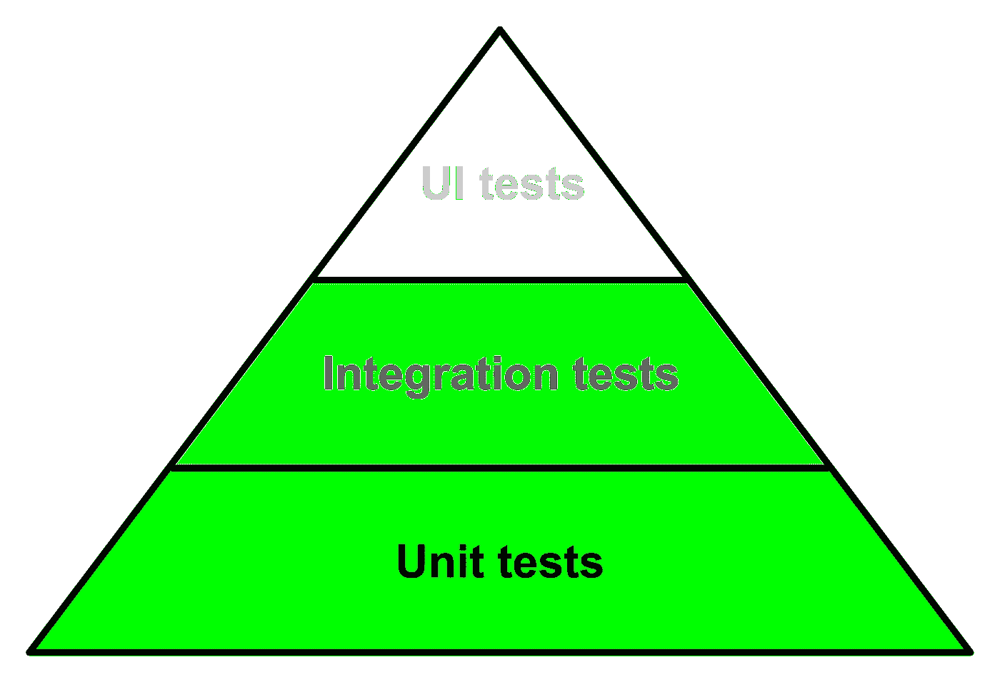

# 不熟悉前端测试？从金字塔的顶端开始！

> 原文：<https://itnext.io/new-to-front-end-testing-start-from-the-top-of-the-pyramid-a0039615353c?source=collection_archive---------0----------------------->

从前端测试世界获得即时结果(和满意度)的更简单方法。在这里或者在 [dev.to](https://dev.to/noriste/new-to-front-end-testing-start-from-the-top-of-the-pyramid-36kj) 上阅读。

[Guillaume TECHER](https://unsplash.com/@guillaume_t?utm_source=unsplash&utm_medium=referral&utm_content=creditCopyText) 在 [Unsplash](https://unsplash.com/s/photos/reverse?utm_source=unsplash&utm_medium=referral&utm_content=creditCopyText) 上拍摄的照片

我正在 GitHub 上做一个大的 [UI 测试最佳实践](https://github.com/NoriSte/ui-testing-best-practices?source=post_page---------------------------)项目，我分享这个帖子来传播它并有直接的反馈。

当你是一个有经验的测试人员时，接近一个测试套件是一条容易的道路。而是学习如何正确地测试，测试什么和避免什么，选择哪种测试等等。不是那么容易的。

开始时测试很贵。一切都是新的，你试图实现的例子不工作，你不清楚为什么测试失败，它与你的代码有什么关系，等等。

我们都知道测试金字塔，通常，我们从底部接近它

标准测试金字塔方法:自下而上。

从底部接近金字塔是有道理的。从单元测试开始更容易，因为它们很快，它们不需要复杂的上下文或工具，一个“单元”(无论你说的“单元”是什么意思):一个函数，一个组件，等等。)只包含几行代码，通常它有一些依赖项(或者根本没有)，等等。

这种方法最大的缺点是什么？本质上，它的**信心**。

测试是关于信心以及高信心但缓慢的测试和低信心但快速的测试之间的权衡。

如果你是测试领域的新手，你可能不太清楚“信心”这个术语，那么:如果测试通过了，你如何确定你正在开发的**应用程序**能够工作？这就是**测试信心**。

为什么单元测试给人如此少的信心？一些例子:

*   如果`isValidEmail`函数通过了测试，你确定你的前端应用程序的注册表单有效吗？
*   如果`Input` React 组件通过了测试，您确定注册表单也能工作吗？
*   如果整个`RegisterForm`组件通过测试，你确定用户可以注册吗？

答案是否定的。整个应用程序是由许多相互集成的单元组成的，这还不包括一些表示(CSS)问题，这些问题可能会阻止用户注册，因为有一个更高的`z-index`图像覆盖了提交按钮。

再次谈到测试新手的缺失经历(就像我两年前一样):**每件新事物都需要很大的认知负荷**，你不能同时面对太多的新事物。很难面对你的 app 平时的开发，新的测试题目，单元测试世界和 UI 测试一(后两者需要不同的工具和努力)。

看看这个来自 [JavaScript & Node.js 测试最佳实践](https://github.com/goldbergyoni/javascript-testing-best-practices)项目的详尽图片:

感谢 [Yoni Goldberg](https://goldbergyoni.com/) ，访问[testjavascript.com](https://testjavascript.com/)并为 [JavaScript & Node.js 测试最佳实践](https://github.com/goldbergyoni/javascript-testing-best-practices)库添加一颗星。

对于有经验的开发人员来说确实如此，当你第一次接触测试世界时，情况会更糟。

# 自下而上的方法结果

您不可避免地将大部分注意力放在金字塔的底部，即单元测试上。您将要编写的一堆测试允许您熟悉测试世界，但是没有信心。你会发现自己在问

*   “我写的测试有什么优势？”
*   “我花了一些时间与单元测试作斗争，但应用程序像以前一样崩溃，测试会自己结束吗？”
*   “老实说，我现在比开始测试前有更多的疑虑……”

自底向上的方法不可避免地会让你专注于单元测试。

问题不是出在你身上，而是出在对初学者来说错误的测试上！

我建议的解决方案是什么？**从头开始，先集中精力做 UI 测试**！

首先，什么是 UI 测试(也叫功能测试、E2E 测试等。)?它本质上是一个打开真正的浏览器并与 DOM 元素交互的脚本，与真正的最终用户一样。一些视频可以讲述上百个单词。

一项针对[导管的 E2E 测试——真实世界项目](http://realworld.io/)。

[Conio](https://business.conio.com/) Backoffice 的一些 UI 测试。

在上面的视频中，你可以看到一个加载整个前端应用程序并与之交互的真实浏览器。优点是:

*   您的应用程序在最终用户(浏览器)的相同环境中进行测试，这意味着**更高的可信度**。即使你只写了一个 UI 测试，它也比一百个单元测试给你更多的信心
*   测试下的路径(用户执行的步骤，如“注册”、“创建新帖子”等)。)是最终用户必须执行的，这意味着**更低的认知负荷**(对你来说)来理解你真正测试的是什么
*   老实说，自动化浏览器比自动化终端更有趣😁
*   **UI 测试最适合你日常工作的大多数项目的中小规模。从一个登陆页面到一个小 CMS:它们都至少需要一些 UI 测试，但是你可以基于测试信心和你必须尊重的交付来进行单元测试。你们中只有少数人在脸书、Spotify、网飞等公司工作。需要严格的测试策略、代码覆盖要求等的产品。更一般的是:如果你在大中型产品公司工作，你可能不需要这个职位，因为测试是你公司文化的核心🎉**

也有缺点，但我稍后会列出来。这是我建议的方法:

自上而下的方法。

# 自顶向下的方法是否强制测试不良实践？

这篇文章不是关于最佳或不好的实践(看看文章末尾的一长串资源)，这篇文章是关于在测试世界中吸引新的前端开发人员并从中获利。我的目标是提供一种更实用的方法，一种允许开发人员享受测试优势并且不会给他留下比以前更多疑虑的方法。

# 如果 UI 测试如此神奇，为什么还有其他种类的测试存在？

这才是重点！请注意，我并不反对单元测试！每种测试都很重要，不同的测试提供不同的反馈！一个从顶端接近金字塔的开发人员足够高兴去爱整个测试世界。

然后，您将会发现高级 **UI 测试**的局限性:

*   他们**很慢**:我知道上面的视频让你觉得他们超级快，但事实并非如此。当你有五个、十个、二十个用户界面测试时，它们很快，但是当你有数百个用户界面测试时，它们需要几分钟，你开始问自己如何改善这种情况
*   他们给你的大多是**高层次的反馈**:如果表单的提交按钮不起作用，是什么问题？有很多可能的原因，但是 UI 测试不允许排除其中的一些
*   他们渲染整个应用程序，如果你只是想测试更小的东西，这可能会很麻烦。你需要测试的一些极限情况在整个应用程序中是不可复制的

以上所有问题的解决方案是:**和测试金字塔一起倒**！如果你达到了较低测试的要求，做得很好！是这个帖子的目标！

考虑两种方法的结果:

*   自下而上:**您对您编写的单元测试的有用性有所怀疑**，并且您不理解这些测试如何帮助您提高测试信心
*   自上而下:你有**几个自信的测试**，你最终需要走下测试金字塔。如果你不需要把它写下来，这意味着你的项目很小，不需要更多的测试

我们(我和 [Jaga Santagostino](https://www.jagasantagostino.com/) )在[React 2019 年](https://2019.reactjsday.it/workshops/react-testing-101.html)[日大会](https://2019.reactjsday.it/)的React 测试课程中采用了自上而下的方法。

# 告诉我更多关于 UI 测试的信息

为什么测试金字塔把 UI 测试放在顶部？嗯，因为它们通常很贵(就持续时间和写作成本而言)。如果它们如此昂贵，我为什么建议从它们开始呢？

*   首先:UI 测试是一个通称，我们必须把它们拆分成 **E2E 测试和 UI 集成测试**。E2E 测试非常昂贵，因为他们需要你和团队的其他成员一起工作，他们需要一个工作的后端和数据库，他们受到后端资源和网络缓慢的困扰。
    UI 集成测试更加可行，因为所有的 AJAX 请求都被存根化(替换为静态 JSON 文件),所以您不需要工作后端，而且它们**快速、可靠、可预测**,并且它们允许您独立工作。在进行 E2E 测试之前，先从它们开始。
*   现在已经有了成熟的工具:不要考虑 Selenium 或 Puppeteer(那是通用的浏览器自动化工具)，用 [Cypress](https://www.cypress.io/) 或 [TestCafé](https://devexpress.github.io/testcafe/) (第一个对初学者来说更容易，但两个都有效)。
*   遵循一些基本的最佳实践，比如[避免考试困倦](https://medium.com/@NoriSte/await-do-not-sleep-your-e2e-tests-df67e051b409)和[避免完美主义](https://github.com/NoriSte/ui-testing-best-practices/blob/master/sections/testing-strategy/avoid-perfectionism.md)。如果这篇文章让你兴奋，也请阅读“ [Cypress 作为你的主要开发浏览器](https://medium.com/@NoriSte/front-end-productivity-boost-cypress-as-your-main-development-browser-f08721123498)”。

我希望这篇文章对你有所帮助。请不要犹豫留下您的反馈或分享您自己的经验，当您开始与令人惊讶的测试世界。

你好👋我是 Stefano Magni，我是一名充满激情的 **JavaScript 开发人员**，一名 **Cypress 大使、**和一名**讲师**。
我喜欢创造高质量的产品，测试和自动化一切，学习和分享我的知识，帮助他人，在会议上发言和面对新的挑战。
我为意大利比特币初创公司 [Conio](https://conio.com/it/?source=post_page---------------------------) 工作。
你可以在 [Twitter](https://twitter.com/NoriSte?source=post_page---------------------------) 、 [GitHub](https://github.com/NoriSte?source=post_page---------------------------) 、 [LinkedIn](https://www.linkedin.com/in/noriste/?source=post_page---------------------------) 上找到我。你可以找到我最近所有的文章/演讲等等。这里。