# 新闻广播——将 Sagas 与编排和编排模式结合使用——Java 17/kot Lin 示例

> 原文：<https://itnext.io/newscast-using-sagas-in-choreography-and-orchestration-patterns-a-java-17-and-kotlin-example-e3d0ec17b910?source=collection_archive---------0----------------------->


# 介绍

aga 是在事件源架构中使用的企业集成模式。当弹性、负载能力和性能很重要时，它们很有用。电信公司经常使用这种方法来传递数据，以保持重要的指标，如请求的持续时间、可能的同时请求数量、应用程序的响应速度以及符合**SLA**(服务级别协议)的弹性。这种模式在 1987 年由[埃克托·加西亚-莫利纳和肯尼斯·塞勒姆](https://www.cs.cornell.edu/andru/cs711/2002fa/reading/sagas.pdf)首次公之于众。这个想法是为了解决与 **LLTs** (长期事务)相关的一个问题。这些交易被认为是 A.C.I.D .交易，但是花费了大量的时间。这里的关键词是原子性、一致性、隔离性和持久性。对于消耗大量资源的事务这样做，会导致 **LLTs** 持续很长时间，甚至几天或几周。这显然带来了延迟问题和过度的资源消耗。通过拆分一个事务，将不可能遵守隔离或原子性。失去一致性的风险也很高。为了利用**llt**并将它们转换为可管理的事务并尽快释放资源，他们设计了一个系统，有两个变体，具有定义的布局计划来执行特定的操作以应对故障。在一个 **LLT** 中，这将是回滚。在 Sagas 中，如果任何一个子进程失败，这些智能进程能够回滚或使系统达到期望的状态。这些子流程仍然是事务，它们严格遵循 A.C.I.D .范例。我们将探索我在 GitHub[](https://github.com/jesperancinha/news-cast-explorer)**中创建的例子。**

# **2.情况**

**我们希望在我们的数据库中存储来自特定新闻提要的所有新闻。然后，我们希望允许用户对它们进行评论，我们希望控制我们可能遇到的所有错误流。我们还希望尽可能缩短响应时间，提供高可用性和弹性，并确保用户尽快获得他们的评论。**

# **3.项目布局**

**F 对于这个项目，我们将使用[最终框架](https://eventuate.io/)，结合[弹簧框架](https://spring.io/):**

**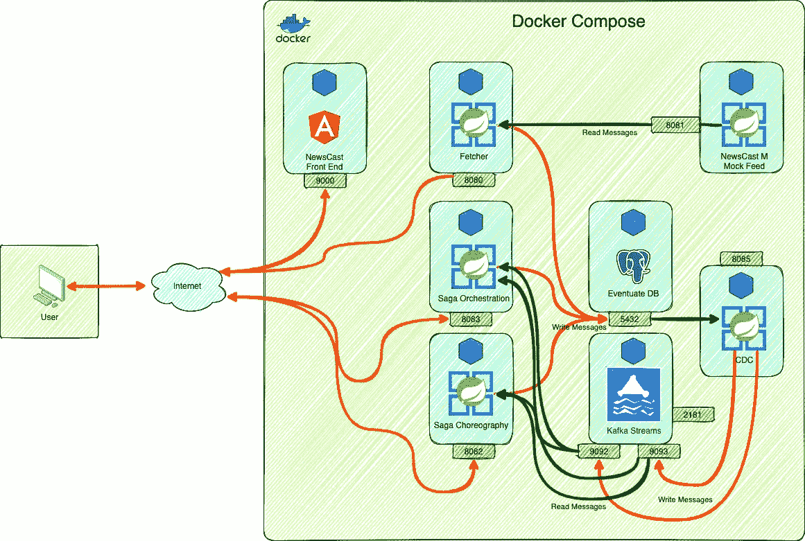**

**概述**

**在该模式中，我们可以看到两个重要的主要部分。第一个由 Fetcher 和模拟提要组成。这两者为我们的传奇架构提供了原始数据。作为默认运行，我将 Fetcher 设置为每分钟运行一次，最长 30 秒，直到它收到 100 条新闻消息。这意味着要么它将在 30 秒内完成 100 条以下的消息，要么它将在更早的时间内完成总共 100 条消息。由于这不是一个在线社交媒体平台，也不是一个真正的新闻提要，所以在这个例子中，您将总是会收到 100 条消息。本文的目的不是演示这是如何工作的，但是我认为让您了解所有这些背后有三个正在运行的线程是很重要的。一个负责检查队列中的传入消息。第二个负责向模拟新闻提要发出请求。最后，如果 30 秒已经过去，第三个将停止整个过程。**

**一旦我们获得了数据，我们就可以继续探索传奇。提取过程将无限期继续。这是图表的第二部分。**

**我们的 saga 实施将消耗像本例中这样的有效载荷:**

```
{ 
"idPage": 1, 
"pageComment": "I love this", 
"idAuthor": 2,
"authorComment": "This is my favourite author", 
"idMessage": 3, 
"messageComment": "I agree", 
"authorRequestId":123,
"pageRequestId":456,
"messageRequestId":789 
}
```

**关于这个有效载荷，重要的是要知道`***idPage***`、`***idAuthor***`、**、*、*、**和`***idMessage***`。这些 id 没有被编程为外键，因此当发送附加到页面、作者和消息的评论时，它们应该能够匹配现有的数据。否则，数据将被记录为**不可用**。有一个层次结构，那就是页面- >作者- >消息。例如，如果作者不存在，则不会记录消息注释，但会记录页面和作者注释，并且它们会被标记为不可用。这种情况当然在现实中并不存在。这只是一个虚构的案例，展示如何利用传奇故事为我们造福。**

# **4.实践中的传奇**

**让我们详细关注本文的目标。我们想看看传奇如何为我们服务。Sagas 也是一种将客户端请求从实际处理中分离出来的方法。客户端发出 POST 请求，Saga 将确保请求到达数据库。然而，如果某个东西失败了，那么 Saga 必须具有执行回滚或其他可预测操作的智能。**

**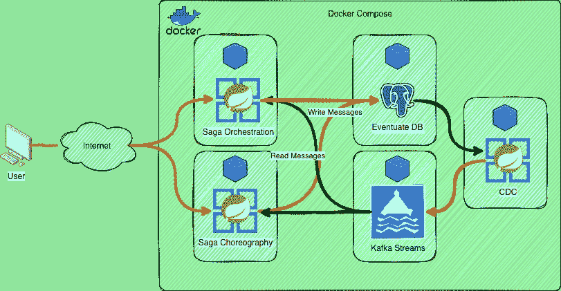**

**传奇概述**

**从外部来看，我们可以看到解耦是通过一个流引擎提供的。在我们的例子中，我们将使用卡夫卡。出于流的目的，我们可以使用任何我们想要的机制。不强制使用卡夫卡。请查看 [eventuate.io](https://eventuate.io/) 网站，了解更多关于其他兼容机制的信息。为了更好地想象幕后将要发生的事情，我们来看看这个序列图。**

**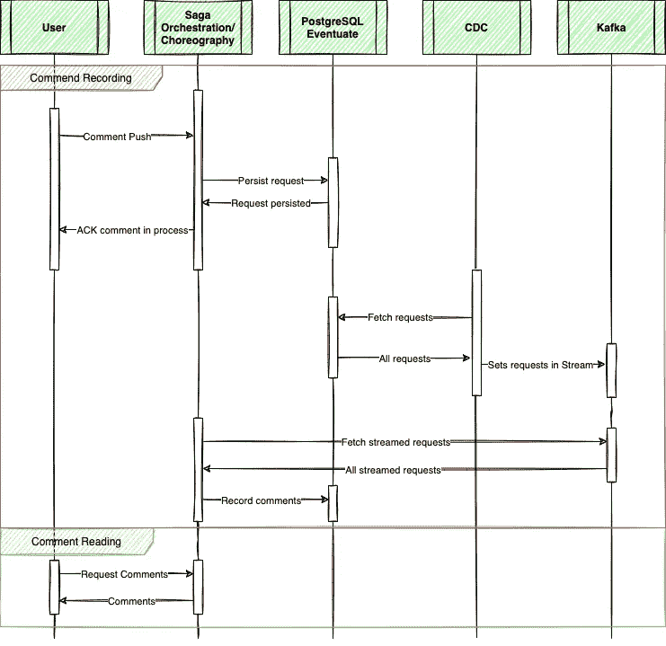**

**通用序列图**

**在这个图中，我们可以看到，当我们使用所描述的两种 Saga 类型中的任何一种发出请求时，我们的请求将被发送到数据库。它被持久化，继续的唯一方法是将其发送到流中。在我们的例子中，它流向卡夫卡的溪流。eventuate 团队创建了一个 CDC 服务来完成这项工作。然而，出于这个例子的目的，管理起来相当复杂，这就是为什么我创建了我自己的 **CDC 模仿的**版本。本质上，它从一个名为 messages 的表中选取数据，并将未发布的数据原样发送到 Kafka 流中。我们将在本文后面详细了解这是如何工作的。一旦 CDC 选择了消息并将它们发送到 Kafka，我们的 Saga 代码将在另一个线程中选择它并继续执行 Saga。此时，我们的用户已经收到了 200 OK，这意味着消息正在处理中。最后，如果我们检查数据库中的评论，我们将根据发送的内容看到结果。也许我们会看到被标记为不可用的评论，或者我们会看到评论被完全正确地处理。**

# **4.1.最终疾病控制中心服务**

**CDC 服务的实现无非是 **Kafka** 客户端的实现。为此我们创建一个***KafkaProducerFactory***:**

```
class KafkaProducerFactory {
    companion object {
        fun createProducer(brokers: String): Producer<Long?, String?> {
            val props = Properties()
            props[ProducerConfig.BOOTSTRAP_SERVERS_CONFIG] = brokers
            props[ProducerConfig.CLIENT_ID_CONFIG] = CdcConstants.CLIENT_ID
            props[ProducerConfig.KEY_SERIALIZER_CLASS_CONFIG] = LongSerializer::class.java.name
            props[ProducerConfig.VALUE_SERIALIZER_CLASS_CONFIG] = StringSerializer::class.java.name
            return KafkaProducer(props)
        }
    }
}
```

**消息的内容和形式确实取决于数据库中注册的内容。对于最终的 Saga 实现，我们首先需要创建一个数据库。这个数据库的脚本可以在他们的网站上获得，在许多地方。我把它们都总结在这里:**

```
-- from:
-- https://github.com/eventuate-tram/eventuate-tram-sagas/blob/master/postgres/tram-saga-schema.sql

CREATE SCHEMA IF NOT EXISTS eventuate;

DROP Table IF Exists eventuate.saga_instance_participants;
DROP Table IF Exists eventuate.saga_instance;
DROP Table IF Exists eventuate.saga_lock_table;
DROP Table IF Exists eventuate.saga_stash_table;
drop table if exists eventuate.message;
drop table if exists eventuate.received_messages;
drop table if exists eventuate.cdc_monitoring ;

CREATE TABLE eventuate.saga_instance_participants
(
    saga_type   VARCHAR(255) NOT NULL,
    saga_id     VARCHAR(100) NOT NULL,
    destination VARCHAR(100) NOT NULL,
    resource    VARCHAR(100) NOT NULL,
    PRIMARY KEY (saga_type, saga_id, destination, resource)
);

CREATE TABLE eventuate.saga_instance
(
    saga_type       VARCHAR(255)  NOT NULL,
    saga_id         VARCHAR(100)  NOT NULL,
    state_name      VARCHAR(100)  NOT NULL,
    last_request_id VARCHAR(100),
    end_state       BOOLEAN,
    compensating    BOOLEAN,
    saga_data_type  VARCHAR(1000) NOT NULL,
    saga_data_json  VARCHAR(1000) NOT NULL,
    PRIMARY KEY (saga_type, saga_id)
);

create table eventuate.saga_lock_table
(
    target    VARCHAR(100) PRIMARY KEY,
    saga_type VARCHAR(255) NOT NULL,
    saga_Id   VARCHAR(100) NOT NULL
);

create table eventuate.saga_stash_table
(
    message_id      VARCHAR(100) PRIMARY KEY,
    target          VARCHAR(100)  NOT NULL,
    saga_type       VARCHAR(255)  NOT NULL,
    saga_id         VARCHAR(100)  NOT NULL,
    message_headers VARCHAR(1000) NOT NULL,
    message_payload VARCHAR(1000) NOT NULL
);

-- from
-- https://github.com/eventuate-tram/eventuate-tram-core/blob/master/eventuate-tram-in-memory/src/main/resources/eventuate-tram-embedded-schema.sql

CREATE TABLE eventuate.message
(
    ID            VARCHAR(1000) PRIMARY KEY,
    DESTINATION   VARCHAR(1000) NOT NULL,
    HEADERS       VARCHAR(1000) NOT NULL,
    PAYLOAD       VARCHAR(1000) NOT NULL,
    CREATION_TIME BIGINT,
    PUBLISHED     BIGINT
);

CREATE TABLE eventuate.received_messages
(
    CONSUMER_ID   VARCHAR(1000),
    MESSAGE_ID    VARCHAR(1000),
    CREATION_TIME BIGINT,
    PRIMARY KEY (CONSUMER_ID, MESSAGE_ID)
);

create table eventuate.cdc_monitoring
(
    reader_id VARCHAR(1000) PRIMARY KEY,
    last_time BIGINT
);
```

**如果我们仔细看看消息表，我们可以看到 CDC 有效负载到 Kafka 的所有重要字段。我们需要 ID，它由 eventuate 框架、报头、有效载荷在内部使用，我们使用 published 来确定消息是否已经发送给 kafka。我选择 0 表示不发送，1 表示已发送。这样，我们可以使用 apache kafka 库轻松地创建我们的 kafka 客户端:**

```
@SpringBootApplication
@EnableScheduling
open class CdcProcessLauncer(
    private val messageRepository: MessageRepository,
    @Value("\${org.jesperancinha.newscast.host.kafka.brokers}")
    private val brokers: String
) {
    private val producer = KafkaProducerFactory.createProducer(brokers)

    @Scheduled(cron = "0/5 * * ? * *")
    fun fetchAndPublish() {
        messageRepository.findAllByPublishedIs(0).forEach {
            val objectMapper = ObjectMapper()
            val headers = objectMapper.readTree(it.headers)
            val command = KafkaCommand(it.payload, headers)
            val commandPayload = objectMapper.writeValueAsString(command)
            val record = ProducerRecord<Long?, String?>(it.destination, commandPayload)
            producer.send(record).get()
            messageRepository.save(it.copy(published = 1))
            println("Sent: $commandPayload")
        }
    }

    companion object {
        @JvmStatic
        fun main(args: Array<String>) {
            SpringApplication.run(CdcProcessLauncer::class.java, *args)
        }
    }
}
```

# **4.2.传奇编舞**

**传奇编排非常依赖于事件和事件处理程序。对于代码应该如何干预，通常没有单一的定义结构:**

**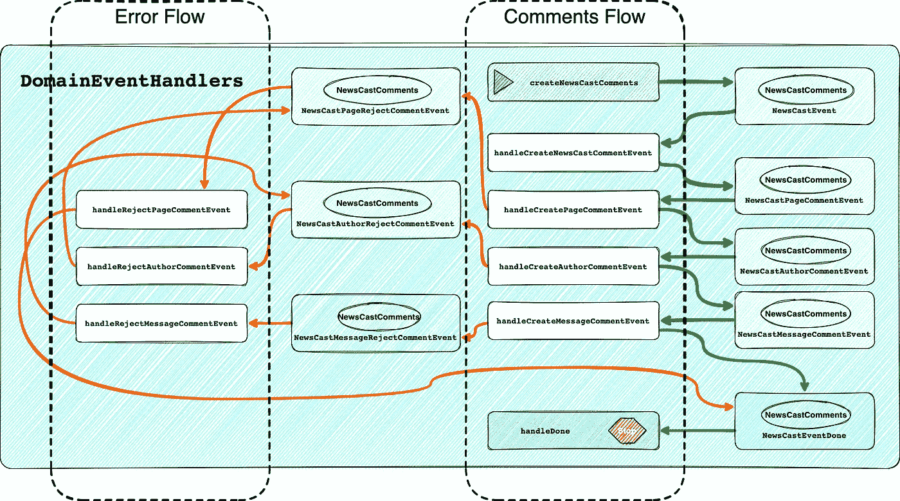**

**Saga 编排概述**

**在上图中，我们看到我们有不同的事件，它们包装相同的类型。这是 ***新闻播报评论*** :**

```
data class NewsCastComments(
    val idPage: Long? = null,
    val pageComment: String? = null,
    val idAuthor: Long? = null,
    val authorComment: String? = null,
    val idMessage: Long? = null,
    val messageComment: String? = null,
    var authorRequestId: Long? = null,
    var pageRequestId:Long? = null,
    var messageRequestId:Long? = null
)
```

**如果我们希望我们的链像传奇一样，它需要共享相同的有效载荷。把这想象成一个食谱，你创造一种配料，让它流过你的食谱。它永远不会离开食谱，它可以被修改，但它会一直存在到最后。上面的整个模式可以用下面的代码简化:**

```
class NewsCastEventConsumer(
    private val domainEventPublisher: DomainEventPublisher,
    private val newsCasePageCommentService: NewsCastPageCommentService,
    private val newsCastAuthorCommentService: NewsCastAuthorCommentService,
    private val newsCastMessageCommentService: NewsCastMessageCommentService,
    private val pageService: PageService,
    private val authorService: AuthorService,
    private val messageService: MessageService,

    ) {

    private val logger = KotlinLogging.logger {}

    fun domainEventHandlers(): DomainEventHandlers {
        return DomainEventHandlersBuilder
            .forAggregateType("org.jesperancinha.newscast.saga.data.NewsCastComments")
            .onEvent(NewsCastEvent::class.java, ::handleCreateNewsCastCommentEvent)
            .onEvent(NewsCastPageCommentEvent::class.java, ::handleCreatePageCommentEvent)
            .onEvent(NewsCastPageRejectCommentEvent::class.java, ::handleRejectPageCommentEvent)
            .onEvent(NewsCastAuthorCommentEvent::class.java, ::handleCreateAuthorCommentEvent)
            .onEvent(NewsCastAuthorRejectCommentEvent::class.java, ::handleRejectAuthorCommentEvent)
            .onEvent(NewsCastMessageCommentEvent::class.java, ::handleCreateMessageCommentEvent)
            .onEvent(NewsCastMessageRejectCommentEvent::class.java, ::handleRejectMessageCommentEvent)
            .onEvent(NewsCastDoneEvent::class.java, ::handleDone)
            .build()
    }
...
}
```

# **4.3.Saga 编排**

**世家编排有着非常不同的形式，但与世家编排非常相似。在前一种情况下，所有的事件和处理程序都必须很好地相互编排。本质上，这就是它被如此称呼的原因。处理程序需要知道在每种情况下发送哪个事件。就 Saga 编排而言，有一个向前的计划和一个向后的计划。没有复杂的方法来定义回滚。**

**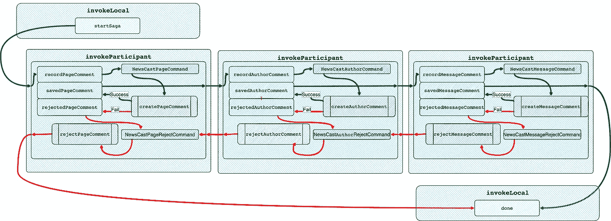**

**Saga 编排概述**

**在上面的例子中，我们看到，当我们使用不同的参与者处理数据时，我们会经历不同的处理程序。在这种情况下，它们也会被触发，但不是由事件触发，而是由命令调用。它只是几乎做同样事情的另一个名字。**

```
class CreateCommentSaga : SimpleSaga<NewsCastComments> {
    private val logger = KotlinLogging.logger {}

    private val sagaDefinition = this.step()
        .invokeLocal(this::startSaga)
        .step()
        .invokeParticipant(this::recordPageComment)
        .onReply(PageComment::class.java, this::savedPageComment)
        .withCompensation(this::rejectPageComment)
        .onReply(PageComment::class.java, this::rejectedPageComment)
        .step()
        .invokeParticipant(this::recordAuthorComment)
        .onReply(AuthorComment::class.java, this::savedAuthorComment)
        .withCompensation(this::rejectAuthorComment)
        .onReply(AuthorComment::class.java, this::rejectedAuthorComment)
        .step()
        .invokeParticipant(this::recordMessageComment)
        .onReply(MessageComment::class.java, this::savedMessageComment)
        .withCompensation(this::rejectMessageComment)
        .onReply(MessageComment::class.java, this::rejectedMessageComment)
        .step()
        .invokeLocal(this::done)
        .build()

    private fun startSaga(newsCastComments: NewsCastComments) = logger.info("Saga has started: $newsCastComments")

    private fun recordPageComment(newsCastComments: NewsCastComments): CommandWithDestination =
        send(NewsCastPageCommand(
            idPage = newsCastComments.idPage,
            requestId = newsCastComments.pageRequestId,
            comment = newsCastComments.pageComment
        )).to("pageChannel").build()
...
}
```

# **5.运行示例**

**为了运行此示例并测试一切是如何工作的，请运行:**

```
make docker-clean-build-start
```

**这个命令需要一段时间，它将构建整个项目，为 docker 映像准备二进制文件，并启动所有必要的容器。为了快速参考，这是所使用的 docker-compose 文件:**

```
networks:
  newscast:

services:
  news_cast_postgres:
    hostname: news_cast_postgres
    container_name: news_cast_postgres
    command: -c 'max_connections=400' -c 'shared_buffers=100MB'
    build:
      context: ./docker-files/docker-psql/.
    environment:
      - POSTGRES_USER=postgres
      - POSTGRES_PASSWORD=admin
      - POSTGRES_MULTIPLE_DATABASES=ncexplorer,eventuate
    networks:
      - newscast
    deploy:
      resources:
        limits:
          memory: 200M
        reservations:
          memory: 200M
    healthcheck:
      test: [ "CMD", "pg_isready", "-U", "postgres" ]
      interval: 30s
      timeout: 30s
      retries: 10
      start_period: 0s

  news_cast_kafka:
    hostname: news_cast_kafka
    container_name: news_cast_kafka
    build:
      context: ./docker-files/kafka/.
    deploy:
      resources:
        limits:
          memory: 1000M
        reservations:
          memory: 1000M
    networks:
      - newscast
    depends_on:
      news_cast_postgres:
        condition: service_healthy

  news_cast_mock:
    hostname: news_cast_mock
    container_name: news_cast_mock
    build:
      context: news-cast-mock/.
    restart: on-failure
    networks:
      - newscast
    deploy:
      resources:
        limits:
          memory: 400M
        reservations:
          memory: 400M
    depends_on:
      news_cast_postgres:
        condition: service_healthy

  news_cast_cdc:
    hostname: news_cast_cdc
    container_name: news_cast_cdc
    build:
      context: news-cast-explorer-cdc/.
    restart: on-failure
    deploy:
      resources:
        limits:
          memory: 300M
        reservations:
          memory: 300M
    networks:
      - newscast
    depends_on:
      news_cast_postgres:
        condition: service_healthy

  news_cast_fetcher:
    hostname: news_cast_fetcher
    container_name: news_cast_fetcher
    build:
      context: news-cast-explorer-fetcher/.
    deploy:
      resources:
        limits:
          memory: 200M
        reservations:
          memory: 200M
    networks:
      - newscast
    depends_on:
      news_cast_postgres:
        condition: service_healthy
    healthcheck:
      test: ["CMD", "curl", "--silent", "http:/127.0.0.1:8080/api/newscast/fetcher/actuator"]
      interval: 5s
      timeout: 240s
      retries: 60

  news_cast_choreography:
    hostname: news_cast_choreography
    container_name: news_cast_choreography
    build:
      context: news-cast-explorer-saga-choreography/.
    restart: on-failure
    deploy:
      resources:
        limits:
          memory: 300M
        reservations:
          memory: 300M
    networks:
      - newscast
    depends_on:
      news_cast_postgres:
        condition: service_healthy

  news_cast_orchestration:
    hostname: news_cast_orchestration
    container_name: news_cast_orchestration
    build:
      context: news-cast-explorer-saga-orchestration/.
    restart: on-failure
    deploy:
      resources:
        limits:
          memory: 300M
        reservations:
          memory: 300M
    networks:
      - newscast
    depends_on:
      news_cast_postgres:
        condition: service_healthy

  news_cast_fe:
    hostname: news_cast_fe
    container_name: news_cast_fe
    build:
      context: docker-files/nginx/.
    restart: on-failure
    deploy:
      resources:
        limits:
          memory: 300M
        reservations:
          memory: 300M
    networks:
      - newscast
    depends_on:
      news_cast_fetcher:
        condition: service_healthy
```

**一旦一切开始，请前往[T5 http://localhost:9000。](http://localhost:9000.)你会发现这样一个页面:**

**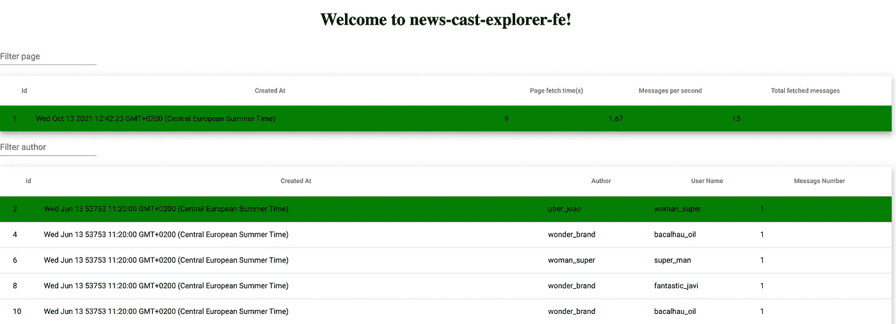**

**新闻广播浏览器的图形用户界面**

**一旦完成了这些，您就可以测试不同的编排类型了:**

**编排—端口 8082:**

```
curl -X POST http://localhost:8082/api/saga/orchestration -H 'Content-Type: application/json' --data '{ "idPage": 1, "pageComment": "I love this", "idAuthor": 2, "authorComment": "This is my favourite author", "idMessage": 3, "messageComment": "I agree", "authorRequestId":123,"pageRequestId":456,"messageRequestId":789 }'
```

**编排—端口 8083:**

```
curl -X POST http://localhost:8083/api/saga/choreography -H 'Content-Type: application/json' --data '{ "idPage": 1, "pageComment": "I love this", "idAuthor": 2, "authorComment": "This is my favourite author", "idMessage": 3, "messageComment": "I agree", 
"authorRequestId":123,"pageRequestId":456,"messageRequestId":789 }'
```

**检查端口 5432 上的 PostgresSQL 数据库和数据库***event***，并检查***event***模式和 ***public*** 模式中的表变化。也就是说，我们要查看 ***eventuate*** 模式中的表 message、saga_instance 和 received_messages 以及 ***public*** 模式中的所有注释表。让我们尝试不同的 Id 组合，看看会发生什么。**

**只是为了提供一个例子，我现在将发送一个请求，我知道这将使整个传奇失败:**

```
curl -X POST http://localhost:8082/api/saga/orchestration -H 'Content-Type: application/json' --data '{ "idPage": 1, "pageComment": "I love this", "idAuthor": 2, "authorComment": "This is my favourite author", "idMessage": 999999, "messageComment": "I agree", "authorRequestId":200,"pageRequestId":500,"messageRequestId":800 }'
```

**这是因为我正在发送 id 为 999999 **的消息。**在当前的 id 生成系统中，获取这个 id 需要很长时间，所以我非常确定我们没有这个 Id 的消息。**

**对于编排，我们将得到:**

**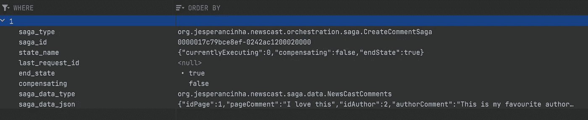**

*****Saga _ instance***表中的 saga 注册**

**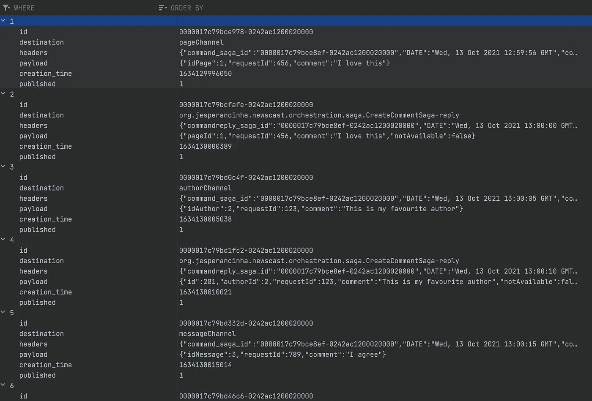**

**消息登记在**消息*表*消息**表中**

**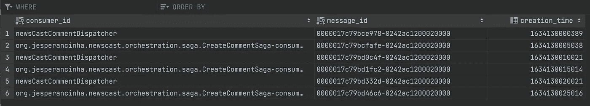**

**收到的消息登记在 ***接收 _ 消息*** 表中**

**最后，我们可以看到当流程正确和不正确时，注释表会发生什么**

****

****页 _ 注释**表中的页表注释**

**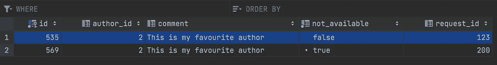**

****表中的作者表注释作者 _ 注释**表**

**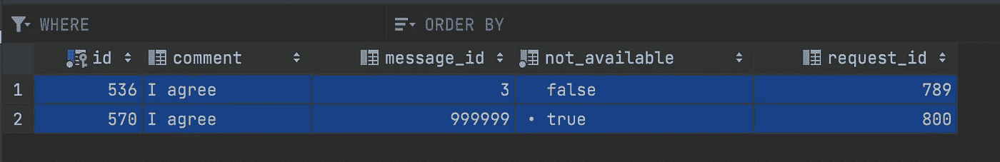**

****消息 _ 注释**表中的消息表注释**

**我们也可以对编舞表做同样的事情。结果是非常相似的，所以我留给你去尝试。**

# **8.结论**

**正如我们在这个例子中看到的，传奇是管理事务的一种很好的方式。他们以一种分离的方式工作，并且在他们的子流程中遵循 A.C.I.D 原则。它们为 LLT 延迟和性能下降提供了解决方案。**

**我们在这两种情况下都看到了优势:**

**对于编排，我们看到没有工作流，这反过来可以减少性能开销。也不需要额外的框架来支持它。它是一种事件驱动的实现形式，允许以一种已知的方式实现不同系统元素之间的松散耦合。**

**对于流程编排，我们看到我们可以防止流程复杂化，因为它是命令驱动的，而不是事件驱动的。这意味着在实践中，编排将遵循内置的错误处理工作流。它能让我们更好地了解正在做的事情。因为它迫使我们遵循一个特定的标准，这个标准已经被测试和证明了，它也防止了代码中太多的定制变化，这些变化通常是容易出错的。**

**我已经将这个应用程序的所有源代码放在了 [GitHub](https://github.com/jesperancinha/news-cast-explorer) 中**

**我希望你能像我喜欢写这篇文章一样喜欢它。我试着让它简洁明了，我忽略了许多小细节。**

**我很想听听你的想法，所以请在下面留下你的评论。**

**提前感谢您的帮助，感谢您的阅读！**

# **参考**

**[](https://microservices.io/patterns/data/saga.html) [## 微服务模式:Sagas

### 您已经按照服务模式应用了数据库。每个服务都有自己的数据库。一些商业交易…

微服务. io](https://microservices.io/patterns/data/saga.html) [](https://www.nicolaferraro.me/2018/04/25/saga-pattern-in-apache-camel/) [## 《阿帕奇骆驼》中的传奇模式

### Apache Camel (2.21.0)中添加了一种新的企业集成模式:“Saga”模式。这篇文章将…

www.nicolaferraro.me](https://www.nicolaferraro.me/2018/04/25/saga-pattern-in-apache-camel/) [](https://blog.couchbase.com/saga-pattern-implement-business-transactions-using-microservices-part/) [## Saga 模式:使用微服务的应用事务

### 事务是应用程序的重要组成部分。没有它们，就不可能保持数据的一致性…

blog.couchbase.com](https://blog.couchbase.com/saga-pattern-implement-business-transactions-using-microservices-part/) [](https://docs.microsoft.com/en-us/azure/architecture/reference-architectures/saga/saga) [## Saga 分布式事务- Azure 设计模式

### saga 设计模式是一种在分布式事务场景中跨微服务管理数据一致性的方法…

docs.microsoft.com](https://docs.microsoft.com/en-us/azure/architecture/reference-architectures/saga/saga) [](https://nlogn.in/the-saga-pattern-for-distributed-transactions-in-microservices/) [## 微服务中分布式事务的 SAGA 模式

### 在一个整体架构中，所有的服务和数据库运行在同一个服务器上，因此很容易…

n 登录. in](https://nlogn.in/the-saga-pattern-for-distributed-transactions-in-microservices/) 

[https://www . IBM . com/cloud/architecture/architectures/event-driven-saga-pattern](https://www.ibm.com/cloud/architecture/architectures/event-driven-saga-pattern)**