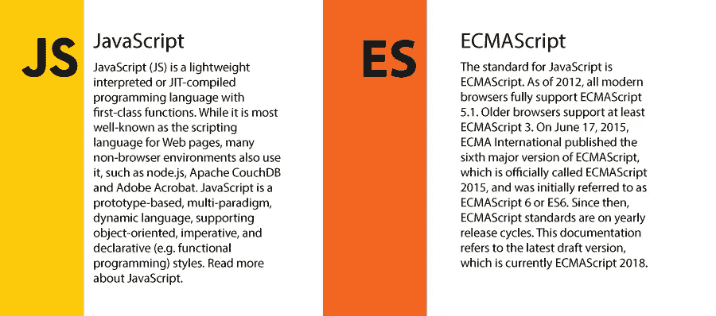

# 下一代 Javascript

> 原文：<https://itnext.io/next-gen-javascript-2697ab934ffd?source=collection_archive---------0----------------------->



ECMAScript 是定义 JS 特性的标准

# 让和 const 超过 var

let 关键字允许您考虑块范围来定义变量。

```
**const** letFunc = () => {
    **let** myLet = 1
    **if**(**true**) {
        **let** myLet = 2
        console.log(myLet)
    }
    console.log(myLet)
}letFunc()// 2
// 1
```

const 关键字的作用类似于 java 中的 final 关键字。它告诉你被定义为 const 的变量在整个代码中不会再被改变。

```
const myConst = 'I\'m not gonna change'
```

另一方面，var 关键字考虑的是函数范围，而不关心块范围。这意味着您可以使用 var 关键字来定义全局变量。

```
**const** varFunc = () => {
    **var** myVar = 1
    **if**(**true**) {
        **var** myVar = 2
        console.log(myVar)
    }
    console.log(myVar)
}

varFunc()// 2
// 2
```

# 箭头功能

Arrow 函数没有取代 js 中的函数有几个原因

> 箭头功能没有自己的`this`

1.  这个关键字总是指在定义 arrow 函数的环境中定义的东西
2.  不能与 new 关键字一起使用

```
**function** testScopeFunc() {
    console.log(**this**.amt)
    **return** {
        amt: 10,
        getAmt: () => console.log(**this**.amt)
    }
}

testScopeFunc.call({ amt: 2 }).getAmt()// 2
// 2
```

但是当我们使用一个普通的函数时

```
**function** testScopeFuncNormal() {
    console.log(**this**.amt)
    **return** {
        amt: 10,
        getAmt: **function**() {
            "use strict";
            console.log(**this**.amt)
        }
    }
}

testScopeFuncNormal.call({amt: 2}).getAmt()// 2
// 10
```

如你所见，arrow 函数总是指向一个固定的范围。就像我们在 java 中使用“this”一样。

## 如何使用箭头函数

1.  单线线路

```
const myFunc = () => console.log('My Function')
```

这里不需要 return 关键字

2.多线

```
const myFunc = () => { //Your Function body }
```

3.单变量

```
const myFunc = arg => { // your func body}
```

如果有多个参数或者根本没有参数，则必须使用括号()=> {}语法

# 出口和进口

当您在多个文件中编写代码时，您必须将一个文件中编写的函数导入到另一个文件中。这就是你需要这个的地方。

## 出口

如果你想从你的文件中公开一个函数，你可以使用如下的默认导出

```
export default myfunc
```

但是当你有多个函数时，你可以使用下面的语法。我们称之为命名导出

```
export const func1
export const func2
```

## 导入

如果您使用上面给出的默认导出，您可以使用下面的语法

```
import myfunc from './somefile'
import person from './somefile'
```

如果要导入多个函数，可以使用以下语法

```
import { func1 } from './somefile'
import { func1, func2 } from './somefile'
import { func1 as f1, func2 as f2 } from './somefile'
```

或者你可以一次全部导入并如下使用它们

```
import * as myFunctionPool from './somefile'// call seperate functions as 
myFunctionPool.func1()
myFunctionPool.func2()
```

# 班级

类是对象的蓝图。它们可以同时具有属性和方法。

```
**class** Planet {
    constructor(){
        **this**.name = 'Earth'
        **this**.age = 2300
    }
    getName() { console.log(**this**.name) }
}
**const** earth = **new** Planet()
earth.getName()Spread and Rest Operators
```

类支持继承

```
**class** SolarSystem {
    constructor(){
        **this**.galaxy = 'Milky way'
    }
    getGalaxy() { console.log(**this**.galaxy)}
}

**class** Planet **extends** SolarSystem{
    constructor(){
        **super**() // Have to call the super class in derived class    which executes the parent constructor
        **this**.name = 'Earth'
        **this**.age = 2300
    }
    getName() { console.log(**this**.name) }

}

**const** earth = **new** Planet()
earth.getName()
earth.getGalaxy()
```

在 **ES7** 中，你可以跳过构造函数调用，直接在类中开发属性。你也不必使用 **super()** 调用超类的构造函数。

```
**class** Water {
    ph = 6.97
    o2 = 22
}
```

# 休息和传播运算符

仅使用 3 个连续的点(…)来表示静止和展开

```
... // This is basically the spread and rest operator
```

*   Spread 用于拆分数组或对象属性，以创建新的数组或对象
*   Rest —用于将函数的多个参数聚合到一个数组中

## 扩展运算符用途

```
**let** myArr = [1,2,3]
**let** myNewArray = [...myArr, 4, 5]
console.log(myNewArray) // [ 1, 2, 3, 4, 5 ]
```

扩展操作符也可以用于对象

```
**const** leaf = {
    color:'green',
}

**const** tree = {
    ...leaf,
    leaves: 23,
}console.log(tree)
```

Rest 运算符使用

```
**function** arguments(...args) {
    **for**(**let** arg **of** args){
        console.log(arg)
    }
}

arguments(1,2,3,4,5,6)
```

这里，我们传递给函数的参数将被推送到一个数组中，这个数组可以使用索引来访问

# 解构

用于分别从对象和数组中提取属性或元素。

在数组中，元素的顺序定义了我们提取的对象，而在对象中，属性名定义了我们提取的内容

```
{ name, age } = { name: 'me', age:22 }
console.log(name) // me
```

对于数组

```
[x,,z] = [1, 2, 3]
console.log(x) // 1
console.log(z) //3
```

这些是 js 最新版本中新引入的一些东西。但是还有其他一些重要的特性，比如循环的**—**、**生成器函数**，当 yeild(暂停)**、async await** 取代了承诺和回调等的使用时，它会在函数中存储一个状态。最后如果喜欢这篇文章就鼓掌。