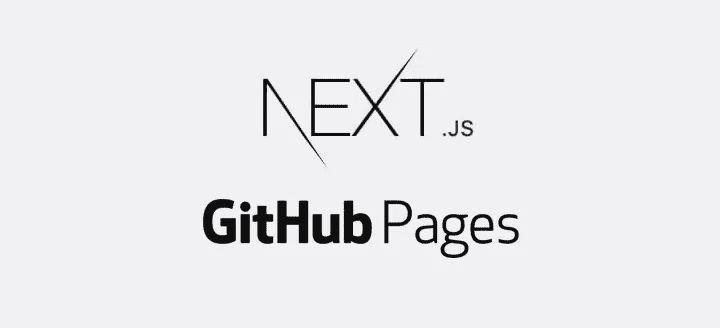

# Github 页面上的 Next.js 应用

> 原文：<https://itnext.io/next-js-app-on-github-pages-768020f2b65e?source=collection_archive---------4----------------------->

Next.js + Github 页面

[*点击这里在 LinkedIn 上分享这篇文章*](https://www.linkedin.com/cws/share?url=https%3A%2F%2Fitnext.io%2Fnext-js-app-on-github-pages-768020f2b65e)

最近，我决定最终创建我的主页。对于这个任务，我决定使用 Next.js，它的静态导出功能令人惊叹。毫不犹豫地，我也决定使用 github 页面，因为我将 github。我当时想:“这应该简单明了，只需将应用程序导出到`docs`文件夹(带有`next build`和`next export -o docs`)中，就大功告成了”。那些已经在咯咯笑的人，其实是对的，因为原来不是小菜一碟。

首先，我们有这个指南(它实际上错过了一些重要的信息，我已经添加了，但最好继续阅读帖子)。第一个重要的部分是`.nojekyll`文件，因为 Jekyll 忽略文件夹，以下划线开始，我们有`_next`。所以你应该在你的`docs`文件夹中添加一个名为`.nojekyll`的空文件。别担心，不会在`next export`时被删除。你也可以选择使用`gh-pages`分支(有一个很酷的 git 特性叫做 subtree for it，[见这里](https://gist.github.com/cobyism/4730490))。所以应该没问题吧？…

Cuphead 卡格尼康乃馨老板

# 首要问题

如果不是你的个人或组织页面，你的 github 页面会发布在`[http://{username}.github.io/{reponame}](http://{username}.github.io/{reponame}.)` [下。这意味着默认情况下，到脚本的链接将被断开。不过不用担心，`next.js`有一个选项可以修复它，它叫`assetPrefix`。问题是你不想为本地开发清除`assetPrefix`，所以最好依靠`process.env.NODE_ENV`，或者任何你用来区分 dev 和 prod 的东西。](http://{username}.github.io/{reponame}.)

Cuphead 卡拉玛丽亚老板

# 我们继续下一个

您已经更新了静态文件的路径，但是链接呢？我们还应该给它们加上前缀。将前缀传递给组件和页面的最简单方法是使用`webpack.DefinePlugin`和 webpack 配置函数(Next.js 版本≥ 5)。

> Next.js 也有一个使用`env-config.js`的选项，但是我看不出将一个关注点分成两个文件有什么意义。

然后我们这样使用它。重要的是，我们没有简单地把它加到`href`的前缀上，而是使用了`as`道具。否则这就不是客户端导航，而是全页面重载。我想知道这是什么原因(见[这个线程](https://github.com/zeit/next.js/issues/3335#issuecomment-348802894)了解更多信息)。

您也可以为它创建一个简单的包装器。

瘾君子魔鬼老板

# 奖金问题

如果你正在使用 Next.js v5 通用 webpack 配置特性，比如`withCss` decorator，它允许你使用旧式 css 方法(普通 css、css-modules、sass、less、post-css)创建单独的文件，你可能想使用`_document.js`文件来微调 Next.js 将用来呈现你的页面的模板。但是在`assetPrefix`的情况下，你可能也想改变这个脚本的 url。幸运的是你可以从道具(`this.props.__NEXT_DATA__.assetPrefix`)中得到`assetPrefix`，就像这样。

“谢谢”屏幕

谢谢你的关注，我希望你不会很快面临另一堆什么问题！