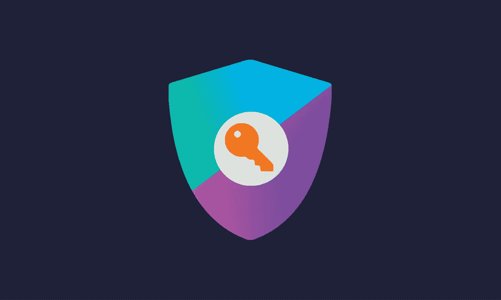
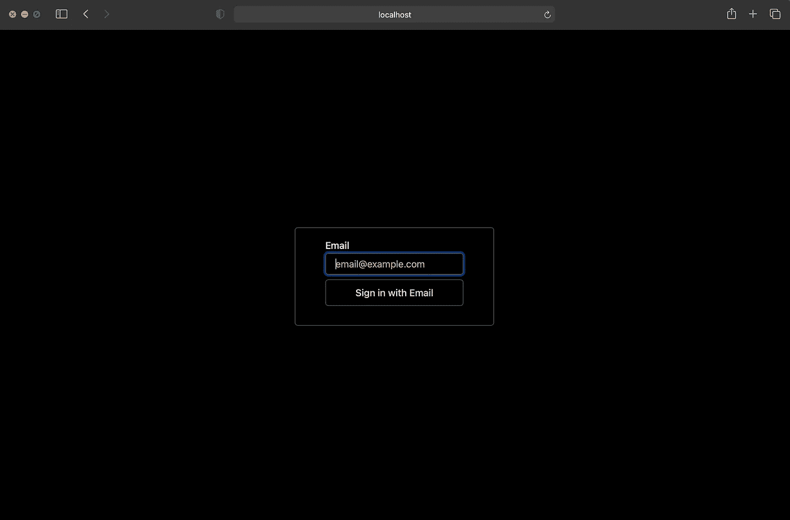
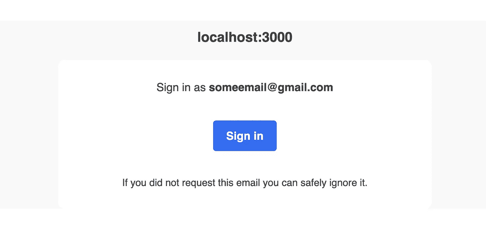
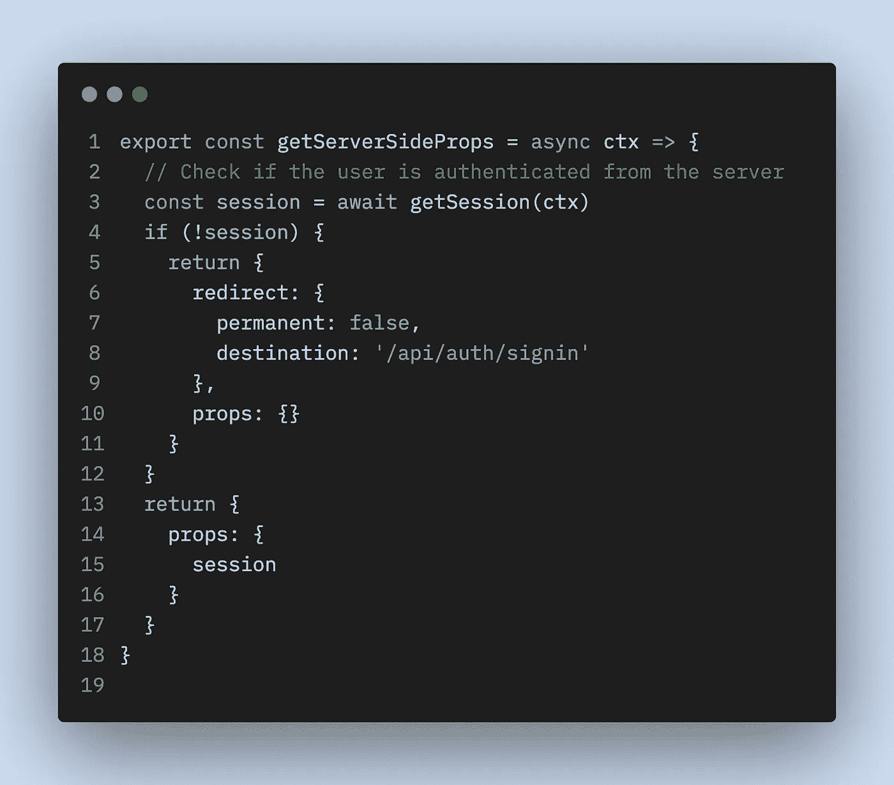
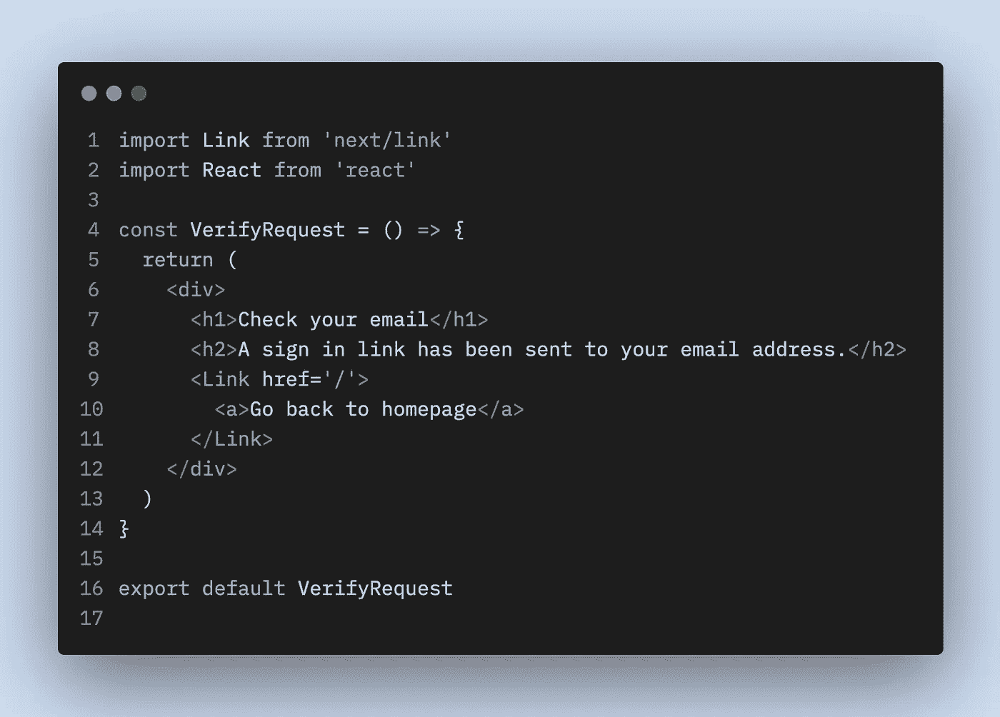
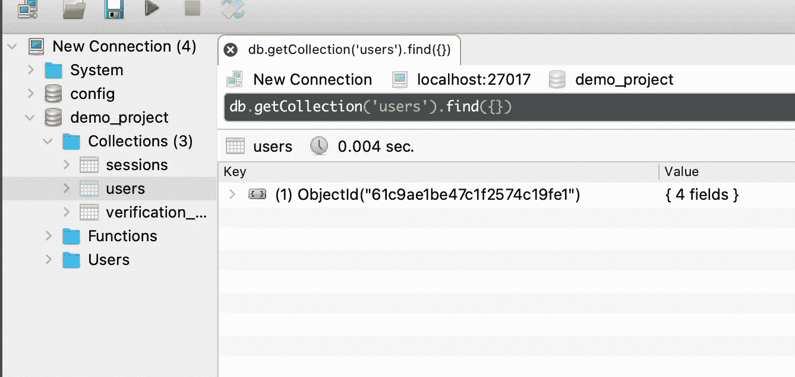

# Next.js 使用 NextAuth & MongoDB 进行无密码电子邮件认证

> 原文：<https://itnext.io/next-js-passwordless-email-authentication-with-nextauth-mongodb-397e558bdcf0?source=collection_archive---------0----------------------->



对 Next.js 应用程序实现身份验证的最简单方法之一是通过 [NextAuth.js](https://next-auth.js.org/) 。让我们看看如何使用这个库添加无密码电子邮件认证。

[](https://next-auth.js.org/) [## NextAuth.js

### Next.js 的身份验证

next-auth.js.org](https://next-auth.js.org/) 

# 1.创建新的 Next.js 应用程序

```
npx create-next-app some-project-name
```

# 2.安装依赖项

```
yarn add next-auth [@next](http://twitter.com/next)-auth/mongodb-adapter mongodb nodemailer
```

注意:当我这么做的时候，我的 M1 Mac 电脑出现了一个错误。我在上面的命令中添加了`--ignore-engines`标志。

# 3.连接到 MongoDB

您可以使用 NextAuth 提供的众多[适配器](https://next-auth.js.org/adapters/overview)中的一个来使用任何其他数据库。对于本教程，我们将使用 MongoDB。

**添加**

这个文件将向我们的应用程序公开 MongoDB 连接。我们将把这个连接传递给我们的 NextAuth MongoDB 适配器。

**添加**

这将允许 NextAuth 创建所需的 API 端点。

**JWT —可选**

我们在这里使用 JWT 策略，因为我们不想不断地从数据库中查询会话信息。`maxAge`定义了用户必须再次重新认证的时间。`updateAge`定义了每次令牌刷新的时间间隔。

**电子邮件提供商— SMTP 中继**

由于我们使用无密码身份验证，当用户输入他们的电子邮件时，我们将向该电子邮件发送一个验证链接。然后，用户点击这个链接，登录到我们的应用程序。要发送这些电子邮件，我们需要电子邮件提供商和 SMTP 凭证。由于 NextAuth 在内部使用 Nodemailer，所以您可以看看下面与 Nodemailer 合作的电子邮件提供商的[列表。](https://nodemailer.com/smtp/well-known/)

出于演示的目的，我使用了我的 Gmail。以下是如何获得 Gmail SMTP 证书的指南:

[](https://kinsta.com/blog/gmail-smtp-server/) [## 如何使用 Gmail SMTP 服务器免费发送电子邮件

### 大多数人都知道 Gmail 简洁的界面和有用的功能，比如搜索操作符和插件。但是你也可以…

kinsta.com](https://kinsta.com/blog/gmail-smtp-server/) 

# 4.添加环境变量

不要忘记添加环境变量。

**添加**

# 5.测试身份验证

我们现在可以在您的应用程序的`/api/auth/signin`路径访问 NextAuth 为我们创建的默认登录页面。



输入您希望用来登录的电子邮件，然后提交表单。您将会看到以下屏幕。


现在，检查您的电子邮件，您应该收到了这样一封电子邮件:



单击电子邮件中的登录按钮，您将被重定向回您的应用程序。

# 6.检查身份验证

## 从客户那里

我们已经完成了身份验证，但是我们无法从屏幕上判断用户是否登录。让我们使用 NextAuth 提供的钩子来显示用户的信息。

**编辑**

首先，我们编辑 our _app.js 以包含`SessionProvider`。

**编辑**

接下来，出于演示的目的，让我们编辑我们的`index.js`文件以包含`useSession`钩子来获取用户信息和登录状态。

`useSession`钩子提供会话数据和认证状态。有三种可能的规约— `loading`、`authenticated`和`unauthenticated`。

该页面现在看起来像这样:


## 从服务器

为了从服务器读取认证状态，我们可以将`getSession`方法添加到`getServerSideProps`中。确保你没有被弄糊涂。对于客户端来说是`useSession`，对于服务器来说是`getSession`。一个完整的示例将如下所示:

## 来自 API

`getSession`也可用于 API 路线。但是我们不是传递上下文，而是传递如下所示的`req`对象:

# 7.保护页面

现在，让我们让一些未经认证的用户无法访问某些页面。

## 来自客户

## 从服务器

我们可以简单地使用`getSession`方法，并在`getServerSideProps`中使用重定向。



## 使用中间件(Next.js 12)

随着 Next.js 12 的发布，我们还可以使用中间件一次性保护多条路由。下面的例子是在`/pages/protected/_middleware.js`创建的中间件。这个中间件将保护`/protected`路径下的所有页面。

# 8.自定义登录页面

NextAuth 还使我们能够重建我们的登录页面。要使用自定义登录页面，我们需要编辑掉`/pages/api/auth/[...nextauth].js`。我们需要添加`pages`选项。

现在，我们可以添加自定义页面。

`/pages/login.js`

注意，通过向`signIn`方法传递参数，我们还可以在登录后将用户重定向到不同的路由，例如`/protected`。

`/pages/verify-request.js`



# 9.自定义电子邮件

我们可以通过在`/pages/api/auth/[...nextauth].js`的 EmailProvider 选项中添加`sendVerificationRequest`方法来轻松定制验证邮件

如果您现在检查您的 MongoDB，您将看到已登录的用户被填充。您还将看到会话和验证链接的集合。



就是这样！现在你可以轻松实现无密码认证了！✨