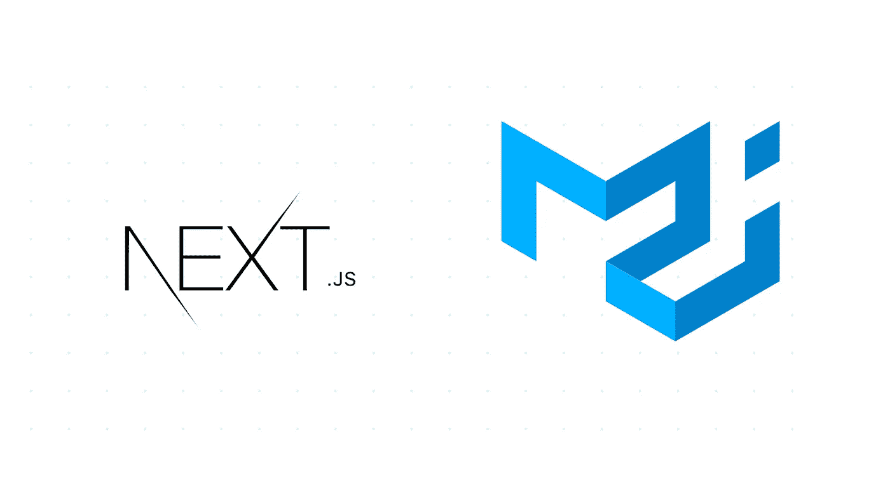

# Next.js 带材质-UI

> 原文：<https://itnext.io/next-js-with-material-ui-7a7f6485f671?source=collection_archive---------0----------------------->



Nextjs 是一个非常流行的服务器渲染 react 框架，很多人都将其用于开发目的。

还有很多用于服务器端渲染框架的 UI 库，Material UI 就是其中之一。

Material UI 提供 React 组件，用于更快、更轻松的 web 开发。可以创建自己的设计体系，也可以从材料设计入手。

你可以在他们的网站上找到很多有用的信息，以及你想在你的项目中使用的组件。

[**素材 UI 库**](https://material-ui.com/)

用 Material UI 构建的一些示例网站


材料用户界面示例

你可以检查他们的[模板](https://material-ui.com/getting-started/templates/)，并尽快开始使用其中一个。

# 更新:

对于材质 UI 5，你可以遵循我在这里解释的教程。

更新了材料 UI 5 的 GitHub URL

[](https://github.com/hadnazzar/nextjs-materialui) [## GitHub-hadnazzar/nextjs-material UI:带有材料 UI 5 的 Nextjs

### 这是一个用 create-next-app 引导的 Next.js 项目。首先，运行开发服务器:打开…

github.com](https://github.com/hadnazzar/nextjs-materialui) 

# 如何在材质 UI 中使用 Next.js

在 next.js 项目中使用 material UI 我们应该做一些需求。

1-固定解决顺序

2-删除服务器端注入的 CSS

**我们的应用程序中的解析顺序**需要如下

```
On the server:
1\. app.getInitialProps
2\. page.getInitialProps
3\. document.getInitialProps
4\. app.render
5\. page.render
6\. document.renderOn the server with error:
1\. document.getInitialProps
2\. app.render
3\. page.render
4\. document.renderOn the client
1\. app.getInitialProps
2\. page.getInitialProps
3\. app.render
4\. page.render
```

## 为什么我们要这样使用它？

服务器端渲染框架有时在样式上有点棘手。

如果你在 next.js 中改变了你的根目录后遇到了闪烁屏幕的问题，你应该在你的应用程序中做这些改变。

## 如何用 next.js 安装和使用材质 UI

将 material-ui 安装到现有的 next.js 项目中

故事

```
yarn add @material-ui/core
```

npm

```
npm install @material-ui/core
```

如果您正在使用 _document.js 文件，请将其改编为您的文件或创建新文件。

**_document.js**

如果您正在使用 _app.js 文件，请修改它或创建新文件。

**_app.js**

这里最重要的部分是移除服务器端注入的 CSS。

```
***React***.useEffect(() => {
  // Remove the server-side injected CSS.
  const jssStyles = ***document***.querySelector('#jss-server-side');
  if (jssStyles) {
    jssStyles.parentElement.removeChild(jssStyles);
  }
}, []);
```

您的应用程序已经准备就绪！你可以测试它，现在闪烁的问题消失了，你可以在你的 nextjs 应用程序上正确地使用材质 UI。

[**项目的 Github 链接**](https://github.com/hadnazzar/nextjs-with-material-ui)

如果你想用 Nextjs 探索更多的 UI 示例组件，请看看我下面的另一个故事🎉该系列教程将帮助您从入门开始构建自己的 nextjs 应用程序并将其部署到 vercel。

[](https://melih193.medium.com/nextjs-from-beginning-to-deployment-nextjs-video-tutorial-series-f688c43dcb8f) [## Nextjs 从开始到部署🚀:Nextjs 视频教程系列📺

### 使用 material UI 一步步从头开始创建 Nextjs 应用程序，并部署到 vercel。

melih193.medium.com](https://melih193.medium.com/nextjs-from-beginning-to-deployment-nextjs-video-tutorial-series-f688c43dcb8f) 

*如果你觉得这篇文章很有帮助，你* [***可以通过使用我的推荐链接注册一个***](https://medium.com/@melih193) **[***中级会员来访问类似的文章***](https://melih193.medium.com/membership) *。***

***跟我上*** [**推特**](https://twitter.com/hadnazzar193)

[](https://www.youtube.com/c/TechnologyandSoftware?sub_confirmation=1)

在 Youtube 上订阅更多内容

# 编码快乐！

梅利赫