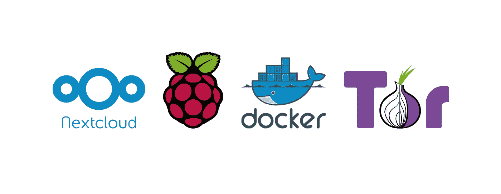
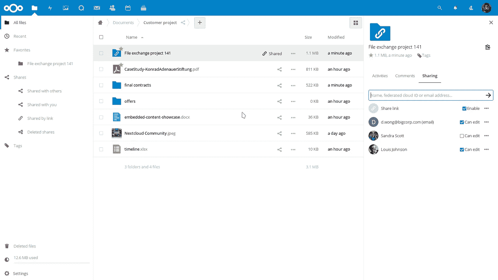
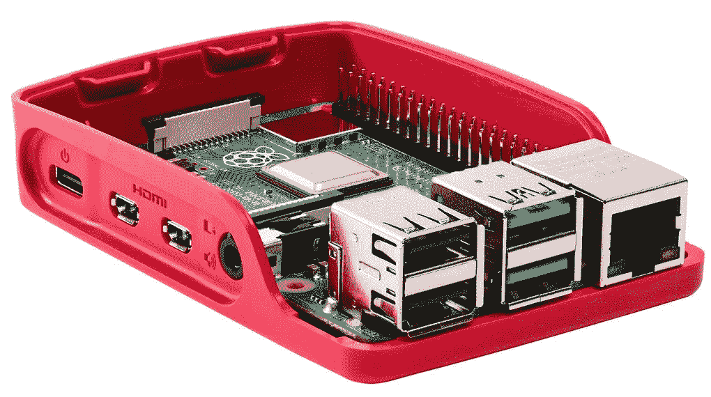

# Nextcloud +树莓 Pi + Docker +洋葱服务=🔥

> 原文：<https://itnext.io/nextcloud-docker-raspberry-pi-onion-service-84d4af13f7e6?source=collection_archive---------2----------------------->

([法文版此处](https://medium.com/@robinriclet/nextcloud-raspberry-pi-docker-onion-service-fr-c778d4974e8a))



几个月前，我有一个想法，建立一个私有的 [Nextcloud](https://en.wikipedia.org/wiki/Nextcloud) 实例，与朋友分享文件，有一个小组议程和更多的协作内容。



(下一代云用户界面)

出于隐私方面的考虑，也为了避免支付域名费用，我考虑将这个实例作为一个 [Tor 隐藏服务](https://en.wikipedia.org/wiki/Tor_(anonymity_network)#Onion_services)。

我开始四处询问托管解决方案、价格和隐私政策。在几个星期的不成功的发现之后，我偶然发现这个 Reddit 帖子建议在 Raspberry Pi 上托管 Nextcloud 实例。为什么我没有早点想到这个？！



(一个漂亮的覆盆子 Pi 4 放在覆盆子色的盒子里，❤)

我订购了一个[树莓 Pi 入门套件](https://thepihut.com/collections/raspberry-pi-kits-and-bundles/products/raspberry-pi-starter-kit)，配有全新的树莓 Pi 4 Model B (4GB 内存)。等包裹的时候发现[这个 GitHub 回购](https://github.com/torservers/onionize-docker)。我使用 Docker 和 MariaDb 设置了 Nextcloud 实例，所有这些都在洋葱服务的背后。`docker-compose.yaml`看起来是这样的:

```
version: '3'services:
  onionize:
    image: torservers/onionize
    volumes:
      - /var/run/docker.sock:/tmp/docker.sock:ro
    networks:
      - faraday nextcloud:
    image: nextcloud:apache
    environment:
      - ONIONSERVICE_NAME=app
    networks:
      - faraday
    depends_on:
      - db
    volumes:
      - nextcloud:/var/www/html
      - ./app/config:/var/www/html/config
      - ./app/custom_apps:/var/www/html/custom_apps
      - ./app/data:/var/www/html/data
      - ./app/themes:/var/www/html/themes
      - /etc/localtime:/etc/localtime:ro
    restart: unless-stopped db:
    image: mariadb
    networks:
      - faraday
    volumes:
      - db:/var/lib/mysql
      - /etc/localtime:/etc/localtime:ro
    environment:
      - MYSQL_ROOT_PASSWORD=password
      - MYSQL_PASSWORD=mysql
      - MYSQL_DATABASE=nextcloud
      - MYSQL_USER=nextcloud
    restart: unless-stoppedvolumes:
  nextcloud:
  db:networks:
  faraday:
    driver: bridge
```

我的笔记本电脑一切正常，所以我在等待。收到树莓后，[我安装了 Raspbian Lite 并设置了 SSH](https://www.instructables.com/id/Install-and-Setup-Raspbian-Lite-on-Raspberry-Pi-3/)。接下来，我安装了`git`、`docker`、`docker-compose`，并添加了外部存储。

`docker-compose up` 而且……没有。`nextcloud`和`db`服务正确启动，但`onionize`出错退出。它在我的笔记本电脑上运行良好，为什么在覆盆子上就不行呢？！

docker 镜像`torservers/onionize:latest`的架构是`amd64`而[树莓派 4 有一个](https://stackoverflow.com/questions/37790029/what-is-difference-between-arm64-and-armhf) `[armhf](https://stackoverflow.com/questions/37790029/what-is-difference-between-arm64-and-armhf)` [架构](https://stackoverflow.com/questions/37790029/what-is-difference-between-arm64-and-armhf)！我做了一些研究，发现了 Docker 团队最近开发的[工具](https://github.com/docker/buildx) : `buildx`

`buildx`允许为特定处理器架构构建映像，如`amd64` 或`amrhf`。我分叉了`torservers/onionize`，改变了 docker 文件中`docker-gen`的架构，并使用`buildx`创建了一个兼容`armhf`的映像。

这里举例:[https://medium . com/@ Artur . klauser/building-multi-architecture-docker-images-with-buildx-27d 80 f 7 e 2408](https://medium.com/@artur.klauser/building-multi-architecture-docker-images-with-buildx-27d80f7e2408)

容器现在已经启动一周了，Nextcloud 运行得很好，通过 Tor 网络的响应时间非常快！

我的 Github 回购:[https://github.com/rriclet/tor-cloud](https://github.com/rriclet/tor-cloud)