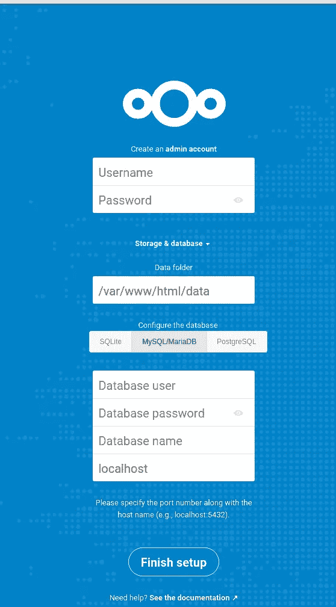
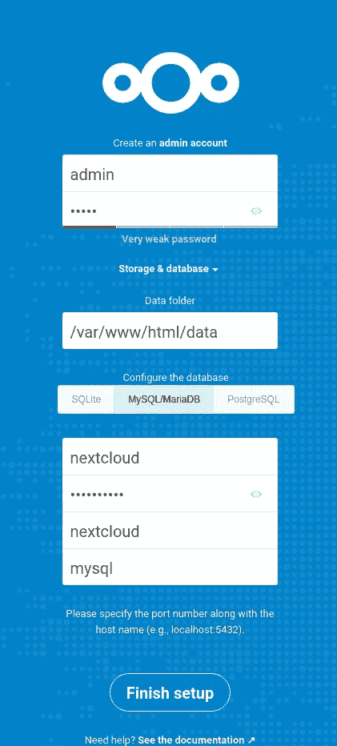

# Nextcloud:在 Debian 上运行 Docker Compose，让我们加密 SSL

> 原文：<https://itnext.io/nextcloud-running-in-docker-compose-on-debian-with-lets-encrypt-ssl-510d937d115a?source=collection_archive---------2----------------------->


不久前我测试了 Nextcloud，见 [NextCloud:用 PHP-FPM 在 NGINX 后面的 Debian 上安装服务器，在 Arch Linux 上安装客户端](https://rtfm.co.ua/en/nextcloud-installing-server-on-debian-behind-nginx-with-php-fpm-and-client-on-arch-linux/)帖子。

总的来说，看起来还不错，所以是时候尝试在生产环境下运行，最后从 Dropbox 迁移到 it 上了。

今天，让我们使用 Docker Compose 在数字海洋中运行的一个 droplet 上运行一个 Nextcloud 实例。

这个 droplet 安装了一个额外的卷，以便于在实例之间迁移数据和备份数据。

要运行所有必要的服务，让我们用下面的容器创建一个 Docker 合成文件:

1.  NGINX:一种代理服务
2.  让我们加密:一个 SSL 代理
3.  MariaDB:存储 Nextcloud 设置的数据库服务器
4.  Nextcloud:一个包含 Apache 和 Nextcloud 源代码的 Nextcloud 容器

参见文档[此处> > >](https://github.com/nextcloud/docker) 。

因为 SSL 将使用来自[docker-letsencrypt-nginx-proxy-companion](https://github.com/JrCs/docker-letsencrypt-nginx-proxy-companion)映像**的加密客户端。**

## Docker 和 Docker 组成装置

安装 Docker:

```
root@setevoy-do-nextcloud-production:~# curl [https://get.docker.com/](https://get.docker.com/) | bash
```

和 Docker Compose(先检查版本— *下载/1.24.1/* 在[发布页面](https://github.com/docker/compose/releases/)):

```
root@setevoy-do-nextcloud-production:~# curl -L “https://github.com/docker/compose/releases/download/1.24.1/docker-compose-$(uname -s)-$(uname -m)” -o /usr/local/bin/docker-compose
root@setevoy-do-nextcloud-production:~# chmod +x /usr/local/bin/docker-compose
```

创建一个新目录来存储我们将来的合成文件:

```
root@setevoy-do-nextcloud-production:~# mkdir /opt/nextcloud
root@setevoy-do-nextcloud-production:~# cd /opt/nextcloud/
```

让我们从堆栈创建开始。

## 运行 Nexcloud

## `nginx-proxy`

创建目录来保存 NGINX a 让加密文件:

root @ setevoy-do-next cloud-production:/data/next cloud # mkdir-p/data/next cloud/nginx/{ certs，vhost.d，html}

创建合成文件`/opt/nextcloud/nextcloud-compose.yml`，先添加一个网络:

```
networks:
  nextcloud_network:
```

现在，添加第一个包含将使用该网络的`nginx-proxy`映像的容器，从上面创建的目录中添加卷，因此该文件将是下一个:

```
version: '3'  

services:

  nginx-proxy:
    image: jwilder/nginx-proxy:alpine
    labels:
      - "com.github.jrcs.letsencrypt_nginx_proxy_companion.nginx_proxy=true"
    container_name: nextcloud-proxy
    networks:
      - nextcloud_network
    ports:
      - 80:80
      - 443:443
    volumes:

      - /data/nextcloud/nginx/vhost.d:/etc/nginx/vhost.d:rw
      - /data/nextcloud/nginx/html:/usr/share/nginx/html:rw
      - /data/nextcloud/nginx/certs:/etc/nginx/certs:ro

      - /etc/localtime:/etc/localtime:ro
      - /var/run/docker.sock:/tmp/docker.sock:ro

    restart: unless-stopped

networks:
  nextcloud_network:
```

let 加密容器将使用*标签:com . github . jrcs . Lets Encrypt _ nginx _ proxy _ companion . nginx _ proxy = true*字符串来查找“它自己的”代理服务。

这里的目录:

*   `/etc/nginx/certs`:存储 SSL 的证书和私有密钥(对于`nginx-proxy`容器是只读的，因为这些文件将由 let 加密容器生成)。
*   `/etc/nginx/vhost.d`:虚拟主机配置
*   `/usr/share/nginx/html`:用于颁发新 SSL 证书时的域验证

运行它:

```
root@setevoy-do-nextcloud-production:/opt/nextcloud# docker-compose -f nextcloud-compose.yml up
Creating nextcloud-proxy … done
Attaching to nextcloud-proxy
nextcloud-proxy | WARNING: /etc/nginx/dhparam/dhparam.pem was not found. A pre-generated dhparam.pem will be used for now while a new one
nextcloud-proxy | is being generated in the background. Once the new dhparam.pem is in place, nginx will be reloaded.
nextcloud-proxy | forego | starting dockergen.1 on port 5000
nextcloud-proxy | forego | starting nginx.1 on port 5100
nextcloud-proxy | Generating DH parameters, 2048 bit long safe prime, generator 2
nextcloud-proxy | dockergen.1 | 2019/11/27 08:15:10 Generated ‘/etc/nginx/conf.d/default.conf’ from 1 containers
nextcloud-proxy | dockergen.1 | 2019/11/27 08:15:10 Running ‘nginx -s reload’
nextcloud-proxy | dockergen.1 | 2019/11/27 08:15:10 Watching docker events
nextcloud-proxy | dockergen.1 | 2019/11/27 08:15:10 Contents of /etc/nginx/conf.d/default.conf did not change. Skipping notification ‘nginx -s reload’
nextcloud-proxy | 2019/11/27 08:15:41 [notice] 41#41: signal process started
nextcloud-proxy | This is going to take a long time
nextcloud-proxy | dhparam generation complete, reloading nginx
```

并尝试连接:

```
[setevoy@setevoy-arch-work ~] $ curl -I cloud.example.org.ua
HTTP/1.1 503 Service Temporarily Unavailable
Server: nginx/1.17.5
Date: Wed, 27 Nov 2019 07:57:28 GMT
Content-Type: text/html
Content-Length: 197
Connection: keep-alive
```

酷毙了。此时 503 错误对我们来说没有意义，因为我们还没有启动其他服务。

## 让我们加密 Docker

现在，将 Let's Encrypt 容器添加到这个合成文件中:

```
...
  letsencrypt:
    image: jrcs/letsencrypt-nginx-proxy-companion
    container_name: nextcloud-letsencrypt
    depends_on:
      - nginx-proxy
    networks:
      - nextcloud_network
    volumes:

      - /data/nextcloud/nginx/vhost.d:/etc/nginx/vhost.d:rw
      - /data/nextcloud/nginx/html:/usr/share/nginx/html:rw
      - /data/nextcloud/nginx/certs:/etc/nginx/certs:rw

      - /etc/localtime:/etc/localtime:ro
      - /var/run/docker.sock:/var/run/docker.sock:ro

    restart: unless-stopped
...
```

重新创建堆栈:

```
root@setevoy-do-nextcloud-production:/opt/nextcloud# docker-compose -f nextcloud-compose.yml up
Starting nextcloud-proxy … done
Creating nextcloud-letsencrypt … done
Attaching to nextcloud-proxy, nextcloud-letsencrypt
nextcloud-proxy | Custom dhparam.pem file found, generation skipped
nextcloud-proxy | forego | starting dockergen.1 on port 5000
nextcloud-proxy | forego | starting nginx.1 on port 5100
nextcloud-proxy | dockergen.1 | 2019/11/27 08:31:01 Contents of /etc/nginx/conf.d/default.conf did not change. Skipping notification ‘nginx -s reload’
nextcloud-proxy | dockergen.1 | 2019/11/27 08:31:01 Watching docker events
nextcloud-proxy | dockergen.1 | 2019/11/27 08:31:01 Contents of /etc/nginx/conf.d/default.conf did not change. Skipping notification ‘nginx -s reload’
nextcloud-proxy | dockergen.1 | 2019/11/27 08:31:02 Received event start for container 2f40fa5f50ea
nextcloud-proxy | dockergen.1 | 2019/11/27 08:31:02 Contents of /etc/nginx/conf.d/default.conf did not change. Skipping notification ‘nginx -s reload’
nextcloud-letsencrypt | Generating a RSA private key
nextcloud-letsencrypt | ……………………………………………………………………………………………………………++++
nextcloud-letsencrypt | ………..++++
nextcloud-letsencrypt | writing new private key to ‘/etc/nginx/certs/default.key.new’
nextcloud-letsencrypt | — — -
nextcloud-letsencrypt | Info: a default key and certificate have been created at /etc/nginx/certs/default.key and /etc/nginx/certs/default.crt.
nextcloud-letsencrypt | Info: Creating Diffie-Hellman group in the background.
nextcloud-letsencrypt | A pre-generated Diffie-Hellman group will be used for now while the new one
nextcloud-letsencrypt | is being created.
nextcloud-letsencrypt | Generating DH parameters, 2048 bit long safe prime, generator 2
nextcloud-letsencrypt | Reloading nginx proxy (2e665ad175d4e2dbd270b4616bbe5d0e1c5f78421d25da55d163cc15836e859c)…
nextcloud-letsencrypt | 2019/11/27 08:31:03 Generated ‘/etc/nginx/conf.d/default.conf’ from 2 containers
nextcloud-letsencrypt | 2019/11/27 08:31:03 [notice] 34#34: signal process started
nextcloud-letsencrypt | 2019/11/27 08:31:03 Generated ‘/app/letsencrypt_service_data’ from 2 containers
nextcloud-letsencrypt | 2019/11/27 08:31:03 Running ‘/app/signal_le_service’
nextcloud-letsencrypt | 2019/11/27 08:31:04 Watching docker events
nextcloud-letsencrypt | 2019/11/27 08:31:04 Contents of /app/letsencrypt_service_data did not change. Skipping notification ‘/app/signal_le_service’
nextcloud-letsencrypt | Sleep for 3600s
nextcloud-letsencrypt | This is going to take a long time
nextcloud-letsencrypt | Info: Diffie-Hellman group creation complete, reloading nginx.
nextcloud-letsencrypt | Reloading nginx proxy (2e665ad175d4e2dbd270b4616bbe5d0e1c5f78421d25da55d163cc15836e859c)…
nextcloud-letsencrypt | 2019/11/27 08:31:12 Contents of /etc/nginx/conf.d/default.conf did not change. Skipping notification ‘’
nextcloud-letsencrypt | 2019/11/27 08:31:12 [notice] 54#54: signal process started
```

让我们加密容器为我们生成的证书—检查它:

```
root@setevoy-do-nextcloud-production:/data/nextcloud# ll /data/nextcloud/nginx/certs/
total 12
-rw-r — r — 1 root root 1870 Nov 27 08:31 default.crt
-rw-r — r — 1 root root 3272 Nov 27 08:31 default.key
-rw-r — r — 1 root root 424 Nov 27 08:31 dhparam.pem
```

并通过 HTTPS/443 查询可用性:

```
[setevoy@setevoy-arch-work ~] $ curl -I [https://cloud.example.org.ua](https://cloud.example.org.ua)
curl: (60) SSL certificate problem: self signed certificate
More details here: [https://curl.haxx.se/docs/sslcerts.html](https://curl.haxx.se/docs/sslcerts.html)
curl failed to verify the legitimacy of the server and therefore could not
establish a secure connection to it. To learn more about this situation and
how to fix it, please visit the web page mentioned above.
```

好的—连接正常，只是证书名称无效。我们将在稍后使用 Nextcloud 实例添加 web 应用程序时修复它

现在，可以通过使用`curl -k`跳过这个检查:

```
[setevoy@setevoy-arch-work ~] $ curl -kI [https://cloud.example.org.ua](https://cloud.example.org.ua)
HTTP/2 503
server: nginx/1.17.5
date: Wed, 27 Nov 2019 08:32:58 GMT
content-type: text/html
content-length: 197
```

仍然是 503，但主要的事实是，HTTPS 正在工作，一切顺利。

## 码头工人中的 MariaDB

接下来是添加一个 MariaDB 实例。

要使其数据持久，请在主机上创建一个新目录:

```
root@setevoy-do-nextcloud-production:/data/nextcloud# mkdir /data/nextcloud/mysql
```

将其服务添加到合成文件:

```
...
  mysql:
    image: mariadb
    container_name: nextcloud-mysql
    networks:
      - nextcloud_network
    volumes:
      - /data/nextcloud/mysql:/var/lib/mysql
      - /etc/localtime:/etc/localtime:ro
    environment:
      - MYSQL_ROOT_PASSWORD=mysql-root-p@ssw0rd
      - MYSQL_PASSWORD=nextcloud-p@ssw0rd
      - MYSQL_DATABASE=nextcloud
      - MYSQL_USER=nextcloud
    restart: unless-stopped
...
```

运行堆栈:

```
…
nextcloud-mysql | 2019–11–27 09:16:38+00:00 [Note] [Entrypoint]: Database files initialized
nextcloud-mysql | 2019–11–27 09:16:38+00:00 [Note] [Entrypoint]: Starting temporary server
nextcloud-mysql | 2019–11–27 09:16:38+00:00 [Note] [Entrypoint]: Waiting for server startup
nextcloud-mysql | 2019–11–27 9:16:38 0 [Note] mysqld (mysqld 10.4.10-MariaDB-1:10.4.10+maria~bionic) starting as process 121 …
nextcloud-mysql | 2019–11–27 9:16:38 0 [Note] InnoDB: Using Linux native AIO
nextcloud-mysql | 2019–11–27 9:16:38 0 [Note] InnoDB: Mutexes and rw_locks use GCC atomic builtins
nextcloud-mysql | 2019–11–27 9:16:38 0 [Note] InnoDB: Uses event mutexes
…
nextcloud-mysql | 2019–11–27 9:16:38 0 [Note] mysqld: ready for connections.
nextcloud-mysql | Version: ‘10.4.10-MariaDB-1:10.4.10+maria~bionic’ socket: ‘/var/run/mysqld/mysqld.sock’ port: 0 mariadb.org binary distribution
nextcloud-mysql | 2019–11–27 09:16:39+00:00 [Note] [Entrypoint]: Temporary server started.
…
```

检查主机上是否存在数据:

```
root@setevoy-do-nextcloud-production:~# ll /data/nextcloud/mysql/
…
drwx — — — 2 systemd-coredump systemd-coredump 4096 Nov 27 09:17 mysql
drwx — — — 2 systemd-coredump systemd-coredump 4096 Nov 27 09:17 nextcloud
drwx — — — 2 systemd-coredump systemd-coredump 4096 Nov 27 09:16 performance_schema
Okay.
```

尝试本地连接:

```
root@setevoy-do-nextcloud-production:/data/nextcloud# mysql -h localhost -u root
…
MariaDB [(none)]>
```

很好，起作用了。

## Nextcloud

最后，让我们添加 Nextcloud 应用程序。

创建目录:

```
root@setevoy-do-nextcloud-production:~# mkdir -p /data/nextcloud/app/{config,custom_apps,data,themes,html}
```

更新撰写文件:

```
...
  nextcloud-app:
    image: nextcloud:latest
    container_name: nextcloud-app
    networks:
      - nextcloud_network
    depends_on:
      - letsencrypt
      - nginx-proxy
      - mysql
    volumes:
      - /data/nextcloud/app/html:/var/www/html
      - /data/nextcloud/app/config:/var/www/html/config
      - /data/nextcloud/app/custom_apps:/var/www/html/custom_apps
      - /data/nextcloud/app/data:/var/www/html/data
      - /data/nextcloud/app/themes:/var/www/html/themes
      - /etc/localtime:/etc/localtime:ro
    environment:
      - VIRTUAL_HOST=cloud.example.org.ua
      - LETSENCRYPT_HOST=cloud.example.org.ua
      - LETSENCRYPT_EMAIL=root@example.org.ua
    restart: unless-stopped
...
```

`VIRTUAL_HOST`将被`nginx-proxy`用来选择代理的内容和位置，而`LETSENCRYPT_HOST`将被 Let 的加密容器用来确定一个域名以创建一个 SSL 证书。此处> > > 见文档。

运行堆栈

```
root@setevoy-do-nextcloud-production:/opt/nextcloud# docker-compose -f nextcloud-compose.yml up — force-recreate
Recreating nextcloud-proxy … done
Recreating nextcloud-mysql … done
Recreating nextcloud-letsencrypt … done
Creating nextcloud-app … done
Attaching to nextcloud-mysql, nextcloud-proxy, nextcloud-letsencrypt, nextcloud-app
…
```

检查 HTTPS，但现在没有`-k`，因为现在必须有一个有效的 SSL 证书，在我们指定了上述变量中的域名之后:

```
[setevoy@setevoy-arch-work ~] $ curl -I [https://cloud.example.org.ua](https://cloud.example.org.ua)
HTTP/2 200
server: nginx/1.17.5
…
```

在浏览器中:



## Nextcloud 配置

接下来的步骤与 [NextCloud 中的步骤相同:在 NGINX 后面的 Debian 上安装带有 PHP-FPM 的服务器，在 Arch Linux 上安装客户机](https://rtfm.co.ua/en/nextcloud-installing-server-on-debian-behind-nginx-with-php-fpm-and-client-on-arch-linux/) post，只是将 MySQL 的主机指定为 Docker Compose 文件中的服务，在当前示例中它将是*MySQL*——Docker 将通过服务的名称对来自`nextcloud_network`的相应容器的 IP 执行 DNS 解析:



并且:


## 标签和完整的 docker-compose 文件

在最终确定这个设置之前，让我们更新我们的合成文件，而不是使用*最新的*标签——设置用于提取图像的严格版本——这在任何类似生产的设置中都是很好的做法。

在撰写本报告时，它们是:

*   jwilder/nginx-proxy:0.4.0
*   jrcs/lets encrypt-nginx-proxy-companion:v 1.12
*   马里亚布:10.4.10
*   下一代云:17 . 0 . 1-阿帕奇

因此，完整的文件将是下一个:

```
version: '3'

services:

  nginx-proxy:
    image: jwilder/nginx-proxy:0.4.0
    labels:
      - "com.github.jrcs.letsencrypt_nginx_proxy_companion.nginx_proxy=true"
    container_name: nextcloud-proxy
    networks:
      - nextcloud_network
    ports:
      - 80:80
      - 443:443
    volumes:
      - /data/nextcloud/nginx/vhost.d:/etc/nginx/vhost.d:rw
      - /data/nextcloud/nginx/html:/usr/share/nginx/html:rw
      - /data/nextcloud/nginx/certs:/etc/nginx/certs:ro
      - /etc/localtime:/etc/localtime:ro
      - /var/run/docker.sock:/tmp/docker.sock:ro
    restart: unless-stopped

  letsencrypt:
    image: jrcs/letsencrypt-nginx-proxy-companion:v1.12
    container_name: nextcloud-letsencrypt
    depends_on:
      - nginx-proxy
    networks:
      - nextcloud_network
    volumes:
      - /data/nextcloud/nginx/vhost.d:/etc/nginx/vhost.d:rw
      - /data/nextcloud/nginx/html:/usr/share/nginx/html:rw
      - /data/nextcloud/nginx/certs:/etc/nginx/certs:rw
      - /etc/localtime:/etc/localtime:ro
      - /var/run/docker.sock:/var/run/docker.sock:ro
    restart: unless-stopped

  mysql:
    image: mariadb:10.4.10
    container_name: nextcloud-mysql
    networks:
      - nextcloud_network
    volumes:
      - /data/nextcloud/mysql:/var/lib/mysql
      - /etc/localtime:/etc/localtime:ro
    environment:
      - MYSQL_ROOT_PASSWORD=mysql-root-p@ssw0rd
      - MYSQL_PASSWORD=nextcloud-p@ssw0rd
      - MYSQL_DATABASE=nextcloud
      - MYSQL_USER=nextcloud
    restart: unless-stopped

  nextcloud-app:
    image: nextcloud:17.0.1-apache
    container_name: nextcloud-app
    networks:
      - nextcloud_network
    depends_on:
      - letsencrypt
      - nginx-proxy
      - mysql
    volumes:
      - /data/nextcloud/app/html:/var/www/html
      - /data/nextcloud/app/config:/var/www/html/config
      - /data/nextcloud/app/custom_apps:/var/www/html/custom_apps
      - /data/nextcloud/app/data:/var/www/html/data
      - /data/nextcloud/app/themes:/var/www/html/themes
      - /etc/localtime:/etc/localtime:ro
    environment:
      - VIRTUAL_HOST=cloud.example.org.ua
      - LETSENCRYPT_HOST=cloud.example.org.ua
      - LETSENCRYPT_EMAIL=root@example.org.ua
    restart: unless-stopped

networks:
  nextcloud_network:
```

拉取图像:

```
root@setevoy-do-nextcloud-production:/opt/nextcloud# docker-compose -f nextcloud-compose.yml pull
```

重新创建堆栈:

```
root@setevoy-do-nextcloud-production:/opt/nextcloud# docker-compose -f nextcloud-compose.yml up — force-recreate
```

并测试是否一切正常。

## `systemd`

这里的最后一步是为一个服务创建一个`systemd`单元文件，正如在[Linux:systemdсервсдляdocker compose](https://rtfm.co.ua/linux-systemd-servis-dlya-docker-compose/)post(RUS)中所描述的，让我们将它保存为`/etc/systemd/system/nextcloud.service`:

```
[Unit]
Description=Nextcloud stack
Requires=docker.service
After=docker.service

[Service]
Restart=always
WorkingDirectory=/opt/nextcloud
ExecStart=/usr/local/bin/docker-compose -f nextcloud-compose.yml up
ExecStop=/usr/local/bin/docker-compose -f nextcloud-compose.yml down                                                                                                                                                                          

[Install]
WantedBy=multi-user.target
```

运行服务:

```
root@setevoy-do-nextcloud-production:~# systemctl start nextcloud
root@setevoy-do-nextcloud-production:~# systemctl status nextcloud
● nextcloud.service — Nextcloud stack
Loaded: loaded (/etc/systemd/system/nextcloud.service; disabled; vendor preset: enabled)
Active: active (running) since Wed 2019–11–27 13:56:37 UTC; 4s ago
Main PID: 16599 (docker-compose)
Tasks: 7 (limit: 1167)
Memory: 74.3M
CGroup: /system.slice/nextcloud.service
├─16599 /usr/local/bin/docker-compose -f nextcloud-compose.yml up
…
```

将其添加到自动启动:

```
root@setevoy-do-nextcloud-production:~# systemctl enable nextcloud
Created symlink /etc/systemd/system/multi-user.target.wants/nextcloud.service → /etc/systemd/system/nextcloud.service.
```

完成了。

*最初发布于* [*RTFM: Linux、DevOps 和系统管理*](https://rtfm.co.ua/en/nextcloud-running-in-docker-compose-on-debian-with-lets-encrypt-ssl/) *。*