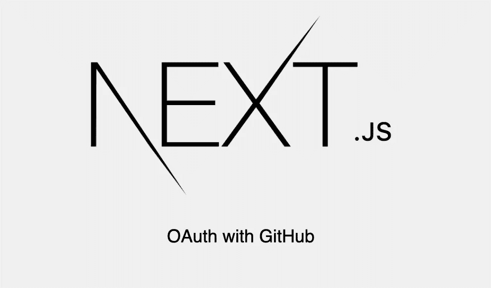
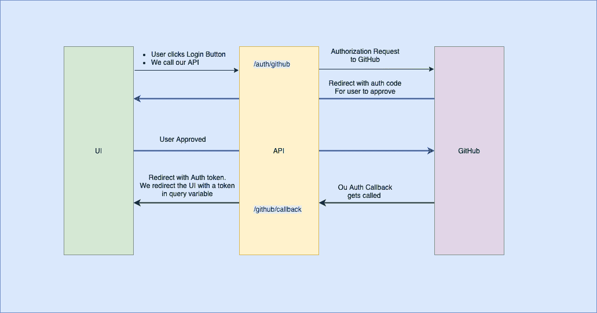

# 带有 Passport 和 Github 的 NextJS OAuth

> 原文：<https://itnext.io/nextjs-oauth-with-passport-and-github-159e324f4900?source=collection_archive---------3----------------------->



在本文中，我们将在 NextJS 客户端和 Express API 之间设置 OAuth。在这篇文章中，我假设了 JavaScript、Nodejs 和 Expressjs 的知识。然而，我把事情解释得很好，足以让任何人跟上并理解事情。

这篇文章由两部分组成。

1.  `API`——涉及 REST API 后端部分，它有端点的 OAuth 集合和一个删除概要文件端点。这将包括创建 REST 端点、GitHub OAuth 和用于存储用户详细信息的 MongoDB 数据库。
2.  `UI` -该部分包括设置一个 Nextjs 服务器端渲染应用程序，该应用程序有一个用于登录的页面。

因此，要让 OAuth 工作，请看下图。



用户点击登录按钮，调用我们的 API `/auth/github`。我们的 API 使用 GitHub passport 库将用户重定向到他们的 GitHub 帐户，以批准或拒绝身份验证。在用户批准身份验证之后，Passportjs 将使用用户详细信息回调我们的身份验证回调端点`/auth/github/callback`。然后，我们使用用户详细信息来生成一个令牌，我们使用该令牌将用户重定向回我们的 UI，并完成身份验证过程。

运行`npm init`创建一个新的 Nodejs 应用程序。

安装包`express`、`body-parser`、`passport`、`passport-github`、`jsonwebtoken`和`mongoose`组成我们的 API 服务器。

```
npm i --save express passport passport-github mongoose jsonwebtoken
```

我们的基本服务器看起来会像这样。使用 body-parser 解析请求体并在端口 3001 上侦听。

让我们允许 cors，这样我们的 UI 将能够调用 API，而没有跨来源请求的限制。这将是一个安装在应用程序请求链中的中间件。

此时我们要做的下一件事是设置 passport 来为下游流程序列化用户。Passport 将在收到 OAuth 响应时序列化用户，然后将一切交给我们。在 OAuth 协商完成后，我们将处理会话并使用 cookie 验证自己。

所以上面的代码将被 passport 和 passport-github 之间的通信所使用，现在是时候设置 OAuth 部分了，它将与 Github API 对话，这将包括登录端点。为此，我们将使用一个专用的路由`/auth`和一些使用 Mongoose 的数据库实用程序来存储来自 OAuth 调用的用户详细信息。

# 设置数据层

这包括你喜欢的任何东西，但我使用 Mongoose 连接到一个本地 mongodb。Mongoose 对于建立快速连接和模型很有用。

当应用程序启动时，启动数据库服务连接。编辑`app.js`并要求 db。

然后我们创建用户模型。只包含`oAuthId`——GitHub 上的用户 id 和`oAuthData`——其余的数据。

接下来，我们创建 DB 实用程序，用于从 Mongodb 创建和获取用户

现在我们已经准备好创建我们的身份验证端点了。但在此之前，请进入 [GitHub OAuth 应用](https://github.com/settings/developers)设置并创建一个新应用。获取值`Client ID`和`Client Secret`，并设置为本地环境，如下所示

现在创建下面的文件，保存 login 调用和 intern 调用 GitHub APIs 的端点。在这里，我们调用 GitHub 并进行身份验证，然后生成一个新的令牌，我们在 URL 查询中将其发送回 UI

然后我们将路线上传到我们的应用程序，编辑`app.js`并添加路线。

我们的 API 现在可以开始接受 OAuth 请求了

使用`npx create-next-app`创建一个新的 Nextjs 应用程序，并按照说明进行操作。创建一个 nextjs 应用程序后，我们将编辑索引页面，使其具有一个登录按钮。

现在，在这一点上，点击登录应该会重定向次数，并把我们带回到在浏览器 cookie 部分有一个名为`authorization`的 cookie 的索引页面。所以我们要做的下一件事就是在使用 Nextjs 服务器为我们的页面提供服务时找到这个 cookie。

为了设置 cookie，因为令牌是在登录后在重定向 URL 中发送的，所以我们在下一个应用程序中使用了一个[定制文档](https://nextjs.org/docs/advanced-features/custom-document)。这将帮助我们在服务器端拦截请求，并使用 [Nookies](https://www.npmjs.com/package/nookies) 设置 cookie

为了在服务器端读取 cookie，我们使用 [Nookies](https://www.npmjs.com/package/nookies) 来读取令牌，同时在请求查询参数中考虑它。

```
npm install — save nookies
```

然后，我们向索引页面组件添加一个`getInitialProps`来读取 cookie。

现在，在成功登录之后，应该不会显示登录，因为在服务器端呈现过程中，我们找到了 cookie，并将其作为一个道具返回给组件，以便在对 API 的任何后续请求中使用。让我们使用令牌来获取用户配置文件。

现在，我们知道 cookie 在服务器端呈现期间是可用的，因此我们可以使用它来执行需要身份验证的 API 调用，例如获取用户配置文件。

为此，我们向用户配置文件添加一个端点

并挂载在 app 上。

然后，我们修改索引页面以在服务器端呈现时获取用户。我们在 get initial props 或 query 中使用从 cookies 中获取的令牌。

我希望你在这篇文章中学到了一些东西。我们使用 cookies 来管理对 REST API 的认证，REST API 使用 passportjs 对 GitHub 进行认证。您可以使用这种方法对任何其他 OAuth API 进行身份验证，比如 Google、Twitter 和脸书。

这里使用的全部代码在 [GitHub](https://github.com/zemuldo/nextjs-oauth) 干杯！

*最初发表于*[T5【http://zemuldo.com】](https://zemuldo.com/blog/5e6d256f7f7b5b001984784f)*。*