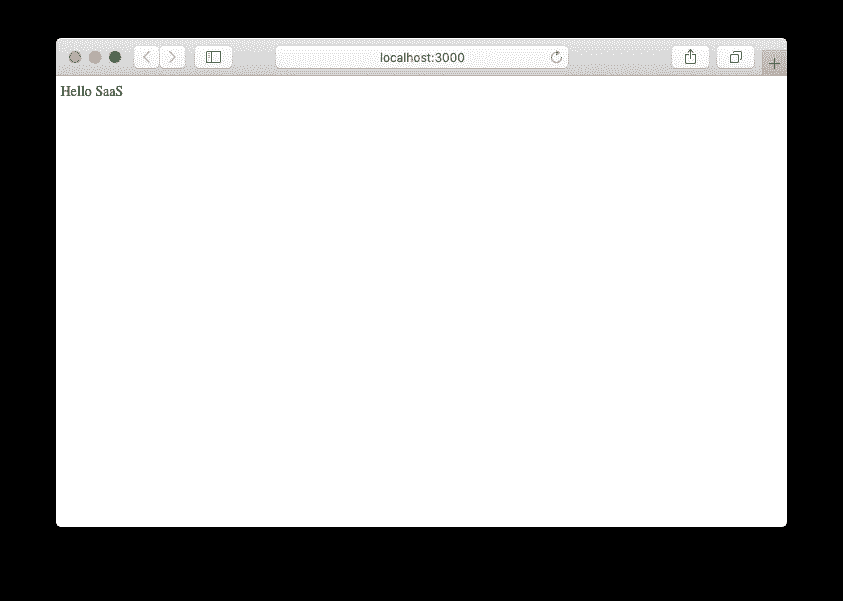
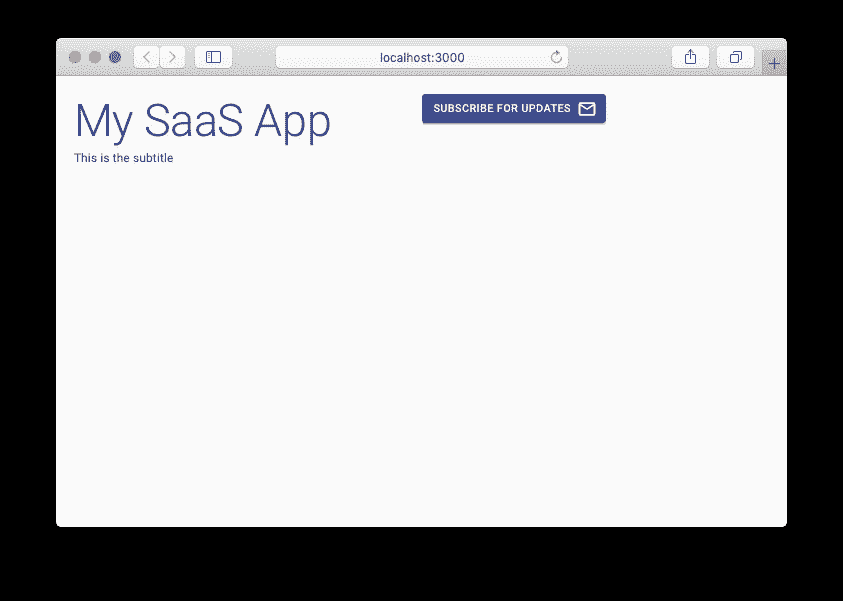
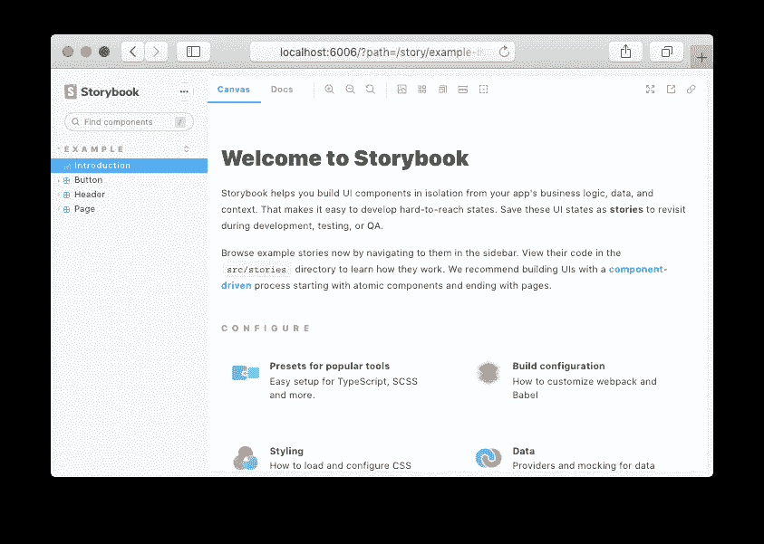
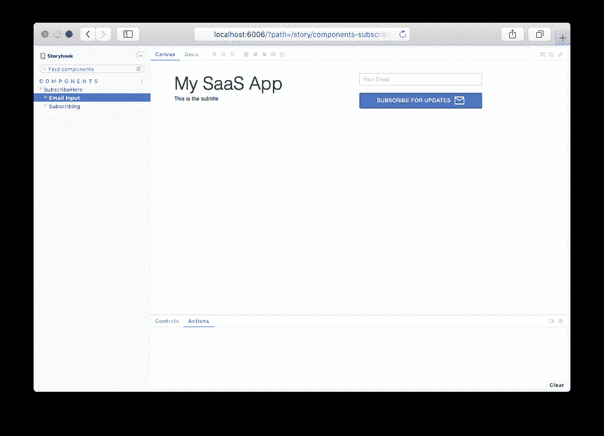
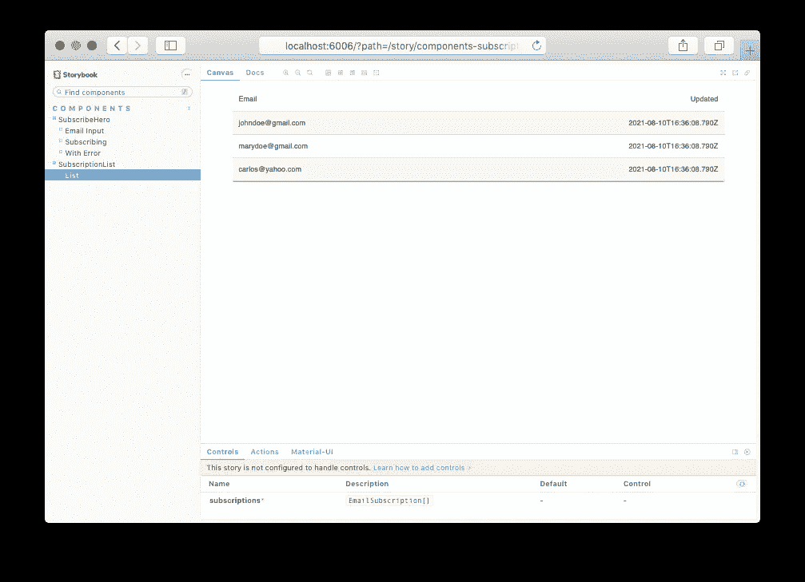
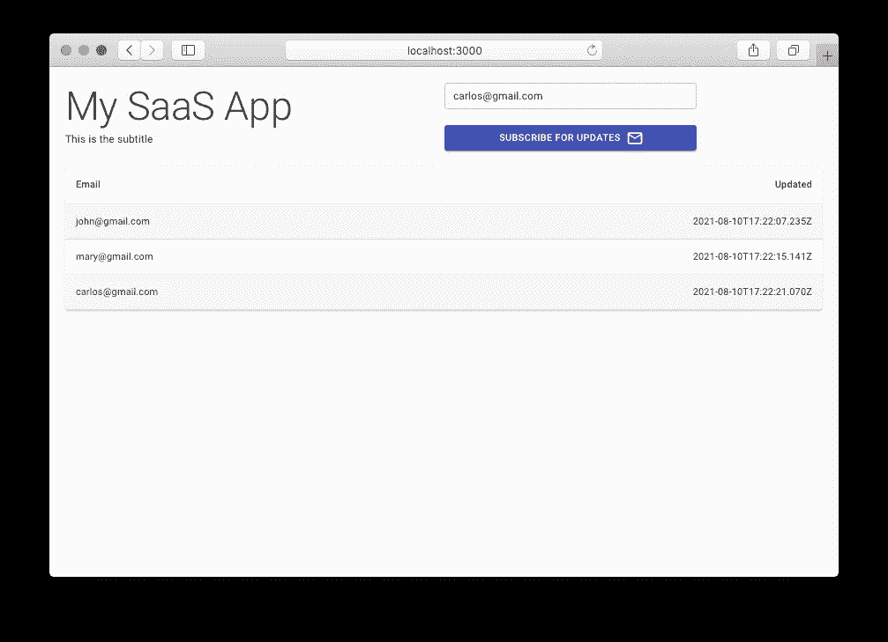

# next js+storybook js+Material-UI+Jest+SWR

> 原文：<https://itnext.io/nextjs-storybookjs-material-ui-jest-swr-fe2ff5cb9af8?source=collection_archive---------3----------------------->

这是我最喜欢的新应用程序设置，我想你也会喜欢的。


米格尔·Á拍摄的照片。帕德里纳来自[派克斯](https://www.pexels.com/photo/paper-boats-on-solid-surface-194094/?utm_content=attributionCopyText&utm_medium=referral&utm_source=pexels)

像 NextJS([https://nextjs.org/](https://nextjs.org/))这样的框架可以帮助你在几秒钟内启动一个 React 应用程序。您只需安装几个 NPM 软件包，创建一个文件，瞧，您就拥有了 React 应用程序，它具有卓越的功能支持，以及一个由解决方案、示例、文档和开发人员组成的庞大生态系统，随时可以帮助您构建您梦想中的 SaaS 应用程序或媒体网站。

对我来说，这是理想的堆栈(截至 2021 年 8 月):

*   NextJS:([https://nextjs.org/](https://nextjs.org/))对所有现代 React 特性和工具无与伦比的支持。
*   TypeScript:([https://www.typescriptlang.org/](https://www.typescriptlang.org/))及早发现一系列可能会困扰你的应用程序的错误。
*   material UI:([https://material-ui.com/](https://material-ui.com/))这个 UI 套件有完整的类型脚本支持和一套非常完整的组件，还有一个很棒的主题 API 和通用的`Box`和`Grid`组件。
*   storybook js:([https://storybook.js.org/](https://storybook.js.org/))在 React 应用中，没有更好更简单的方法来构建界面了。
*   笑话:([https://jestjs.io/](https://jestjs.io/))测试？肯定的！否则你怎么知道你的代码是正确的。从小单元测试开始，然后进行更复杂的集成测试。
*   SWR:([https://swr.vercel.app/](https://swr.vercel.app/))我们喜欢这套用于获取数据的小钩子。有足够多的不可知论者，如果我们愿意，我们可以将它与 REST 或 GraphQL 一起使用。(我用`axios`做 HTTP 客户端)

## 引导 NextJS 应用程序。

让我们为我们的应用程序引导一个 saas-app 文件夹，并安装所有的 NextJS 依赖项，包括 TypeScript。

```
**$ mkdir saas-app
$ cd saas-app
$ yarn init -y**
yarn init v1.22.11warning The yes flag has been set. This will automatically answer yes to all questions, which may have security implications.success Saved package.json✨  Done in 0.05s.**$ yarn add next react react-dom**
yarn add v1.22.11
info No lockfile found.
[1/4] 🔍  Resolving packages...
warning next > native-url > querystring@0.2.1: The querystring API is considered Legacy. new code should use the URLSearchParams API instead.
warning next > node-libs-browser > url > querystring@0.2.0: The querystring API is considered Legacy. new code should use the URLSearchParams API instead.
[2/4] 🚚  Fetching packages...
[3/4] 🔗  Linking dependencies...
[4/4] 🔨  Building fresh packages...success Saved lockfile.
success Saved 197 new dependencies.
info Direct dependencies
├─ next@11.0.1
├─ react-dom@17.0.2
└─ react@17.0.2
info All dependencies
├─ [@babel/code-frame](http://twitter.com/babel/code-frame)@7.12.11
├─ [@babel/helper-validator-identifi](http://twitter.com/babel/helper-validator-identifi)er@7.14.9
...
```

下一步是在`package.json`文件上为`dev`、`build`、`start`和`lint`创建必要的脚本(最近在 v11 上支持)。

```
{
  "name": "saas-app",
  "version": "1.0.0",
  "main": "index.js",
  "license": "MIT",
  **"scripts": {
    "dev": "next",
    "build": "next build",
    "start": "next start",
    "lint": "next lint"
  },**
  "dependencies": {
    "next": "^11.0.1",
    "react": "^17.0.2",
    "react-dom": "^17.0.2"
  }
}
```

用 TypeScript 在`src/pages/index.tsx`创建你的第一个页面(这将告诉 NextJS 我们想要使用它，所以它可以推荐必要的依赖项)。

运行`yarn dev`

```
**$ yarn dev**
yarn run v1.22.11
$ next
ready - started server on 0.0.0.0:3000, url: [http://localhost:3000](http://localhost:3000)
info  - Using webpack 5\. Reason: Enabled by default [https://nextjs.org/docs/messages/webpack5](https://nextjs.org/docs/messages/webpack5)
It looks like you're trying to use TypeScript but do not have the required package(s) installed.Please install typescript and [@types/react](http://twitter.com/types/react) by running:yarn add --dev typescript [@types/react](http://twitter.com/types/react)If you are not trying to use TypeScript, please remove the tsconfig.json file from your package root (and any TypeScript files in your pages directory).error Command failed with exit code 1.
info Visit [https://yarnpkg.com/en/docs/cli/run](https://yarnpkg.com/en/docs/cli/run) for documentation about this command.
```

如你所见，要求我们安装 TypeScript 依赖项，然后再次运行`yarn dev`。

```
**$ yarn add --dev typescript** [**@types/react**](http://twitter.com/types/react)
yarn add v1.22.11
[1/4] 🔍  Resolving packages...
[2/4] 🚚  Fetching packages...
[3/4] 🔗  Linking dependencies...
[4/4] 🔨  Building fresh packages...
success Saved lockfile.
success Saved 5 new dependencies.
info Direct dependencies
├─ [@types/react](http://twitter.com/types/react)@17.0.16
└─ typescript@4.3.5
info All dependencies
├─ [@types/prop-types](http://twitter.com/types/prop-types)@15.7.4
├─ [@types/react](http://twitter.com/types/react)@17.0.16
├─ [@types/scheduler](http://twitter.com/types/scheduler)@0.16.2
├─ csstype@3.0.8
└─ typescript@4.3.5
✨  Done in 1.65s.**$ yarn dev**
yarn run v1.22.11
$ next
ready - started server on 0.0.0.0:3000, url: [http://localhost:3000](http://localhost:3000)
info  - Using webpack 5\. Reason: Enabled by default [https://nextjs.org/docs/messages/webpack5](https://nextjs.org/docs/messages/webpack5)
event - compiled successfully
```

导航至`[http://localhost:3000](http://localhost:3000)`您将看到…



NextJS 应用程序正在运行

设置 NextJS 的最后一步是运行 linter(包含在 v11 中):

```
**$ yarn lint**
yarn run v1.22.11
$ next lint
To use ESLint, additional required package(s) must be installed.Please install eslint and eslint-config-next by running:yarn add --dev eslint eslint-config-nextOnce installed, run next lint again.error Command failed with exit code 1.
info Visit [https://yarnpkg.com/en/docs/cli/run](https://yarnpkg.com/en/docs/cli/run) for documentation about this command.
```

NextJS 再次要求我们安装所需的依赖项:

```
**$ yarn add --dev eslint eslint-config-next**
yarn add v1.22.11
[1/4] 🔍  Resolving packages...
[2/4] 🚚  Fetching packages...
[3/4] 🔗  Linking dependencies...
[4/4] 🔨  Building fresh packages...
success Saved lockfile.
success Saved 137 new dependencies.
info Direct dependencies
├─ eslint-config-next@11.0.1
└─ eslint@7.32.0
info All dependencies
├─ [@babel/runtime-corejs3](http://twitter.com/babel/runtime-corejs3)@7.14.9
├─ [@babel/runtime](http://twitter.com/babel/runtime)@7.14.8
...
```

安装后，我们可以:

```
**$ yarn lint**
yarn run v1.22.11
$ next lint
We created the .eslintrc file for you and included the base Next.js ESLint configuration.
info  - Using webpack 5\. Reason: Enabled by default [https://nextjs.org/docs/messages/webpack5](https://nextjs.org/docs/messages/webpack5)
✔ No ESLint warnings or errors
✨  Done in 1.67s.
```

耶！没有错误或警告

我们将在 NextJS config 上为 TypeScript 更改的最后一个设置是修改 tsconfig.json 文件上的 baseUrl 属性，以将所有代码的基本路径更改为从 src 文件夹开始，这样我们就可以避免导入相对路径，而总是使用从 src 文件夹开始的绝对路径。

```
{
  "compilerOptions": {
    "target": "es5",
    "lib": [
      "dom",
      "dom.iterable",
      "esnext"
    ],
    "allowJs": true,
    "skipLibCheck": true,
    "strict": false,
    "forceConsistentCasingInFileNames": true,
    "noEmit": true,
    "esModuleInterop": true,
    "module": "esnext",
    "moduleResolution": "node",
    "resolveJsonModule": true,
    "isolatedModules": true,
    "jsx": "preserve",
    **"baseUrl": "./src"**
  },
  "include": [
    "next-env.d.ts",
    "**/*.ts",
    "**/*.tsx"
  ],
  "exclude": [
    "node_modules"
  ]
}
```

## 使用 MaterialUI 创建组件

安装 MaterialUI 核心模块和图标模块。

```
**$ yarn add** [**@material**](http://twitter.com/material)**-ui/core** [**@material**](http://twitter.com/material)**-ui/icons**
yarn add v1.22.11
[1/4] 🔍  Resolving packages...
[2/4] 🚚  Fetching packages...
[3/4] 🔗  Linking dependencies...
[4/4] 🔨  Building fresh packages...success Saved lockfile.
success Saved 19 new dependencies.
info Direct dependencies
├─ [@material](http://twitter.com/material)-ui/core@4.12.3
└─ [@material](http://twitter.com/material)-ui/icons@4.11.2
info All dependencies
├─ [@emotion/hash](http://twitter.com/emotion/hash)@0.8.0
├─ [@material](http://twitter.com/material)-ui/core@4.12.3
...
```

为了让 MaterialUI 在服务器端渲染(SSR)应用程序和基于客户端的应用程序上都能很好地工作，我们需要修改我们的 NextJS 应用程序上的两个文件:`src/pages/_app.tsx`和`src/pages/_document.tsx`

src/pages/_app.tsx 文件

src/pages/_document.tsx 文件

有了这些文件，我们现在可以修改 index.tsx 页面以包含实际的 MaterialUI 组件:

带有 MaterialUI 组件的 src/pages/index.tsx 文件

使用 yarn dev 运行我们的应用程序将为我们带来:



## 在 StorybookJS 上创建组件

来自 StorybookJS 网站:

> Storybook 是一个 UI 开发工具。它通过隔离组件使开发更快更容易。这允许您一次处理一个组件。您可以开发整个 ui，而不需要启动复杂的开发堆栈、将某些数据强制输入数据库或在应用程序中导航。

要在您的项目中安装它，请执行以下操作:

```
**$ npx sb init**sb init - the simplest way to add a Storybook to your project.• Detecting project type. ✓
yarn add v1.22.11
[1/4] 🔍  Resolving packages...
[2/4] 🚚  Fetching packages...
[3/4] 🔗  Linking dependencies...
[4/4] 🔨  Building fresh packages...
success Saved lockfile.
success Saved 552 new dependencies.
info Direct dependencies
├─ [@babel/core](http://twitter.com/babel/core)@7.15.0
├─ [@storybook/addon-actions](http://twitter.com/storybook/addon-actions)@6.3.7
├─ [@storybook/addon-essentials](http://twitter.com/storybook/addon-essentials)@6.3.7
├─ [@storybook/addon-links](http://twitter.com/storybook/addon-links)@6.3.7
└─ [@storybook/react](http://twitter.com/storybook/react)@6.3.7
info All dependencies
├─ [@babel/code-frame](http://twitter.com/babel/code-frame)@7.14.5
├─ [@babel/compat-data](http://twitter.com/babel/compat-data)@7.15.0
...
└─ yargs@16.2.0
✨  Done in 35.16s.
. ✓
 • Preparing to install dependencies. ✓yarn install v1.22.11
[1/4] 🔍  Resolving packages...
success Already up-to-date.
✨  Done in 0.58s.
. ✓To run your Storybook, type:yarn storybookFor more information visit: [https://storybook.js.org](https://storybook.js.org)
```

安装完成后，我们已经可以运行`yarn storybook`来查看故事书和自动安装的例子。

```
$ yarn storybook
...
╭────────────────────────────────────────────────────╮
│                                                    │
│   Storybook 6.3.7 started                          │
│   7.7 s for preview                                │
│                                                    │
│    Local:            [http://localhost:6006/](http://localhost:6006/)        │
│    On your network:  [http://10.183.191.72:6006/](http://10.183.191.72:6006/)    │
│                                                    │
╰────────────────────────────────────────────────────╯
```



故事书

我们需要修改一些东西，使这本故事书与我们的 NextJS 和 MaterialUI 设置兼容。首先，让我们安装`storybook-addon-material-ui addon`并在故事书设置文件中配置它。

```
**$ yarn add --dev storybook-addon-material-ui**
yarn add v1.22.11
[1/4] 🔍  Resolving packages...
[2/4] 🚚  Fetching packages...
[3/4] 🔗  Linking dependencies...
[4/4] 🔨  Building fresh packages...
success Saved lockfile.
success Saved 12 new dependencies.
info Direct dependencies
└─ storybook-addon-material-ui@0.9.0-alpha.24
info All dependencies
├─ [@usulpro/color-picker](http://twitter.com/usulpro/color-picker)@1.1.4
├─ abbrev@1.1.1
├─ babel-runtime@6.26.0
...
✨  Done in 7.15s.
```

`.storybook/main.js`应修改为包括以下行(粗体):

```
**const path = require('path')**module.exports = {
  **webpackFinal: async config => {
    config.resolve.modules.push(path.resolve(__dirname, '../src'))
    return config
  },**
  stories: [
    '../src/**/*.stories.mdx', 
    '../src/**/*.stories.@(js|jsx|ts|tsx)'
  ],
  addons: [
    '[@storybook/addon-links](http://twitter.com/storybook/addon-links)', 
    '[@storybook/addon-essentials](http://twitter.com/storybook/addon-essentials)', 
    **'storybook-addon-material-ui'**
  ]
}
```

在`.storybook/preview.js`文件中，我们应该包含 MaterialUI 主题插件装饰器:

```
**import { muiTheme } from 'storybook-addon-material-ui'****export const decorators = [muiTheme()]**export const parameters = {
  actions: { argTypesRegex: '^on[A-Z].*' },
  controls: {
    matchers: {
      color: /(background|color)$/i,
      date: /Date$/
    }
  }
}
```

删除 src/storybook 文件夹，其中包含 storybook 安装中的演示示例。让我们创建自己的组件，并把它放在故事书里。

组件是在 src/components 文件夹中自己的文件夹中创建的:`src/components/SubscribeHero/SubscribeHero.tsx`

src/components/subscribe hero/subscribe hero . tsx

这个组件的故事书:

src/components/subscribe hero/subscribe hero . stories . tsx

运行故事书并检查您的新故事。



订户组件

## 用笑话测试很容易。

单元测试应该很容易添加到您的项目中。我知道对于一个 SaaS MVP 来说，这听起来有点过头了。我的方法是为一些控制我的应用程序逻辑的重要部分的函数创建它们。

为了在我们的项目中增加对 Jest 测试的支持，我们安装了:

```
**$ yarn add --dev jest** [**@types/jest**](http://twitter.com/types/jest) **ts-jest** 
yarn add v1.22.11
[1/4] 🔍  Resolving packages...
[2/4] 🚚  Fetching packages...
[3/4] 🔗  Linking dependencies...
[4/4] 🔨  Building fresh packages...
success Saved lockfile.
success Saved 77 new dependencies.
info Direct dependencies
├─ [@types/jest](http://twitter.com/types/jest)@26.0.24
├─ jest@27.0.6
└─ ts-jest@27.0.4
info All dependencies
├─ [@babel/plugin-syntax-bigint](http://twitter.com/babel/plugin-syntax-bigint)@7.8.3
├─ [@babel/plugin-syntax-import-meta](http://twitter.com/babel/plugin-syntax-import-meta)@7.10.4
...
✨  Done in 9.09s.
```

修改`package.json`文件，添加`test`脚本:

```
{
  "name": "saas-app",
  "version": "1.0.0",
  "main": "index.js",
  "license": "MIT",
  "scripts": {
    ...
    **"test": "jest"**
  },
  "dependencies": {
    ...
  },
  "devDependencies": {
    ...
  }
}
```

在这之后，我们创建了`jest.config.js`文件:

```
module.exports = {
  modulePaths: ['<rootDir>/src'],
  testPathIgnorePatterns: [
    '<rootDir>/.next/', 
    '<rootDir>/node_modules/'
  ]
}
```

为了确保我们也可以使用 TypeScript 编写测试，我们需要在根文件夹上添加一个`.babelrc`。

```
{
  "presets": ["next/babel"]
}
```

并用一个简单的函数及其测试来尝试这一切。

src/lib/email.ts

测试将在嵌套文件夹`__tests__`上创建

src/lib/_ _ tests _ _/email . test . ts

运行测试将为我们提供:

```
**$ yarn test**
yarn run v1.22.11
$ jest
 PASS  src/lib/__tests__/email.test.ts
  isValidEmail
    ✓ valid email (1 ms)
    ✓ invalid emailTest Suites: 1 passed, 1 total
Tests:       2 passed, 2 total
Snapshots:   0 total
Time:        0.687 s, estimated 1 s
Ran all test suites.
✨  Done in 1.77s.
```

全绿！！

# API 和数据获取完成您的设置。

SaaS MVP 不需要复杂的微服务架构。当然有些人会，但大多数人不会。

NextJS 还支持创建 API，因此我们将使用它来创建一个注册 API 后端，并在浏览器中使用它来:

1.  提交订阅的电子邮件地址
2.  查询订阅的电子邮件地址以显示在网格组件上

为了提交数据，我喜欢使用一个定制的钩子来包装`axios`客户机，以便向服务器 API 发送 POST 请求。

为了获取数据，SWR 获取挂钩是一个很好的选择。react-query([https://react-query.tanstack.com/](https://react-query.tanstack.com/))也是一个不错的解决方案。

next-connect([https://www.npmjs.com/package/next-connect](https://www.npmjs.com/package/next-connect))是一个漂亮的小 NPM 模块，帮助你在 NextJS 上构建 API 端点

```
**$ yarn add axios swr next-connect**
yarn add v1.22.11
[1/4] 🔍  Resolving packages...
[2/4] 🚚  Fetching packages...
[3/4] 🔗  Linking dependencies...
[4/4] 🔨  Building fresh packages...
success Saved lockfile.
success Saved 4 new dependencies.
info Direct dependencies
├─ axios@0.21.1
├─ next-connect@0.10.2
└─ swr@0.5.6
info All dependencies
├─ axios@0.21.1
...
✨  Done in 6.83s.
```

## 首先是几个 API。

我们的两个端点将:

1.  POST `/api/subscriptions`创建一个新的订阅，只在 JSON 对象中传递电子邮件。电子邮件将使用我们在上一步中创建的函数进行验证。
2.  获取`/api/subscriptions`以查询所有现有订阅

src/pages/api/subscriptions.ts

有了文件和运行的应用程序，我们可以进行查询:

```
**$ curl -X POST** [**http://localhost:3000/api/subscriptions**](http://localhost:3000/api/subscriptions) **\
-H 'content-type: application/json' \
-d '{"email": "john@gmail.com"}'****$ curl** [**http://localhost:3000/api/subscriptions**](http://localhost:3000/api/subscriptions)
[{"email":"john@gmail.com","updated":1628614626605}]**$ curl -X POST** [**http://localhost:3000/api/subscriptions**](http://localhost:3000/api/subscriptions) **\
-H 'content-type: application/json' \
-d '{"email": "johngmail.com"}'** {"error":"invalid-email"}
```

## 订阅列表组件

另一个可视组件:`SubscriptionList`

src/components/subscription list/subscription list . tsx

故事也是，为了故事书。

src/components/subscription list/subscription list . stories . tsx



故事书上的订阅列表组件

我用来向后端 API 获取和发送数据的定制钩子如下:

1.  `useAPIPost`:向 API 发送 POST 请求的自定义钩子。支持，加载，重置，最后发布，完全键入。
2.  `secureLoader`:接收一个`apiURL`基函数和一个异步`getToken`函数，并为 SWR 钩子返回一个 fetcher 函数。也是全打。

src/lib/api.ts

最后是我们在`index.tsx`页面上的代码。

在浏览器上，我们的应用程序将如下所示:



# 最后…

*   检查 StorybookJS 的 Storyshot 插件来执行视觉测试:[https://www.npmjs.com/package/@storybook/addon-storyshots](https://www.npmjs.com/package/@storybook/addon-storyshots)
*   作为一个 SaaS 应用程序，集成 Stripe 可能是一个好主意。查看此报告以了解如何:[https://github . com/stripe-samples/nextjs-typescript-react-stripe-js](https://github.com/stripe-samples/nextjs-typescript-react-stripe-js)
*   用赛普拉斯([https://www.cypress.io/](https://www.cypress.io/))进行自动化测试是一件轻而易举的事情，并且在交付给客户之前肯定有很多价值要测试。
*   你可以将这段代码作为你下一个应用的模板:[https://github.com/outsrc/next-mui](https://github.com/outsrc/next-mui)
*   查看运行于:[https://next-mui-two.vercel.app/](https://next-mui-two.vercel.app/)的最终应用(将在 3 个月后或 2021 年 11 月 10 日移除)

## 阅读第 2 部分:NextJS + API Routes + MongoDB

[](/part-2-nextjs-api-routes-mongodb-b6895232c27) [## 第 2 部分:NextJS + API Routes + MongoDB

### 将 MongoDB 数据库添加到我们在本博客系列的第一部分中构建的 SaaS MVP 应用程序中。

itnext.io](/part-2-nextjs-api-routes-mongodb-b6895232c27) 

黑客快乐…