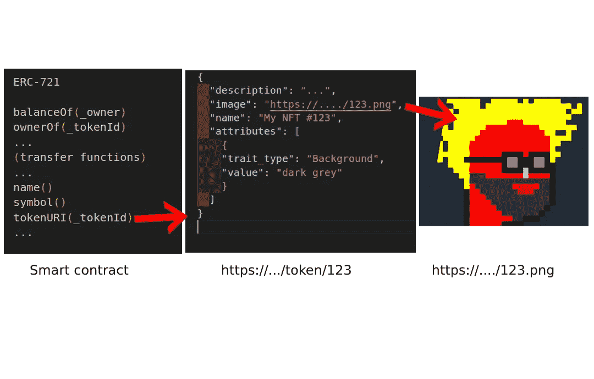
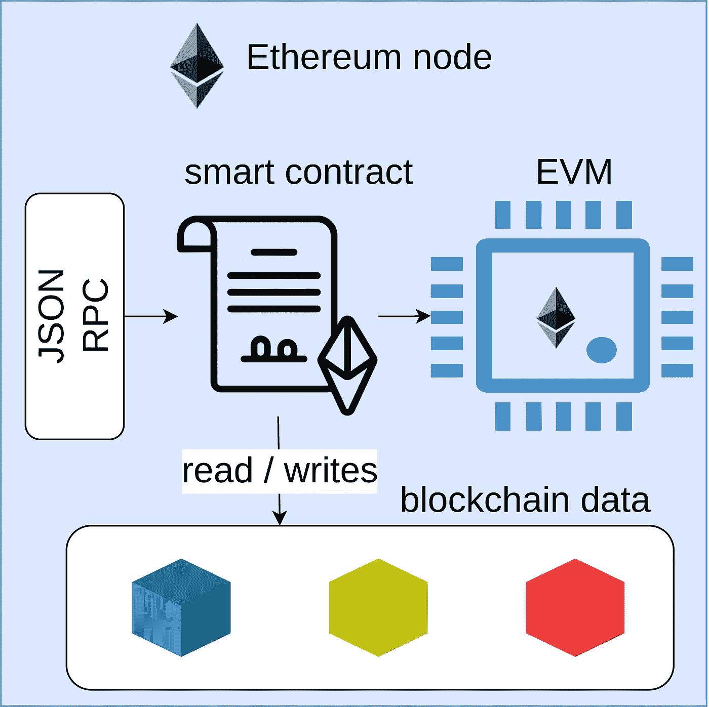

# 软件开发人员解释说

> 原文：<https://itnext.io/nfts-explained-by-a-software-developer-6f0c13c52dfc?source=collection_archive---------0----------------------->

## 还不知道 NFT 是什么吗？

## 作为一名开发人员，创建 NFT 需要知道什么

在本文中，您将了解什么是 NFT，以及我们开发人员如何创建一个(或者 10，000 个)。

> NFT 是记录在区块链上的交易，证明一个独特对象的所有权，通过元数据链接到一些资产，通常是图像或视频。

好吧，这个定义太笼统了，你这样读也解释不了什么。

让我们退一步，从基础开始。


*照片由*[Ananthu Ganesh](https://unsplash.com/@ananthuganesh?utm_source=unsplash&utm_medium=referral&utm_content=creditCopyText)*上* [*下*](https://unsplash.com/s/photos/supermarket-cart?utm_source=unsplash&utm_medium=referral&utm_content=creditCopyText)

## 可替代是什么意思？

想象一下，你在超市，每消费 30 美元就能得到一张优惠券或邮票。你是忠实顾客，有 20 张半美元的优惠券。

现在想象一下，当你拿着优惠券冲出门时，一位中年女士撞到了你，你的 20 张优惠券掉了出来，和那位女士的混在一起。

没什么大不了的，你知道你有 20 块，那位女士也知道她有 10 块。你把它们从地上捡起来，分享它们。每个都很好。

如果我们把优惠券看作代币，它们是可以互换的:你可以互相交换。每一个都具有与另一个相同的价值和特征。

如果你掉了房子的钥匙而不是优惠券，那就不一样了。

虽然看起来很相似，但每把钥匙都不一样，你不能和这位女士互换。如果我们将密钥视为令牌，那么它们是不可替换的令牌。

```
*> Student: So, are house keys NFTs?* *> Guru: No, because they do not "live" on the blockchain.* *> Student: Right, and how does the blockchain work?*
```

# 区块链上的 NFTs

现在我们知道了不可替代性的含义，让我们弄清楚如何将这些令牌与区块链联系起来。

好消息是，详细了解区块链如何开发 NFT 是可选的。我们需要了解一些基本信息。让我们看看。

第一个区块链——比特币——于 2008 年由中本聪诞生:然而，随后的实现都是基于一些标准功能。

区块链(在其基础上)是分布式数据分类账，即，我们可以将其想象为数据库或数据存储器，其中写入交易，即，区块链的状态变化。

它的基本特征是它不是一个单一的、集中的数据源。尽管如此，它还是分布在一个对等网络中，其中每台计算机(称为一个节点)都有整个账本的副本。

数据的添加是通过共识机制完成的，因为大多数网络节点都验证事务。

区块链的基本特征是:

*   是**分布式**(正是因为它是去中心化的)。
*   它是**透明**(因为账本是公开的、公开的)。
*   它是**无信任**(也就是说，它没有用户必须依赖的中央权威或中介，但任何人都可以直接在网络上操作)
*   它是**不朽的**(写在区块链上的数据是永久不变的)
*   它是**安全的**(因为它依赖于使用非对称密钥加密和各种散列系统来确保数据有效的机制)

使这项技术得名的一个关键特征是数据的存储方式:它们被分组到一个按时间顺序连接在一起的块结构中。

将数据写入区块链是通过生成包含一定数量记录的新块来完成的(命名事务)。

计算当前块的散列，然后作为引用插入到下一个块中，从而连接两个块。随着新块的增加，链会增长。


区块链区块生成

# 越来越接近 NFTs

```
*> student: okay, but you still need to tell me how to develop an NFT.**> guru: Easy, you can't run before you know how to walk.*
```

在比特币区块链中，交易本质上包含从一个账户到另一个账户的货币转移。尽管如此，在 2015 年，由于 Vitalik Buterin 的工作，以太坊诞生了。

这个新的区块链允许代码在上面运行。这个代码，这些在区块链上运行的程序，叫做智能合约。

以太坊网络上的每个节点都实现了一个称为以太坊虚拟机(EVM)的系统，这是一个能够执行智能合约代码的虚拟机，使用区块链的本地副本来读写信息，并可能与其他智能合约进行交互。

# 最后，NFTs

NFT 是一种特殊类型的智能契约，它实现了特定的标准。该标准是 ERC-721，它定义了由智能合约实现的接口。

这个接口有确定 NFT 所有权的函数和转移它的函数。

接下来是获取 NFT 的名称和符号的函数。

一个重要的函数是 tokenURI，它为契约管理的每个令牌定义了一个 URI。



NFT 智能合同如何与 NFT 形象相联系

这个 URI 必须指向一个 JSON 文件，其结构类似于图中定义的结构。该标准定义了前三个字段。这些属性是由 OpenSea marketplace 添加的扩展，后来变得非常普遍。

图像属性指向实际的图像。

# 创建 NFT

通常，用户通过 dApp(分散式应用程序)与智能合约进行交互，dApp 与部署在区块链上的智能合约进行交互。

通常，dApp 负责让用户通过其钱包进行连接。此时，它允许用户执行铸造，即:从智能合约生成新的 NFT。

该契约将在区块链上写入一个事务，生成一个新令牌及其相关令牌 id。

该令牌 id 用于检索元数据和图像(通常先前上传到分布式文件系统，例如 IPFS ),以向用户显示新获得的 NFT 的图像。

在这一点上，我们可以再写一次最初的定义，我希望它变得更加明显:

> NFT 是记录在区块链上的交易，证明一个独特对象的所有权，通过元数据链接到资源，通常是图像或视频。

```
*>* student: now I understand, but in practice how should I develop an NFT?
```

## 是的，但实际上呢？

要开发智能合同代码，你需要使用一种合适的编程语言，Solidity 就是其中之一。

ERC-721 接口已经由 [Openzeppelin](https://www.openzeppelin.com/) 为我们实现，该公司已经编写了许多[开源智能合同](https://github.com/OpenZeppelin/openzeppelin-contracts/blob/master/contracts/token/ERC721/ERC721.sol)。

一些框架和工具帮助我们开发 NFT 的智能合约，测试它，在区块链上部署它，与部署的合约进行交互，并最终创建一个 dApp 供用户与之交互。

松露和安全帽是这些工具中最受欢迎的两种。

要开发 NFT，您应该遵循以下步骤:

*   生成资产(图像、视频、音频等。)并上传到网上。最好是在诸如 IPFS 这样的分布式文件系统上。
*   复制资产的 URI。
*   开发实现 ERC-721 的智能合同。您可以使用 Openzeppelin 的 ERC-721 基本智能合约，让您的生活更轻松。
*   对新开发的智能契约编写测试。一旦进入区块链，智能合同就不可编辑:我们的 bug 将永远留在区块链。
*   在测试网络上部署智能合约。是的，幸运的是，区块链也有测试环境。
*   在测试网络上运行 mint 和其他交易的测试。
*   在生产网络上部署智能合约。这一步需要挂接区块链上的一个节点。
*   可选但推荐:开发一个 dApp 来允许用户创建 NFT(通常需要付费)。

```
*> Student: but how do I connect to a blockchain node?*
```

# 奖励:在区块链部署合同

连接到区块链节点是一项具有挑战性的任务。

但是首先，让我们看看节点是如何工作的。每个区块链节点由基本部分组成:

*   区块链的数据
*   执行智能合同的 EVM(以太坊虚拟机)
*   节点公开的 JSON-RPC API，允许用户和其他节点与之通信。



当用户想要与区块链交互时，他必须连接到一个节点，通过调用每个节点公开的 API 来实现。

为此，他需要知道这个 API 的互联网地址。

此外，这些 API 不是我们日常使用的经典 REST APIs，而是“稍微”复杂一些。有两个原因:

1.遵循标准的消息内容以十六进制编码

2.您必须用您的私钥签署大多数邮件。

您应该使用现成的库来实现对区块链节点的调用。几乎每种语言都有一些。

但这并不是故事的结尾。它变得更加复杂，节点可能需要与区块链的其余部分完全同步，或者它可能在处理我们的一个事务时被关闭或变得不可达。

我们如何解决这个问题？

```
*> Student: why can't I launch a blockchain node by myself? In the end, it's just a program running on a server.**> Guru: Running a blockchain node on your pc or server is not trivial. Server space in the hard disk (about a terabyte currently), a lot of RAM, CPU, and download internet bandwidth. You also need to synchronize all existing blockchain data before you can start receiving calls to “run smart contracts.”*
```

幸运的是，存在所谓的提供者，即公开与区块链节点相同的 API 但更可靠且专用于这些操作的服务。最著名的提供商当然是 Infura 和 Alchemy。

因此，当您想要在区块链上部署 NFT 的智能合约时，您必须连接到一个提供者并执行一个“特殊的”合约创建事务。

当契约在区块链上部署时，它会为其分配一个地址。

区块链协定地址是唯一的，必须用于执行智能协定公开的各种交易:例如，NFT 的铸造或转让。

## 铆钉铆合

我们已经给出了创建 NFT 的概述。我们仅仅触及了这个世界的表面，在本文中，没有办法深入开发细节，但是请继续关注。我将尽快发布更多与实现相关的材料。

与此同时，如果你想学习如何开发 NFT 或智能合同，请随时联系我。

谢谢，下次见

> *恭喜你！！😎你坚持到了最后。如果你喜欢👌这篇文章，点击下面按钮👏。这对我意义重大，也有助于其他人了解这个故事。*

更多故事由[洛伦佐·斯皮纳](https://medium.com/@spyna)

[](https://spyna.medium.com/the-truth-about-amazon-job-interview-b940a2190585) [## 如何在亚马逊找到工作

### 我们听说了很多关于亚马逊招聘流程的故事，有些是真的，有些不是。我想分享我的…

spyna.medium.com](https://spyna.medium.com/the-truth-about-amazon-job-interview-b940a2190585)