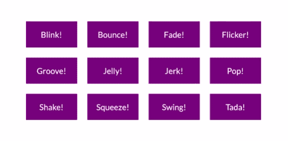

# ng-micro-interact——Web 动画 API 之上的微小角度库

> 原文：<https://itnext.io/ng-micro-interact-a-tiny-interactions-angular-lib-based-on-web-animations-api-1e73923faef1?source=collection_archive---------4----------------------->



[网络动画](https://developer.mozilla.org/en-US/docs/Web/API/Web_Animations_API)仍处于实验阶段，但它是一个漂亮简单的 API，目前它是制作网络动画最具表现力的方式之一。

根据 mdn 的说法:让浏览器在没有黑客、强制或`[Window.requestAnimationFrame()](https://developer.mozilla.org/en-US/docs/Web/API/Window/requestAnimationFrame)`的情况下进行自己的内部优化。

所以我认为基于网络动画 API 为 Angular 创建一个小的交互库会很酷。

如果你熟悉 [micronjs](https://webkul.github.io/micron/) 你会发现它的使用“氛围”,我实际上“转换”了 micronjs 给出的微交互，在运行时基于它的数据属性添加 css 类…而不是我使用的 css 和数据集→ Web 动画 API 和 Angular 指令:)

下面是[演示应用](https://ng-micro-interact-demo.stackblitz.io)。

要开始使用 ng-micro-interact，请遵循以下 3 个步骤:
1 .安装软件包`npm i ng-micro-interact`

2.导入 NgMicroInteractModule

```
import { NgMicroInteractModule } from 'ng-micro-interact'
import { AppComponent } from './app.component';@NgModule({
  imports:      [ BrowserModule, FormsModule, NgMicroInteractModule ],
  declarations: [ AppComponent ],
  bootstrap:    [ AppComponent ]
})
export class AppModule { }
```

3.在您认为适合交互的任何元素上使用该指令:

```
<div ngMicroInteract 
                 [type]="'blink'" 
                 [options]="{ duration: 2000}" 
                 [trigger]="'mouseover'">  Blink! </div>
```

实现真的很简单，深入研究[代码并开始回购](https://github.com/LironHazan/ng-micro-interact)如果你喜欢:)

干杯，

利伦。