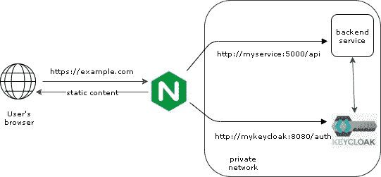

# Nginx 作为 Keycloak 前面的反向代理

> 原文：<https://itnext.io/nginx-as-reverse-proxy-in-front-of-keycloak-21e4b3f8ec53?source=collection_archive---------0----------------------->

具有访问管理服务器、HTTP 服务器和后端服务的全栈基础架构，设置只需几分钟。

照片由[汉娜·布斯](https://unsplash.com/@hannahbusing?utm_source=medium&utm_medium=referral)在 [Unsplash](https://unsplash.com?utm_source=medium&utm_medium=referral) 拍摄

Nginx 是最受欢迎的 HTTP 服务器之一，根据 W3Tech 的调查，超过 33%的网站使用 nginx。这是提供静态内容和将客户端请求转发到服务器的完美选择，从而充当反向代理。

Keycloak 是一个开源的身份和访问管理服务。它提供了您可能需要的所有功能，如多因素身份认证、与通用身份提供商的集成、用户联盟、强力保护等。

为什么不把它们放在一起？在这篇博客中，我们将讨论:

*   Nginx 提供静态内容
*   将流量路由到 Keycloak
*   微调键锁
*   带托管数据库的键盘锁
*   在 HTTPS 服役
*   安全微调
*   摘要

TL；DR 可以随意跳到摘要中查看完整的工作设置。

# 1.Nginx 提供静态内容

让我们从创建 nginx.conf 配置文件开始，它定义了 HTTP 服务器的行为方式。

在服务器部分，我们定义到达端口 80 和任何路径的传入流量应该被路由到 data/www 文件夹。

try_files 指令指示 Nginx 在根目录中搜索$uri，并使用 index.html 作为后备。

现在，在本地创建一个名为 www 的文件夹，并将一些有效的 index.html 文件放入其中，在下一步中，我们将把这个文件映射到服务器的 data/www 文件夹。

我们已经准备好了 Nginx 配置，但是还没有 Nginx 服务器。幸运的是，旋转一个只是几秒钟的事。创建以下 docker-compose.yml 文件:

**Test:** 在根目录下的命令行中键入 docker-compose up 来运行它。导航到 [http://localhost/](http://localhost/) 查看您的 index.html。

# 2.添加键盘锁

启动 Keycloak 最简单的方法是将 JBoss Keycloak 映像添加到 docker-compose.yml 文件中

在本地根目录中，创建一个名为。env 并在其中写入 Keycloak 管理员密码，就像这样`KEYCLOAK_PASSWORD=mysecret!`

默认情况下，Keycloak 服务在路径/auth 上可用。因此，我们需要指示 Nginx，到达端点/auth 的流量应该被重定向到 Keycloak 服务器，所有其他流量都应该由静态内容提供服务。为了实现这一点，nginx.conf 需要通过附加的 location 部分进行扩展，如下所示:

请注意，如果客户端使用路径/auth Nginx 请求端点，则将请求传递给内部网络端点 mykeycloak:8080/auth。这个内部网络端点应该与我们之前在 docker-compose 文件中定义的服务名称相匹配。端口 8080 是 JBoss Keycloak 映像公开的默认端口。

最后，但同样重要的是，通过设置`proxy_set_header`，我们将关于原始主机和客户端 IP 的信息传递给 Keycloak。这使得 Keycloak 能够生成正确的应用内导航链接。如果我们没有这样做，当用户点击登录按钮时，Keycloak 页面会将他发送到不正确的[https://mykey cloak:8080/auth/admin/master/console](http://localhost/auth/admin/master/console)，而不是正确的【https://example.com/auth/admin/master/console】T4。我们还想将客户机 IP 传递给 Keycloak，以支持正确的访问日志记录。

**测试:**运行 docker-compose up，浏览到 [http://localhost/auth](http://localhost/auth) 。您将看到 Keycloak 登录页面，导航到管理控制台时，您可以使用之前在中提供的凭据登录。环境文件。当导航到任何其他路径时，您会看到 index.html

# 3.微调键盘锁

## 连接到数据库

到目前为止，我们的 Keycloak 实例使用内存中的 H2 数据库来存储领域、角色或客户端等设置。为了使这些设置持久化，Keycloak 需要连接到一个真实的数据库。JBoss Keycloak docker image 支持几个数据库，如 Postgress、MariaDB、MySQL、Oracle。让我们假设在 my-sql-host 端点上有一个可用的 MySQL 数据库(您可以用 MySQL 容器扩展 docker-compose 或者连接到现有的 DB)。首先，当您使用 admin 帐户连接到数据库实例时，创建一个数据库和 Keycloak 使用的用户。

然后，我们准备修改 docker-compose.yml 文件，将以下环境变量附加到 mykeycloak 服务中。

不要忘记编辑。env 文件添加一个新行`DB_KEYCLOAK_PASSWORD=mytopsecret`

**测试**:运行 docker-compose up。登录到 Keycloak 管理控制台，创建一个新的领域、角色或客户端。用 docker-compose down 把所有东西都拆了，然后再用 docker-compose up 重新开始。登录到管理控制台，看到您的领域、角色或客户端仍然存在。

## 分配内存

一旦我们有了一个合适的数据库，我们可能想尝试其他设置。例如，即使 Keycloak 规范规定最低内存需求是 512MB，内存不足的容器也会崩溃。内存和其他配置可以通过 docker-compose.yml 文件中的 JAVA_OPTS params 环境变量来传递

`-JAVA_OPTS=-Xms1024m -Xmx2048m`

## 导入领域

导出 Keycloak 设置然后在部署到其他地方时导入它们可能会很方便。

在 Keycloak 管理控制台中，我们可以导出领域并将其存储为本地文件(realm-export.json)。我们可以将它挂载为一个卷，然后浏览 Keycloak 容器来加载这个配置。

# 4.带托管数据库的键盘锁

我用几个托管数据库测试了上面的设置。

*   对于使用 MySQL 引擎的[亚马逊 Aurora 无服务器 v1](https://aws.amazon.com/rds/aurora/serverless/) ，我必须通过设置环境变量`JDBC_PARAMS=enabledTLSProtocols=TLSv1.2`来指定 TLSProtocol
*   我在数字海洋[上用托管的 MySQL 数据库](https://www.digitalocean.com/)测试这个设置失败了，因为在初始化期间 Keycloak 试图创建一个没有主键`Unable to create or change a table without a primary key CREATE TABLE keycloak.DATABASECHANGELOG`的表。我的第一个想法是运行:`SET GLOBAL sql_require_primary_key=OFF`，但是，数字海洋不允许在他们的托管数据库上更改这个设置。
*   AWS RDS MySQL 运行良好

# 5.配置 TLS 协议

对于只是玩玩，依赖 HTTP 是完全可以的，但是对于产品设置，安全的通信是必须的。

我们现在将通过 HTTPS 进行从互联网到 Nginx 的通信，而 Nginx 背后的内部通信，例如当我们的后端服务将与 Keycloak 对话时，将通过 HTTP 进行。这对应于 Keycloak 对“sslRequired”的默认设置:“external”。

注意:Keycloak 的文档建议在生产中将 sslRequired 设置为“all”。我敢肯定，在生产环境中运行的许多堆栈在负载均衡器或反向代理后面没有 TLS，因此依赖于网络隔离。根据项目的具体情况，仔细考虑安全问题。

首先，我们为我们的域获取一个有效的 TLS 证书。我们可以从[让我们加密](https://letsencrypt.org/)中免费获得一个，或者只是为了本教程的目的，生成一个自签名证书(这里的例子[是](https://gist.github.com/cecilemuller/9492b848eb8fe46d462abeb26656c4f8))。

假设我们现在已经将 fullchain.pem 和 privkey.pem 存储在本地目录/etc/letsencrypt 中。

让我们将它们挂载为 docker-compose.yml 的 nginx_rproxy 部分中的卷

`- /etc/letsencrypt/:/etc/letsencrypt/`

对 nginx.conf 文件进行最后的调整:

*   修改服务器以指定证书和私钥的路径
*   将服务器修改为仅侦听端口 443，以服务 HTTPS 流量
*   添加一个监听端口 80 并将所有 HTTP 流量重定向到 HTTPS 端点的服务器

# 6.安全微调

基础设施已经准备好了，我们开发并部署了一个漂亮的 web 应用程序，除了 [Mozilla Observatory](https://observatory.mozilla.org/) (或者你喜欢的安全扫描工具)之外，每个人都很高兴。幸运的是，我们可以通过添加 nginx.conf 安全相关的响应头来修复一些最常见的问题。请参见下面的例子获取灵感:

# 摘要

在这篇博客中，我们配置了 Nginx 服务器来提供静态内容，并将授权请求传递给 Keycloak。类似地，我们可以将请求传递到任何其他内部服务器，例如/api 到 myservice:5000，如完整的 nginx.conf:

我们通过 docker-compose.yml 文件定义了运行容器和服务(可用于开发目的或小型项目)。为了使这个例子完整，我们假设 myservice 是一个运行应用程序的容器，它公开了端口 5000，并且是从根目录中的 docker 文件构建的:

docker-compose.yml 文件假设您有。带有机密的 env 文件已准备好:

感谢阅读！