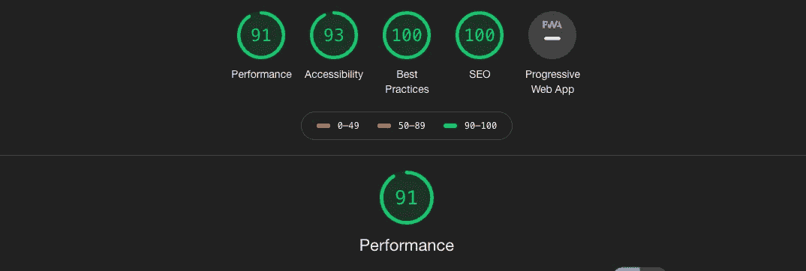
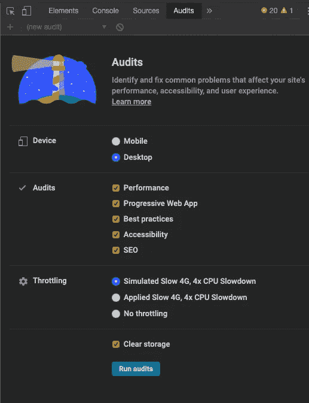
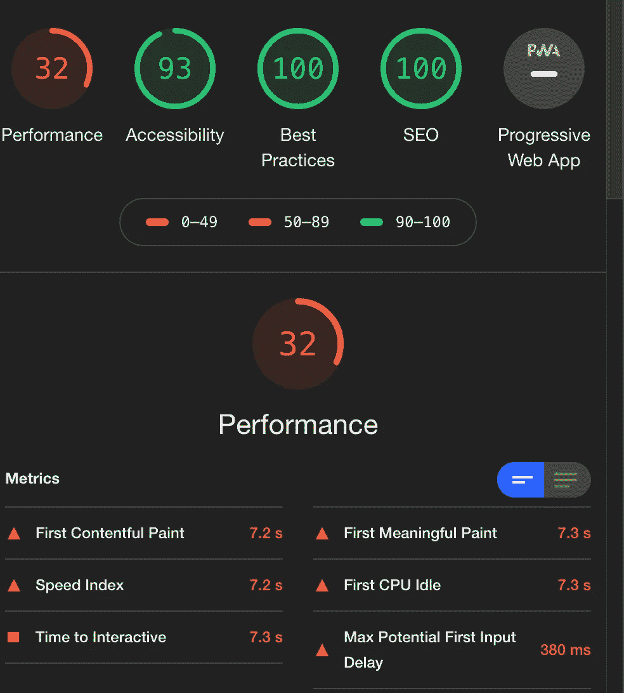
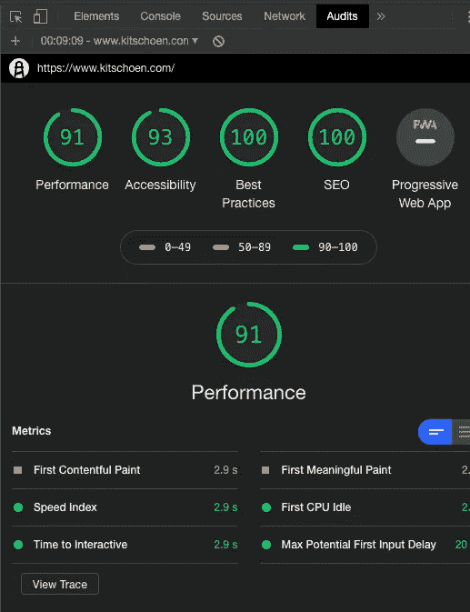
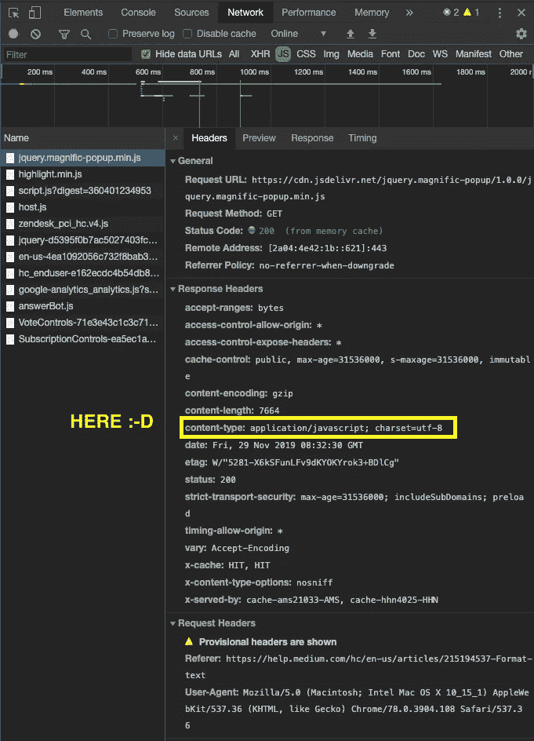

# Nginx + Create-React-App + gzip:在 5 分钟内将你的 Lighthouse 性能分数翻三倍

> 原文：<https://itnext.io/nginx-create-react-app-gzip-tripple-your-lighthouse-performance-score-in-5-minutes-627465c3f445?source=collection_archive---------0----------------------->

*At*[*part well*](https://partwell.io)*我们帮助公司深入了解员工决定离职的原因。最重要的是，我们想出了一个独特的解决方案，帮助您在 5 年内重新雇用高达 40%的最佳流失人才。更多信息请访问*[*part well . io*](https://partwell.io)*。*

许多 react 开发人员使用样板文件来开始他们的项目。最流行的样板设置是 create-react-app。Create-react-app 消除了编写自己的 Webpack 配置的麻烦。但是，使用预定义的 Webpack 配置会删除使用 Webpack 压缩文件的选项。这并不一定是坏事，因为有很多其他方法可以将压缩引入到你的应用程序中。你只需要记得去做…

通过运行快速 Lighthouse 审计，您可以很容易地发现您是否已经在压缩文件。在本文中，我将向您介绍我如何通过使用 Nginx 压缩服务器响应，将个人应用程序的 Lighthouse 性能分数提高了两倍。

# 灯塔:一个巧妙的小把戏

Lighthouse 是一个嵌入 Chrome 的小型审计工具。灯塔测试性能，最佳实践，基本搜索引擎优化和可访问性。它也是帮助你在谷歌搜索上排名更好的工具。您可以在 Chrome inspect 面板中找到 Lighthouse(您可能需要按下小箭头才能找到它):

在对 SEO、最佳实践和可访问性进行了一些相当直接的改进后，我的 create-react-app 的性能得分停留在 32 分:

我尝试了几种方法来提高我的网站的性能:

*   **代码拆分**用动态导入()和 React。悬念(我的分数上升到 33)
*   **通过分析我的渲染树和增加 PureComponent 的使用来优化**渲染(我的分数保持在 33)

自然，这并不令人满意。令我惊讶的是，我在生产中的 Lighthouse 性能得分(33)与我在开发期间看到的几乎相同(29)，并且 Lighthouse 突出地建议在生产中运行审计时启用文本压缩。

这里是要点:Webpack 不会自动压缩对客户端的响应。

在 googling 上搜索这个问题时，我发现 Webpack 能够压缩对客户端(您的用户)的响应，但是您不能在不弹出的情况下使用 create-react-app 样板文件的这一功能。您应该在服务器端实现压缩。Nginx 出现了。

简短声明:启用 gzip 后，我的分数增加了两倍(敬请关注):

# Nginx:一个非常流行的反向反应代理

有一些关于 Nginx 的功能和工作方式的精彩文章。对于本文，我将假设您熟悉 Nginx 的基本工作原理。

事实证明，使用 Nginx 启用 gzip 非常简单。但是有些陷阱最好避免。

下面是一个 Nginx 服务器块，它为您启用了 gzip:

让我们来看一下设置:

**基础设置:**

*   **gzip on:** 这是许多 Nginx 服务器的默认配置。它将启用 gzip，但只针对 MIME 类型 text/html
*   **gzip_disable "msie6":** 禁用不支持 gzip 的浏览器——这将禁用 IE4–6 的 gzip
*   **gzip_vary on:** 让浏览器决定是否接受 gzip。如果它不接受 gzip 发送的未压缩文件。这个决定是通过 Accept 编码头做出的。用现代浏览器发出的典型请求会包含标题:" **accept-encoding** gzip，deflate，br "(在您自己的请求中检查)
*   **gzip_proxied any** :为所有代理请求启用压缩。或者，您可以将压缩限制在包含无缓存或无存储头的响应中。
*   **gzip_comp_level:** 该设置将设置 gzip 的压缩级别(这是一个压缩功能，并不特定于 nginx)。默认级别是 6，这应该适用于大多数用例。但是要注意，Nginx 的默认值为 1。**启动它会增加你的服务器的工作——如果你运行一个大的应用程序会有所不同！**
*   **gzip_buffers:** 设置用于压缩响应的缓冲区的数量和大小。默认情况下，缓冲区大小等于一个内存页面。这要么是 4K，要么是 8K，取决于平台。您可以编辑这个值，或者使用 Nginx 的默认值:gzip_buffers 32 4k|16 8k 这应该可以很好地工作！
*   **gzip_http_version:** 设置压缩响应所需的请求的最低 http 版本——您可以选择忽略此设置，因为 1.1 是默认值。
*   **gzip_min_length 0:** 只能是有一定大小的 gzip 文件(你可以在这里插入一个字节大小)。许多人会告诉你将这个值设置为大约 1000 甚至 10000，但是我发现首先确保你的包有好的大小，并且只包含好的 gzip_types(见下面)更有用。

**陷阱:**

*   **gzip _ types text/plain text/CSS application/JSON application/x-JavaScript text/XML application/XML+RSS text/JavaScript application/vnd . ms-font object application/x-font-TTF font/opentype:**这告诉 Nginx 它应该 gzip 哪些文件格式。通常，对于包含大量文本的文件，如 HTML、CSS 或 JavaScript 文件，好处最大。对于已经压缩的文件格式，如。jpg 或者. png 也可以 gzip。svg 文件，但是我发现它的方式(！)如果您优化您的，性能会更好。svg 文件，然后发送它们(SVGO 是一个伟大的工具)。**请注意:使用 gzip 对服务器来说是一项要求很高的任务。不要简单地盲目压缩所有文件，因为这会对你的网站性能产生不良影响。你需要尝试这些设置，为你的应用找到最佳设置！**

> **这种设置的一个快速提示:** Nginx 使用 MIME 类型来决定它应该压缩哪些文件。你可以在所有现代浏览器的网络标签中检查文件的 MIME 类型，**使用列出的 MIME 类型**。这里有一个例子:

# 安全性

请注意，通过 HTTPS 发送的 gziped 文件可能会受到[违规](https://en.wikipedia.org/wiki/BREACH)攻击。现代浏览器大大降低了这种风险。尽管如此，如果你运行一个有严格安全要求的应用程序，一定要了解通过 HTTP 和 HTTPS 发送压缩文件的安全方面。

# **结论**🎉🎉🎉

用 Nginx 和 create-react-app 设置 gzip 非常简单，大约 5 分钟就可以完成。在进入更高级的优化技术之前，比如代码分割(一旦你有了 React + Redux 应用程序，这可能会变得很麻烦)，这绝对应该是你的首选优化之一。我希望你已经成功地提高了应用程序的性能！

*如果你有兴趣增加你在所有社交渠道的有机接触，请查看*[***https://gosquad . cc***](https://gosquad.cc)