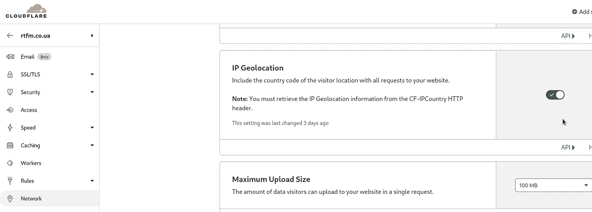
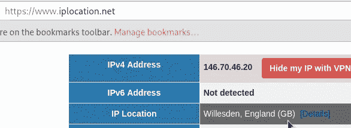
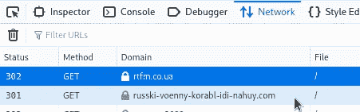

# NGINX:通过 Cloudflare 和“嵌套”if 条件进行 IP 地理定位

> 原文：<https://itnext.io/nginx-ip-geolocation-by-cloudflare-and-nested-if-conditions-1e305beb8efd?source=collection_archive---------1----------------------->


在 Cloudflare 提供的其他功能中，它可以添加一个带有国家值的特殊标题，访问者来自哪里。

作为一个乌克兰人，我想禁止所有来自俄罗斯的游客，但是:

1.  将所有来自俄罗斯 IP 的访问者重定向到另一个 web 域—*russki-voenny-korabl-idi-nahuy.com*
2.  在此期间，我想过滤请求，让来自俄罗斯 Yandex 搜索系统的请求不受影响，因此它将继续在俄罗斯听觉搜索结果中返回我的 RTFM 博客。

# Cloudflare IP 地理定位和 NGINX

这里最简单的部分是通过来自 Cloudflare 的标题来配置过滤器。

首先启用 [CF-IPCountry](https://support.cloudflare.com/hc/en-us/articles/200168236-Configuring-Cloudflare-IP-Geolocation) 表头。

转到您的 Cloudflare *仪表盘>网络*，激活该选项，即使在其基本计划中也是免费的:



然后，在 NGINX 的虚拟主机配置中，在`server {}`块中使用`[proxy_set_header](http://nginx.org/en/docs/http/ngx_http_proxy_module.html#proxy_set_header)`创建一个变量`$http_cf_ipcountry`:

```
...
proxy_set_header CF-IPCountry $http_cf_ipcountry;
...
```

# NGINX 和“嵌套”`if`

第二部分更有趣。

所以，我们需要检查两个条件:

1.  是一个来自俄罗斯的游客
2.  是普通访客，还是 Yandex 搜索机器人？

在 NGINX 中，我们不能使用带有`if`的真正嵌套条件，例如:

```
...
    if ($country_allowed = no) {
        if ($http_user_agent !~* (YandexBot) ) {
            rewrite ^ [https://russki-voenny-korabl-idi-nahuy.com](https://russki-voenny-korabl-idi-nahuy.com) break;
        }
    }
...
```

但是我们在这里能做的，就是使用变量和专用的`if`。

让我们检查一下。

启用 VPN，并检查您现在的位置，例如使用[https://www.iplocation.net](https://www.iplocation.net)服务:



GB —大不列颠。

在`nginx.conf`中，您还可以启用`access_log`的扩展日志格式来查看更多信息，并检查`$http_cf_ipcountry`和我们将在下面添加的新变量`$visitor`的值:

```
...
    log_format  main_ext '$time_local client: $remote_addr fwd_for: $http_x_forwarded_for '
                         'status: $status user_agent: "$http_user_agent" '
                         'server: "$server_name" country: $http_cf_ipcountry visitor: $visitor';
...
```

接下来，创建条件并运行测试。测试成功后，我们会将条件更改为区域 *RU* 和“如果不相等” *Yandex* (参见服务器日志中的 [Yandex 机器人)。](https://yandex.com/support/webmaster/robot-workings/check-yandex-robots.html)

所以:

1.  从`CF-IPCountry`头创建一个名为`$http_cf_ipcountry`的变量；
2.  在第一个`if`条件中，检查`$http_cf_ipcountry`的值:现在，检查 *GB* 并创建一个变量`$visitor`，该变量将保存一个值 *rus* ，如果 region = =*CA*；
3.  在第二个`if`条件中，检查`User-Agent`，如果是== *Firefox* 则给`$visitor`变量增加另一个值- " *重定向*；
4.  在第三个`if`条件中检查`$visitor`变量的值，如果它等于 *rusredirect* 字符串，那么对*russki-voenny-korabl-idi-nahuy.com*域做一个`rewrite`；

此外，您可以将`[rewrite_log](http://nginx.org/en/docs/http/ngx_http_rewrite_module.html#rewrite_log)`参数设置为上的*，并将`error_log`设置为*通知*级别，这样您就能够检查重写是否按预期工作。*

这是我的配置在测试期间的样子:

```
...
    rewrite_log on;
    access_log /var/log/nginx/rtfm.co.ua-access-ext.log main_ext;
    error_log /var/log/nginx/rtfm.co.ua-error.log notice;
...
    proxy_set_header CF-IPCountry $http_cf_ipcountry;

    if ($http_cf_ipcountry = GB) {
        set $visitor rus;
    }

    if ($http_user_agent ~* (Firefox) ) {
        set $visitor "${visitor}redirect";
    }

    if ($visitor = "rusredirect") {
        rewrite ^ [https://russki-voenny-korabl-idi-nahuy.com](https://russki-voenny-korabl-idi-nahuy.com) break;
    }
...
```

检查配置文件并重新加载`nginx`:

```
root@rtfm-do-production-d10:~# nginx -t
nginx: the configuration file /etc/nginx/nginx.conf syntax is ok
nginx: configuration file /etc/nginx/nginx.conf test is successful
root@rtfm-do-production-d10:~# systemctl reload nginx
```

使用 Firefox 浏览器访问博客:



访问日志:

```
root@rtfm-do-production-d10:~# tail -f /var/log/nginx/rtfm.co.ua-access-ext.log | grep GB
02/Apr/2022:06:22:29 +0000 client: 162.158.91.190 fwd_for: 146.70.46.20,146.70.46.20 status: 302 user_agent: “Mozilla/5.0 (X11; Linux x86_64; rv:98.0) Gecko/20100101 Firefox/98.0” server: “rtfm.co.ua” country: GB visitor: rusredirect
```

错误日志:

```
root@rtfm-do-production-d10:~# tail -f /var/log/nginx/rtfm.co.ua-error.log | grep ‘rewritten redirect’
2022/04/02 06:22:29 [notice] 21018#21018: *33766595 rewritten redirect: “https://russki-voenny-korabl-idi-nahuy.com", client: 162.158.91.190, server: rtfm.co.ua, request: “GET / HTTP/1.1”, host: “rtfm.co.ua”
```

用`user_agent: "Firefox"`得到了一个`country: GB`的访客，又得到了一个`redirect: "https://russki-voenny-korabl-idi-nahuy.com"`-*的作品！*(丙)。

现在，用 *RU* 区域和 *Yandex* 为`User-Agent`更改条件到最终版本:

*   设置地区:`if ($http_cf_ipcountry = RU)`
*   并将`~* (Firefox)`改为不相等，即`!~* (Yandex)` - `if ($http_user_agent !~* (Yandex) )`:

```
...
    proxy_set_header CF-IPCountry $http_cf_ipcountry;

    if ($http_cf_ipcountry = RU) {
        set $visitor rus;
    }

    if ($http_user_agent !~* (Yandex) ) {
        set $visitor "${visitor}redirect";
    }

    if ($visitor = "rusredirect") {
        rewrite_log on;
        rewrite ^ [https://russki-voenny-korabl-idi-nahuy.com](https://russki-voenny-korabl-idi-nahuy.com) break;
    }
...
```

完成了。

*最初发布于* [*RTFM: Linux、DevOps、系统管理*](https://rtfm.co.ua/en/nginx-ip-geolocation-by-cloudflare-and-nested-if-conditions/) *。*