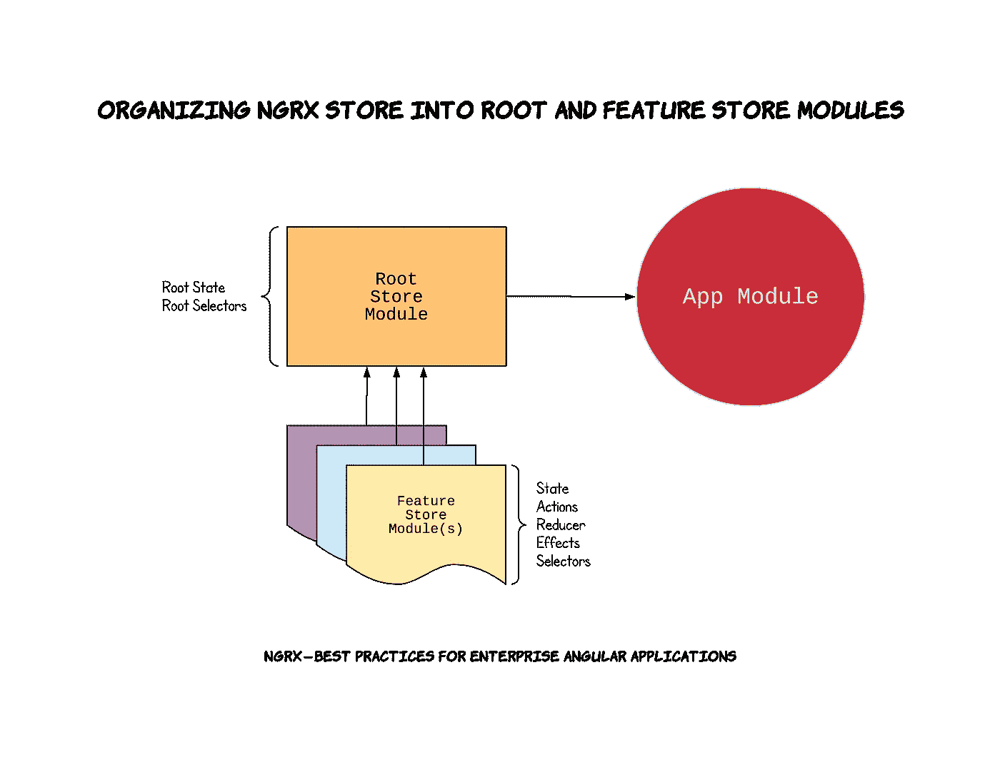

# NgRx —企业角度应用的最佳实践

> 原文：<https://itnext.io/ngrx-best-practices-for-enterprise-angular-applications-6f00bcdf36d7?source=collection_archive---------1----------------------->

[](https://ultimatecourses.com/courses/angular/ref/wes.grimes/) [## ultimate Angular |专家指导的在线 Angular 和 TypeScript 培训课程

### 学习最新的 Angular，TypeScript，通过 NGRX 和超越。通过我们的在线课程，成为在线角度专家。

ultimatecourses.com](https://ultimatecourses.com/courses/angular/ref/wes.grimes/) 

# 在开始之前

本文并不打算成为关于 **NgRx** 的教程。目前有几个很棒的资源，是由比我聪明得多的专家写的。我强烈建议你在尝试实现这些概念之前，花时间学习一下 **NgRx** 和 **redux** 模式。

*   [极限角度— NgRx 存储&效果](https://ultimatecourses.com/courses/angular/ref/wes.grimes/)
*   [多视角—逐角度播放 NgRx](https://www.pluralsight.com/courses/play-by-play-angular-ngrx)
*   [Medium.com NgRx 博客](https://medium.com/ngrx)
*   [NgRx.io 文档](https://ngrx.io/docs)
*   [NgRx.io 资源](https://ngrx.io/resources)

# 背景

下面是我在日常工作中使用 **NgRx** 库构建了几个企业角度应用程序后开发的一个模式。我发现大多数在线教程在帮助您启动和运行您的商店方面做得很好，但通常无法说明在您的商店功能片段、根商店和用户界面之间清晰分离关注点的最佳实践。

使用下面的模式，您的根应用程序状态，以及该根应用程序状态的每个片段(属性)被分成一个 *RootStoreModule* 和每个特性 *MyFeatureStoreModule* 。



# 先决条件

本文假设您正在构建一个 [Angular v6 CLI](https://cli.angular.io/) 生成的应用程序。

# 安装 NgRx 依赖项

在开始生成代码之前，让我们确保根据提示安装必要的 **NgRx** 节点模块:

```
npm install [@ngrx](http://twitter.com/ngrx)/{store,store-devtools,entity,effects}
```

# 最佳实践#1 —根存储模块

创建一个根存储模块，作为捆绑 NgRx 存储逻辑的适当角度的模块。功能存储模块将被导入到根存储模块中，从而允许将单个根存储模块导入到应用程序的主应用程序模块中。

## 建议的实施

1.  使用 **Angular CLI:** 生成 *RootStoreModule*

```
ng g module root-store —-flat false —-module app.module.ts
```

2.使用 **Angular CLI:** 生成 *RootState* 接口来表示应用程序的整个状态

```
ng g interface root-store/root-state
```

这将创建一个名为`RootState`的接口，但是您需要在生成的`.ts`文件中将其重命名为`State`,因为我们希望稍后将它用作`RootStoreState.State`

请注意:您稍后将返回，并将每个特性模块作为属性添加到该接口中。

# 最佳实践#2 —创建功能存储模块

创建特征商店模块作为适当的 Angular NgModule，将你的商店的特征切片捆绑在一起，包括*状态*、*动作*、*减速器*、*选择器*和*效果*。然后特性模块被导入到您的 *RootStoreModule* 中。这将使您的代码清晰地组织到每个特性库的子目录中。此外，如本文后面所述，公共*动作*、*选择器*和*状态*是名称空间的，导出时带有特性存储前缀。

## 命名您的功能库

在下面的示例实现中，我们将使用特性名称 *MyFeature* ，但是，这对于您生成的每个特性都是不同的，并且应该与 *RootState* 属性名称非常接近。例如，如果您正在构建一个博客应用程序，一个特性名称可能是 *Post* 。

## 实体特征模块还是标准特征模块？

根据您正在创建的特征类型，您可能会受益于也可能不会受益于实施 [NgRx 实体](https://medium.com/ngrx/introducing-ngrx-entity-598176456e15)。如果你的商店特性片将处理类型的数组，那么我建议按照下面的*实体特性模块*实现。如果构建一个不包含类型的标准数组的商店特性片，那么我建议遵循下面的*标准特性模块*实现。

## 建议实施—实体特征模块

1.  使用 **Angular CLI:** 生成 *MyFeatureStoreModule* 特征模块

```
ng g module root-store/my-feature-store --flat false --module root-store/root-store.module.ts
```

2.动作—在*app/root-store/my-feature-store*目录下创建一个 *actions.ts* 文件:

3.State 在*app/root-store/my-feature-store*目录下创建一个 *state.ts* 文件:

4.Reducer —在*app/root-store/my-feature-store*目录下创建一个 *reducer.ts* 文件:

5.选择器—在*app/root-store/my-feature-store*目录下创建一个 *selectors.ts* 文件:

6.效果—在*app/root-store/my-feature-store*目录中创建一个 *effects.ts* 文件，包含以下内容:

## 建议实施—标准功能模块

1.  使用**角度 CLI:** 生成 *MyFeatureStoreModule* 特征模块

```
ng g module root-store/my-feature-store --flat false --module root-store/root-store.module.ts
```

2.Actions —在*app/root-store/my-feature-store*目录下创建一个 *actions.ts* 文件:

3.State 在*app/root-store/my-feature-store*目录下创建一个 *state.ts* 文件:

4.Reducer —在*app/root-store/my-feature-store*目录下创建一个 *reducer.ts* 文件:

5.选择器—在*app/root-store/my-feature-store*目录下创建一个 *selectors.ts* 文件:

6.效果—在*app/root-store/my-feature-store*目录下创建一个 *effects.ts* 文件，如下所示:

## 建议实施—实体和标准功能模块

现在我们已经创建了我们的特征模块，无论是实体模块还是上面输入的标准模块，我们需要将部件(状态、动作、缩减器、效果、选择器)导入到特征的 Angular NgModule 中。此外，我们将创建一个桶导出，以使我们的应用程序组件中的导入干净有序，并带有断言的名称空间。

1.  用以下内容更新*app/root-store/my-feature-store/my-feature-store . module . ts*:

2.创建一个*app/root-store/my-feature-store/index . ts*[桶导出](https://twitter.com/toddmotto/status/918818392680824832)。您会注意到，我们导入了商店组件，并在重新导出之前给它们起了别名。这实质上是“命名空间”我们的商店组件。

# 最佳实践#1 —根存储模块(续。)

现在我们已经构建了我们的功能模块，让我们从最佳实践#1 中停止的地方开始，完成构建我们的 *RootStoreModule* 和 *RootState。*

## 建议实施(续))

3.更新*app/root-store/root-state . ts*并为我们之前创建的每个特性添加一个属性:

4.通过导入所有功能模块，更新您的*app/root-store/root-store . module . ts*，并导入以下 **NgRx** 模块:*store module . for root({ })*和*effects module . for root([])*:

5.创建一个*app/root-store/selectors . ts*文件。这将包含任何根状态级别的选择器，例如加载属性，甚至是聚合错误属性:

6.使用以下内容为您的商店创建一个*app/root-store/index . ts*barrel 导出:

# 将根存储模块连接到您的应用程序

现在，我们已经构建了由功能商店模块组成的根商店模块，让我们将它添加到主 *app.module.ts* 中，并展示连接过程是多么整洁和干净。

1.  将 *RootStoreModule* 添加到应用程序的 *NgModule.imports* 数组中。确保当您导入模块以从桶导出时:

```
import { RootStoreModule } from ‘./root-store’;
```

2.这里有一个使用商店的*容器*组件的例子:

# 完成的应用程序结构

一旦我们完成了上述最佳实践的实现，我们的 Angular 应用程序结构应该看起来非常类似于这样:

```
├── app
 │ ├── app-routing.module.ts
 │ ├── app.component.css
 │ ├── app.component.html
 │ ├── app.component.ts
 │ ├── app.module.ts
 │ ├── components
 │ ├── containers
 │ │    └── my-feature
 │ │         ├── my-feature.component.css
 │ │         ├── my-feature.component.html
 │ │         └── my-feature.component.ts
 │ ├── models
 │ │    ├── index.ts
 │ │    └── my-model.ts
 │ │    └── user.ts
 │ ├── root-store
 │ │    ├── index.ts
 │ │    ├── root-store.module.ts
 │ │    ├── selectors.ts
 │ │    ├── state.ts
 │ │    └── my-feature-store
 │ │    |    ├── actions.ts
 │ │    |    ├── effects.ts
 │ │    |    ├── index.ts
 │ │    |    ├── reducer.ts
 │ │    |    ├── selectors.ts
 │ │    |    ├── state.ts
 │ │    |    └── my-feature-store.module.ts
 │ │    └── my-other-feature-store
 │ │         ├── actions.ts
 │ │         ├── effects.ts
 │ │         ├── index.ts
 │ │         ├── reducer.ts
 │ │         ├── selectors.ts
 │ │         ├── state.ts
 │ │         └── my-other-feature-store.module.ts
 │ └── services
 │      └── data.service.ts
 ├── assets
 ├── browserslist
 ├── environments
 │ ├── environment.prod.ts
 │ └── environment.ts
 ├── index.html
 ├── main.ts
 ├── polyfills.ts
 ├── styles.css
 ├── test.ts
 ├── tsconfig.app.json
 ├── tsconfig.spec.json
 └── tslint.json
```

# 完整的工作示例— Chuck Norris 笑话生成器

我已经收集了上述最佳实践的完整工作示例。这是一个简单的查克·诺里斯笑话生成器，使用了 *@angular/material* 和[http://www.icndb.com/](http://www.icndb.com/)API 获取数据。

## 开源代码库

[](https://github.com/ngHighCountry/angular-ngrx-chuck-norris) [## nghighground/angular-ngrx-chuck-Norris

### angular-ngrx-Chuck-Norris-Chuck Norris 笑话生成器，带 NgRx 商店

github.com](https://github.com/ngHighCountry/angular-ngrx-chuck-norris) 

## 斯塔克布里茨

你可以在[https://angular-ngrx-chuck-Norris . stack blitz . io](https://angular-ngrx-chuck-norris.stackblitz.io)看到现场演示，这里是 [Stackblitz](https://stackblitz.com) 编辑器:

[](https://stackblitz.com/edit/angular-ngrx-chuck-norris?embed=1&file=src/app/containers/jokes/jokes.component.ts) [## 安格尔-ngrx-查克-诺里斯-斯塔克布利茨

### NgRx _ 最佳实践 _ 查克 _ 诺里斯 _ 范例

stackblitz.com](https://stackblitz.com/edit/angular-ngrx-chuck-norris?embed=1&file=src/app/containers/jokes/jokes.component.ts) 

# 结论

重要的是要记住，我已经在几个“真实世界”的应用程序中实现了这些最佳实践。虽然我发现这些最佳实践很有帮助，并且可维护，但我不认为它们是组织 NgRx 项目的终极解决方案；我就是这么做的。我很好奇你们都是怎么想的？在使用 NgRx 构建企业级 Angular 应用程序时，请随时提供您学到的任何建议、技巧或最佳实践，我将更新文章以反映这一点。编码快乐！

# 额外资源

我强烈推荐参加终极角度课程，尤其是 NgRx 课程。它物有所值，我已经把它作为新的 Angular 开发者的培训工具。点击下面的链接注册。

[](https://ultimatecourses.com/courses/angular/ref/wes.grimes/) [## ultimate Angular |专家指导的在线 Angular 和 TypeScript 培训课程

### 学习最新的 Angular，TypeScript，通过 NGRX 和超越。通过我们的在线课程，成为在线角度专家。

ultimatecourses.co](https://ultimatecourses.com/courses/angular/ref/wes.grimes/)