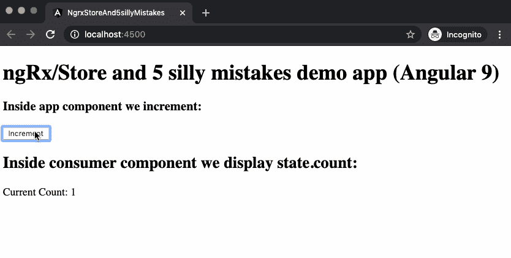
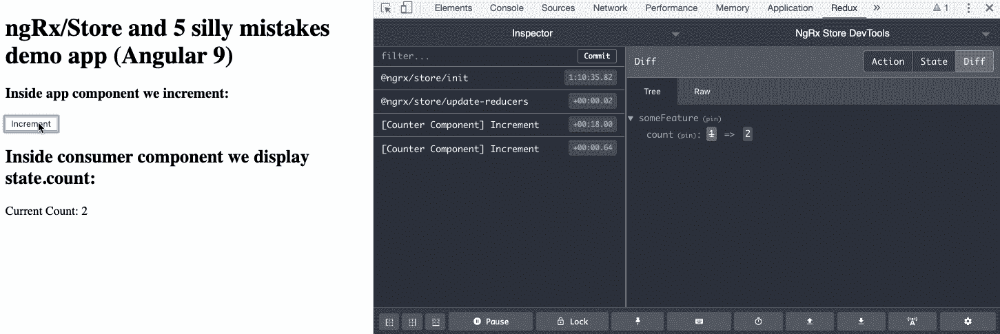
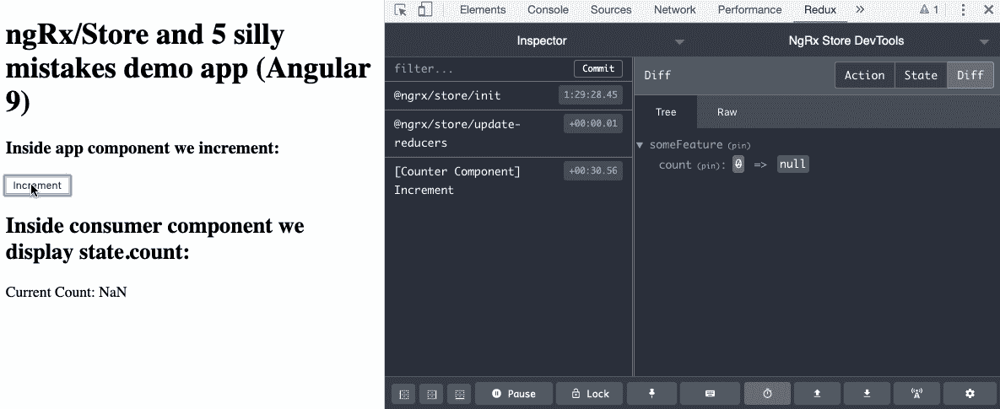
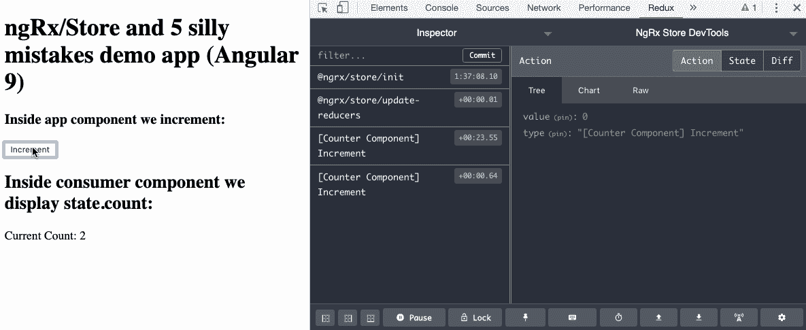
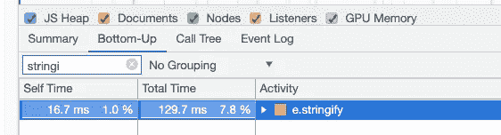
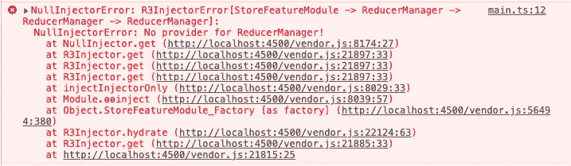
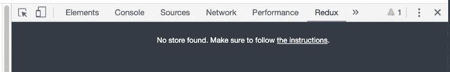
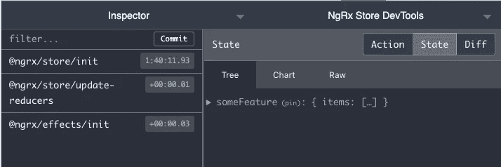
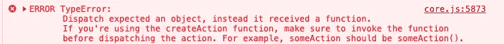
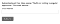

# ngRx/Store 和 5 个愚蠢的错误

> 原文：<https://itnext.io/ngrx-store-and-5-silly-mistakes-780ae2f961d0?source=collection_archive---------2----------------------->

*学习如何避免它们*


与其花时间在调试上，不如花时间和家人在一起:-)

*在这篇文章中，我将告诉你如何在使用 ngRx 来改善你的家庭与工作平衡时避免简单的陷阱:-)*

## 介绍

如果你和 Angular 一起工作，你肯定知道 Angular 应用最流行的状态管理系统 [**ngRx/Store**](https://ngrx.io/) 。

让我们回忆一下什么是在同一页上:

> **@ngrx/store**
> 
> …是 RxJS 供电的状态管理，用于角度应用，灵感来自 Redux。Store 是一个受控状态容器，旨在帮助在 Angular 上编写高性能、一致的应用程序。

以下是官方文档中描述其工作原理的流程图:


组件发送**动作**，这是一个具有强制属性*类型*和可选的其他属性的对象，其数据将被存储到中心对象——存储。动作由***reducer****处理，这是一个特殊的函数，它从动作中产生数据并把它们存储(或修改存储)。其他组件可以使用**选择器**订阅存储更新(到存储的特定部分)(实际上选择器决定了您想要监控存储更新的哪一部分)。在简单的情况下，选择器接收状态对象作为参数，并返回状态对象的一些属性:*

```
*(state) => state.prop1*
```

*在我开始占用你的时间之前，让我们回顾一下最简单的例子。为了不重复发明自行车，我将使用[官方文件](https://ngrx.io/guide/store)中的简化示例。*

*我们将创建一个带有计数器值的存储，以及增加该计数器值的操作/缩减器。*

*让我们创建一个操作:*

```
*// src/app/counter.actions.ts[import](https://ngrx.io/api/store-devtools/DevToolsFeatureOptions#import) { [createAction](https://ngrx.io/api/store/createAction) } from '@ngrx/store';[export](https://ngrx.io/api/store-devtools/DevToolsFeatureOptions#export) const increment = [createAction](https://ngrx.io/api/store/createAction)('[Counter Component] Increment');*
```

*减速器:*

```
*//src/app/counter.reducer.tsimport { createReducer, on } from '@ngrx/store';
import { increment } from './counter.actions';export const initialState = 0;
const _counterReducer = createReducer(initialState,
   on(increment, state => state + 1)
);export function counterReducer(state, action) {
   return _counterReducer(state, action);
}*
```

*将 StoreModule 模块添加到 app.module.ts*

```
*import { BrowserModule } from '@angular/platform-browser';
import { NgModule } from '@angular/core';
import { AppComponent } from './app.component';import { StoreModule } from '@ngrx/store';import { counterReducer } from './counter.reducer';@NgModule({
  declarations: [AppComponent],
  imports: [
    BrowserModule,
    StoreModule.forRoot({ count: counterReducer })
  ],
  providers: [],
  bootstrap: [AppComponent],
})export class AppModule {}*
```

*您可以看到，我们在这一行中指定了我们的减速器*

```
*StoreModule.forRoot({ count: counterReducer })*
```

*要读取计数值我们只需要使用 [*选择*](https://ngrx.io/api/store/select) 功能中的一个组件:*

```
*// in some component
import { Store, select } from '@ngrx/store'
...constructor(private store: Store<{ count: number }>) {this.count$ = store.pipe(**select**('count')); 
// now we have observable that will emit values on each count update// old school approach
//this.count$ = store.pipe(**select**(state => state.count));}*
```

*如果我们不想在主应用程序模块中继续计数怎么办？我们可以把它放到一个特征模块中。*

```
*@NgModule({
  declarations: [AppComponent],
  imports: [
    BrowserModule,
    StoreModule.forRoot({}),
    StoreModule.forFeature('featureName', { count: counterReducer })
  ],
  providers: [],
  bootstrap: [AppComponent],
})export class AppModule {}*
```

*现在，我们从商店状态的特征分支获取值的选择器将是:*

```
*// count.selectors.ts
export const selectFeature = createFeatureSelector<FeatureState>('featureName');export const countSelector = createSelector(selectFeature, (state) => state.count); // And in some component
this.count$ = store.pipe(**select**(countSelector));*
```

*现在让我们来看看这一切是如何工作的:*

**

*一个组件增加 state.count，另一个组件显示状态值。*

*我们所有的动作和商店状态的变化都可以通过 Chrome 插件观察到: [Redux DevTools](https://chrome.google.com/webstore/detail/redux-devtools/lmhkpmbekcpmknklioeibfkpmmfibljd?hl=ru) :
1。在 Chome
2 中安装一个插件。将 [@ngrx/store-devtools](https://ngrx.io/api/store-devtools) 模块安装到您的 Angular app:
—**ng add @ ngrx/store-devtools**
—或***NPM I @ ngrx/store-devtools***(在这种情况下，您应该手动将 StoreDevtoolsModule 添加到 AppModule 中)*

*3.在 Chrome 开发工具中监控你的商店(Redux 标签)*

**

*简单吧？*

*此时，您可能会问自己，为什么我们需要一篇仅仅代表官方文档示例的文章？因为即使有了这些简单的流程，如果有些东西不能像预期的那样工作，您也可能会花费数小时进行调试。*

***我在我(和我的开发伙伴)的实践中揭露了 5 个常见的错误。***

## ***#1。Redux-DevTools 不显示动作中未定义的道具***

*假设我们有一个动作，它不仅发送唯一类型的消息，还发送一些附加信息:*

```
*{
 type: SOME_TYPE,
 value: this.someProp
}*
```

*为此，让我们稍微修改一下代码:*

```
***// counter.actions.ts**
...
export const increment = createAction('[Counter Component] Increment', props<{value: number}>());**// counter.reducer.ts**
const counterReducerFunc = createReducer(initialState,
  on(increment, (*state*, {*value*}) => *state* + 1 + *value*)
);**//app.component.ts**
public value;
...increment() {
// provide additional value to actionCreator function  this.store.dispatch(increment({value: this.value})); 
}*
```

*现在我们的减速器应该将状态值增加 1，并添加*值。**

*但是，有些地方出错了，您想在 Redux Dev 工具中调试这些操作。*

**

*调试问题*

*好吧，*算*得了楠值，这是不正确的。还有为什么我们在 ReduxDevTools 的动作标签内容中看不到*值*道具？只有*类型的*字段存在。*

*答案是 **a)** 我们忘记给 *value* 属性赋值了，Chrome 插件不能得到未定义的值 ，因为它不能被字符串化。*

*让我们将*值*赋值为 0 ***。****

```
***//app.component.ts**
public value = 0; // or other number value*
```

*现在我们可以在 ReduxDevTools 中观察这个道具:*

**

*我花一个小时来揭示它。也许看完这个你会少浪费点时间:)*

*你可以看一下[这个分支中的代码文章 GitHub repo](https://github.com/kievsash/ngrx-store-and5sillyMistakes/tree/pitfall_1_ReduxDevTools_Doesnt_display_undefined) 。或者在 ng-run.com 游乐场检查一下。*

***要点:**如果您需要指定空值，最好使用 **null** ，因为 null 可以被字符串化并显示在 ReduxDevTools 中。*

## ***#2。StoreDevModule 可能会降低应用程序的速度***

*很久以前，我在一家商店里有一大堆物品。一些用户操作修改了特定动作类型的数据，并将它们放回存储器，然后组件显示这些数据。*

*我们的测试人员观察到，从列表中的几百个项目开始，每个用户操作都会导致微小但明显的 UI 更新延迟。这不是渲染，而是 JS 问题。*

*在性能标签上用 ChromeDevTools 检查后(你可以在这里阅读更多信息)，我得到了这张图片:*

**

*7.8%的 Javascript 活动被 stringify 函数捕获*

*你记得为什么会这样吗？是的，因为我们将数据发送到 ReduxDevTools 插件，以便能够监控存储操作和状态。*

*由于我们手动将 StoreDevToolsModule 添加到 AppModule，因此我们错过了为产品构建关闭它的选项:*

```
*imports: [
  StoreModule.forRoot({}),
  StoreModule.forFeature(featureKey, {items: itemsReducer}),
  BrowserModule,
  // StoreDevtoolsModule.instrument({ maxAge: 25, **logOnly: environment.production** }), **// missed logOnly option**
  EffectsModule.forRoot([AppEffects])
],*
```

*在我添加它之后— UI 开始感觉好多了:-)*

***要点:**当您使用 StoreDevtoolsModule 监控您的 ngrx/Store 活动时，不要忘记 **logOnly** 选项。实际上，如果你用**ng add @ ngrx/store-dev tools**安装，那么这个选项会自动添加。你可以在这里阅读更多关于*logon only*的内容。*

*可以玩 GitHub 回购分支中的代码[。或者在](https://github.com/kievsash/ngrx-store-and5sillyMistakes/tree/pitfall_2_StoreDevtoolsModule_slow_down)[ng-run.com](https://ng-run.com/)Angular 游乐场由 [Alexey Zuev](https://medium.com/u/d59a9e801370?source=post_page-----780ae2f961d0--------------------------------) 开始这个分支。为此，只需复制 GitHub 分支链接，并添加 ng-run.com/github/<your link>，如下所示:*

```
***Branch link:** 
https://github.com/kievsash/ngrx-store-and5sillyMistakes/tree/pitfall_2_StoreDevtoolsModule_slow_downNow lets start it on ng-run.com[https://ng-run.com/github/**kievsash/ngrx-store-and5sillyMistakes/tree/pitfall_2_StoreDevtoolsModule_slow_down**](https://ng-run.com/github/kievsash/ngrx-store-and5sillyMistakes/tree/pitfall_2_StoreDevtoolsModule_slow_down)*
```

*喜欢这篇文章？ [**给我买杯咖啡**](https://buymeacoffee.com/nqypxi6) :-)*

***#3。您导入了功能模块，但它不工作***

***a)** 好了，你有了漂亮的特征角度模块，你把:*

```
*// feature.module.ts...imports: [
   StoreModule.forFeature(featureKey, {items: itemsReducer}),
...*
```

*当您将它添加到 app.module.ts AppModule imports 时，您希望它应该可以工作。但是…它没有)你打开一个 ChromeDevTools 控制台，看到:*

**

*好，那么我们转到 [ngrx/platform GitHub repo](https://github.com/ngrx/platform/search?q=ReducerManager&unscoped_q=ReducerManager) 并搜索' *ReducerManager* 实体。并且看到它是由 StoreModule.forRoot(…)在这里调用作为 REDUCER_MANAGER_PROVIDERS 提供的。答案是显而易见的:我们忘记在 out AppModule 中包含 StoreModule.forRoot({})。*

```
*// app.module.ts
imports: [
  StoreModule.forRoot({}),
  StoreModule.forFeature(featureKey, {items: itemsReducer}),*
```

*现在它工作得很好。*

****b)*** *我发现了一个更有趣的行为，但是使用了 StoreDevtoolsModule**

*好的，那么您将它添加到 AppModule:*

```
*imports: [
  StoreDevtoolsModule.instrument({ maxAge: 25, logOnly: environment.production }),
  StoreModule.forRoot({}),
  StoreModule.forFeature(featureKey, {items: itemsReducer}),*
```

*但是当你在 ChromeDevTools 中打开 Redux 标签时，你会看到这个:*

**

*找不到商店。*

*为什么？？*

*因为我只是把 StoreDevtoolsModule 放在 StoreModule.forRoot 之前的 *imports* 数组中，所以看起来 Angular 试图在创建任何存储之前实例化它。只需将 StoreDevtoolsModule 放在 app module decorator*imports*数组中 StoreModule.forRoot 之后即可修复问题。*

```
*imports: [
  StoreModule.forFeature(featureKey, {items: itemsReducer}),
  StoreModule.forRoot({}),
  StoreDevtoolsModule.instrument({ maxAge: 25, logOnly: environment.production }),*
```

*现在它运行良好:*

**

*有趣的是，在 Angular 9 中，将 *StoreModule.forFeature* 放在 StoreModule.forRoot 之前不会产生任何[问题](https://github.com/ngrx/platform/issues/400)。*

*你可以在这里找到和[一起玩的代码](https://github.com/kievsash/ngrx-store-and5sillyMistakes/tree/pitfall_3_StoreDevtoolsModule_before_StoreModule.forRoot)。*

***#4。导出的缩减器函数是必要的，因为 AOT 编译器不支持函数调用(在 Angular 8 中)。***

*这个陷阱的名称听起来不清楚，但实际上非常简单。你有减速器:*

```
*export const counterReducer = createReducer(initialState,
  on(increment, *state* => *state* + 1),
  on(decrement, *state* => *state* - 1),
  on(reset, *state* => 0),
);@NgModule({
  declarations: [],
  imports: [
    StoreModule.forRoot({ count: counterReducer })
  ],
  providers: [],
})
export class CounterStateModule { }*
```

*它工作得非常好…直到我们尝试构建产品代码:*

```
*ERROR in Error during template compile of 'CounterStateModule'
  Function calls are not supported in decorators but 'createReducer' was called in 'counterReducer'
    'counterReducer' calls 'createReducer' at app/counter.state.ts*
```

*这是一个众所周知的问题，你可以在这里阅读更多关于它的内容。*

*幸运的是，当我用 Ivy (ngRx/Store 8.6)在 Angular 9 项目上测试的时候——已经解决了！你可以在本期[中读到更多细节。](https://github.com/ngrx/platform/issues/2241)*

*你可以在这里查看代码[。](https://github.com/kievsash/ngrx-store-and5sillyMistakes/tree/pitfall4_no_need_to_export_function_for_reducer)*

***外卖:**更新到 Angular 9 😎*

***#5。Action creator 是一个函数，但是如果你忘记放括号，ngRx 会保持沉默。***

*下面是一个可能的陷阱重现代码:*

```
*constructor(private store: Store<{ count: number }>) {
}

selectAll() {
  this.store.dispatch(select);//should be select() but no type error
}
unselectAll() {
  this.store.dispatch(unselect()); // correct
}*
```

*Typescript 在这里帮不了你。但幸运的是，你会在 ChromeDevTools 控制台中找到提示:*

**

*要点:不要把所有的鸡蛋都放在打字筐里🎓有时候可能对你没什么帮助。*

## *结论*

*好，那么我们从这篇文章中学到了什么？*

1.  *使用 **null** 而不是 **undefined** 作为 *noValue* 以便能够在 ReduxDevTools Chrome 插件中观察到。*
2.  *StoreDevModule 可能会降低应用程序的速度。为防止这种情况发生，将*仅登录*选项设置为*真。**
3.  *当您连接其他 ngrx/Store 功能模块时，不要忘记将 StoreModule.forRoot({})放在 AppModule 中。*
4.  *在 Angular 9 中不需要导出减速器功能。*
5.  *不要忘记在你的调用动作创建函数中使用圆括号。*

*现在你可以花更多的时间和家人在一起，而不是调试 sessions⛷*

*让我们在 [**推特**](https://twitter.com/El_Extremal) 上保持联系吧！*

> *顺便说一句。我在 Youtube 上开始了一个视频教程系列“ [**有棱角可以浪费你的时间**](https://www.youtube.com/watch?v=HI5f6naJdJ8&list=PLNadw4d8-KMVSOffiYBuOlzvF38sO9pdu&utm_content=educational&utm_campaign=2019-11-13&utm_source=email-sendgrid&utm_term=8565702&utm_medium=2586716) ”。在那里，我将发布关于用 Angular 和 RxJS 解决棘手问题的视频。 [**看一看！**](https://www.youtube.com/watch?v=HI5f6naJdJ8&list=PLNadw4d8-KMVSOffiYBuOlzvF38sO9pdu&utm_content=educational&utm_campaign=2019-11-13&utm_source=email-sendgrid&utm_term=8565702&utm_medium=2586716)*

****

*干杯！*