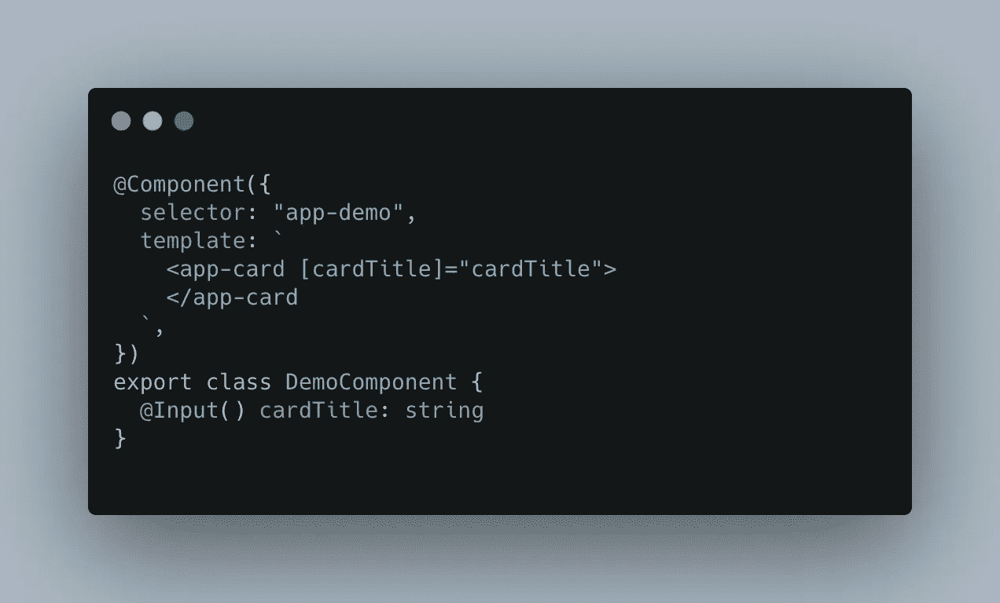
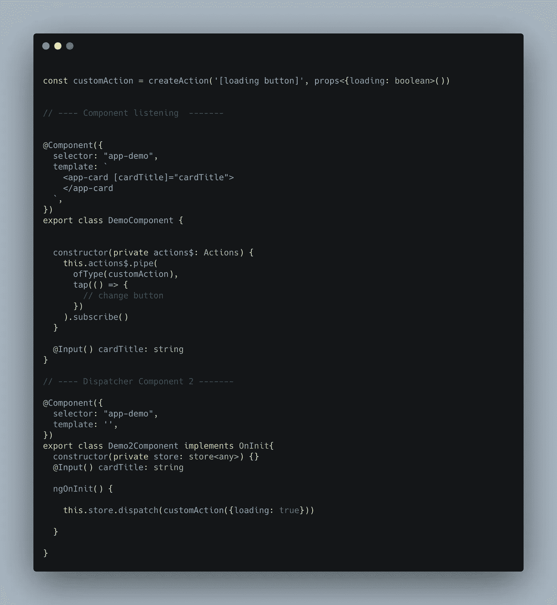

# NGRX —使用操作来创建更具反应性的应用程序

> 原文：<https://itnext.io/ngrx-use-actions-to-create-more-reactive-applications-514562ad23e8?source=collection_archive---------0----------------------->

TLDR:

使用 Ngrx 动作来传递数据或初始化组件内部的流程，使它们保持完全解耦。

**问题:**

随着应用程序变得越来越大，作为开发人员，我们需要找到更好的解决方案来将数据传递到我们的组件和服务中，这就是事情变得混乱的地方。当我们看 Angular 的解决方案时，我们可以看到即将到来的成长烦恼。
1。连锁——我讨厌看到这个。所有组件都确切地知道它们的子组件处于什么状态。这可能很重要也很有用，但通常，我们只看到一个组件从输入中获取数据，然后将它传递给另一个组件。导致许多潜在的断裂点。
2。`*Services*` —非常简单，维护量低，但是数据仍然存储在内存中，并且由于我们将创建的所有用例，可能会导致文件变得非常大。并且可以通过将其作为提供者添加到组件或模块中而被错误地重置(不理解为什么会这样做，但是有这样的有效用例)。

使用上面提到的解决方案没有错。但是我们可以做得更好。

错误输入链接的示例

**固执己见的解决方案**

Ngrx 是在我们的应用程序中存储和共享数据的一个令人惊奇的解决方案。在许多应用程序中，它成为事实的单一来源(应该如此)
并且主要用于使我们的 UI 对我们进行的数据存储更改做出反应。是的，当我们所依赖的数据发生变化时，我们希望更新我们的 UI。但是为什么只停留在数据更改上呢？ ***为什么不是“虐待”行为？***

行动是我们更新商店和启动流程的方式。为此，我们通常使用一个`*EffectsService`和/或`reducers`。其中我们监听特定的动作并运行更高级的功能(例如 HTTP 调用，或者在将数据设置到存储区之前对其进行规范化)，以便更新我们的存储区并使我们的应用程序做出相应的反应。

幸运的是，大多数角度元素(组件/服务/指令)可以监听动作。这意味着几乎任何元素都可以监听为其预先设计的动作。

例如，如果我们有一个按钮组件，它监听一个叫做`ButtonLoaderAction`的动作，它的道具是`props<{loading: boolean}>`。
按钮是不可知的，它与任何其他逻辑都是分离的。它是完全独立的，只有当这个动作被调用它的人调用时，它才会更新。

动作什么也不做，只是将事件发送给任何收听它的人，通常是我们的`reducers`和/或`effects`，我们可以利用它们来使我们的网站不仅对数据变化做出反应，而且对开发人员的决策做出反应。我们决定应用程序何时做出反应和改变。

将应用程序何时做出反应的权力交给开发人员已经是一个新兴的概念，例如将 changeDetection 策略更新为 onPush。

通过店外互动传递动作的示例

**这是不是有点矫枉过正了？**

随着微前端的流行，web 应用程序被要求并被期望做越来越多的事情，我们需要找到更高层次/更少解耦的解决方案来使我们的应用程序按照我们期望的方式运行。

规模和易于开发是指导思想，动作是原生的 js 函数，没有任何智能，创建数百个它们不会损害你的应用程序的性能，因此我们可以享受更容易的开发体验。

好处:
1。我们测试和快速开发所需要的就是分派事件，看看我们做的是否有效。
2。组件可以完全解耦。
3。我们决定应用程序何时更新。
4。当我们想把它作为一项技能添加到简历中时，添加一个有棱角的微型前端会更容易。
5。迁移可能会很慢，一点一点地进行(先试水)，而不会影响整个应用程序

不利方面:
1。创造了许多非常具体的行动。
2。接受我们的应用程序对变化作出反应的新思维。
3。可能需要使用 npm 包来将所有操作传递给其他人。

**注意事项**:

这纯粹是我的看法，它是在一个非常大的带有微前端的代码库上测试的，效果比我想象的要好。性能没有受到阻碍，甚至有所提高。希望你们所有人都能享受并开始这股潮流，我个人将从现在开始实施这股潮流。