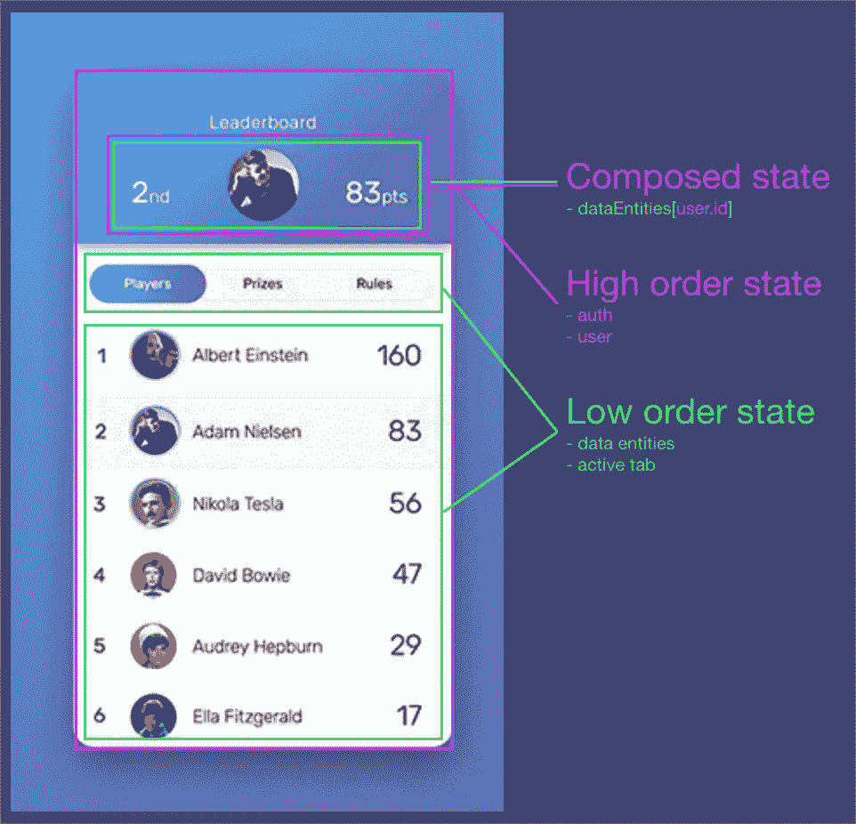

# NGXS——思想、模式、架构和最佳实践

> 原文：<https://itnext.io/ngxs-thoughts-patterns-architecture-and-best-practices-c991c42618d9?source=collection_archive---------1----------------------->


最近，我将我的整个应用程序从 NGRX 重构为 NGXS，在完成这个费力的 160 文件重构后，我松了一口气。为什么？不是因为我已经完成的工作，而是因为我在系统内释放的效率——这种可能性变得可行。

我从每个实体开始，将 NGRX 动作和选择器映射到 NGXS 动作和选择器。一旦我进入状态，这个任务出奇的简单。

在这篇文章中，我将解释我喜欢用 NGXS 实现的一些模式，我对这个库的一些观察，并希望说服你为什么…

> 您应该使用 NGXS 进行角度状态管理

# 文件结构和命名

下面概述的文件结构对我来说工作得很好，它包括将主要的状态问题分离到单独的文件中，例如—

```
//inside a single state folder pertaining to pelicans/pelican
 - index.ts
 - pelican.actions.ts
 - pelican.selectors.ts
 - pelican.state.ts
 - pelican-state.model.ts
```

我们现在已经清楚地定义和分离了我们的动作、状态和选择器。这种结构的好处是它的伸缩性很好，允许我们将所有的状态“汇总”成一个单一的常量，然后我们可以将它注入到我们的模型中。

```
// inside the store folder which contains a bunch of folders like the one outlined above /store
 - index.ts
 - /pelican
 - /salmon
 - /migration-route
 - /lake
```

下面是“roll-up”模式的一个例子，我们将存储根 index.ts 文件中的所有状态作为一个常量导入，然后简单地将该常量导入到模块中，如下所示。

经过多次迭代后，我发现这是一种非常好的结构化和模块化应用程序状态的方法。

# 使用路由器插件

将 Angular 路由器连接到商店绝对是一个好主意。主要原因是，您可以在任何需要的时候从商店生命周期中访问路线状态。这是**完全独立于你的组件&服务**。这对于诸如路径数据之类的东西来说是非常好的，我将在下面作为一个例子进行概述。

现在，我们可以在状态或组件生命周期中的任何时候选择路由状态的片段。

# 使用实体管理器

我 100%支持使用实体适配器来管理状态。在写这篇文章的时候，还没有一个官方的 NGXS 实体适配器([我一直使用这个库](https://www.npmjs.com/package/ngxs-entity))。

> 要了解更多关于 NG redux 实体的主题，这里有一个深入的解释，我建议[阅读](https://medium.com/ngrx/introducing-ngrx-entity-598176456e15)。

然而本质上你可以；

首先，用类型定义定义一个实体适配器。

```
export const pelicanEntityAdapter = createEntityAdapter<Pelican>({});
```

然后，在动作处理程序中，我们可以通过实体适配器来调整状态。

```
@Action(GetPelicans)postPatterns({ getState, patchState }: stateCtx) {
  return this.patternService.postPatterns(createPatterns).pipe(
    tap(pelicans => patchState(
      pelicanEntityAdapter.upsertMany(pelicans, getState()))
    )
  );
}
```

酷的是我们可以升级 tOne、upsertMany、addOne、deleteMany 等等——用更少的样板文件实现出色的抽象。

# 高低阶状态

Redux 架构在现代 SPA 架构中是革命性的，在我看来，MVC 看起来像是一个 *php* 旧时代的古老遗迹。然而，这并不意味着 redux 不是没有缺陷。

MVC 涉及在控制器(组件和服务)之间分配逻辑(也称为复杂性)，而 redux 涉及在状态定义中尽可能多地本地化逻辑。这意味着 redux 状态可能会变得令人费解。

我喜欢把我的状态分为高和低的顺序，这意味着像身份验证、用户和实体状态这样的东西比 ui、表单和加载状态这样的东西存储在更高的级别。

在 angular 的上下文中，高阶状态可以存储在*核心模块*中，而较低级状态通常通过*特征模块延迟加载。*这个概念在下图中有所表达，其中列表和活动选项卡存储在较低的级别，用户和授权存储在较高的级别，需要注意的是:

*   这个概念很大程度上是主观的，并且因情况而异，示例中较低阶的实体很容易成为较高阶的实体。
*   高阶和低阶状态可以组合在一起。



# 选择器组成

Redux 是关于关注点的清晰分离，因此拥有定义良好的选择器是很重要的。为了有一个干净的选择器，我建议在可能的情况下，坚持以下原则。

*   尽可能确保逻辑在选择器中处理，而不是在组件中处理(组件应该只选择一个值并在模板中反映该值)
*   通过只将较高阶的状态导入较低阶的状态，而不是相反，来干净地构成状态(NG lazy 模块不应该从核心模块导入)。

到目前为止，组织选择器的一个很好的模式是在选择器类中定义选择器，然后将它们导入到组件中。在这种方式下，选择器的作用类似于 db 查询，选择状态片段并在需要的地方执行联合。你可以在下面看到一个例子。

希望我已经能够分享我从使用 NGXS 中获得的一些模式。在我看来，这是 Angular 目前可用的最好的状态管理库，因为它周围有很好的社区，以及专注于简单性和最少样板文件的深思熟虑的方法。

[](http://www.velocityapp.io)

*封面图片:*[*https://www.skypixel.com/users/first-tsv*](https://www.skypixel.com/users/first-tsv)