# NLP:使用 Spacy 和 Python 的命名实体识别(NER)

> 原文：<https://itnext.io/nlp-named-entity-recognition-ner-with-spacy-and-python-dabaf843cab2?source=collection_archive---------0----------------------->


亨特·哈里特在 [Unsplash](https://unsplash.com?utm_source=medium&utm_medium=referral) 上的照片

# 介绍

**更新**:查看我的新[NLP 介绍文章](/introduction-to-natural-language-processing-nlp-tools-for-python-cf39af3cfc64?source=post_stats_page-------------------------------------)！

本文的目标是介绍**自然语言处理**中的一个关键任务，即**命名实体识别** ( [**NER**](https://en.wikipedia.org/wiki/Named-entity_recognition) )。目标是能够提取文本语料库中的公共实体。例如，检测人员、地点、药物、日期等。在诸如电子邮件或文档的给定文本中。

**NER** 是广阔的 [NLP](https://towardsdatascience.com/your-guide-to-natural-language-processing-nlp-48ea2511f6e1) 领域的技术部分，它本身是**机器学习**领域的一部分，而后者又属于 **AI** 的父领域。

在这篇**动手**文章中，我们将使用 [**Spacy**](https://spacy.io/) 库来训练一个基于神经网络的深度学习模型，从文本数据中检测实体。我们还将展示的一件事，也是很多文章中经常忽略的一件事，就是如何给数据加标签。我们还将比较**深度学习**和使用**模式匹配**的更暴力的方法。

例如，我们将创建一个模型，从包含与石油行业相关的电子邮件列表的[公共数据集](https://www.kaggle.com/mitusha/email-dataset)中检测与**石油/汽油**相关的实体。这是一个过于简化的例子，因为在现实生活中你会希望有更多的通用实体，但这将为 NER 提供一个简单的例子，并显示一个模式匹配可能是一个比 NER 更好的选择的例子。因此，总结一下**，我们将从电子邮件**中提取石油相关实体。

我们将使用 [**Doccano**](http://doccano.herokuapp.com/) **来标记数据，这是一个开源项目，提供了一个很好的用户界面来管理数据集，标记数据和团队之间的合作。**可以为情感分析、命名实体识别、文本摘要等创建标注数据。您可以尝试[注释演示](http://doccano.herokuapp.com/)了解更多详情。


Doccano 标签工具

我们将在之后执行**:**

*   阅读电子邮件数据集，每行有一封电子邮件。
*   我们将使用 [**Doccano**](http://doccano.herokuapp.com/) 标记工具标记带有石油实体的电子邮件。这是一个手动过程。
*   我们将把标签保存在一个文本文件中，命名为 **JSONL。**
*   我们将使用 **Spacy** 神经网络模型来训练新的统计模型。
*   我们将保存该模型。
*   我们将创建一个**空间** NLP 管道，并使用新的模型来探测从未见过的石油实体。
*   最后，我们将使用模式匹配而不是深度学习模型来比较这两种方法。

这将是一个两步的过程。**标注**数据**训练**模型。

所有的**数据**和一个**笔记本**以及所有的**代码**都可以在我的 [**资源库**](https://github.com/javiramos1/ner_spacy_demo) 中找到。

# 步骤 1:标记数据

## 安装 Doccano

第一步是使用 **Doccano 标记实体。**

如果您对这一步不感兴趣，您可以使用 [**中已经标记的数据，此处**](https://github.com/javiramos1/ner_spacy_demo/blob/main/emails_labeled.jsonl) 并跳到下一节。

按照 [**Doccano**](https://doccano.github.io/doccano/tutorial/) 说明安装并打开该工具。

如果你使用 **Linux/Mac** ，我推荐使用 docker 镜像:

*   `docker pull doccano/doccano`
*   `docker container create --name doccano -e "ADMIN_USERNAME=admin" -e "ADMIN_EMAIL=admin@example.com" -e "ADMIN_PASSWORD=password" -p 8000:8000 doccano/doccano`
*   `docker container start doccano`

对于**窗口**，只需使用 **pip** :

*   `pip install doccano`
*   `doccano`

前往[T3 http://127 . 0 . 0 . 1:8000/T5。](http://127.0.0.1:8000/)

这将显示主页面:

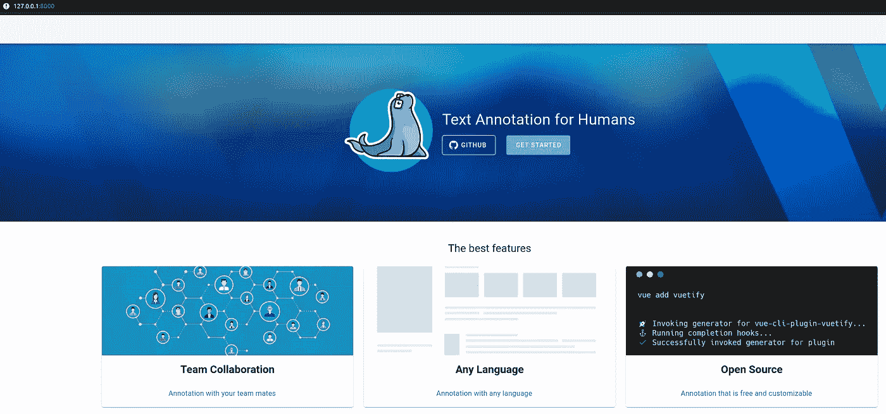

## 创建新项目

在右上角点击项目:

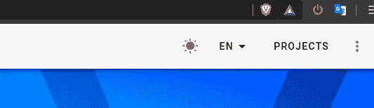

在下一个屏幕中，单击创建:

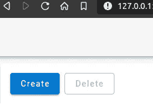

输入名称和描述。对于项目类型，选择**序列标签**，因为我们将把它用于 **NER** 而不是文本分类。

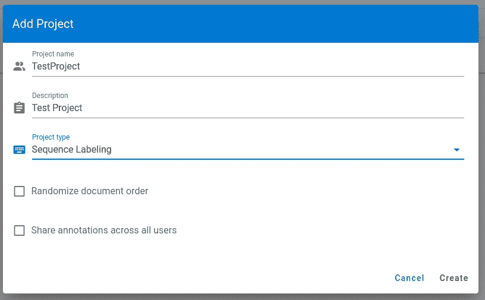

单击创建。弹出屏幕关闭后，选择项目名称。这将显示项目欢迎页面。

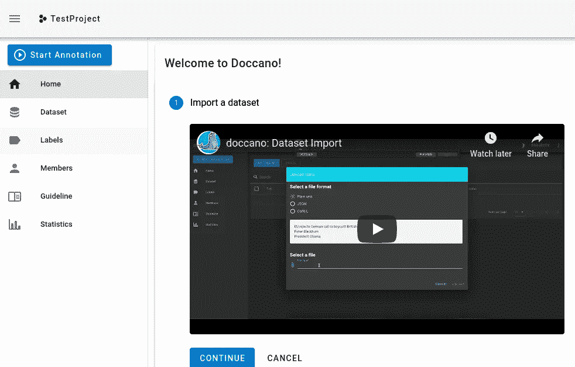

点击菜单中的**数据集**。在操作中，单击“导入数据集”。

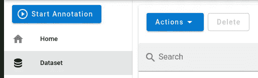

在弹出的屏幕中选择**纯文本**格式，并从存储库中选择 [*emails.txt*](https://github.com/javiramos1/ner_spacy_demo/blob/main/emails.txt) 。您现在应该可以看到只有 23 封电子邮件的列表:

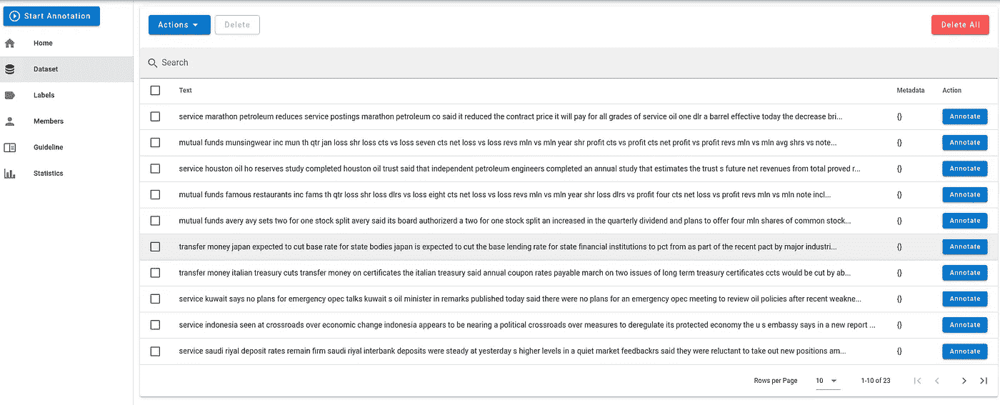

现在点击菜单中的**标签**。在动作中，选择**创建标签。**

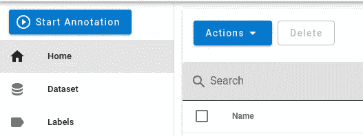

输入**油**作为标签名称，按键 0，然后点击**创建**。

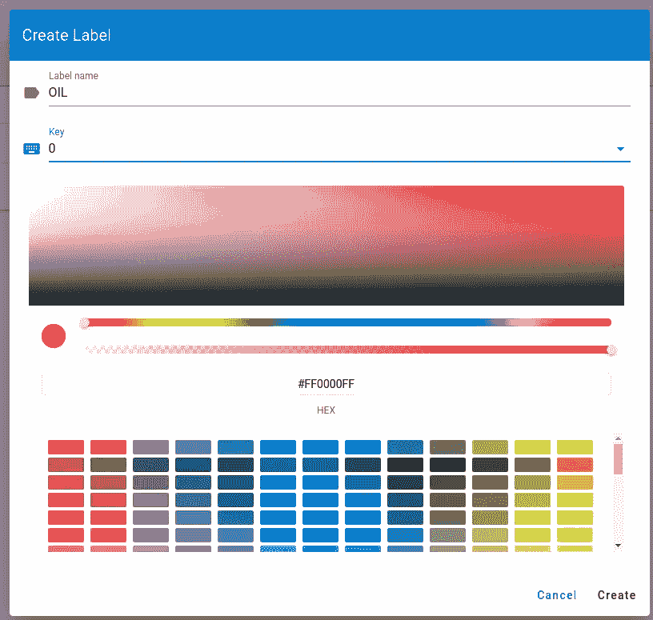

现在，回到数据集，在第一项上单击“ **Annotate** ”。你应该看到第一封邮件。

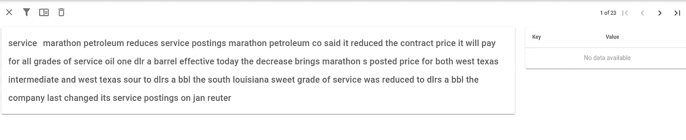

现在是做一些手工工作的时候了。您可以使用浏览器搜索功能来查找石油、汽油或石油文本。当你找到一个，双击选择，会弹出一个选择标签的窗口，你也可以点击 **0** 键。右上角是导航，浏览 23 封电子邮件并标记所有实体。请注意，有些电子邮件可能不包含任何实体，有些可能包含其中的几个实体。重要的是你不能错过任何一个。


完成后，点击菜单中的数据集，选择**动作**->-**导出** **数据集**

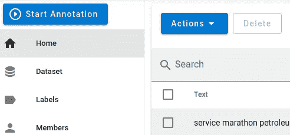

选择***【JSONL(文本标签)*** 格式。输入文件名，例如:*emails _ label*。点击**导出**。

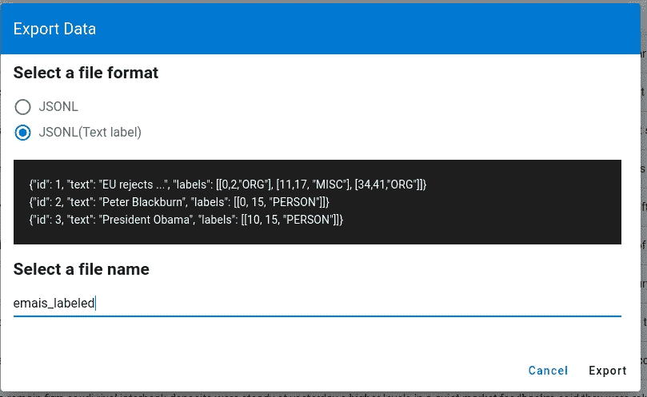

**保存**文件。现在，您已经为第 2 步做好了准备，即训练模型。

# 第二步:模特训练

现在我们有了训练集，是时候开始使用内置深度学习功能的 **Spacy** 来训练我们的模型了。你可以打开一个 **Jupyter 笔记本**或者你喜欢的编辑器；或者跟着 [**库中的**](https://github.com/javiramos1/ner_spacy_demo) 一起走。

## 安装空间

根据您的平台，详细的 [**安装说明**](https://spacy.io/usage) 请参考文档。使用画中画时，只需:

```
pip install -U pip setuptools wheel
pip install -U spacy
python -m spacy download en_core_web_sm
```

## 数据准备

首先，让我们使用以下格式读取 JSONL 文件:

`{"id": 15, "text": "....", "meta": {}, "annotation_approver": null, "labels": [[226, 234, "OIL"]]}`

```
import json
labeled_data = []
with open(r"**emails_labeled.jsonl**", "r") as read_file:
    for line in read_file:
        data = json.loads(line)
        labeled_data.append(data)
```

接下来，让我们将 **Deccano** 格式转换为 **Spacy** 格式。我们还将删除额外的列，并将标签重命名为实体。

```
TRAINING_DATA = []
for entry in labeled_data:
    entities = []
    for e in entry['labels']:
        entities.append((e[0], e[1],e[2]))
    spacy_entry = (entry['text'], {"entities": entities})
    TRAINING_DATA.append(spacy_entry)
```

## 训练模型

我们使用**深度学习** ( **NN** )，设置 0.3 的辍学率，防止过拟合。

这个想法是使用一个有许多神经元和几层的**神经网络**。我们向网络显示已经被标记的文本。我们将运行几次迭代，在每次迭代中，我们将使用*损失函数*计算误差，该函数将触发神经元权重的调整，从而触发它们的激活。随着迭代的进行，网络将调整它们的权重以最小化误差，学习解决问题的模式。

为了避免**过拟合**，也就是说模型“*记忆*训练数据，对新数据表现不佳，我们在每次迭代中随机丢弃一些神经元，这样模型可以更好地泛化。

```
import spacy
import random
import jsonnlp = spacy.blank("en")
ner = nlp.create_pipe("ner")
nlp.add_pipe(ner)
ner.add_label("OIL")# Start the training
nlp.begin_training()# Loop for 40 iterations
for itn in range(40):
    # Shuffle the training data
    random.shuffle(TRAINING_DATA)
    losses = {}# Batch the examples and iterate over them
    for batch in spacy.util.minibatch(TRAINING_DATA, size=2):
        texts = [text for text, entities in batch]
        annotations = [entities for text, entities in batch]# Update the model
        nlp.update(texts, annotations, losses=losses, drop=0.3)
    print(losses)
```

随着迭代的进行，您应该会看到误差在减小，请注意，由于 dropout 设置，有时误差可能会增大。

```
{'ner': 3.7440482430942508}
{'ner': 2.012700471865181}
{'ner': 2.051291773717853}
{'ner': 0.0007268571710379556}
{'ner': 1.8225483010250167}
{'ner': 0.0028021886504119237}
{'ner': 0.0030751793809788803}
{'ner': 1.851928768298534e-06}
```

现在您可以将模型保存到磁盘:

```
nlp.to_disk("oil.model")
```

如果使用 Windows，使用:*NLP . to _ disk("/oil . model ")*

## 测试模型

让我们测试模型。为此，我们使用 ***displacy*** 显示文本中的实体。

```
from spacy import displacy
**example** = "service marathon petroleum reduces service postings marathon petroleum co said it reduced the contract price it will pay for all grades of service oil one dlr a barrel effective today the decrease brings marathon s posted price for both west texas intermediate and west texas sour to dlrs a bbl the south louisiana sweet grade of service was reduced to dlrs a bbl the company last changed its service postings on jan reuter"
```

来测试一下吧！

```
doc = nlp(example)
displacy.render(doc, style='ent')
```

您应该会看到如下输出:


如您所见，这些实体被正确检测到，包括石油和石油。

NER 很酷的一点是，即使文本中有一个*错别字*，它仍能检测出正确的实体，例如，如果我拼错了 petroleum:

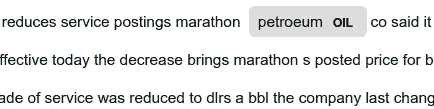

还是找到匹配的！

## 短语匹配

第二种方法是使用**模式匹配**在文本中寻找某些关键字和模式。

**Spacy** 提供了匹配器，可以很容易地用来查找特定的子字符串、数字等。我们还可以根据词性标签设置规则。

这是代码:

```
import spacy
# Import the Matcher
from spacy.matcher import Matchernlp = spacy.load("en_core_web_sm")
doc = nlp(example)# Initialize the Matcher with the shared vocabulary
matcher = Matcher(nlp.vocab)# Add the pattern to the matcher
matcher.add("OIL_PATTERN", None, [{"LOWER": "oil"}], [{"LOWER": "petroleum"}])# Use the matcher on the doc
matches = matcher(doc)
print("Matches:", [doc[start:end].text for match_id, start, end in matches])
```

你应该会看到印在笔记本上的火柴。

```
Matches: ['petroleum', 'oil']
```

我们可以看到，我们也找到了正确的标签，但在这种情况下，没有检测到拼写错误或类似的单词。

# 结论

我们已经看到了用于**实体识别**的不同方法。

**模式匹配**可用于以下用例:

*   低基数属性
*   常见模式，如日期、数量、数字等。(正则表达式)
*   出现在演讲的某些部分的模式
*   当不希望出现错别字时
*   结构数据

**统计模型**非常适合学习数据中的复杂模式，可以“猜测”和分类数据，这是以前从未有过的。使用案例:

*   高基数属性
*   你需要处理错别字(模糊匹配)
*   你需要对新的、从未见过的数据进行分类。
*   非结构化数据

这些模型更加强大，因为它们可以对以前从未见过的事情做出决策。它可以检测新的实体，而无需任何代码更改。

如你所见，像任何机器学习任务一样，**大部分工作都是准备和标记数据**，这部分不仅耗时而且**关键**。对于自然语言处理来说，正确标记数据并对其进行适当的预处理是获得好结果的最重要的因素。

许多组织花费大量资源雇佣人才和构建复杂的模型来改善结果，而不是专注于数据。良好的**数据准备和特征工程**可以比 ML 算法更快更好地提高模型性能。没有什么比一个**业务分析师**理解**细节**中的数据并了解一点 **Python** 更强大的了！

由于标记数据会花费很多时间，我推荐使用一些工具，比如[**Prodigy**](https://prodi.gy/)**通过使用 ML 来半自动标记过程，减少了手工工作量**。

*记得来* ***拍拍*** *如果你喜欢这篇文章* [***关注*******me****](https://javier-ramos.medium.com/subscribe)**或* [***订阅***](https://javier-ramos.medium.com/membership) *获取更多更新！**

*[**订阅**](https://javier-ramos.medium.com/subscribe) 获得**通知**当我发表一篇文章 [**加入 Medium.com**](https://javier-ramos.medium.com/membership)访问数百万或文章！*