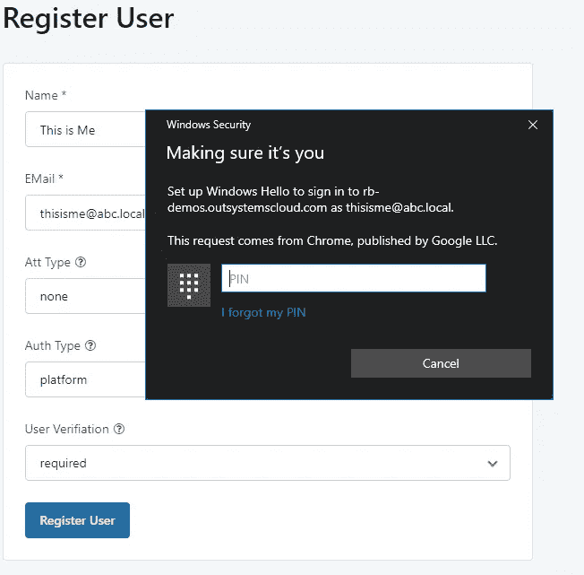
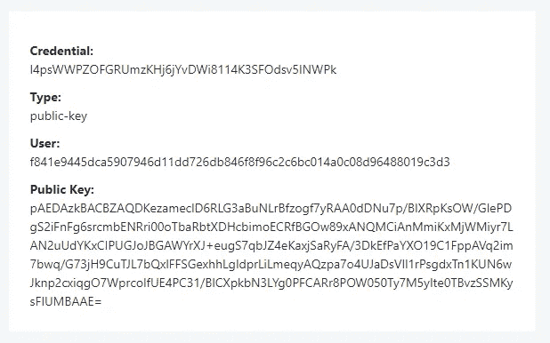
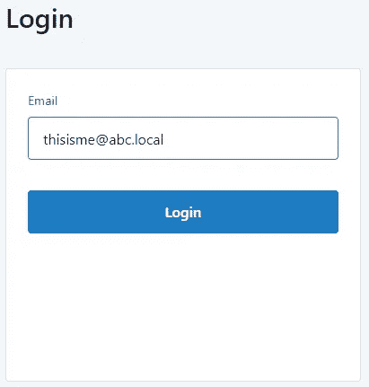
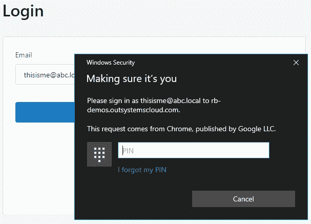
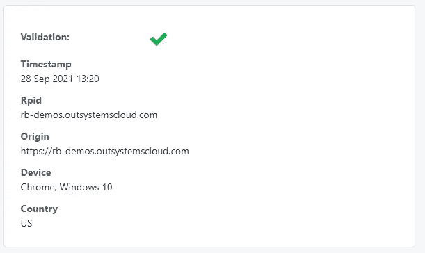
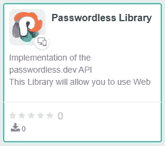

# 不再需要密码:外部系统中的 Web 认证

> 原文：<https://itnext.io/no-more-passwords-web-authentication-in-outsystems-b73eb9f6ee55?source=collection_archive---------8----------------------->

[Zan](https://unsplash.com/@zanilic?utm_source=unsplash&utm_medium=referral&utm_content=creditCopyText) 在 [Unsplash](https://unsplash.com/s/photos/keys?utm_source=unsplash&utm_medium=referral&utm_content=creditCopyText) 上的照片

用户通常在多个网站上使用相同的用户名/电子邮件和密码组合。

这通常是一个问题，因为如果他们的凭证在特定的网站中受到损害，这意味着他们在所有的网站中都受到损害。

有些人使用密码管理器和建议的强密码，但是如果有一种方法可以完全不使用密码呢？

原来是有的。

# Web 身份验证

> Web 认证 API(也称为 WebAuthn)使用[非对称(公钥)加密](https://en.wikipedia.org/wiki/Public-key_cryptography)而不是密码或短信来注册、认证和[第二因素认证](https://en.wikipedia.org/wiki/Multi-factor_authentication)网站。这有一些好处:
> 
> **防钓鱼:**创建虚假登录网站的攻击者无法以用户身份登录，因为签名会随着网站的[来源](https://developer.mozilla.org/en-US/docs/Glossary/Origin)而改变。
> 
> **降低数据泄露的影响:**开发者不需要哈希公钥，如果攻击者获得了用于验证身份验证的公钥，就无法进行身份验证，因为它需要私钥。
> 
> **不易受密码攻击:**一些用户可能会重复使用密码，攻击者可能会获取另一个网站的用户密码(例如通过数据泄露)。此外，文本密码比数字签名更容易被暴力破解。

检查完整的[文档](https://developer.mozilla.org/en-US/docs/Web/API/Web_Authentication_API)。

## 它是如何工作的？

注册用户:

developer.mozilla.org 注册图像

它从浏览器触发的公钥创建开始。这个公钥是使用一些硬件资源创建的，它可以是计算机的 TPM(可信平台模块)或某种外部硬件，如 [Yubico](https://www.yubico.com/) 密钥。

这个公钥被发送到服务器，经过验证，然后与用户配置文件相关联。

登录:

developer.mozilla.org 的签到流程图

当用户登录浏览器时，会发送使用其私钥签名的验证数据，只有您或您的机器拥有该私钥。然后，验证者可以使用您的公钥验证这个签名。

这样，即使您的公钥被盗也没有关系，因为只有您的私钥可以签署消息。

# 外部系统实现

在外部系统中实现这一点需要两个步骤。

首先，我们需要客户端 Web Authn [方法](https://developer.mozilla.org/en-US/docs/Web/API/PublicKeyCredential)。

第二步是在服务器端构建一个认证器。实现 FIDO2 方法的库很少，而最流行的一个【fido2.net ，被证明比预期的更棘手。

所以现在我们将使用一个名为 [passwordless.dev](https://passwordless.dev/) 的 REST API，它提供了服务器端认证者角色。

## 测试 Web 身份验证

为了测试这一点，你需要一台装有 TPM(大多数现代计算机都有)或某种形式的硬件认证(Yubico，指纹扫描仪等)的计算机。).对于 Windows，您可以使用 Windows Hello。

注册步骤:

注册页面示例仅需要姓名和电子邮件

然后浏览器启动，要求你输入(在这种情况下是 Windows Hello)

浏览器要求验证以生成公钥

最后，这由验证器(passwordless.dev api)验证并存储:

存储在 API 上的数据

登录是一个类似的过程:

只用电子邮件登录

浏览器启动并要求创建一个签名。

Windows Hello 要求 pin 来签署验证数据

最后，我们得到了验证:

一个成功验证的例子

我相信我们会看到这种网络认证被越来越多的应用。事实上，微软最近[宣布](https://www.microsoft.com/security/blog/2021/09/15/the-passwordless-future-is-here-for-your-microsoft-account/)它将开始在他们的服务上推出对无密码认证的支持，其他公司也会跟进。

我们可能会认为还没有硬件支持，但事实是我们大多数人已经拥有了所需的一切。我们还可以让用户名/密码成为后备例外，而不是规则。

像往常一样，你会在 [forge](https://www.outsystems.com/forge/component-overview/11638/passwordless-library) 上找到这个组件和演示。

现在，去构建那些应用程序吧。