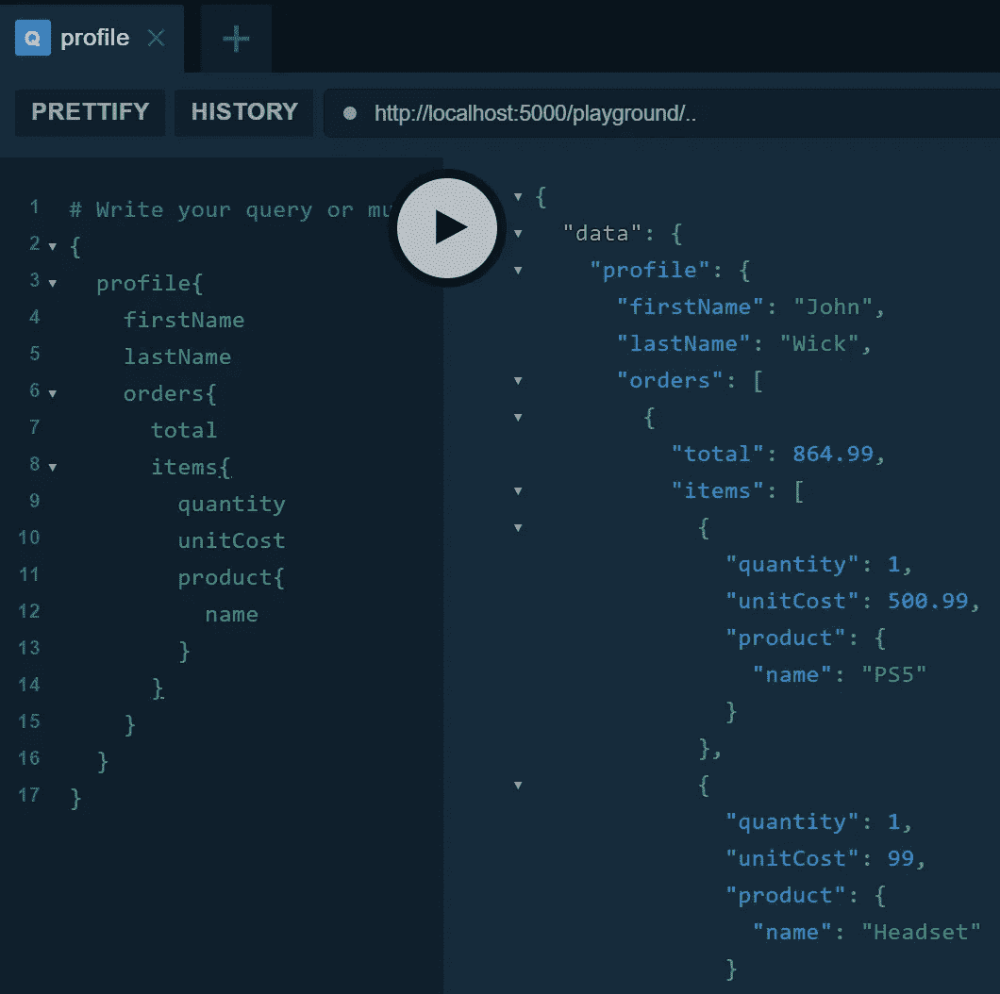
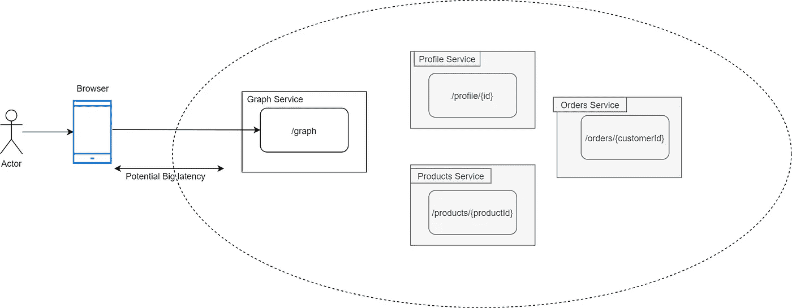
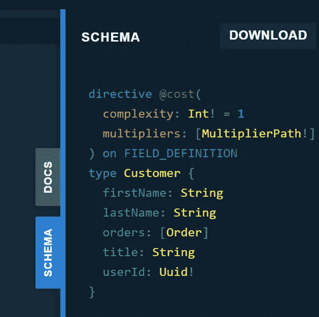
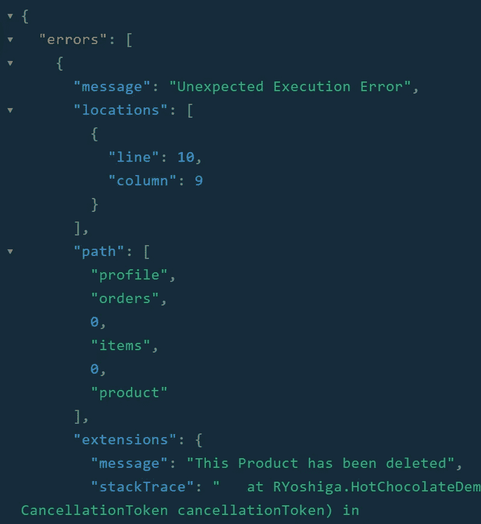
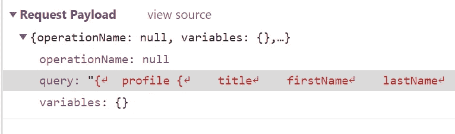

# 不再休息！GraphQL APIs 万岁-使用 C#

> 原文：<https://itnext.io/no-more-rest-long-live-graphql-apis-with-c-55962ba8f942?source=collection_archive---------2----------------------->


艾莉娜·格鲁布尼亚克在 [Unsplash](https://unsplash.com/s/photos/network?utm_source=unsplash&utm_medium=referral&utm_content=creditCopyText) 上的照片

自从通过 SOAP 共享 XML 契约以来，REST 已经将我们带入了一个更好的位置。这是一个很好的标准，给我们带来了很大的进步，但是它让我们容易理解和消费的东西也可能是一个问题。

## 资源集中

REST 是一个以 URL 为中心的单一实体，如下所示:

*   获取/配置文件
*   获取/订单？customerId={customerId}
*   获取/产品/1

虽然这是一个很好的标准，但是单一资源检索的成本可能很高。

# 电子商务订单汇总示例:

假设你正在为一个电子商务建立一个订单汇总页面，为此你需要客户订单，列出每个订单的总价，购买的物品包括数量，单位成本和产品名称。

在微服务架构中，合理的服务划分如下所示:


浏览器多次调用以加载页面的示例图

**获取/简介**

**获取/订购/{客户 Id}**

**GET /product/{productId}**

细分这些调用，一个调用获取客户概要，另一个获取订单，还有 N 个调用获取每个产品。

N 个调用是一个问题，很容易从客户浏览器发出 10、20、30 个 REST 请求。这需要时间，可能会消耗他们的大量数据计划。

如果产品服务提供了“获取产品批次”，这 N 个调用是可以修复的，在这种情况下，客户端传递它想要的所有产品 id，但是这样我们就增加了客户端代码的复杂性，必须编译它需要获取的产品的字典列表并将其映射回来。

这种 REST 方法的另一个缺点是客户端可能会获取它不需要的数据，比如在我的例子中，description 是一个我们在屏幕上可能不需要的额外字段。

# 订单摘要—图表 QL

GraphQL 中的实现如下所示:



GraphQL 操场-订单汇总查询



用户浏览器仅连接到图表服务的图表

**优点**

*   浏览器和服务器之间只有一次 HTTP 调用。
*   客户端代码过得很轻松——它不需要一直映射多个服务调用。
*   灵活的查询，消费者可以构建查询以准确返回他们需要的内容，仅此而已。

在图形服务和之前已有的微服务之间会有内部调用，但我将保持代码示例的简单性，因此图形服务将完成所有工作，而不与其他服务对话。

> 我将在另一篇文章中讲述图形服务如何委托调用，但是如果你好奇并且知道基本知识，你可以继续看[图形拼接。](https://chillicream.com/docs/hotchocolate/v10/stitching/)

## 什么是图形 QL？

[GraphQL](https://graphql.org/) 是一个 API 查询语言的规范，也是一个用现有数据完成这些查询的运行时。

# 热巧克力演示— Dotnet


照片由 [Nica Cn](https://unsplash.com/@niica_cn?utm_source=unsplash&utm_medium=referral&utm_content=creditCopyText) 在 [Unsplash](https://unsplash.com/s/photos/hotchocolate?utm_source=unsplash&utm_medium=referral&utm_content=creditCopyText) 上拍摄

用 Dotnet core 做 GraphQL，可以用一个叫 [HotChocolate](https://github.com/ChilliCream/hotchocolate/tree/develop/src/HotChocolate) 的包。

## 一个简单的 hello world，带有一个空的 web API 项目

添加所需的包:

```
dotnet add package HotChocolate.AspNetCore
dotnet add package HotChocolate.AspNetCore.Playground
```

然后我们可以通过“/操场”进入操场:


GraphQL hello world

# 订单汇总图表

完整的代码在这里，但是如果你一步一步地做:

## 返回客户资料:

修改 Query.cs 以包含检索客户的方法。

如果您在操场上测试它，您应该看到“Orders”属性为空。

只是提醒您可以通过右边的小标签来检查您的模式:



模式选项卡“游乐场”

## 解析订单:

为了告诉 HotChocolate 如何解析客户的订单属性，我们可以添加一个[解析器](https://chillicream.com/docs/hotchocolate/fetching-data#defining-a-resolver),如下所示:

## 批量装载产品:

还记得我们有 N 次调用获取产品的问题吗，GraphQL 用 [BatchDataLoaders](https://chillicream.com/docs/hotchocolate/v10/data-fetching) 解决了这个问题:

# 休息到图表—细微差异


照片由[塞巴斯蒂安·斯塔姆](https://unsplash.com/@sebastiaanstam?utm_source=unsplash&utm_medium=referral&utm_content=creditCopyText)在 [Unsplash](https://unsplash.com/s/photos/cool?utm_source=unsplash&utm_medium=referral&utm_content=creditCopyText) 拍摄

图形规范与 REST 有一些不同之处，可能会在开发时欺骗您:

## **异常可能不会导致 500 —内部服务器错误**

出错时，图 QL 规范仍然返回 200 OK，而不是返回不同的状态代码，因为状态代码被用作传输层问题，而不是 Graph QL 层。

响应将包含一个带有“错误”的对象，而不是更改状态代码:



## **图中查询的不是 JSON**

只要记住 Graph 请求不是 JSON，所以不需要添加逗号和双引号。

但是如果您检查我们在“ */playground* ”中所做的请求，您会看到服务器正在 POST 请求正文中接收 application/JSON，查询属性包含图形请求。



## 其他要点

GraphQL API 不仅用于读取数据，您还可以使用[突变](https://graphql.org/learn/queries/#mutations)(相当于 POST、PUT 和 Patch)进行更改，甚至可以使用[订阅](https://graphql.org/blog/subscriptions-in-graphql-and-relay/)来监听事件，这是我打算在后续的帖子中讨论的内容。

## 有用的链接:

*   [图形规格](https://graphql.org/)
*   [热巧克力文档](https://chillicream.com/docs/hotchocolate/v10/)
*   [完整订单汇总 GitHub 示例](https://github.com/RaphaelYoshiga/HotChocolateDemo)
*   [带有实体框架的 HotChocolate 完整示例](https://github.com/ChilliCream/graphql-workshop)

# 结论

所以它已经死了，过时了？我不会这么说，GraphQL 是一个让你添加到工具箱中的工具，所以你可以在规划一个新的 API 时评估利弊。请记住，一些大公司正在转向 Graph，如 GitHub，用他们自己的话说:

> “GitHub 选择 GraphQL 作为我们的 API v4，因为它为我们的集成商提供了更大的灵活性。与 REST API v3 端点相比，能够精确定义您想要的数据——并且只*定义您想要的数据—*——是一个强大的优势。”