# 状态机中没有僵尸

> 原文：<https://itnext.io/no-zombies-in-state-machines-b24511a2270e?source=collection_archive---------6----------------------->

所以……几周前，我经历了一次小小的冒险(点击此处[阅读](https://medium.com/@sezen.debruijn/how-i-took-a-meme-way-too-seriously-and-accidentally-created-handwashing-zombies-with-low-code-e3fa6fc818ec)它),在 SA 小组中分享了一个迷因:

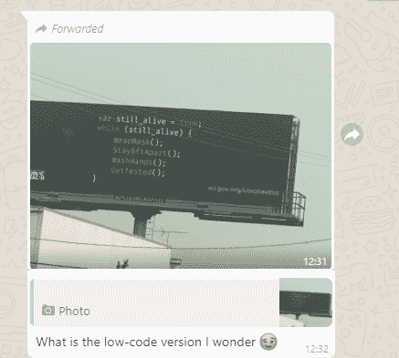

我也想知道，所以我开始工作。一路上制造洗手僵尸。这主要是因为我用错了工具。我们会回来的。

我把所有的事情都写了下来，想着别人可能也会因此而发笑。但是我应该知道，当你与开发人员社区分享这些类型的东西时，你会很快获得许多额外的见解，让你恨不得从头再来一遍。

所以…冒险继续！

# 锤子和螺丝刀

在我发表文章的第二天，当更广泛的生态系统参与进来时，很明显状态机确实是一个更好的方法。

总结讨论，提出了各种有效的观点:

*   首先也是最重要的:状态机中没有僵尸。使用状态机，您只需在案例状态更新为“非活动”时终止所有流程并关闭案例。
*   其次，训练有素的人可以更好地解决这类问题，而不需要流程提供的约束。这主要是因为在这种情况下，许多因素影响着要做什么和如何做。没有顺序。
*   状态机使您的系统更加灵活，并随着时间的变化而变化。因此，如果有任何关于如何处理这种情况的新见解，我们可以很容易地适应新的协议。

**那么，我到底为什么选择和 BPT 一起做呢？**

俗话说:如果你有一把锤子，任何东西看起来都像钉子。

我一直有一把 BPT 式的锤子。我最近也拥有了一把螺丝刀，以案例管理框架的形式……但是我还不太适应弄清楚什么时候某个东西是螺丝钉。原来这个项目绝对是一个螺丝钉。

现在又是星期五了…我觉得这周快结束了。所以，让我们试一试这些状态机。

**到画板**

这一次，我决定在潜入水中之前认真思考一下我在做什么。通常不是我的风格，但我听说过它的好处。

所以我在白板上画了一些图表。首先是简单的部分:

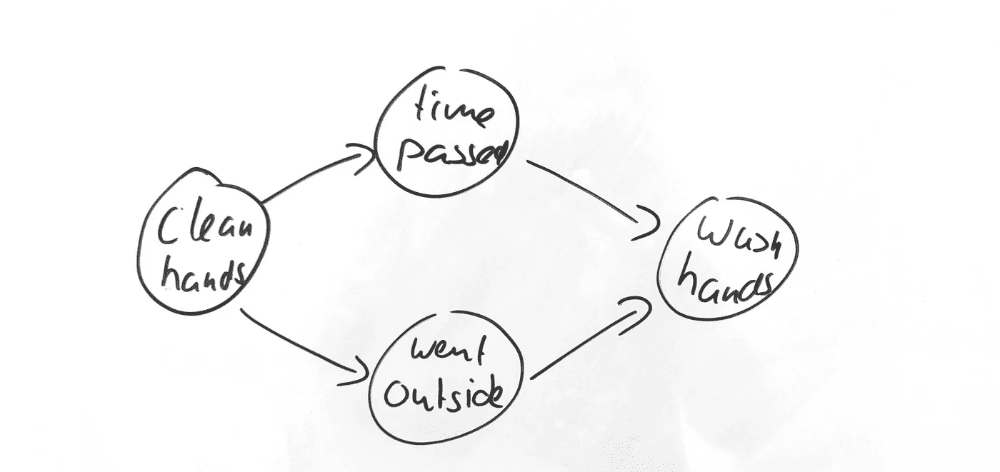

人们开始是用干净的手，但是随着时间的推移，或者他们走到外面，现在他们需要洗手。
人们用肥皂洗手 20 秒后，手大概又干净了，所以我也为状态转换添加了一个箭头:

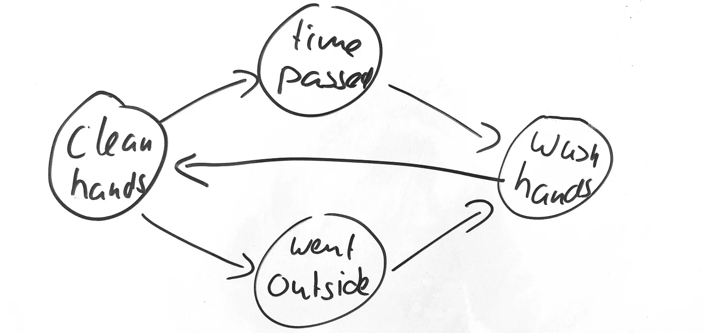

到目前为止，容易，但也查克-充满了僵尸。在任何一种状态下，这个人都有可能不再活着，所以我们需要处理这个问题，否则我们将不可避免地拥有一群非常卫生的不死生物。(不可否认，这将是普通僵尸的升级，但仍然……)

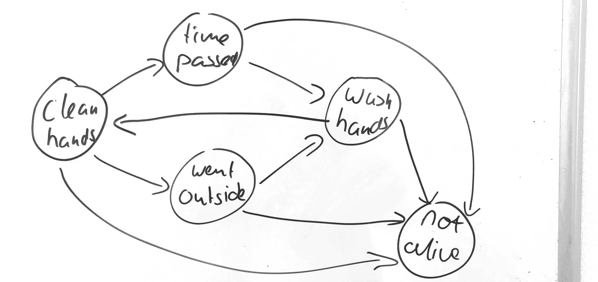

那更好。一旦某人进入非存活状态，那就是他们将保持的状态。他们不能回到任何其他状态，因为没有与此状态相关的动作，我们将避免僵尸。

**想够了！我们就这么做吧！**

第一件事是建立一个案例管理框架应用程序。也就是说，我为我的案例数据创建了一个名为“相关公民”的业务实体，将它链接到一个流程，并输入状态和转换。

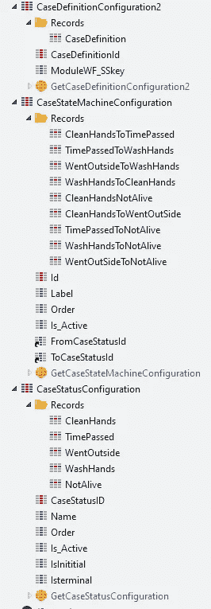

模拟无论你在做什么都会死的部分，有点与我自己的死亡相冲突。但撇开生存危机不谈，我们一路走来相当顺利。

现在是时候制作这个应用程序的完全手动操作版本了，人类可以简单地决定何时到达每个状态。毕竟，我收到的反馈之一是:“没有处理供应的紧身衣，训练有素的人更有能力解决这个问题。”
所以为了方便那些受过训练的人类，我实现了几个屏幕。

总体来说非常简单:只是一个关注公民的列表和详细屏幕。细节屏幕是有趣的开始。当您创建您的公民时，系统会自动创建该案例，并赋予其 CleanHands 状态。在你的屏幕上方，你会看到几个按钮出现:时间通过、非直播和外出。这些是基于“干净的手”状态的后续状态。

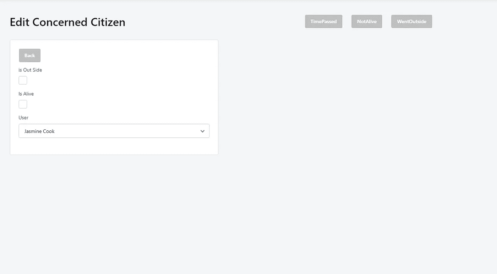

点击时间通过，新的选项出现:洗手和不活。

你可以点击选项，只要你想，除非你点击 NotAlive。现在你的钮扣已经消失，你的公民已经到达他们最后的休息状态。

所有作品！当然，除了一点数据输入错误之外，这确保了“进入外部”之后的唯一后续状态是“时间通过”。(从更元物理学的角度来看，这可能是真的，但这并没有反映出我想要创造的现实。幸运的是，这个问题很容易解决。)

这种手动方法的好处之一正是社区向我指出的，最终人类能够更好地驾驭这种交互协议的复杂性。在这种情况下，信息技术的作用应该只是促进正确的行为。自动化并不总是最好的方法。

话虽如此…

**让我们自动化吧！**

固执是女孩的特权，所以虽然我在理论上同意技术应该从属于人类操作员的角色，但我也觉得有些任务技术更适合。因此，我决定坚持尝试利用自动化软件来驾驭我们当前所处的残酷现实。因此，让我们尝试创造一种解决方案，将技术的一致性与人类思维的更优雅的智能结合起来，创造一个 Covid-Cyborg。

这个协议中有一些基于时间的动作，而计算机非常擅长计时，所以这似乎是开始添加一些自动化的好地方。

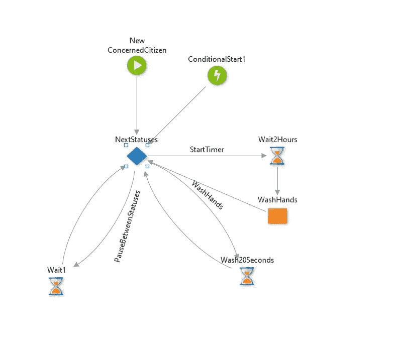

首先，我为后续状态创建了一个调度程序。这种技术基本上循环所有的状态，对于相关的状态，它将它们指向帮助状态转换所需的动作。
例如:当两个小时过去或状态变为外出时，转换为洗手。因此，每当下一个阶段可能是时间流逝，我们需要启动一个计时器，这样我们就可以让这个人在两个小时后洗手。

当计时器超时或状态更新为“外出”时，我们将状态更新为 WashHands，并指向调度员。

作为僵尸生存策略的一部分，我还实现了一个简单的步骤，当相关公民不再活着时终止所有进程。

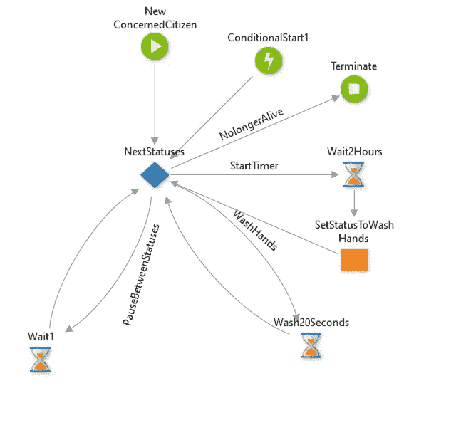

我一发表那篇文章，就发现了问题…你也看到了吗？没有吗？让我们放大一点…

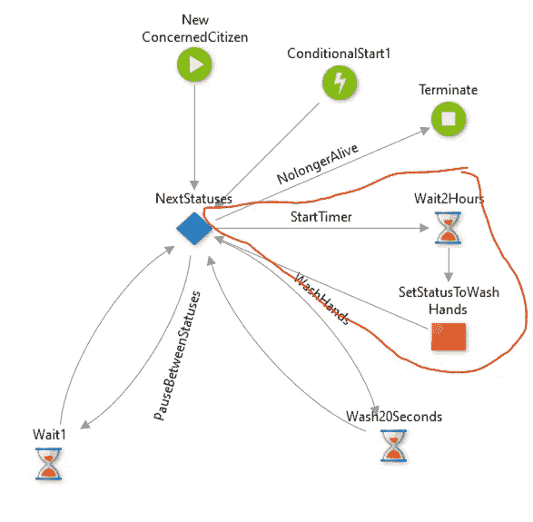

这位可怜的热心市民将每两个小时洗一次手。永远，只要他们活着。这意味着他们每两个小时就会醒来洗手。
这是……不可取的。

所以让我们修复它！

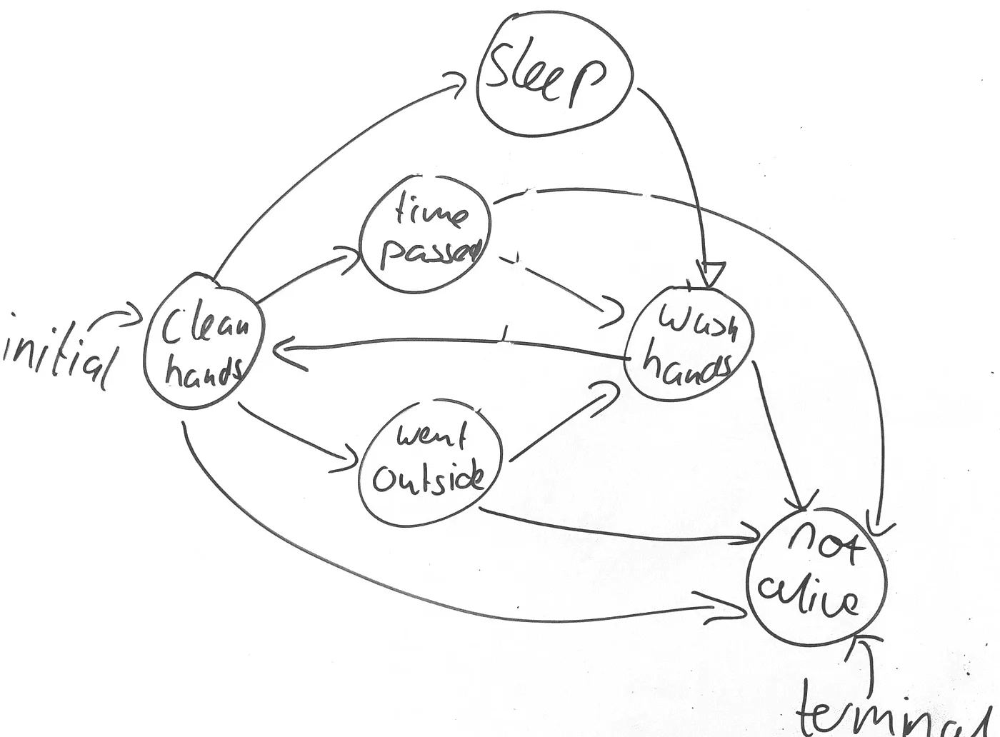

我将状态添加到系统中，这花了大约两分钟，令人高兴的是，这意味着状态立即在屏幕和流程中完全实现。

所以这个实验的一个收获就是，当你像我一样有一个混乱的头脑时，状态机确实允许你很快地改变你的设计。但另一个要点是，对于像我这样混乱的头脑，状态机也允许你以滑稽可笑的方式意外地错误建模。

例如，我不小心让一些人睡着了，而他们本该等两个小时，直到他们不得不去洗手。所以我想这篇文章可以叫做“我摆弄了国家机器，不小心让所有关心的公民患上了嗜睡症。”

**打扫卫生**

因此，我清理并扩展了我的工作流代码，使我的流程看起来像这样:

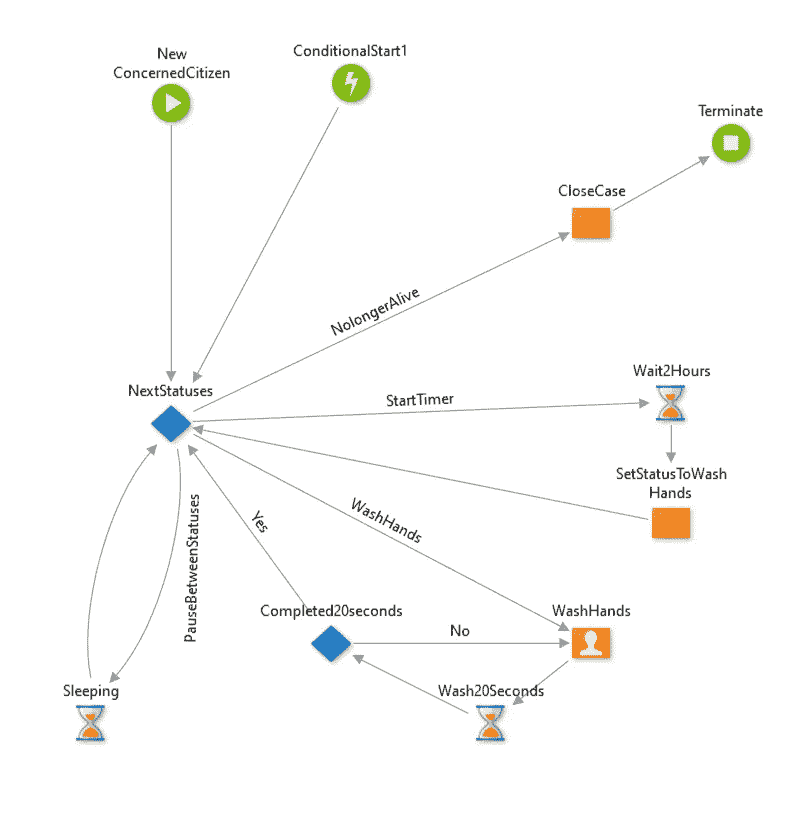

并对用户界面做了一些小的改进，所以我的屏幕现在看起来像这样:

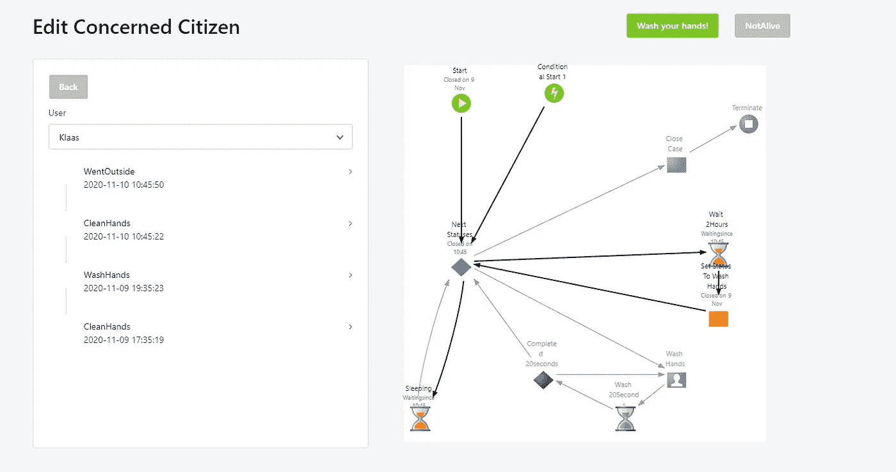

想试试吗？我也把它放到我的个人环境中，你可以在这里玩它。
更喜欢看一看代码？来找我，我会帮你搞定那个傻瓜。

期待听到您的改进建议。

我自己很想为戴面具和测试添加一个子案例，我可能会用我的余生来调整这个应用程序。但是，唉，工作需要完成。

哦，好吧，我相信另一个星期五终将到来。