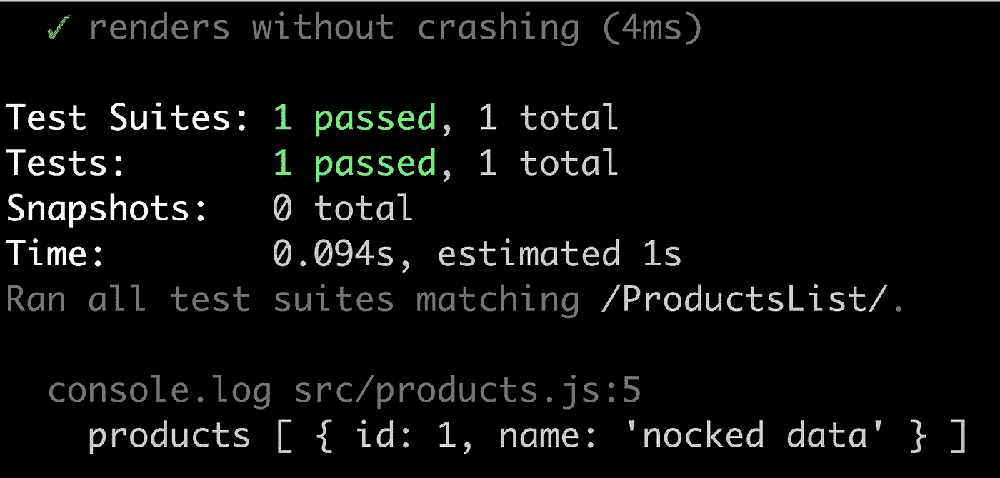
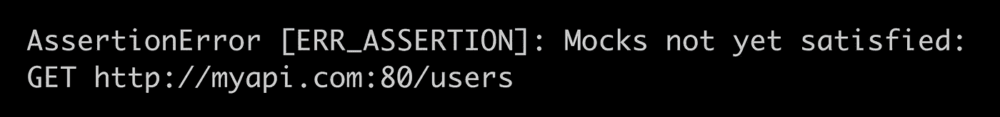

# Nock 出公园，HTTP 嘲讽 React

> 原文：<https://itnext.io/nock-it-out-of-the-park-http-mocking-for-react-42ec927f83e0?source=collection_archive---------1----------------------->

在 [Twitter](https://twitter.com/chris_noring) 上关注我，很乐意接受您对主题或改进的建议/Chris

> Nock 习惯于嘲笑对 HTTP 的调用。它使我们有可能指定要听什么 URL 和用什么来响应。这是一篇相当短的文章，展示了如何使用库`nock`。


在本文中，我们将涵盖:

*   **设置**，设置一个`nock`并指定一个模拟响应
*   **查询参数**，看看我们如何用查询参数设置我们的`nock`
*   **验证**，我们应该始终验证我们的`nocks`在哪里命中。如果不是，那么事情就变了，我们需要改变我们的测试来反映这一点

# 为什么要嘲讽 HTTP？

当我们测试任何东西时，我们应该孤立地进行，我们应该只关注于测试我们当前所在的模块。这意味着我们应该依靠某种对外部依赖性的嘲弄。不仅仅是外部依赖，还包括任何外部的东西，比如副作用，一些你无法控制的东西，比如 HTTP 调用。让一个 HTTP 调用真正通过可能会有很多问题，比如连接性和速率限制，最终它测试的东西很可能超出了您的测试范围。对于本文来说，这个问题的解决方案是库 [Nock](https://github.com/nock/nock) 。

# 方案

在下面的场景中，我们将看看如何测试一个需要显示产品列表的组件。列表数据来自 HTTP 调用。

为了能够运行这个场景，您应该首先创建一个 React.js 项目。最简单的方法就是运行 CRA 创建的 React 应用程序。所以让我们先这样做:

```
npx create-react-app my-app
```

一旦我们有了一个项目，让我们来谈谈运行我们的测试场景和测试`Nock`所需的文件。

假设我们有以下文件:

*   **products.js** ，可以为我们检索数据的服务
*   **ProductsList.js** ，一个调用 products.js 上的方法来获取数据并呈现数据的组件

让我们看看这两个模块是什么样子的:

```
// products.jsexport const getProducts = async () => { 
  const response = await fetch('http://myapi.com/products'); 
  const json = await response.json(); 
  console.log(json); return json.products; 
}
```

从上面我们可以看到，我们对 URL `http://myapi.com/products`进行了一个`fetch()`调用，然后我们转换响应并挖掘出数据`products`。让我们来看看组件:

```
// ProductsList.jsimport React from 'react'; 
import { getProducts } from '../products'; const Products = ({ products }) => ( 
  <React.Fragment> 
  {products.map(p => <div>{product.name}</div>)} 
 </React.Fragment> 
); class ProductsContainer extends React.Component { 
  state = { products: [], }   async componentDidMount() { 
    const products = await getProducts(); 
    this.setState({ products }); 
  }   render() { 
   if (!this.state.products) return null;
   else return ( <Products products={this.state.products} /> ); 
  } 
}

export default ProductsContainer;
```

我们可以看到，我们使用了`product.js`模块，并在`componentDidMount()`中调用了`getProducts()`，当数据到达时，我们最终呈现了数据。

# 测试它

如果我们想测试`ProductsList.js`模块，我们会想把重点放在模仿`products.js`上，因为它是一个依赖。我们可以利用图书馆`nock`来做这件事。让我们从安装`nock`开始，就像这样:

```
yarn add nock
```

现在让我们创建一个测试`__tests__/ProductsList.spec.js`，并将其定义如下:

```
// __tests__/ProductsList.spec.jsimport React from 'react'; 
import ReactDOM from 'react-dom'; 
import ProductsList from '../ProductsList'; 
import nock from 'nock'; it('renders without crashing', () => { 
  const div = document.createElement('div');
  ReactDOM.render(<ProductsList />, div);
  ReactDOM.unmountComponentAtNode(div); 
});
```

让我们先看看如果我们不设置`nock`会发生什么:

我们最终得到以下结果:


从上面可以看出，它试图执行一个网络请求。在运行测试时，我们不应该这样做。我们可以为此添加一个`Jest`模拟，这肯定是解决它的一种方法，然后它会看起来像这样:

```
// __mocks__/products.jsexport const getProducts = async () => { 
  const products = await Promise.resolve([{ name: 'test' }]); 
  return products; 
}
```

这是可行的，但是让我们看看如何用`nock`来解决它。因为我们试图在节点环境中调用`fetch()`，所以我们需要确保它设置正确。建议设置`global.fetch`并将`node-fetch`分配给它，如下所示:

```
global.fetch = require('node-fetch');
```

现在让我们将`nock`添加到我们的测试中，就像这样:

```
import React from 'react'; 
import ReactDOM from 'react-dom'; 
import ProductsList from '../ProductsList'; 
import nock from 'nock'; it('renders without crashing', () => { 
   const scope = nock('http://myapi.com') 
   .get('/products')
   .reply(200, { products: [{ id: 1, name: 'nocked data' }] }, 
   { 
     'Access-Control-Allow-Origin': '*', 
     'Content-type': 'application/json' 
   });    const div = document.createElement('div');
   ReactDOM.render(<ProductsList />, div);
   ReactDOM.unmountComponentAtNode(div); 
});
```

注意上面我们如何调用`nock()`方法，首先给它`baseUrl` `http://myapi.com`，然后是路径`/products`和 HTTP 动词`get`，以及我们如何用`reply()`定义响应的样子。我们还给了`reply()`方法第二个参数，以确保`CORS`运行良好。至此，我们的测试成功了。：



一切正常，我们成功地用 nock 模拟了我们的 HTTP 调用。


# 使用处理查询参数。查询()

如果我们有一个如下所示的 URL 会怎么样:

```
[http://myapi.com/products?page=1&pageSize=10;](http://myapi.com/products?page=1&pageSize=10;)
```

我们如何设置我们的`nock`来匹配它呢？嗯，我们可以使用辅助方法`query`来实现，就像这样:

```
nock('http://myapi.com') 
.get('/products') 
.query({ page: 1, pageSize: 10 })
```

# 验证您的模拟

这被认为是验证您设置的模拟正在被点击的最佳实践。为此，当我们像这样调用`nock`时，我们可以在返回的引用上调用`done()`:

```
const scope = nock('http://myapi.com') 
  .get('/products') 
  .reply(
    200, 
    { products: [{ id: 1, name: 'nocked data' }] }, 
    { 
      'Access-Control-Allow-Origin': '*', 
      'Content-type': 'application/json' 
    }
); scope.done();
```

那么，当我们设置了一个模拟，但它不是真实的，会发生什么呢？让我们在测试中添加另一个调用，就像这样:

```
const users = nock('http://myapi.com') 
  .get('/users') 
  .reply(
    200, 
    { products: [{ id: 1, name: 'user' }] }, 
    { 
      'Access-Control-Allow-Origin': '*', 
      'Content-type': 'application/json' 
    }
);
```

现在看起来是这样的:



# 阻止 HTTP 呼叫

你不应该让一个 HTTP 调用真正发生，所以一定要关闭这个能力。我们可以通过在`setupTests.js`中添加以下行来实现:

```
import nock from 'nock'; 
nock.disableNetConnect();
```

我们已经简要解释了什么是`nock`以及如何在不同的情况下使用它。这只是处理 HTTP 调用的许多方法中的一种。

你可以用`nock`做更多的事情，我们仅仅触及表面。看看官方文件[诺克文件](https://www.npmjs.com/package/nock)

# 摘要

好的，我们已经初步讨论了为什么拦截任何从 HTPP 打来的电话是个好主意。我们已经提到，我们可以使用正常的模仿，但我们选择了用库模仿更接近金属的方法。希望您已经看到使用 nock 是多么容易。

在[推特](https://twitter.com/chris_noring)上关注我，很高兴接受你对主题或改进的建议/Chris