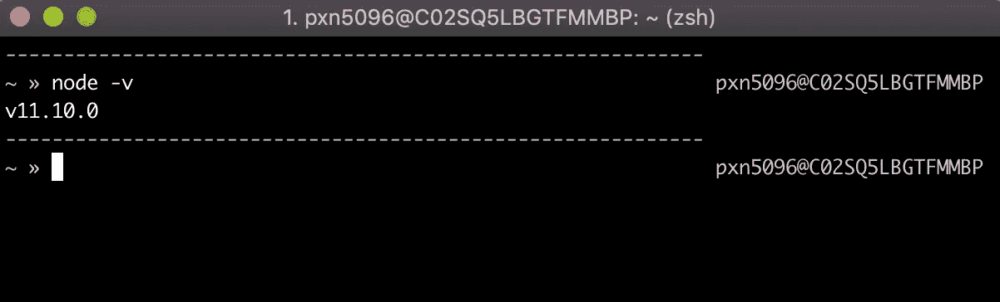
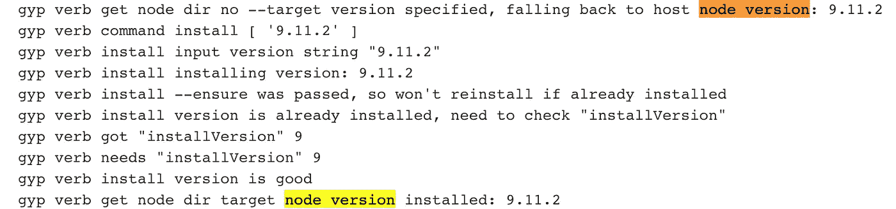
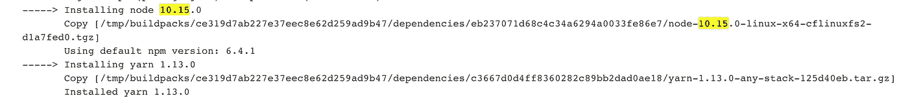

# 节点引擎:帮助各地的开发人员避免幻像错误

> 原文：<https://itnext.io/node-engines-helping-developers-everywhere-avoid-phantom-bugs-2eef519604b2?source=collection_archive---------0----------------------->

# 特定的 Node.js `Engines`应该是每个 Package.json 的必填字段


# 经典的开场白:“它在我的机器上工作。”

L 让我来为你搭建舞台:你正在编写代码，关注自己的事业，为你的应用程序开发一个闪亮的新功能，突然红灯开始闪烁(或者#support Slack channel 亮起，二者之一)，所有人都在甲板上；生产中有问题。🚨

当开发团队放下一切来找出问题所在，并试图查明和重现问题时，经过 20 分钟毫无意义的调试，一个大胆的人耸了耸肩，说“在我的机器上工作。”😒


每个开发人员都至少听过(说过)170 亿次了。

这句话对任何人都没有帮助，但准确地总结了我将要讨论的问题:

> 像生产中不兼容的节点版本这样简单的事情可能会破坏您的应用程序，并且开发人员几乎不可能在本地找出问题所在。锁定节点引擎可以帮助您快速调试并避免这种情况。

您永远不会考虑您的机器在本地使用的是哪个版本的 Node 或 NPM，而您的生产环境使用的是哪个版本的 Node.js 除非这很重要。

## 为什么这很重要的真实世界的例子

当我说，我的团队支持的 AngularJS 1.5 应用程序只在 Node 版本 9 中工作时，我是根据个人经验说的，然而，当我们部署到我们的生产云环境时，与之一起部署的 Node buildpack 是在版本 6 中引入的。版本 6？！？谁还会用这么老的节点版本来开发呢？？

不管怎样，我们的部署失败了，因为 Node 6 无法正确下载`node_modules`依赖项，应用程序无法启动，并且花费了几个小时来研究代码、构建日志和环境变量，以找出实际问题所在。这个部署在我的开发团队中被称为“黑暗星期四”。直到今天，如果你问当时在场的人，他们会给你一个惊恐的表情。😱

类似地，我们的 React 应用程序需要节点版本 10 或更高版本，以利用它拥有的所有 ES6 和更高版本的节点依赖性。它需要*至少* v10 或以上，没有如果，和，或但是。

所以现在你可以明白为什么不知道你的云构建包默认的节点版本是不好的了。这意味着您不知道您的节点模块会成功下载还是会失败。我们都同意这不是发展的方式。

但是我们如何确保得到我们需要的构建包呢？当我们从本地开发环境部署到云生产环境时，我们如何保证 Node.js 运行时是相同的？它可以支持我们的项目运行所需的节点依赖关系？

这实际上比你想象的要容易。请继续阅读我的解决方案。

# 我们如何防止错误版本的 Node 关闭我们的应用程序？

## 简单:引擎

如果这是你最初的反应，我不怪你，这也是我的反应。

引擎？这到底是什么意思？？

## 什么是节点引擎？

[节点引擎](https://docs.npmjs.com/files/package.json#engines)是一个讨论不多(但我认为非常关键)的配置，它可以在你的`package.json`文件中指定，告诉任何运行 JavaScript 应用程序的人(或任何机器)代码需要哪个版本的节点才能工作。

NPM 的[自己的文件](https://docs.npmjs.com/files/package.json#engines)在定义引擎时说:

> “你可以指定你的工作节点的版本”——NPM

不言自明。

这实际上意味着:如果包含了`engines`，当 JavaScript 构建部署时(取决于如何指定引擎字段),它将寻找在`package.json`中配置的版本或更高版本的节点，然后下载它并使用该引擎安装所有的`node_module`依赖项。

如果一个引擎没有被指定，那么这个项目将受到 buildpack 神的支配，并且将假设任何旧版本的 Node 都可以，并下载一些随机版本的 Node 和 NPM 的依赖项。这就是我们如何结束像上述场景的消防演习。

事实上，你可以在项目的`engines`配置中指定 Node.js 的版本、NPM 的版本和 Yarn 的版本，这非常好。

**非常清楚:****`**engines**`**字段将在您安装软件包时验证，而不是在您运行应用程序时验证。****

**既然您对节点引擎有了更好的了解，为什么它们有用以及它们是如何工作的，那么让我们着手建立一个项目来防止一个容易避免的部署失败。**

## **步骤 1:找出您的本地开发运行时**

**第一步是弄清楚您正在使用哪个版本的 Node 进行本地开发。很简单。**

**只需打开一个终端窗口并键入:**

```
node -v
```

**然后，您应该在终端上看到您正在使用的节点的版本。见下面截图:**

****

**如何查看在您的机器上运行的 Node 的本地版本？对我来说，目前是 v11.10.0**

**如果你曾经需要为本地开发切换节点版本，我会强烈推荐 [NVM(节点版本管理器)](https://github.com/creationix/nvm)，在这里我也写过一篇关于[的博文。](/nvm-the-easiest-way-to-switch-node-js-environments-on-your-machine-in-a-flash-17babb7d5f1b)**

**但这是题外话。现在您所需要的是知道您当前正在哪个版本的节点上开发。让我们进入第二步。**

## **步骤 2:在`Package`中指定您的节点引擎。json**

**现在您已经知道了 Node 的版本，您可以在项目的`package.json`文件中指定它。下面是几个关于`engines`配置的例子。**

**此示例包括高于或等于 v11.10.2 且低于 v12.0.0 的节点版本，以及正好为 5.8.0 的 NPM 版本。**

```
... // code above here like dependencies and other specs
"engines": {    
    "node": ">=11.10.2 <12.0.0",    
    "npm": "5.8.0"  
},
... // more code below here
```

**还是这个例子，包括 10.15.0 左右的节点版本。**

```
... // more code 
"engines": {    
    "node": "~10.15.0"  
},
... // more code
```

**指定节点、NPM 和纱线版本类似于在您的`package.json`中为`dependencies`指定它们，您可以指定您想要的精确版本、提供下限、提供范围或近似值。这取决于你。**

**在`package.json`中设置好节点引擎后，就该部署应用程序并验证是否下载和使用了正确的引擎了。**

## **步骤 3:运行您的部署构建脚本并验证构建包是否匹配**

**一旦您的构建管道部署了 JavaScript 应用程序，您应该能够在日志中验证指定的节点版本正在下载，以及正确的节点模块依赖关系。**

**下面是来自 Jenkins 服务器的一些日志，该服务器运行我们 AngularJS 应用程序的所有构建，该应用程序需要 Node 9 版本。正如您在第一个屏幕截图中看到的，构建正在服务器上检查一个特定的节点版本，并找到了在`package.json`中指定的 9.11.2，因此如果该版本不可用，它会将其安装到构建服务器上。**

****

**这里验证了 Node.js 版本正在 Jenkins 构建服务器上运行。**

**这里还有一个截图的例子，这次是我们的 React 应用程序，需要 10 或以上的节点版本，下载节点 v10.15.0，也是在 React 的`package.json` `engines`字段中指定的。**

****

**另一个例子是下载指定的节点引擎，然后获取项目所需的节点模块依赖项。**

**在这之后，可以成功下载指定的节点依赖项，我们的应用程序应该能够顺利启动。**

## **步骤 4:享受压力较小的生产部署**

**当您部署到生产环境时，突然少了一个需要担心的变量，您会感到如释重负。😄**

# **结论**

**Node `engines`不会解决您的所有问题，但它们至少应该消除您的生产部署中的一些猜测(和意外的错误)。对于在您的`package.json`配置中指定这一点所需的少量工作，现在的投资可以节省您的时间。相信我，值得的。**

**过几周再来看看，我会写一些关于 React 或者其他与 web 开发相关的东西，所以请关注我，这样你就不会错过。**

**感谢阅读，我希望这能说服你在你的`package.json`配置中指定你的节点版本和 NPM /纱线引擎。股份非常感谢！**

****如果你喜欢读这篇文章，你可能也会喜欢我的其他博客:****

*   **[NVM，瞬间切换你机器上 Node.js 环境的最简单方法](/nvm-the-easiest-way-to-switch-node-js-environments-on-your-machine-in-a-flash-17babb7d5f1b)**
*   **[调试 Node.js 最简单的方法——使用 VS 代码](/the-absolute-easiest-way-to-debug-node-js-with-vscode-2e02ef5b1bad)**
*   **[使用 Node.js 读取非常非常大的文件(Pt 1)](/using-node-js-to-read-really-really-large-files-pt-1-d2057fe76b33)**

****参考资料和更多资源:****

*   **发动机文档:[https://docs.npmjs.com/files/package.json#engines](https://docs.npmjs.com/files/package.json#engines)**
*   **NVM，Github:[https://github.com/creationix/nvm](https://github.com/creationix/nvm)**